Hello there! This course aims to teach you the principles of multi threading within the context of modern C++. By modern C++, I mean the language after the big changes that were made to it in 2011. I thought it would be a good idea before we get into the multi threading to review the aspects of modern C++ we use in this course.

> 你好！本课程旨在教授现代 C++环境下的多线程原理。我所说的现代 C++是指 2011 年对其进行了重大修改后的语言。我认为在我们进入多线程之前，回顾一下我们在本课程中使用的现代 C++的各个方面是一个好主意。

## img - 21820

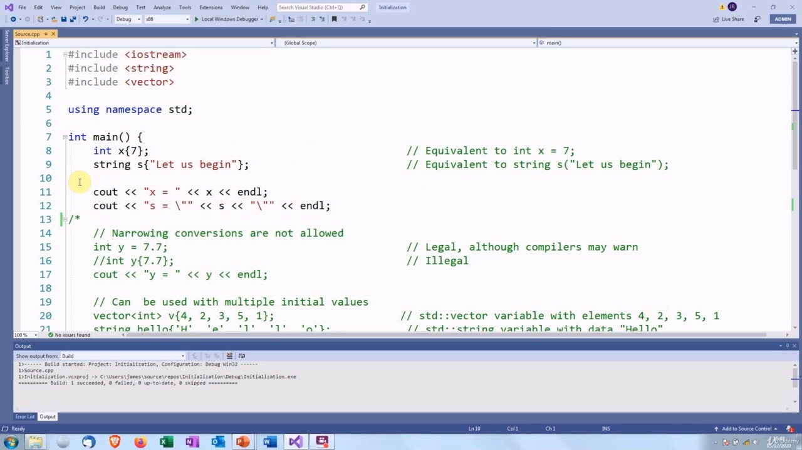

idea before we get into the multi threading to review the aspects of modern C++ we use in this course. So if you haven't seen them before or if you want to revise them, I hope you find this helpful. If you know it all already, then you can just skip over it. Obviously, this is going to be a very brief treatment and we're just going to cover part of modern C++. If you want a detailed coverage, I recommend my course "Learn Advanced Modern C++". The first thing we're going to look at is universal initialization. This means we can use the same

> 在我们进入多线程来回顾我们在本课程中使用的现代 C++的各个方面之前。所以，如果你以前没有看过它们，或者你想修改它们，我希望你觉得这很有用。如果你已经知道了所有这些，那么你可以跳过它。显然，这将是一个非常简短的处理，我们将只涵盖现代 C++的一部分。如果你想要详细的报道，我推荐我的课程“学习高级现代 C++”。我们首先要看的是通用初始化。这意味着我们可以使用相同的

## img - 54090

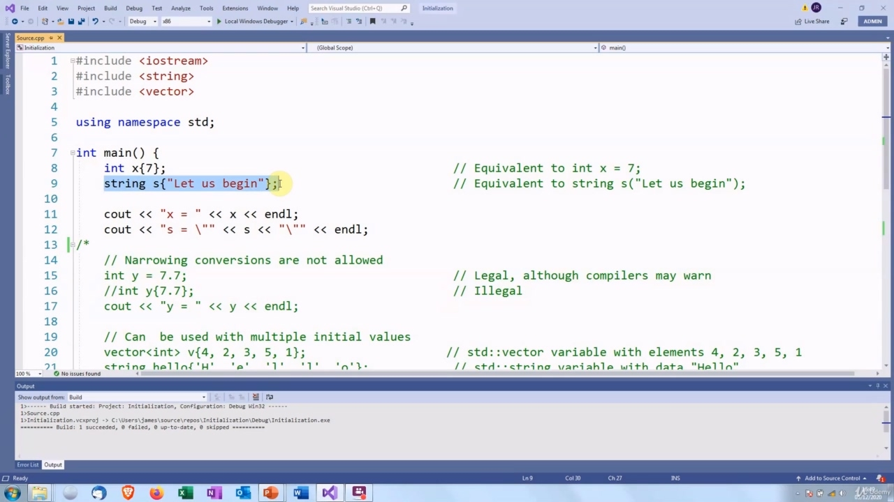

The first thing we're going to look at is universal initialization. This means we can use the same syntax for initializing any type of variable, for example, with a built in type, int x. Then we use a pair of curly braces after the variable name and we put the initial value inside the braces. So this is going to create a variable x, type int, with initial value seven. For a class type such as the standard string it is exactly the same. We have the type, then the variable name, then curly braces containing the initial value.

> 我们首先要看的是通用初始化。这意味着我们可以使用相同的语法初始化任何类型的变量，例如，使用内置类型 int x。然后我们在变量名称后使用一对大括号，并将初始值放在大括号内。这将创建一个变量 x，类型为 int，初始值为 7。对于标准字符串等类类型，它完全相同。我们有类型，然后是变量名，然后是包含初始值的大括号。

## img - 123820

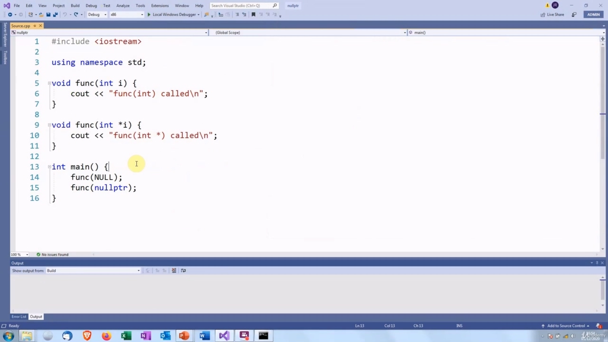

We have the type, then the variable name, then curly braces containing the initial value. So this will create a string variable "s", with the initial value "let us begin" and then if we print them out, we should see, yes, we do, we do get those values. So this form of initialization can be used with any type. It also prevents what are called narrowing conversions. For example, if we have an int and we try to initialize it with a double, then in that case the double is being narrowed down. It's going to be truncated to seven. So some compilers might give a warning for this, but they can't give an error. And when we compile it, we get "conversion from double to int, possible loss of data". I don't know if you can see that, it's rather small, but it is there. It is easily overlooked. And you see that the value of y has been truncated to seven. if we use the new syntax. Then we get an error and you can't ignore that. We can also use this syntax for initializing with multiple values, for example, we can initialize all the elements in a vector. So this will create a vector v of int whose elements are four, two, three, five and one. We can also, as an example, initialize a string using individual characters and then when we print them out. There we are: four, two, three, five one, and the string is "hello".

> 我们有类型，然后是变量名，然后是包含初始值的大括号。因此，这将创建一个字符串变量“s”，初始值为“let we begin”，然后如果我们打印它们，我们应该看到，是的，我们确实得到了这些值。因此，这种形式的初始化可以用于任何类型。它还防止了所谓的缩小转换。例如，如果我们有一个 int，我们试图用 double 初始化它，那么在这种情况下，double 被缩小了。它将被截断为 7。因此，一些编译器可能会对此发出警告，但不能给出错误。当我们编译它时，我们会得到“从 double 到 int 的转换，可能会丢失数据”。我不知道你是否能看到，它很小，但它就在那里。它很容易被忽视。你可以看到 y 的值被截断为 7。如果我们使用新语法。然后我们得到一个错误，你不能忽略它。我们也可以使用这个语法来初始化多个值，例如，我们可以初始化向量中的所有元素。这将创建一个 int 向量 v，其元素为四、二、三、五和一。例如，我们还可以使用单个字符初始化字符串，然后在打印它们时进行初始化。我们是：四、二、三、五、一，字符串是“你好”。

## img - 312690

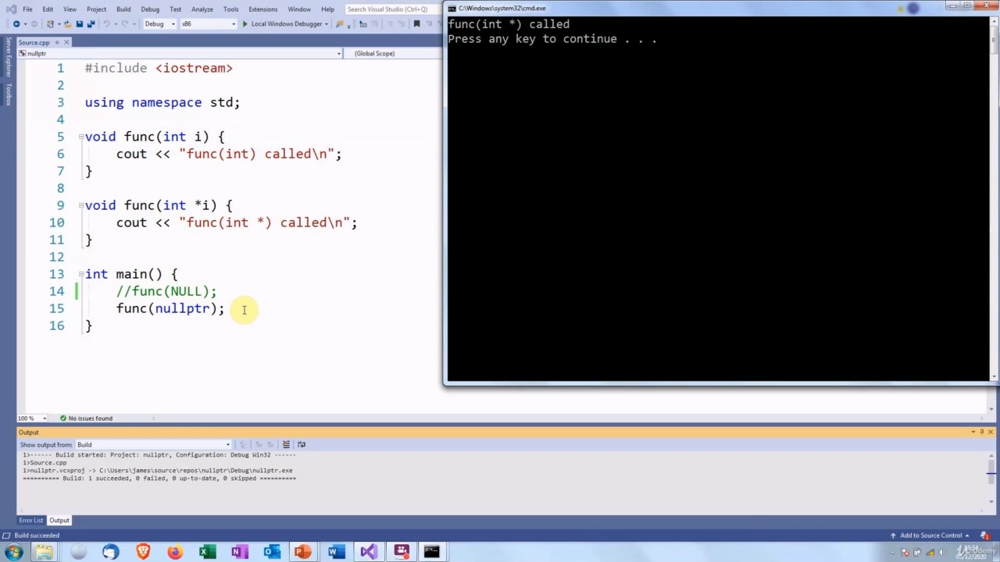

The next feature is the nullptr keyword. This represents the null pointer. It's designed to have a type which is compatible with any pointer, but not with anything else. I'll just comment that code out for a minute. I've got two functions here which are overloaded. One takes an inch and the other takes pointer to inch. So if we call this with nullptr, we always get the version which takes a pointer. Yup.

> 下一个特性是 nullptr 关键字。这表示空指针。它被设计为具有与任何指针兼容的类型，但与其他任何指针都不兼容。我只需将代码注释一分钟。这里有两个重载的函数。一个用英寸表示，另一个用指针表示。所以，如果我们用 nullptr 调用它，我们总是得到一个带指针的版本。是的。

## img - 346140

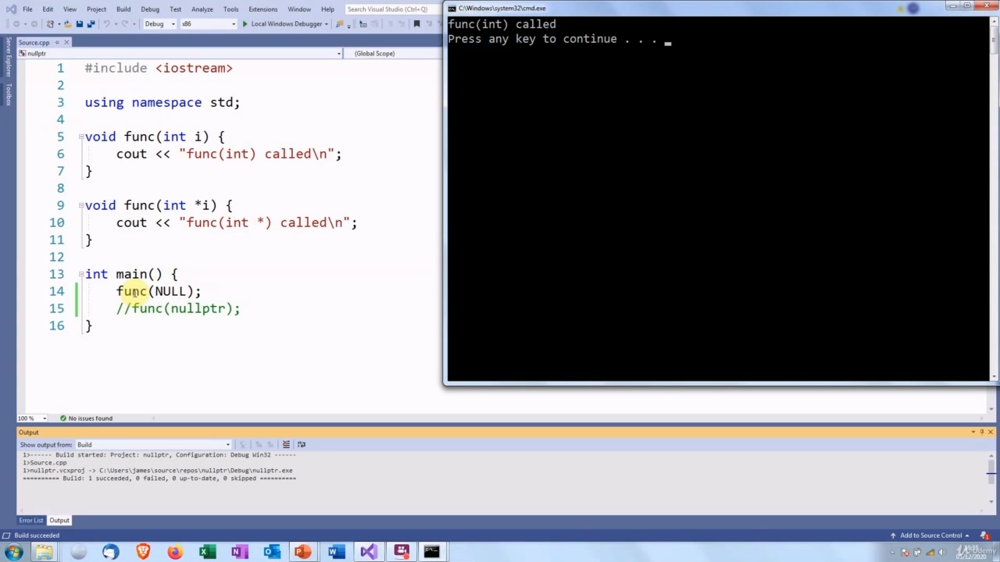

With NULL, on the other hand, this is a preprocessor macro. It is defined as having the value zero, but its type is not specified. So you'll get different results depending on the compiler. Let's see what we get with visual C++. So visual C++ thinks it's an int.

> 另一方面，对于 NULL，这是一个预处理器宏。它被定义为值为零，但未指定其类型。因此，根据编译器的不同，您将得到不同的结果。让我们看看我们用 visual C++得到了什么。所以 visual C++认为它是一个整数。

## img - 358660

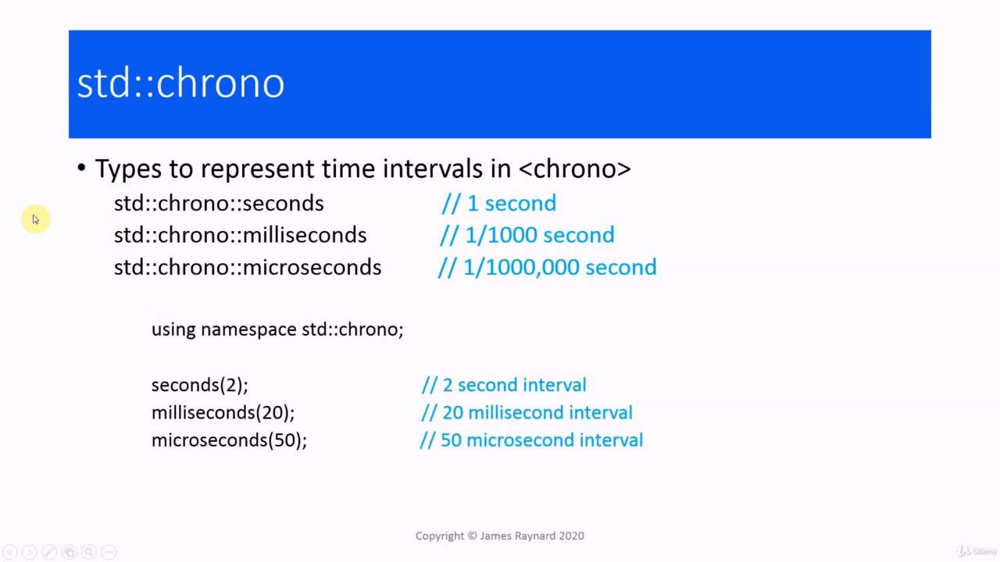

So visual C++ thinks it's an int. I tried the same code out with some other compilers. clang thinks it is a pointer and GCC refuses to compile it. It says it is ambiguous. So in that case, neither type works.

> 所以 visual C++认为它是一个 int。我用其他一些编译器尝试了同样的代码。clang 认为它是一个指针，GCC 拒绝编译它。所以在这种情况下，两种类型都不起作用。

## img - 425890

Another feature is the chrono library. This provides some types to represent time points and durations. In this course, we're only interested in the durations, the time intervals. So this defines some types in the std::chrono namespace. Seconds means multiples of one second, milliseconds means thousandths of a second and microseconds means millionths of a second. So we can create a value, second brackets two. This will represent an interval of two seconds. Milliseconds, twenty is twenty milliseconds and microseconds, 50 is 50 microseconds.

> 另一个功能是 chrono 库。这提供了一些表示时间点和持续时间的类型。在本课程中，我们只关注持续时间和时间间隔。因此，这在 std:：chrono 命名空间中定义了一些类型。秒表示 1 秒的倍数，毫秒表示千分之一秒，微秒表示百万分之一秒。所以我们可以创建一个值，第二个括号是 2。这将代表两秒的间隔。毫秒，20 是 20 毫秒，微秒，50 是 50 微秒。

## img - 458510

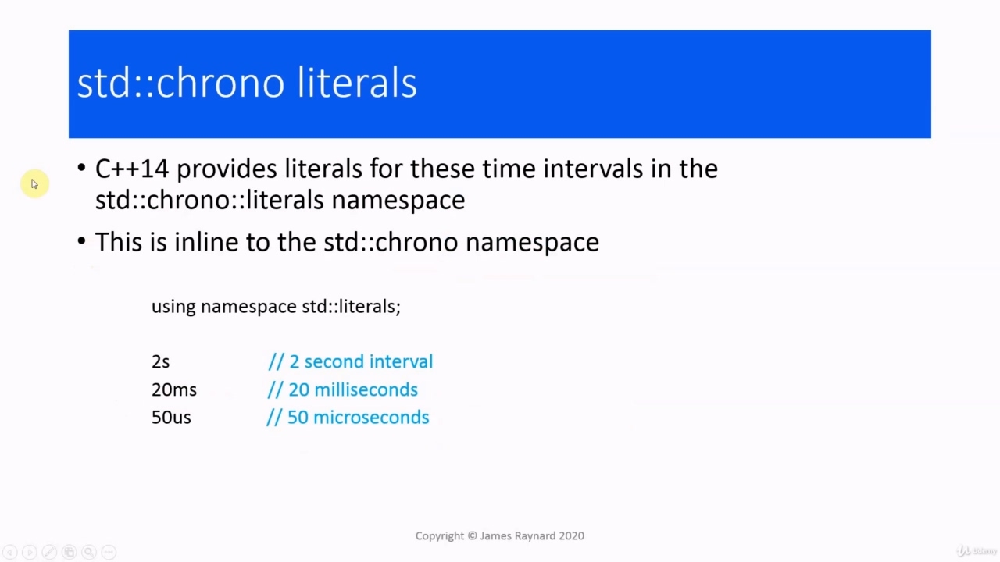

Milliseconds, twenty is twenty milliseconds and microseconds, 50 is 50 microseconds. Modern C++ allows the user to define their own literals, and in C++ 14, the language provided some

> 毫秒，20 是 20 毫秒，微秒，50 是 50 微秒。现代 C++允许用户定义自己的文字，在 C++14 中，该语言提供了一些

## img - 510100

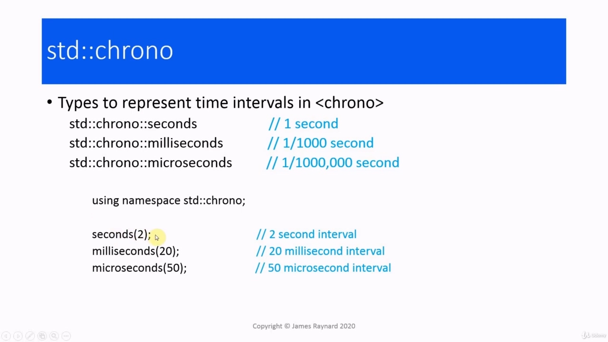

Modern C++ allows the user to define their own literals, and in C++ 14, the language provided some useful ones. There's a string literal, so you can have a string literal, which is of type string and not an array of char. There are literals for distances and also literals for time intervals. These are defined in the literals namespace, the ones for string are in std::string colon colon literals namespace and so on. These are all inline name spaces, which is another modern C++ feature. It means you can just use the std::literals namespace and you'll pull all these in. So we have some suffixes, if we put "s" after the number two, this means an interval of two seconds. So this is fully equivalent to the seconds\{2\} that we had in the previous slide. This one here. 20ms is 20 milliseconds and 50us is 50 microseconds.

> 现代 C++允许用户定义自己的文字，在 C++14 中，该语言提供了一些有用的文字。这里有一个字符串文本，所以可以有一个 string 文本，它是 string 类型，而不是 char 数组。有距离的文字，也有时间间隔的文字。这些是在 literals 命名空间中定义的，string 的是 std:：string 冒号冒号 literals 名称空间等等。这些都是内联名称空间，这是 C++的另一个现代特性。这意味着你可以只使用 std:：literals 名称空间，然后把所有这些都拉进去。所以我们有一些后缀，如果我们在数字 2 后面加上“s”，这意味着间隔两秒。因此，这与上一张幻灯片中的秒数完全相同。这一个。20ms 是 20 毫秒，50us 是 50 微秒。

## img - 607650

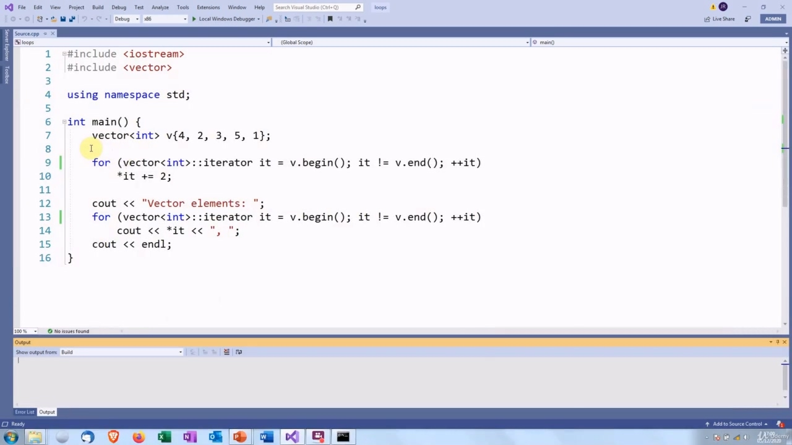

This one here. 20ms is 20 milliseconds and 50us is 50 microseconds. One of the most important features of modern C++ is the auto type specifier. When we use auto instead of a type, the compiler will deduce the type and fill it in for us. For example, if we have auto x curly braces six, the compiler will look at six and deduce that this is an inct, therefore x will have type int. So this will produce exactly the same code as if we'd written int x curly braces six. Where this comes in useful is if we're working with complicated types, for example, iterators to containers. If we have a vector of string and we call the begin member function the return type from that, if we write it out properly, we have to do vector angle bracket string, colon colon iterator. But in modern C++, we can just put auto and the compiler will fill in the correct type. In fact, in modern C++, there are some situations where the type cannot be known by the programmer because it is something that is generated internally by the compiler. If we want to create a variable of that type, the only possibility is to use auto. One situation where auto comes in really useful is in loops. So we have a vector, then we have a

> 这一个。20ms 是 20 毫秒，50us 是 50 微秒。现代 C++最重要的特性之一是自动类型说明符。当我们使用 auto 而不是类型时，编译器将推导出类型并为我们填充。例如，如果我们有 auto x 花括号 6，编译器将查看 6 并推断这是一个 inct，因此 x 将具有 int 类型。因此，这将产生与我们编写 int x 花括号六完全相同的代码。如果我们正在处理复杂的类型，例如，容器的迭代器，这一点很有用。如果我们有一个字符串向量，并且我们从中调用 begin 成员函数作为返回类型，如果我们正确地写出它，我们必须使用向量角括号字符串，冒号迭代器。但在现代 C++中，我们只需放入 auto，编译器就会填充正确的类型。事实上，在现代 C++中，有些情况下程序员无法知道该类型，因为它是由编译器内部生成的。如果我们想创建这种类型的变量，唯一的可能就是使用 auto。auto 真正有用的一种情况是在循环中。所以我们有一个向量，然后我们有一

## img - 731800

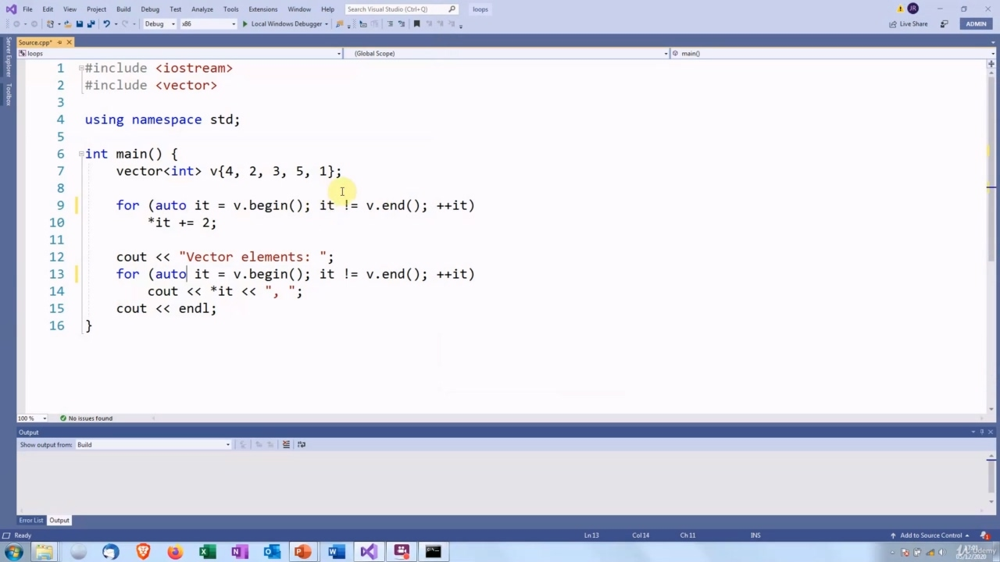

One situation where auto comes in really useful is in loops. So we have a vector, then we have a loop which goes through every element in the container and adds two to it. And then we print out the elements from the vector. So let's see what we get. So that gives us six, four, five, seven and three. Instead of typing out the full type, we can just put auto. And then the compiler will look at the return type of the begin call and deduce that we want

> auto 真正有用的一种情况是在循环中。所以我们有一个向量，然后有一个循环，它通过容器中的每个元素，并向其中添加两个元素。然后我们从向量中打印出元素。让我们看看我们得到了什么。所以我们得到了六、四、五、七和三。我们可以直接输入 auto，而不是键入完整的类型。然后编译器将查看 begin 调用的返回类型，并推断我们需要

## img - 802350

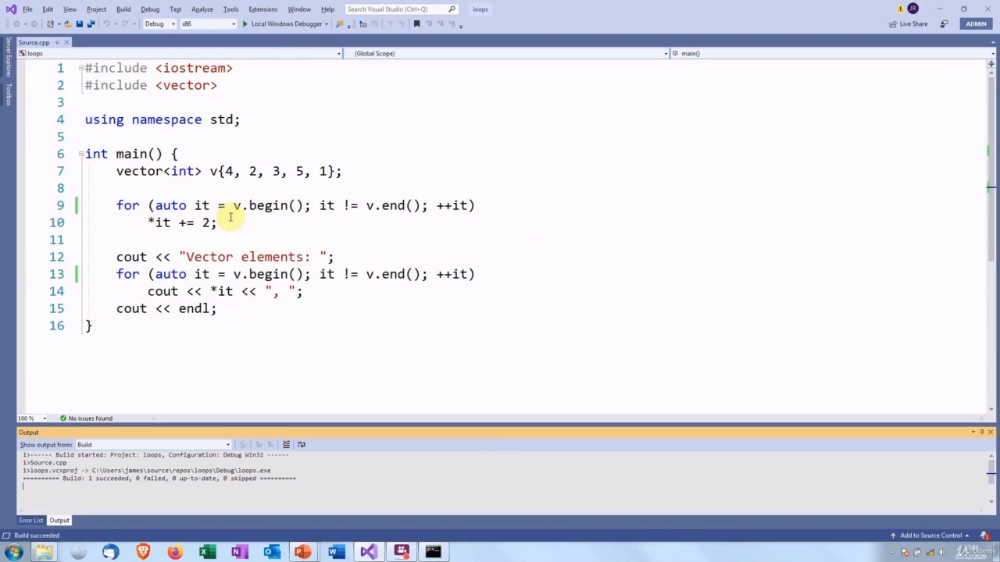

And then the compiler will look at the return type of the begin call and deduce that we want an iterator to a vector of int. And there we are, we get exactly the same results. One important point about auto is that it only gives the bare underlying type. In this example, the compiler was deducing the type from six. Six is actually a const, but the compiler deduced that x should be a normal int, variable and not a const. In fact, when auto is used, any const or reference is ignored. If we have a function which returns a reference to const, which is perhaps not the greatest interface, if we use auto to create a variable which captures this return value, then I is going to be an int, not a const reference to int. So this will make a copy of the return value, which will be mutable. If we actually want to have a const reference, then we need to type that in explicitly and then we have const reference to auto I, and that will cause i to be deduced as a reference to const. There is actually a way to make the compiler do that in C++ 14, but we are not going to use that in this course. So I will not discuss it here. Another very useful feature is the range for loop. If we want to iterate over the containers, modern C++ has a special syntax for that. We have this reduced for loop. So this will cause the compiler to generate the boilerplate code, which calls begin(), increments the iterator, and compares it to the result of calling end() and then dereferences the iterator. So this it in here is actually going to have the type of the element. And then this is going to be a copy of the vector element so we can just print it out directly without having to dereference it. If we want to modify the elements in the vector, then we need to use the reference form of auto. So this would be an actual reference to the element. And then if we do something with that in the loop, then that change will be made to the element in the vector.

> 然后编译器将查看 begin 调用的返回类型，并推断我们需要一个 int 向量的迭代器。在这里，我们得到了完全相同的结果。关于 auto 的一个重要点是它只提供了基本类型。在本例中，编译器从六个类型中推断出类型。Six 实际上是一个常量，但编译器推断 x 应该是一个普通的 int 变量，而不是常量。事实上，当使用 auto 时，任何常量或引用都会被忽略。如果我们有一个函数，它返回对 const 的引用，这可能不是最好的接口，如果我们使用 auto 来创建一个捕获这个返回值的变量，那么我将是一个 int，而不是对 int 的 const 引用。所以这将生成一个返回值的副本，它将是可变的。如果我们真的想要有一个常量引用，那么我们需要显式地键入它，然后我们有一个对 auto I 的常量引用，这将导致 I 被推断为对常量的引用。实际上有一种方法可以让编译器在 C++14 中实现这一点，但我们不会在本课程中使用它。所以我不会在这里讨论它。另一个非常有用的特性是循环范围。如果我们想遍历容器，现代 C++有一个特殊的语法。我们有一个简化的 for 循环。因此，这将导致编译器生成样板代码，该代码调用 begin（），递增迭代器，并将其与调用 end（）的结果进行比较，然后解引用迭代器。所以这里的这个实际上是元素的类型。然后这将是向量元素的副本，所以我们可以直接打印出来，而不必取消引用。如果我们想修改向量中的元素，那么我们需要使用 auto 的引用形式。因此，这将是对元素的实际引用。然后，如果我们在循环中对其进行一些处理，那么将对向量中的元素进行更改。

## img - 1023900

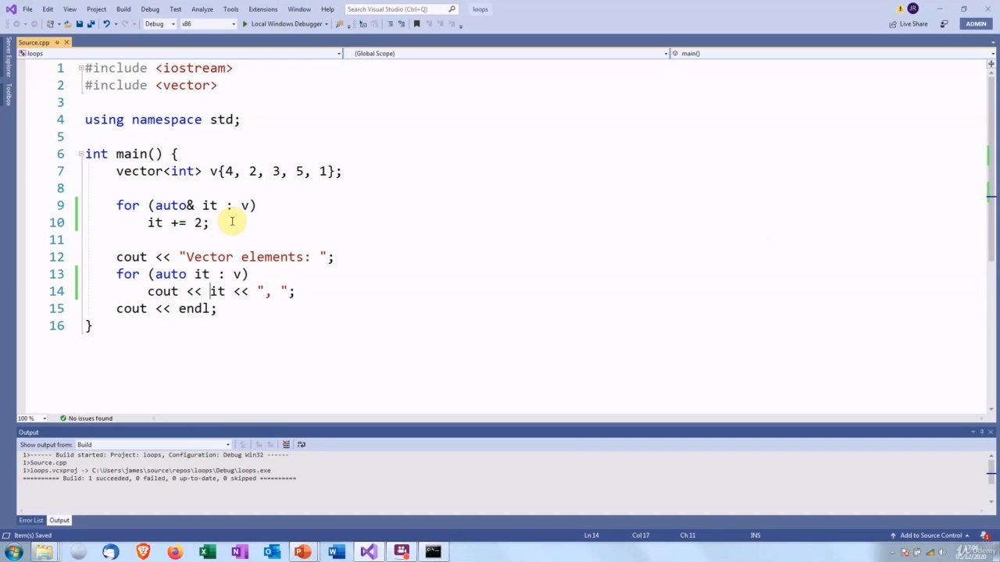

So let's look at this. Here we need the reference because we're going to be modifying the elements. We remove the star, of course, because now we've got the actual element and not an iterator to it.

> 让我们来看看这个。这里我们需要引用，因为我们要修改元素。当然，我们删除了星号，因为现在我们得到了实际的元素，而不是迭代器。
