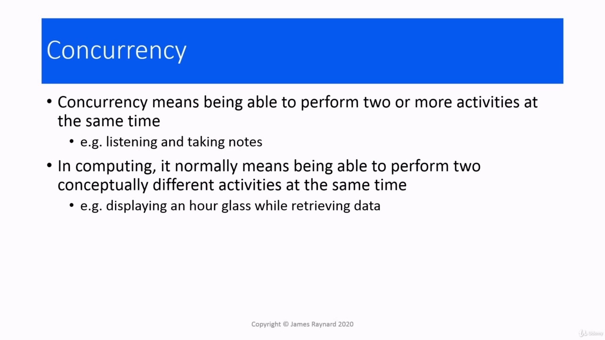
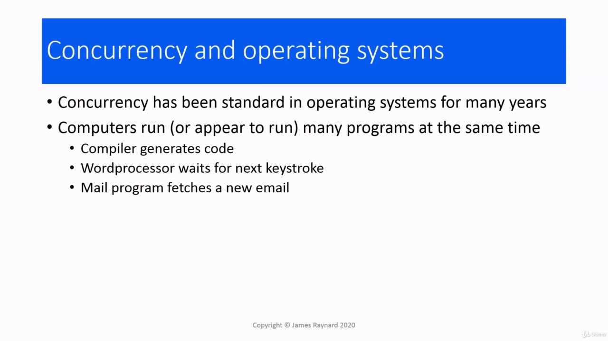
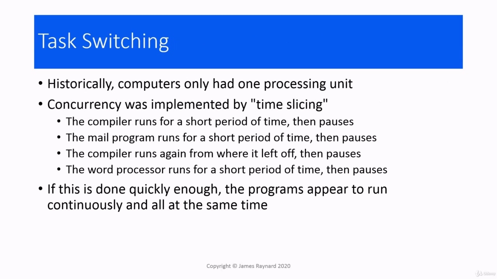
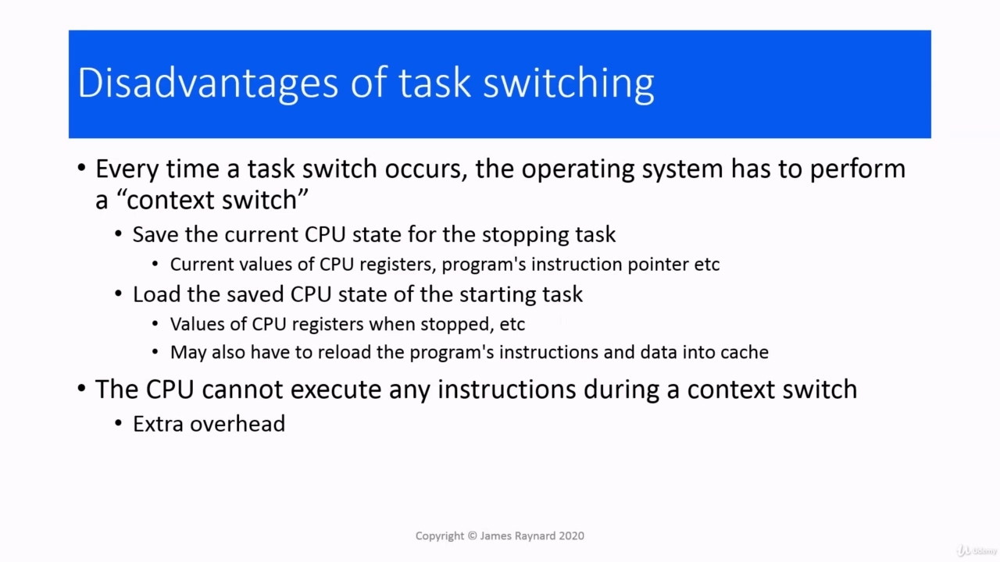
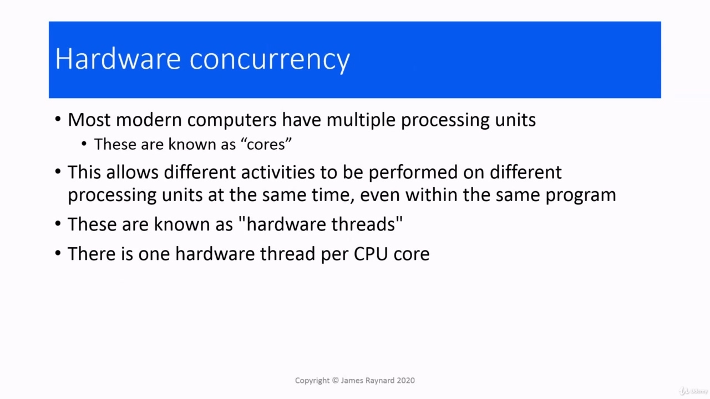
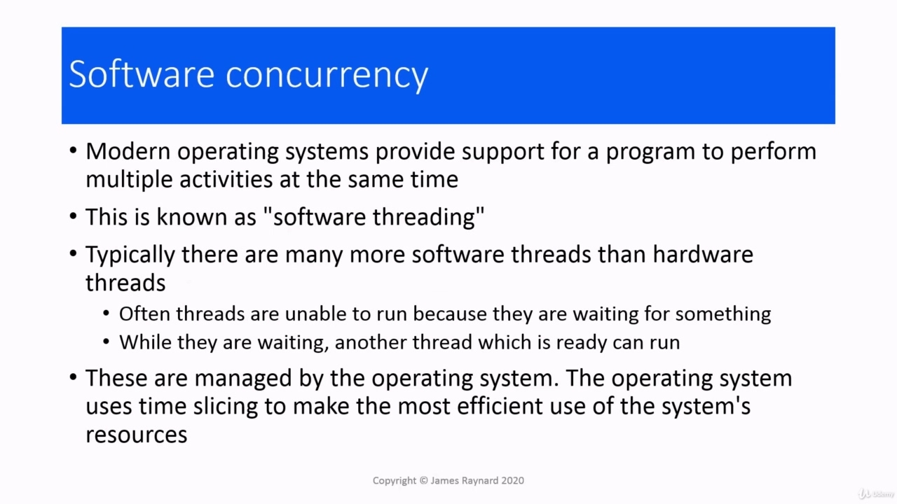
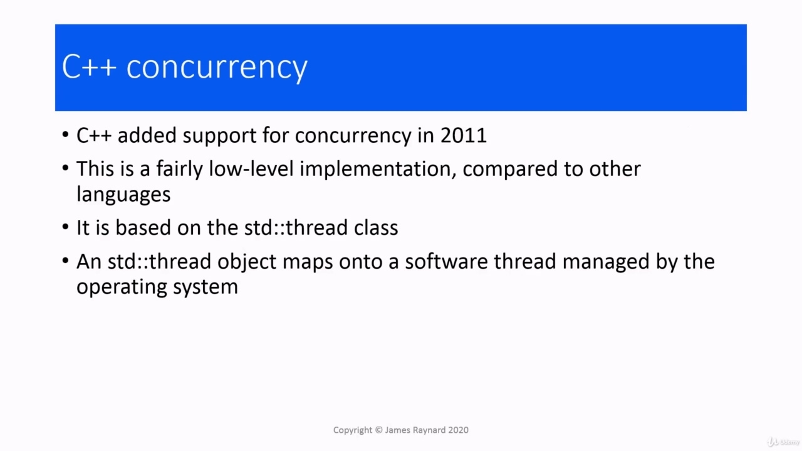
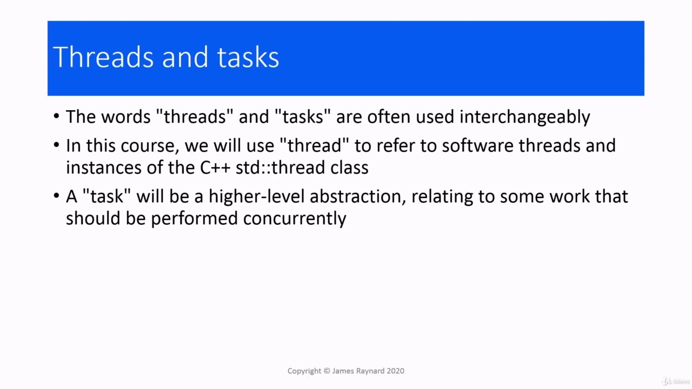

Hello and welcome to my course on modern C++ concurrency.

> 大家好，欢迎来到我的现代 C++并发课程。

## img - 7530 

We're going to start off by finding out what concurrency actually means. So this is an introduction to concurrency. Concurrency generally means two or more things happening at the same time.

> 我们将从找出并发的实际含义开始。这是对并发性的介绍。并发通常意味着同时发生两件或多件事情。

## img - 16230 

Concurrency generally means two or more things happening at the same time. So, for example, you could be watching a video on Udemy, you could be taking notes or typing code into a compiler, and that would be an example of human concurrency. In computing, it normally means that the activities are conceptually different. So, for example, we may have a program that takes a long time to run. It could be fetching data from the Internet or doing a calculation that takes a long time. And normally the program will provide some kind of feedback, like an hourglass or a counter to let you know that things are still happening and the program hasn't died. So that's an example of computational concurrency. At the operating system level, concurrency has been standard for many years. On this laptop, for

> 并发通常意味着同时发生两件或多件事情。因此，例如，你可以在 Udemy 上观看视频，你可以做笔记或在编译器中输入代码，这将是人类并发的一个例子。在计算中，它通常意味着活动在概念上是不同的。例如，我们可能有一个程序需要很长时间才能运行。它可能是从互联网上获取数据，或者做一个需要很长时间的计算。通常情况下，程序会提供某种反馈，比如沙漏或计数器，让你知道事情仍在发生，程序尚未消亡。这是计算并发的一个例子。在操作系统级别，并发性多年来一直是标准。在这台笔记本电脑上

## img - 106460 

At the operating system level, concurrency has been standard for many years. On this laptop, for example, which runs Windows, I have a recording program which is recording my words of wisdom. I have PowerPoint, which is waiting for me to go to the next slide. I have an e-mail program which is occasionally checking for new messages. I have File Explorer in case I want to open another PowerPoint presentation and so on. So the computer is running several different programs at the same time. However, until pretty recently, computers only had one processing unit, so if you only have one processor,

> 在操作系统级别，并发性多年来一直是标准。例如，在这台运行 Windows 的笔记本电脑上，我有一个记录程序，记录我的智慧之言。我有 PowerPoint，它正在等待我转到下一张幻灯片。我有一个电子邮件程序，偶尔会检查新邮件。我有文件资源管理器，以防我想打开另一个 PowerPoint 演示文稿等。因此，计算机同时运行多个不同的程序。然而，直到最近，计算机只有一个处理单元，所以如果你只有一个处理器，

## img - 144280 

However, until pretty recently, computers only had one processing unit, so if you only have one processor, how can you run several different programs at the same time? And the answer is something called "time slicing". So this means that one program gets to run for a little bit of time. Then it stops and another program gets to run. Then that one stops and something else runs and so on. So, for example, if I'm writing a document while I'm waiting for my compilation to finish, we could have a situation where the compiler gets to run for a little bit, then the email program runs and checks. If I've got any new messages, then the compiler runs again, then the word processor runs and sees if I've typed any more words and so on. And if this all happens quickly enough, it'll look to the human as though all these programs are running at the same time. It's a bit like in films where they have these frames, which are snapshots of the actors and the scenery and so on. But if you have enough of these frames appearing quickly enough, it looks as though you have continuous motion. So task switching is really an optical illusion. They say "there's no such thing as a free lunch", and that's true for task switching.

> 然而，直到最近，计算机只有一个处理单元，所以如果你只有一个处理器，你怎么能同时运行几个不同的程序？答案是“时间切片”。这意味着一个程序需要运行一段时间。然后它停止，另一个程序开始运行。然后，一个停止，另一个运行，依此类推。例如，如果我正在编写文档，而我正在等待编译完成，我们可能会遇到这样的情况：编译器需要运行一段时间，然后电子邮件程序运行并检查。如果我有任何新消息，那么编译器会再次运行，然后文字处理器会运行并查看我是否键入了更多的单词等等。如果这一切发生得足够快，那么在人类看来，所有这些程序都在同时运行。这有点像在电影中，他们有这些帧，这些帧是演员和风景等的快照。但如果你有足够多的这些帧出现得足够快，看起来就像你有连续的运动。因此，任务切换实际上是一种视觉错觉。他们说“没有免费的午餐”，这对于任务切换来说是正确的。

## img - 255150 

They say "there's no such thing as a free lunch", and that's true for task switching. The reason is that when a processor is running a program, it needs to have some information about what that program is doing. There are memory cells on the processor called registers. And these will contain the value of local variables and also things like the current stack position, which instruction the program is executing and so on. When it starts running another program, it's got to load up all this state for the new task. Processors also tend to have cache these days, which is used for storing the instructions and data that it's using, which don't fit into the registers. If the program has not run for a while, this is not going to be in the cache, so it has to be loaded up. So there is extra time needed to do that. And, while this so-called "context switch" is taking place, the processor can't execute any instructions for any program. So that slows the whole system down. So there is definitely overhead to task switching. In the modern world that we live in, computers usually have several processors, in fact, even mobile phones have several processors these days. These are known as cores. And when we have these cores, these multiple processing units, they can all be working away, doing

> 他们说“没有免费的午餐”，这对于任务切换来说是正确的。原因是，当处理器运行程序时，它需要了解该程序正在做什么。处理器上有称为寄存器的存储单元。这些将包含局部变量的值，以及当前堆栈位置、程序正在执行的指令等。当它开始运行另一个程序时，必须为新任务加载所有这些状态。如今，处理器也倾向于使用缓存，用于存储不适合寄存器的指令和数据。如果程序有一段时间没有运行，那么它不会在缓存中，所以必须加载它。因此，这需要额外的时间。而且，当这种所谓的“上下文切换”发生时，处理器不能为任何程序执行任何指令。所以这会减慢整个系统的速度。因此，任务切换肯定有开销。在我们生活的现代世界中，计算机通常有几个处理器，事实上，现在连手机也有几个处理器。这些被称为核心。当我们拥有这些核心，这些多个处理单元时，它们都可以工作

## img - 420700 

And when we have these cores, these multiple processing units, they can all be working away, doing different things at the same time, they can even run different parts of the same program at the same time. And these are all executing independently of each other. These are known as "hardware threads" because each core has its own "thread" of execution, if you like, and there's one hardware thread for each core. With modern operating systems, they also provide a software feature that behaves a bit like hardware

> 当我们拥有这些核心，这些多个处理单元时，它们可以一起工作，同时做不同的事情，甚至可以同时运行同一程序的不同部分。这些都是彼此独立执行的。这些被称为“硬件线程”，因为每个内核都有自己的执行“线程”，如果你愿意的话，每个内核有一个硬件线程。对于现代操作系统，它们还提供了一种与硬件有点类似的软件功能

## img - 452580 

With modern operating systems, they also provide a software feature that behaves a bit like hardware threads and these are known as "software threads". So we can have a program which performs multiple activities at the same time at the software level. Often when we talk about "threads", we mean software threads and we use "cores" when we mean hardware threads. Usually there are more software threads than there are hardware threads or there are more threads than there are cores to run them, and that's not actually a problem because usually threads don't run all the time. Quite often they have to stop and wait for something. They may be waiting for some calculation that another thread is doing or they may be waiting for - for example, a thread that is downloading data from the Internet has to wait for the next data to arrive. A thread that is running Word, has to wait for the next key to be entered. That gives a space in which a thread isn't running, in which some other thread can run and do some useful work. These software threads are managed by the operating system, which uses time slicing. What support does C++ have for concurrency? Well, it didn't have any until 2011. Like a lot of C++ libraries, it just gives you the basics really

> 对于现代操作系统，它们还提供了一种软件功能，其行为有点像硬件线程，这些被称为“软件线程”。因此，我们可以有一个在软件级别同时执行多个活动的程序。通常，当我们谈论“线程”时，我们指的是软件线程，而当我们指硬件线程时，我们使用“内核”。通常，软件线程比硬件线程多，或者运行它们的线程比内核多，这实际上不是问题，因为通常线程不会一直运行。很多时候，他们不得不停下来等待。他们可能正在等待另一个线程正在进行的计算，或者他们正在等待-例如，从 Internet 下载数据的线程必须等待下一个数据到达。运行 Word 的线程必须等待输入下一个键。这提供了一个线程不运行的空间，其他线程可以在其中运行并做一些有用的工作。这些软件线程由使用时间切片的操作系统管理。C++对并发有什么支持？嗯，直到 2011 年才有了。像许多 C++库一样，它只是为您提供了真正的基础知识

## img - 610660 

Well, it didn't have any until 2011. Like a lot of C++ libraries, it just gives you the basics really to write your own library, but what it has is very efficient. The basic building block for C++ concurrency is the std::thread class, and this will map onto one of the software threads which is managed by the operating system.

> 嗯，直到 2011 年才有了。像许多 C++库一样，它只是为您提供了编写自己的库的基础知识，但它的效率非常高。C++并发的基本构建块是 std:：thread 类，它将映射到由操作系统管理的一个软件线程上。
