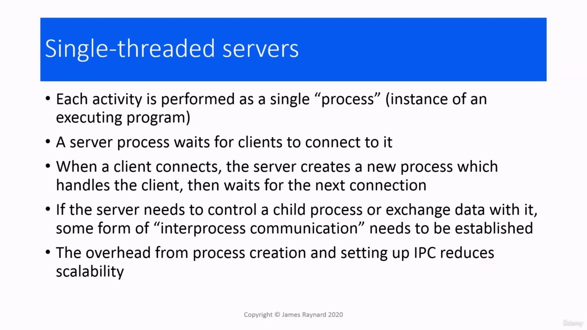
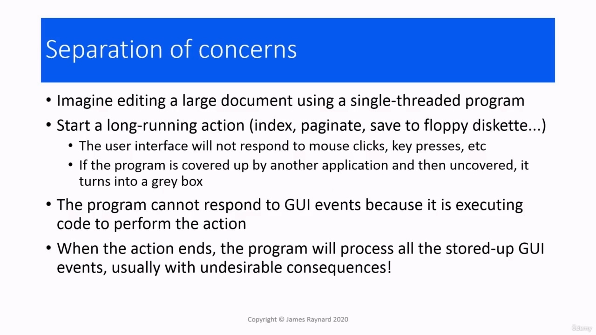
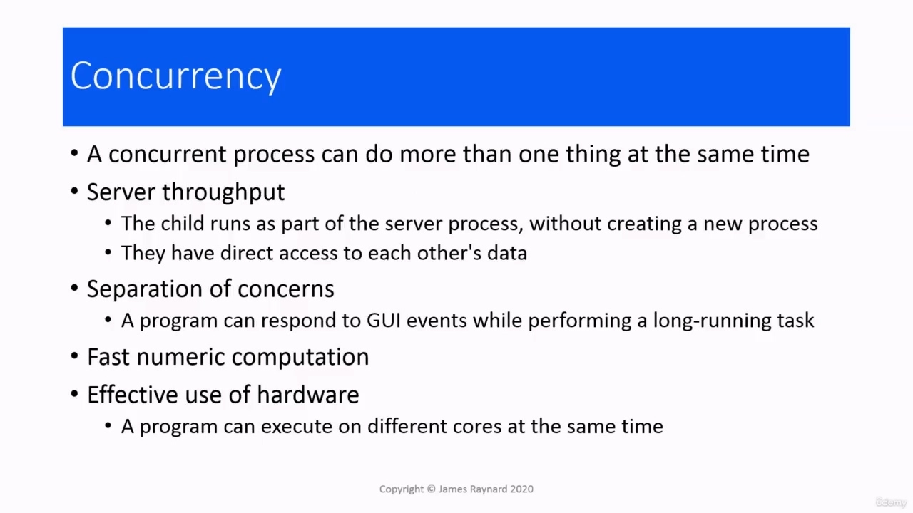

Hello there. In this video, we're going to look at the motivation for concurrency. Or, in other words, why is concurrency considered important?

> 你好。在本视频中，我们将探讨并发的动机。或者，换句话说，为什么并发性被认为是重要的？

## img - 8550

why is concurrency considered important? Concurrency first appeared on mainframes in the 1960s, but it was not until the 1990s before the world of workstations and personal computers began to regard it as an important technology. And there were four main reasons why that happened at that particular time. These were all developments in the computer world, which were more or less happening at the same time. The first one was the rise of the Internet. Previously, a server might handle, maybe a few hundred clients if it was really busy. Now, you could have a server that might have 100,000 or maybe even a million simultaneous clients or more. Clearly, the amount of work that a server could do at any one time, its throughput, needed to increase dramatically and threading was one of the techniques that was used to deliver that. The second one was the rise of Windows. Users on personal computers could now access several running programs at the same time, and they expected to be able to interact with them even if the programs were busy doing something else. So this means that Windows programs had to be able to do more than one thing at a time, and that means multi threading. The third one. was the rise of games and multimedia. These typically involve lots of mathematical computations. If the frame rate is too low, the game will not play smoothly. The video will look jerky, or have bits missing, and the audio will have clicks and pops. And the final event was the rise of multicore processors. We now had computers which had several processors, and we wanted programs which could take full advantage of this. So let's look at each of these in a bit more detail. Traditionally with servers, you would have everything

> 为什么并发性被认为是重要的？并发在 20 世纪 60 年代首次出现在大型机上，但直到 20 世纪 90 年代，工作站和个人计算机世界才开始将其视为一项重要技术。在当时发生这种情况的主要原因有四个。这些都是计算机世界的发展，或多或少都是同时发生的。第一个是互联网的兴起。以前，如果服务器真的很忙，可能会处理几百个客户端。现在，您可以拥有一台服务器，该服务器可能同时拥有 100000 个甚至 100 万个客户端或更多。显然，服务器在任何时候都可以完成的工作量、吞吐量都需要大幅增加，而线程是实现这一点的技术之一。第二个是 Windows 的兴起。个人计算机上的用户现在可以同时访问多个正在运行的程序，他们希望即使程序忙着做其他事情，也能与他们进行交互。这意味着 Windows 程序必须能够一次完成多个任务，这意味着多线程。第三个。游戏和多媒体的兴起。这些通常涉及大量的数学计算。如果帧速率太低，游戏将无法顺利进行。视频看起来会很粗糙，或者有一些缺失，音频会有点击和弹出。最后一件事是多核处理器的兴起。我们现在的计算机有几个处理器，我们需要能够充分利用这一点的程序。因此，让我们更详细地看一下其中的每一个。传统上，使用服务器，您将拥有一切

## img - 205960

So let's look at each of these in a bit more detail. Traditionally with servers, you would have everything done as a single process. So there would be a single process, which was the server, and there would be other processes which are child processes. Every time the server received a client connection, it would start up a new process, a new child process, and that child process would deal with the clients while the server carried on and waited for the next connection. These processes are all separate running applications with their own address space. There is no direct communication between them. If you want the server to be able to send some data to a client, you would need to put in a communication channel. These interprocess communication channels have overhead and there is also a certain amount of overhead from creating a process. It's not too bad on Unix systems, but on Windows systems, it's slow and resource intensive. So all this process creation and adding interprocess communication will increase overhead, and that will reduce the scalability and the amount of work that servers can do. Separation of concerns. Let's imagine you are editing a large document and you are using a single threaded program.

> 因此，让我们更详细地看一下其中的每一个。传统上，对于服务器，您可以将所有事情都作为一个过程来完成。因此，只有一个进程，即服务器，还有其他进程是子进程。每当服务器接收到客户机连接时，它都会启动一个新进程，一个新的子进程，该子进程将在服务器继续运行并等待下一个连接时处理客户机。这些进程都是单独运行的应用程序，具有自己的地址空间。他们之间没有直接的交流。如果您希望服务器能够向客户端发送一些数据，则需要设置通信通道。这些进程间通信信道具有开销，并且创建进程也会产生一定的开销。它在 Unix 系统上并不太坏，但在 Windows 系统上，它速度慢且资源密集。因此，所有这些进程创建和添加进程间通信将增加开销，这将降低可伸缩性和服务器可以完成的工作量。让我们假设您正在编辑一个大型文档，并且正在使用一个单线程程序。

## img - 324480

Separation of concerns. Let's imagine you are editing a large document and you are using a single threaded program. You start some action which is going to take a long time to complete. You could be compiling an index for the document. You could be calculating where the page numbers go, or you could even - and we are still in the 1990s, remember - you could even be saving to a floppy disk! Clunk, clunk, clunk-clunk! While that's happening, The user interface of the program will be completely unresponsive. You can click on it with your mouse, you can press keys, you can do everything, and it'll completely ignore you. If you switch to another application which covers up the program and then eventually you come back to the program, the window will have gone. You just get a grey box, possibly with an hourglass. And the reason for that is that the program can only do one thing at a time, which is performing the action that you asked it to perform. It cannot respond to GUI events, such as being told "someone has clicked a mouse" or "someone has pressed this key", "you've got to redraw yourself", because it is busy performing the action. All these events are stuck in a queue. Then finally, the action will end. The program will read all the events off the queue and process them instantly. Then all sorts of weird things will happen, depending on what you did. You might find out that you have erased your document or overwritten it with a load of garbage and saved it. Generally not desirable. With fast numerical computation, typically, if you were worried about this, you were a scientist or similar, you worked at a university or a research institution and you had persuaded your employers to buy you and your colleagues a nice new toy, which has lots of processors which are specially wired up so that they could coordinate with each other. You wrote a program using a special language, maybe a parallel version of Fortran or Occam, and then this would divide up your program and run different parts of it on different processors at the same time. So that would achieve parallel processing. So instead of taking three months, your simulation might take three weeks. Nowadays we have hardware which supports parallel programming. You can buy a normal computer, or even a phone, which will do that. So it doesn't cost very much. It's supported by standard programming languages which have now got features for parallel processing C++ has some, which we will look at later. And finally, you do not have to fight with your colleagues to actually get to run your program. Effective use of hardware. By the time we got to the 1990s, designers at companies like Intel and AMD had spent a couple of decades making chips that were bigger and bigger and more and more complicated and could do more and more things faster and faster. They were now starting to be affected by the limits imposed by the laws of physics. In particular, the one which says nothing can travel faster than the speed of light. In practice, electrons can move through silicon at maybe five or 10 percent of the speed of light. If your processor cycle time is one nanosecond, that might mean a quarter of an inch, half a centimetre, which is a very long way, actually, but if your chip is three inches or five centimetres across, it's going to take a long time just for an electron to go from one side of the processor chip to the other. And that's going to slow down the rate at which data can move around and instructions can be processed. The other problem is the heat generated. While the electrons move through silicon, they generate heat and the amount of heat was getting bigger and bigger. If you extrapolate it, you eventually get to things like the temperature of molten steel or the surface of the sun. And that's really not something that you want to have sitting on your desk! So they abandoned the idea of having one mega processor and instead they started designing chips which had several smaller processor cores. If you have a single threaded program, it can only run on one core, or maybe one core at a time, if it gets switched around between cores. If you have a computer with 16 or eight or four cores, then you are obviously not making the full use of the system potential. If you have a computer which only runs one program and it only uses one core, then you are only using a small fraction of the system's power.

> 关注点分离。让我们假设您正在编辑一个大型文档，并且正在使用一个单线程程序。你开始一些需要很长时间才能完成的动作。您可能正在编译文档的索引。你可以计算页码的去向，或者你甚至可以——记住，我们仍在 20 世纪 90 年代——你甚至可以把它保存到软盘上！嘎吱嘎吱！当这种情况发生时，程序的用户界面将完全没有响应。你可以用鼠标点击它，你可以按键，你可以做任何事情，它会完全忽略你。如果您切换到另一个覆盖程序的应用程序，然后最终返回到该程序，则窗口将消失。你只会得到一个灰色的盒子，可能还有一个沙漏。原因是程序一次只能做一件事，那就是执行你要求它执行的动作。它无法响应 GUI 事件，例如被告知“有人单击了鼠标”或“有人按下了此键”，“您必须重新绘制自己”，因为它正忙于执行操作。所有这些事件都停留在队列中。最后，行动将结束。程序将从队列中读取所有事件并立即处理它们。然后会发生各种奇怪的事情，这取决于你做了什么。你可能会发现你已经擦除了你的文档，或者用一堆垃圾覆盖了它并保存了它。通常情况下，这是不可取的。通过快速的数字计算，通常情况下，如果你担心这一点，你是一名科学家或类似的人，你在大学或研究机构工作，你说服了你的雇主给你和你的同事买了一个漂亮的新玩具，它有很多专门连接的处理器，以便他们能够相互协调。你用一种特殊的语言编写了一个程序，可能是 Fortran 或 Occam 的并行版本，然后这会将你的程序分割开来，同时在不同的处理器上运行它的不同部分。因此，这将实现并行处理。因此，您的模拟可能需要三周，而不是三个月。现在我们有支持并行编程的硬件。你可以买一台普通的电脑，甚至一部手机，这样就可以了。所以它的成本不高。它得到了标准编程语言的支持，这些语言现在已经具备了并行处理的功能。最后，你不必和你的同事斗争，就能真正运行你的程序。有效使用硬件。到了 20 世纪 90 年代，英特尔和 AMD 等公司的设计师们已经花了几十年的时间来制造越来越大、越来越复杂的芯片，并且可以更快、更快地完成越来越多的事情。他们现在开始受到物理定律限制的影响。特别是，没有什么能比光速更快的。实际上，电子可以以光速的 5%或 10%穿过硅。如果你的处理器周期时间是一纳秒，那可能意味着四分之一英寸，半厘米，这实际上是一条很长的路，但如果你的芯片是三英寸或五厘米宽，那么仅仅是电子从处理器芯片的一侧到另一侧就需要很长的时间。这将降低数据移动和指令处理的速度。另一个问题是产生的热量。当电子通过硅时，它们产生热量，热量越来越大。如果你外推，你最终会得到像钢水温度或太阳表面这样的东西。这真的不是你想坐在桌子上的东西！因此，他们放弃了拥有一个超大处理器的想法，转而开始设计具有几个较小处理器内核的芯片。如果你有一个单线程程序，它只能在一个内核上运行，或者一次只能运行一个内核，如果它在内核之间切换的话。如果你有一台 16、8 或 4 核的计算机，那么你显然没有充分利用系统潜力。如果你的计算机只运行一个程序，并且只使用一个内核，那么你只使用了系统的一小部分功率。
