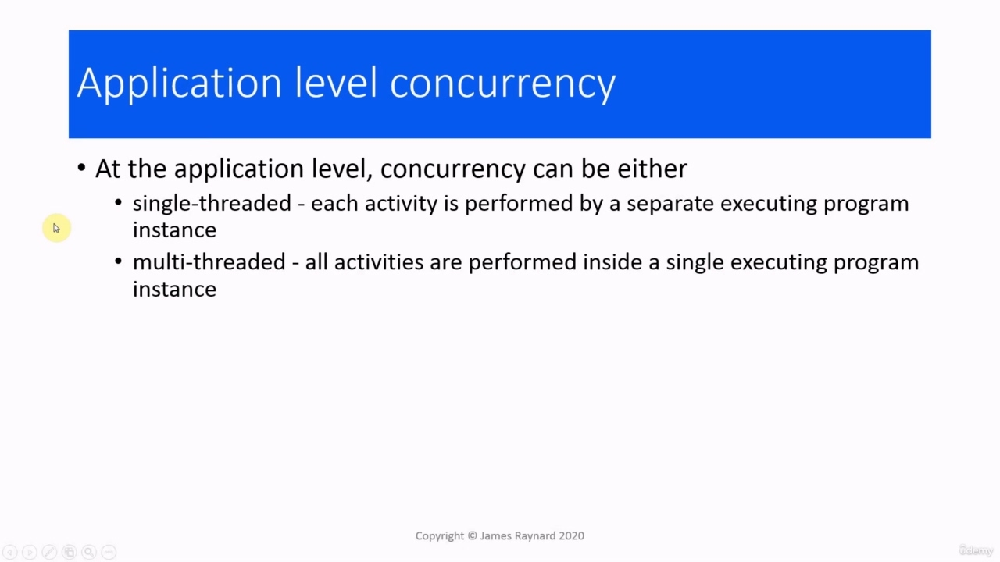
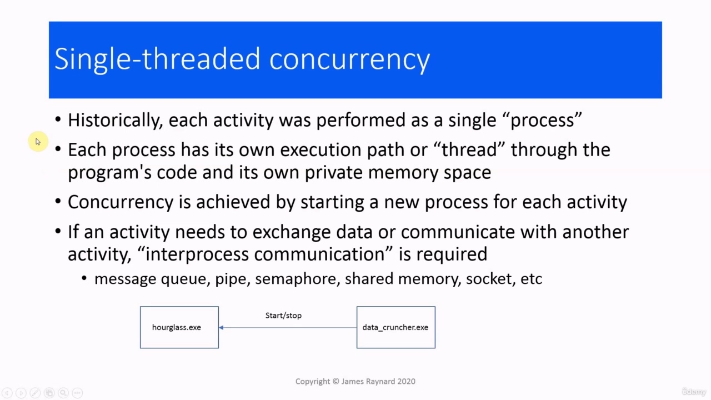
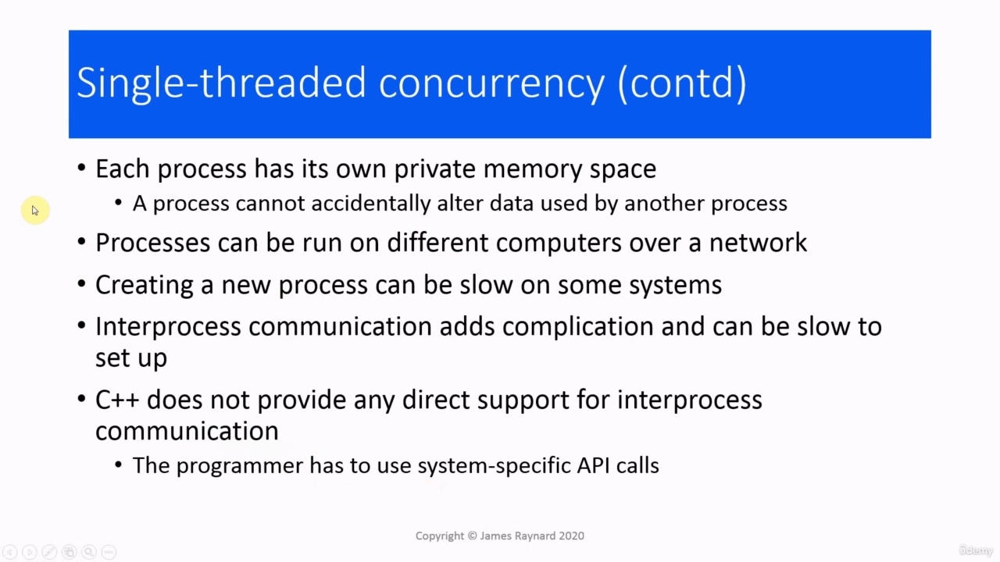
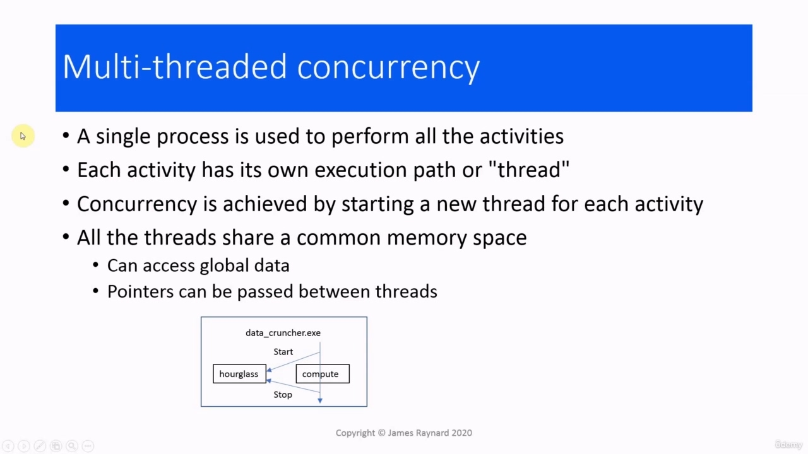
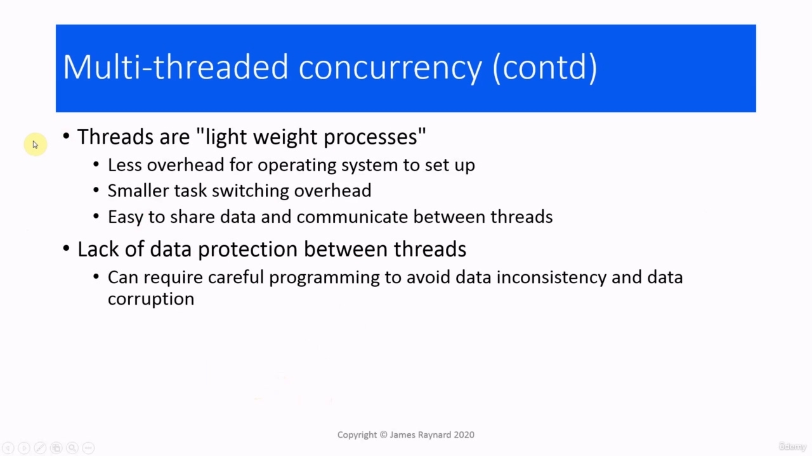
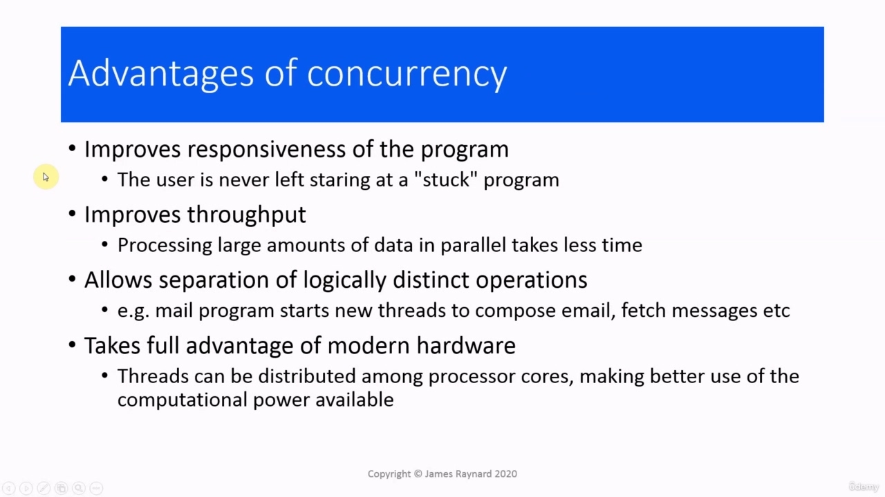
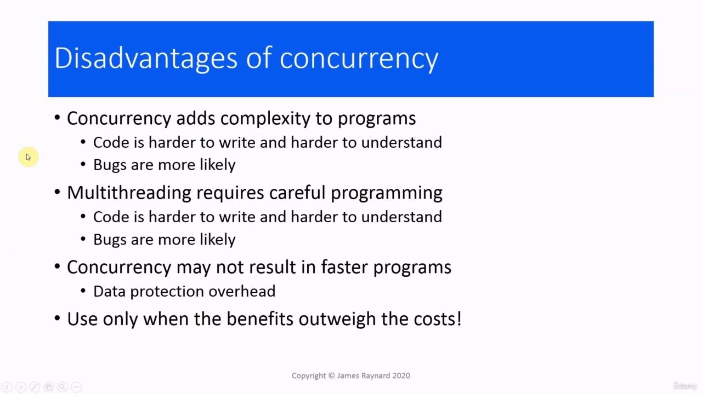

Hello there. In this video, we're going to have an overview of concurrency. So this is basically going to look

> 你好。在本视频中，我们将概述并发性。所以这基本上看起来

## img - 6420

In this video, we're going to have an overview of concurrency. So this is basically going to look at some of the points made in previous videos in a little bit more detail. At the application level,

> 在本视频中，我们将概述并发性。所以，这基本上是要看一些在以前的视频中提出的点，更详细一点。在应用层，

## img - 13440

at some of the points made in previous videos in a little bit more detail. At the application level, concurrency can be done by having lots of separate programs representing different activities, which is single threading, or it can have one single executing program in which all the activities are performed, some of them at the same time, or even maybe all of them at the same time. And that's multi threading.

> 在之前视频中的一些要点上做了更详细的介绍。在应用程序级别，可以通过使用许多表示不同活动的单独程序（即单线程）来实现并发，也可以使用一个执行程序来执行所有活动，其中一些活动同时执行，甚至可能所有活动同时执行。这就是多线程。

## img - 44760

Single threaded concurrency is the oldest and the original, a separate process for each activity, which has its own execution path through the source code, which is also known as a thread. So if you imagine you have the program's source code and you have a little... Is it the Greek legend with the Minotaur? He had the thread and he found his way out of the maze. So this is how the program traces its way through the maze of the program's code. So in single threading, each program only has one thread. There's just one way: to start at the beginning, go through to the end and then stop. Each process also has its own private memory space, so it's not possible for another process to directly access the data inside a process. We start up a new process for each activity so they can run concurrently. That's organized by the operating system. We start up a new process for each activity and the operating system will take care and make sure they run concurrently. If any of our activities need to exchange data or communicate in some way with each other, this will need some kind of interprocess communication. And there are various ways of doing that: message queue, pipe, semaphore, shared memory, network socket, file handles and so on. If we have a very simple system where we have one program that does lots of computations, that take a long time and make it unresponsive, and we want to be able to display an hourglass just to let the user know that we haven't forgotten them, then this program will need to start up a separate program to display the hourglass. It will also need to provide some kind of communication channel so it can tell the hourglass to stop, then when the data cruncher has finished crunching its data, it will send a message to the hourglass and the hourglass will stop running and the data cruncher can start reacting again. Each process has its own private space and cannot accidentally interfere with another process's data.

> 单线程并发是最古老的，也是最原始的，每个活动都有一个单独的进程，它通过源代码有自己的执行路径，也称为线程。所以如果你想象你有程序的源代码，你有一点点。。。这是希腊传说中的弥诺陶洛斯吗？他抓住了线，找到了走出迷宫的路。这就是程序如何在程序代码的迷宫中追踪自己的方式。所以在单线程中，每个程序只有一个线程。只有一种方法：从开始开始，一直到结束，然后停止。每个进程都有自己的专用内存空间，因此另一个进程不可能直接访问进程内的数据。我们为每个活动启动一个新流程，以便它们可以同时运行。这是由操作系统组织的。我们为每个活动启动一个新进程，操作系统将负责并确保它们同时运行。如果我们的任何活动需要交换数据或以某种方式相互通信，这将需要某种进程间通信。有多种方法可以做到这一点：消息队列、管道、信号量、共享内存、网络套接字、文件句柄等等。如果我们有一个非常简单的系统，其中有一个程序可以进行大量计算，这需要很长时间，而且会导致无响应，我们希望能够显示沙漏，让用户知道我们没有忘记它们，那么这个程序需要启动一个单独的程序来显示沙漏。它还需要提供某种通信渠道，这样它可以告诉沙漏停止，然后当数据处理器处理完数据时，它会向沙漏发送消息，沙漏停止运行，数据处理器可以再次开始反应。每个进程都有自己的私有空间，不会意外地干扰另一个进程的数据。

## img - 301400

Each process has its own private space and cannot accidentally interfere with another process's data. A good feature of this is that process can be run on different computers, communicating over a network, so you can have a computer that is dedicated to a particular activity. Creating new processes can be slow on some systems. Interprocess communication adds complexity and can be slow to set up, and if you are working in C++, there's no direct support for this. You have to drop down to the operating system and use whatever facilities are available, so that's a lot of extra work and it means your program will not work if you try to run it on a different system. With multithreaded concurrency, we have all the activities running in a single process. Each activity has its own execution path or thread. So you can imagine there are several different threads making their way through the program code, at the same time, going in different directions, doing different things, or maybe even doing the same thing.

> 每个进程都有自己的私有空间，不会意外地干扰另一个进程的数据。这样做的一个好特点是，流程可以在不同的计算机上运行，通过网络进行通信，这样您就可以拥有一台专用于特定活动的计算机。在某些系统上创建新流程可能会很慢。进程间通信增加了复杂性，并且设置起来可能很慢，如果您使用 C++，则没有直接的支持。你必须降到操作系统并使用任何可用的工具，所以这是一项额外的工作，这意味着如果你尝试在不同的系统上运行程序，你的程序将无法工作。通过多线程并发，我们可以在一个进程中运行所有活动。每个活动都有自己的执行路径或线程。所以你可以想象有几个不同的线程在程序代码中穿行，同时，朝着不同的方向，做着不同的事情，甚至可能做着相同的事情。

## img - 405870

same time, going in different directions, doing different things, or maybe even doing the same thing. To start a new activity, we create a new thread, so that's concurrency. All the threads share the memory space of the process they are running in. If we make any data global in this process, then all the threads can see it and access it and modify it. It's also possible to pass certain types of objects between threads. So if we go back to our data crunching example, we have one program that does everything. So this program will start off in main() executing the main thread. When it is about to start a long computation, it will start a new thread which will display the hourglass. And then when this computation is finished, it will terminate the hourglass thread and it will carry on executing. Threads are implemented using so-called lightweight processes.

> 同时，朝着不同的方向，做不同的事情，甚至可能做相同的事情。为了启动一个新的活动，我们创建了一个新线程，这就是并发。所有线程共享它们正在运行的进程的内存空间。如果我们在这个进程中使任何数据全局化，那么所有线程都可以看到它，访问它并修改它。也可以在线程之间传递某些类型的对象。所以，如果我们回到我们的数据处理示例，我们有一个程序可以做所有事情。因此，该程序将从 main（）开始执行主线程。当它即将开始长时间计算时，它将启动一个新线程，该线程将显示沙漏。然后，当计算完成时，它将终止沙漏线程并继续执行。线程是使用所谓的轻量级进程实现的。

## img - 508270

Threads are implemented using so-called lightweight processes. These are provided by the operating system. There is less overhead involved in creating a thread than there is in creating a full process. And there is also less overhead for task switching between threads because there's not so much to set up and switch. And sharing data and communication between threads is much easier than for processes. On the other hand, there is a lack of data protection. This can require careful programming. If you're not careful, you can corrupt your data and your program will behave inconsistently. And this is a big problem in threaded programming. The advantages of concurrency. The program will feel more responsive: if it is doing something and

> 线程是使用所谓的轻量级进程实现的。这些由操作系统提供。创建线程所需的开销比创建完整进程所需的更少。而且线程之间的任务切换开销也较少，因为没有太多的设置和切换。线程之间共享数据和通信要比进程容易得多。另一方面，缺乏数据保护。这可能需要仔细编程。如果你不小心，你可能会破坏你的数据，你的程序会表现得不一致。这是线程编程中的一个大问题。并发的优点。该程序将感觉更灵敏：如果它正在做一些事情

## img - 555800

The advantages of concurrency. The program will feel more responsive: if it is doing something and it gets busy, it will still respond to your commands. Concurrency can improve throughput by allowing large amounts of data or computation to be done at the same time. Which means less time overall. Concurrency allows logically distinct operations to be kept separate. If you are in an e-mail program and you are composing a new message, then other threads can run to fetch messages or perhaps archive your old messages. And it takes full advantage of modern hardware. Threads can be distributed among processor cores, so each thread runs on a separate core. And that will make much better use of the power that modern computers offer us.

> 并发的优点。该程序会感觉更灵敏：如果它正在做什么并且变得忙碌，它仍然会响应您的命令。并发可以通过允许同时完成大量数据或计算来提高吞吐量。这意味着总体时间更短。并发性允许逻辑上不同的操作保持独立。如果您正在电子邮件程序中编写新邮件，则其他线程可以运行以获取邮件或归档旧邮件。它充分利用了现代硬件。线程可以分布在处理器内核之间，因此每个线程都在一个单独的内核上运行。这将更好地利用现代计算机提供给我们的能量。
