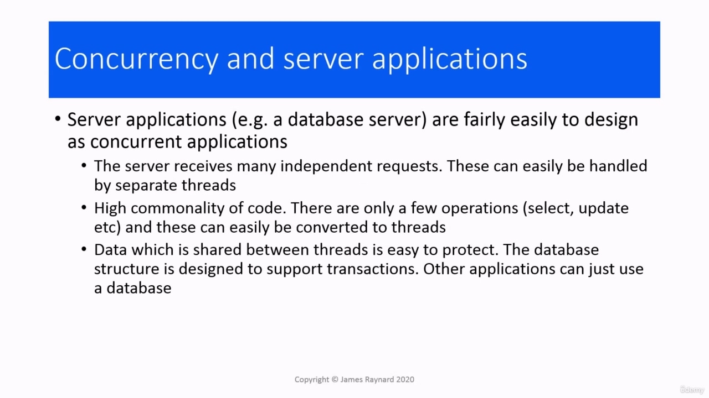
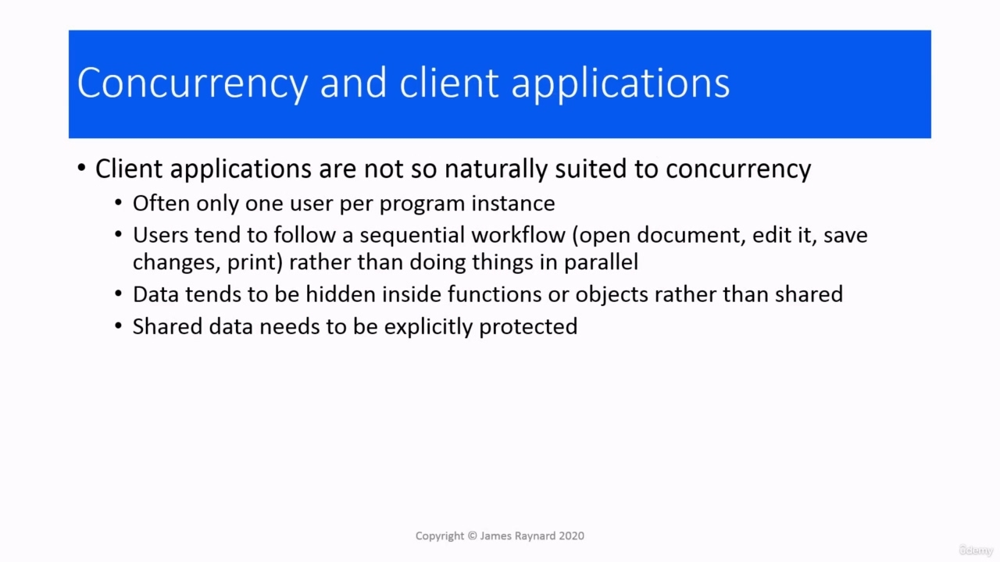
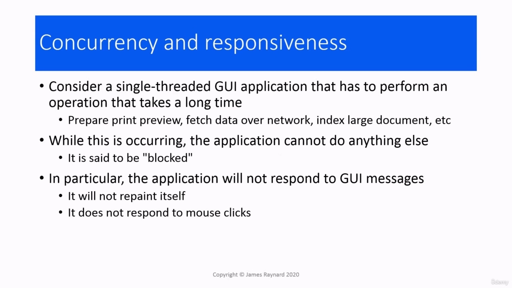
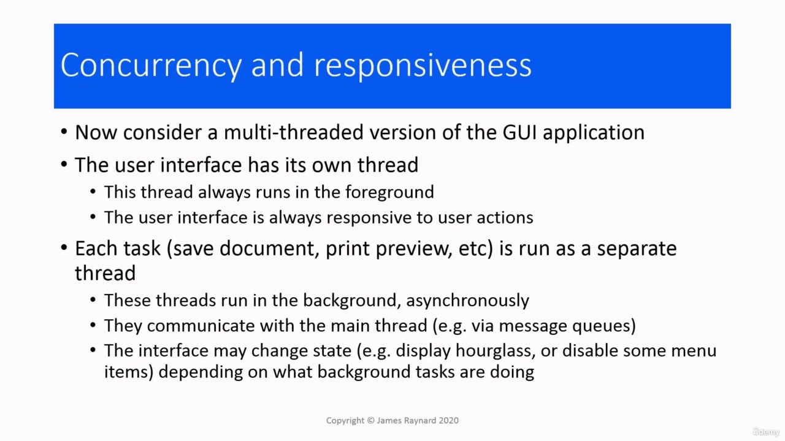
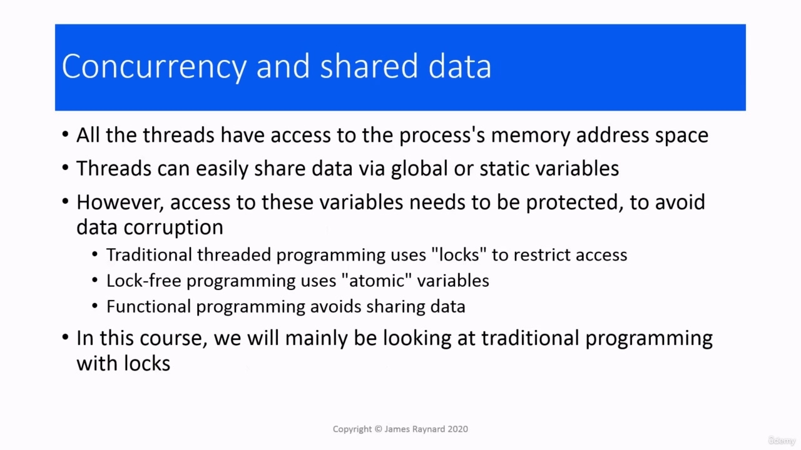
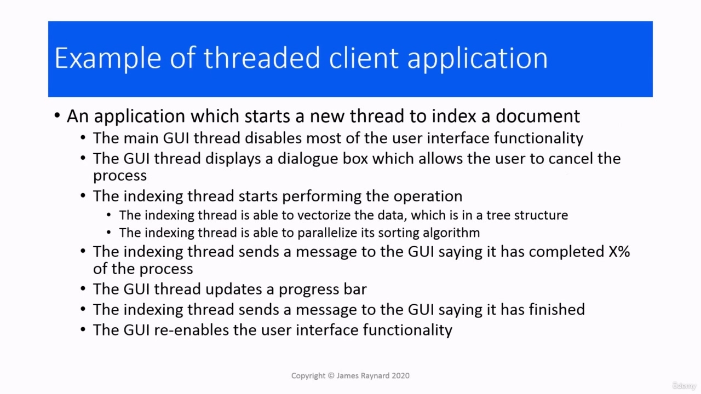

Hello there. In this video, we are going to look at concurrent applications. In general terms, what does it mean

> 你好。在本视频中，我们将讨论并发应用程序。一般来说，这意味着什么

## img - 7800

In this video, we are going to look at concurrent applications. In general terms, what does it mean to make an application concurrent?

> 在本视频中，我们将讨论并发应用程序。一般来说，使应用程序并发意味着什么？

## img - 14570

There are two main cases. Going back to the client server relationship, we mentioned earlier, there was the server side and on the other hand, there is the client side and also standalone applications. With server applications, it is usually fairly easy to see how to make it concurrent. Typically a server receives lots of requests from different clients, so it is quite natural to create a new thread to handle each request. Usually there are only a few basic operations, for example, with a database server, you may be asked to return some data or create a new table and populate it. So it is quite obvious where the concurrent tasks are and how to write them, at least in principle! Data which is shared between threads. It is pretty obvious what that is. If you are writing a database server than you already have code which supports transactions, and you can use that for protecting shared data. For client applications or standalone user applications, it is not quite so simple.

> 主要有两种情况。回到前面提到的客户机-服务器关系，一方面是服务器端，另一方面是客户端，还有独立的应用程序。对于服务器应用程序，通常很容易看到如何使其并发。通常，服务器从不同的客户端接收大量请求，因此创建一个新线程来处理每个请求是很自然的。通常只有几个基本操作，例如，对于数据库服务器，可能会要求您返回一些数据或创建一个新表并填充它。因此，至少在原则上，并发任务在哪里以及如何编写它们是非常明显的！线程之间共享的数据。这是很明显的。如果你正在编写一个数据库服务器，那么你已经有了支持事务的代码，你可以用它来保护共享数据。对于客户端应用程序或独立的用户应用程序，它并不是那么简单。

## img - 130500

For client applications or standalone user applications, it is not quite so simple. Usually there is only one person using a program instance, so you cannot gain concurrency between users. When people that use an application or a client, they tend to follow a sequential workflow. For example, you can open a document, make some changes, save your document, print it out, and that is all done in sequence. There is not really much scope for doing things concurrently. The data that the program uses that you might want to share between threats tends to be hidden away inside functions or objects in the application. It is not really out in the open like it is in servers. And also there is not any easy way to manage shared data.

> 对于客户端应用程序或独立的用户应用程序，它并不是那么简单。通常只有一个人使用一个程序实例，因此无法获得用户之间的并发性。当人们使用应用程序或客户端时，他们倾向于遵循顺序工作流。例如，您可以打开一个文档，进行一些更改，保存文档，打印出来，这些都是按顺序完成的。同时做事情的空间并不大。您可能希望在威胁之间共享的程序使用的数据往往隐藏在应用程序中的函数或对象中。它并不像在服务器中那样公开。而且也没有任何简单的方法来管理共享数据。

## img - 226160

Concurrency and responsiveness. We have basically looked at this before. When the application does a operation that takes a long time, it is blocked and it cannot do anything else. If we make the application multithreaded, the user interface will run in its own thread, which is

> 并发性和响应性。我们以前基本上看过这个。当应用程序执行一个需要很长时间的操作时，它会被阻止，无法执行其他操作。如果我们将应用程序设置为多线程，则用户界面将在其自己的线程中运行，即

## img - 238640

If we make the application multithreaded, the user interface will run in its own thread, which is always in the foreground. So it is always available to respond to user actions. And then each of these tasks where the application does its work, such as saving a document, preparing a print preview and so on, is run in its own thread. And these threads can run in the background, asynchronously. They communicate with the main thread. They could use message queues, which is a popular technique. And also, the communication can cause the user interface thread to change state. For example, if you are doing an operation, then some of the menu items might be greyed out, or it might show an hourglass or a progress counter, and that can be flexible depending on what is actually happening in the background.

> 如果我们将应用程序设置为多线程，那么用户界面将在其自己的线程中运行，该线程始终位于前台。因此，它总是可以响应用户的操作。然后，应用程序执行其工作的每个任务（例如保存文档、准备打印预览等）都在其自己的线程中运行。这些线程可以在后台异步运行。它们与主线程通信。他们可以使用消息队列，这是一种流行的技术。而且，通信会导致用户界面线程改变状态。例如，如果您正在执行一项操作，则某些菜单项可能会变灰，或者显示沙漏或进度计数器，这可以根据背景中实际发生的情况而灵活。

## img - 335830

All threads have access to the memory space and can easily share data, so you could use global or static variables in the application for sharing that. However, you can have different threads accessing the same data concurrently. And if threads try to modify the same variable at the same time, then you can get data corruption. And these variables need to be protected, so only one threat at a time can access them. The traditional approach is to use a lock, so the variable is locked and only one thread is allowed in to access it at a time. There's also lock-free programming using something called atomic variables. And then finally, you can use functional programming techniques where you do not actually share data. This course is mainly going to be looking at the traditional programming technique with locks. We will mention the others briefly, but the main focus is going to be on locks.

> 所有线程都可以访问内存空间，并且可以轻松共享数据，因此可以在应用程序中使用全局或静态变量来共享数据。但是，可以让不同的线程同时访问相同的数据。如果线程试图同时修改同一变量，那么可能会导致数据损坏。这些变量需要保护，因此一次只有一个威胁可以访问它们。传统的方法是使用锁，因此变量被锁定，一次只允许一个线程访问它。还有使用原子变量的无锁编程。最后，您可以在实际不共享数据的情况下使用函数式编程技术。本课程将主要学习带锁的传统编程技术。我们将简要提及其他问题，但主要重点将放在锁上。
