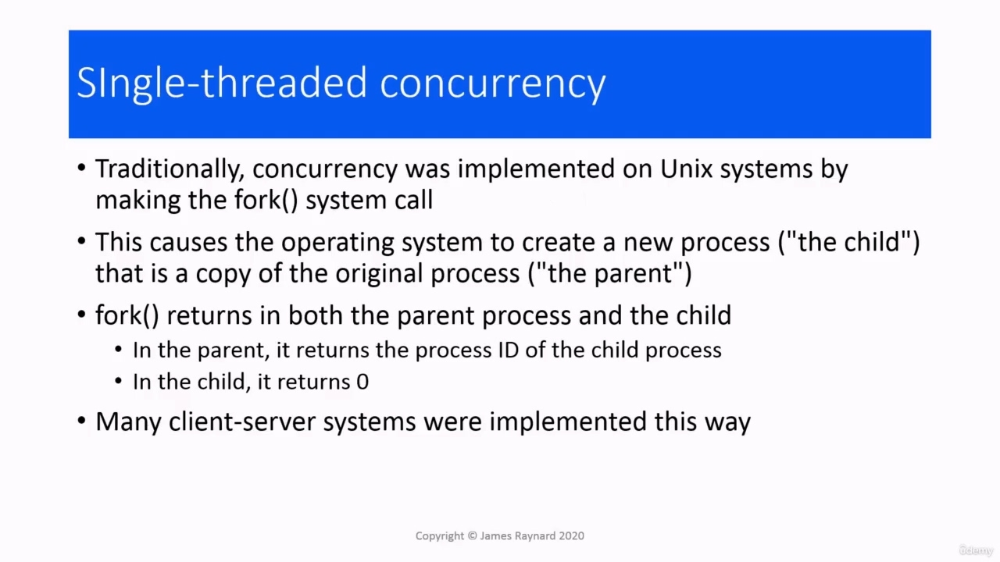
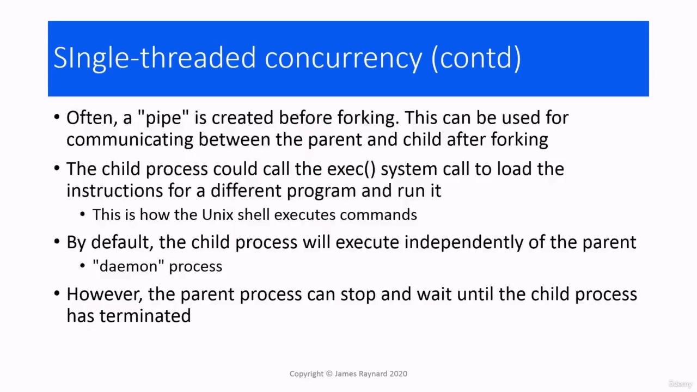
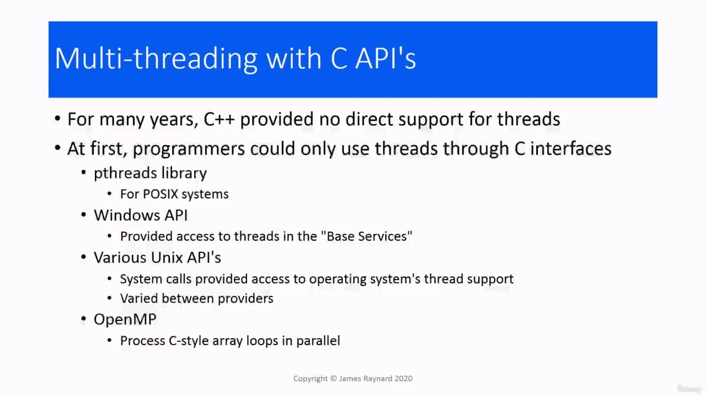
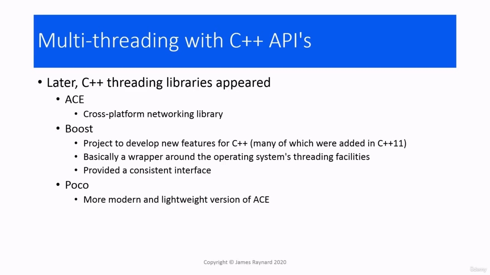
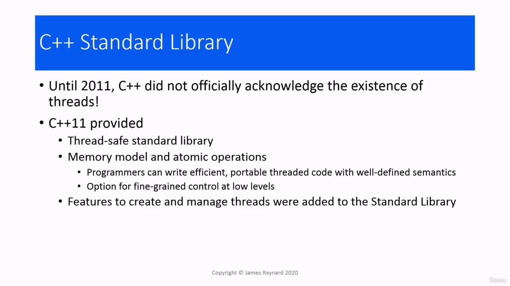
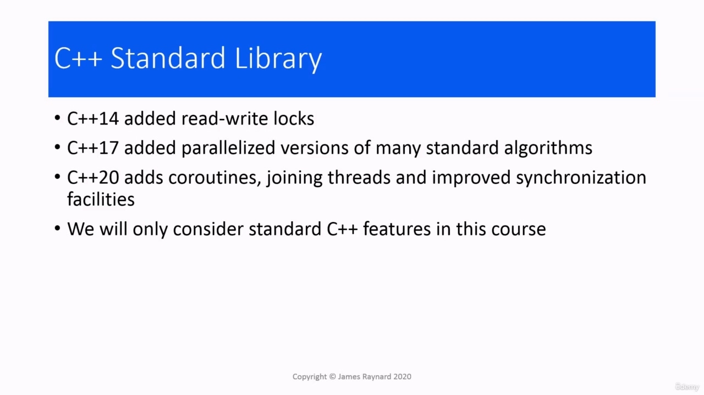

Hello there. In this video, we are quickly going to go over the history of support in C++ for concurrency.

> 你好。在本视频中，我们将快速回顾 C++支持并发的历史。

## img - 6930

In this video, we are quickly going to go over the history of support in C++ for concurrency. If we go back to the very early days when the C language was developed for writing the Unix operating

> 在本视频中，我们将快速回顾 C++支持并发的历史。如果我们回到 C 语言为编写 Unix 操作系统而开发的早期

## img - 17690

If we go back to the very early days when the C language was developed for writing the Unix operating system. We could create a new process by calling the fork() function in the operating system API. This would create a new copy that was almost an exact copy of the original, except for some book keeping details. You could also create a "pipe" which allows data to flow between the parent and the child. You had the

> 如果我们回到 C 语言为编写 Unix 操作系统而开发的早期。我们可以通过调用操作系统 API 中的 fork（）函数来创建一个新进程。这将创建一个新副本，除了一些簿记细节外，几乎与原始副本完全相同。您还可以创建一个“管道”，允许数据在父级和子级之间流动。你有

## img - 44530

You could also create a "pipe" which allows data to flow between the parent and the child. You had the option to make the child process run a different program from the parent. So it would load up the instruction codes for a different executable. And in fact, that's how the Unix [command line] shell executes.

> 您还可以创建一个“管道”，允许数据在父级和子级之间流动。您可以选择使子进程运行与父进程不同的程序。因此，它将为不同的可执行文件加载指令代码。事实上，Unix[命令行]shell 就是这样执行的。

## img - 107170

When C++ came along, for many years, there was nothing special about C++. There were various ways: you could do it in C, you could still go to the Unix API or the Windows API. There was also a library called pthreads, which worked with POSIX systems. Which basically means Unix or anything that is very good at pretending to be Unix. And finally there is the open MP library, which was and perhaps still is very popular in numeric processing. So you can write code which loops over arrays. It looks like C, but it can do it in parallel so it can use multiple processors if you have them. And later, in the 1990s onwards.

> 当 C++出现时，多年来，C++并没有什么特别之处。有多种方法：可以用 C 语言实现，也可以使用 UnixAPI 或 WindowsAPI。还有一个名为 pthreads 的库，用于 POSIX 系统。这基本上意味着 Unix 或任何擅长伪装成 Unix 的东西。最后还有一个开放的 MP 库，它在数字处理中曾经非常流行，也许现在仍然非常流行。因此，您可以编写在数组上循环的代码。它看起来像 C，但它可以并行执行，所以如果你有多个处理器，它可以使用它们。后来，在 20 世纪 90 年代以后。

## img - 150120

And later, in the 1990s onwards. Various libraries for doing threading in C++ appeared. ACE was in the mid 90s. It is a very big, clunky library, mainly intended for networking, written in typical 1990s C++ code. The Boost library, which was developed by people who are trying to get features into C++, the library was basically a kind of testbed to show that these features could be developed and they were useful, and they did actually

> 后来，在 20 世纪 90 年代以后。出现了用于在 C++中执行线程的各种库。ACE 在 90 年代中期。它是一个非常大、笨重的库，主要用于网络，用典型的 20 世纪 90 年代 C++代码编写。Boost 库是由试图将特性引入 C++的人开发的，该库基本上是一种测试平台，以表明这些特性可以开发，并且它们是有用的

## img - 220060

a kind of testbed to show that these features could be developed and they were useful, and they did actually succeed in getting a fair number of these features added to C++ 11. Boost has support for threads. It was basically a wrapper around whatever facilities the operating system provided, but it did mean that you had a consistent interface and you could write the same code on anywhere that had a C++ compiler. And then there's also Poco, which is a more modern and lightweight version of ACE, so that is, again, mainly networking, but it does have thread support as well. And finally, 2011. This is quite ironic because when Bjarne Stroustrup first got his "C with classes"

> 这是一种测试平台，表明这些功能是可以开发的，它们是有用的，而且它们确实成功地将大量这些功能添加到 C++11 中。Boost 支持线程。它基本上是操作系统提供的任何功能的包装器，但它确实意味着你有一个一致的接口，你可以在任何有 C++编译器的地方编写相同的代码。还有 Poco，它是 ACE 的一个更现代、更轻量级的版本，这也是主要的网络，但它也有线程支持。最后是 2011 年。这是非常讽刺的，因为当 Bjarne Stroustrup 第一次获得“C 与类”时

## img - 302710

And finally, 2011. This is quite ironic because when Bjarne Stroustrup first got his "C with classes" language working, the first thing he did was writing a task management library with coroutines. That was 1980, and it took another 31 years before he could get threading into the standard. Anyway, in C++11 we now have a thread-safe standard library so we can use all the standard containers and algorithms with threads. Again, we need to be a little bit careful like we do with all data. It also provided a memory model and atomic operations. So this means that programmers can write code using threads, which is efficient and portable, and the behaviour of the code is well defined (unless you make a mistake, in which case it isn't defined, which is the same as everything else in C++.) And it also gives you the possibility to have fine grained control over the exact operations at low levels. And finally, which we are mainly going to concentrate on in this course, features for creating and managing threads which were provided in the standard library.

> 最后是 2011 年。这很讽刺，因为当 Bjarne Stroustrup 第一次使用“C with classes”语言时，他做的第一件事就是用协同程序编写任务管理库。那是 1980 年，他又花了 31 年的时间才进入标准。无论如何，在 C++11 中，我们现在有了一个线程安全的标准库，因此我们可以使用线程的所有标准容器和算法。同样，我们需要像对待所有数据一样小心一点。它还提供了内存模型和原子操作。因此，这意味着程序员可以使用线程编写代码，这是高效和可移植的，并且代码的行为被很好地定义（除非你犯了错误，在这种情况下，它没有被定义，这与 C++中的所有其他操作都一样）。它还为你提供了在低级别对精确操作进行细粒度控制的可能性。最后，我们将在本课程中重点介绍标准库中提供的创建和管理线程的功能。
