Hello again. In this video, we are going to look at data races. I am going to show you an example of a data race

> 再次问候。在本视频中，我们将讨论数据竞争。我将向您展示一个数据竞争的示例

## img - 6510

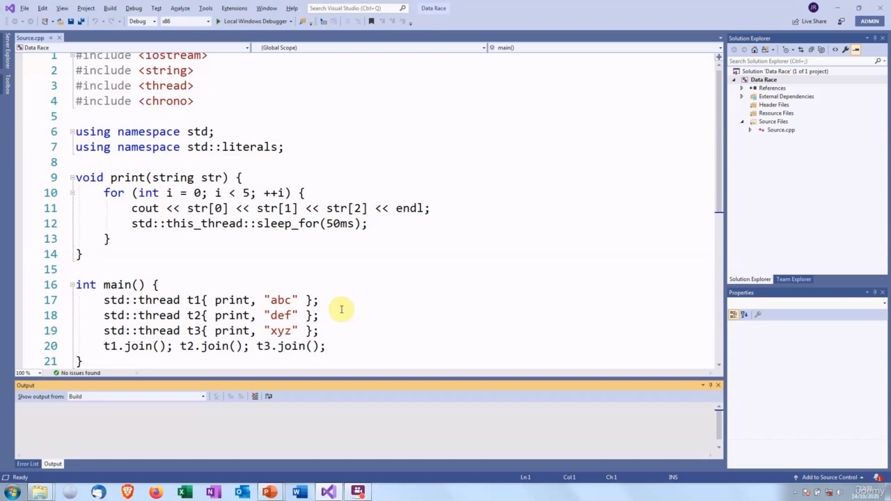

In this video, we are going to look at data races. I am going to show you an example of a data race and then discuss the kinds of problems that they can cause. So we remember the definition of a data race? It is when we have accesses from multiple threads which are not ordered or atomic. So here is the code that I am going to use to demonstrate this. It is quite similar to the example in the last video. We are going to have three threads which print a message to the screen.

> 在本视频中，我们将讨论数据竞争。我将向您展示一个数据竞争的例子，然后讨论它们可能导致的各种问题。所以我们还记得数据竞争的定义吗？
> 这是当我们有来自多个非有序或原子线程的访问时。这是我要用来演示的代码。它与上一个视频中的示例非常相似。我们将有三个线程将消息打印到屏幕上。

## img - 38580

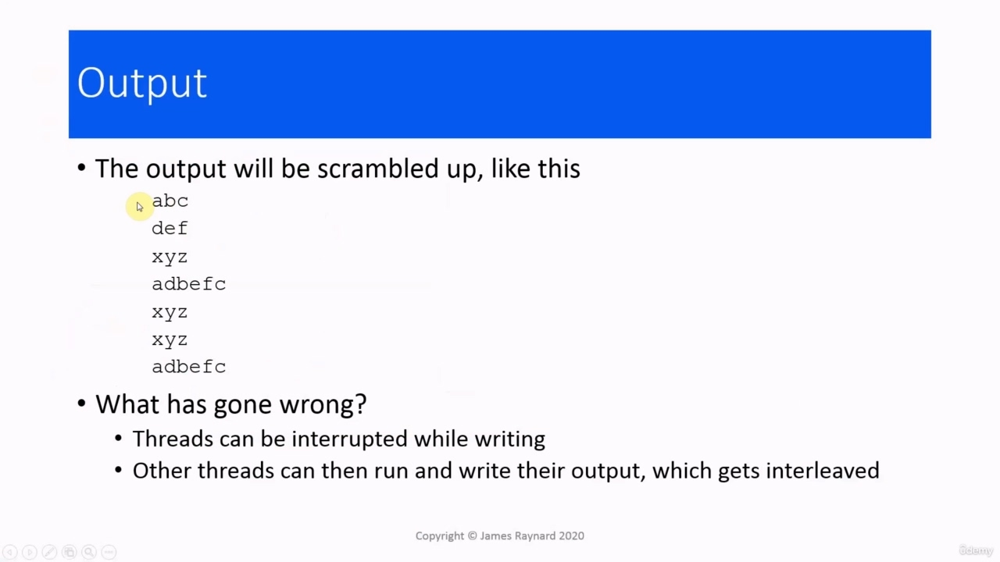

In the last video, I was careful to make sure that the threads could not print to the screen at the same time, by putting sleeps in. And in effect, that means the threads run one after the other. In this case, I actually want the threads to try to print to the screen at the same time. To do that, I have broken up the print statement into separate outputs of each character. So the thread could be interrupted between each of these function calls [to operator There are three function calls as opposed to one, so that is three times as many opportunities to be interrupted. And I have also put a sleep in here, which will give the scheduler more opportunities to interrupt threads and let other threads run. So let's see what happens when we run this. That is an extremely boring example! OK, this one is better. So the threat that prints "abc" runs first, it gets to print "a" and "b", then it gets interrupted before it can do its final output operator call. Then the "xyz" thread and the "def" thread both run and print all their output. And then the "abc" thread wakes up again and it is able to output the final character. So one of the things about data races is that they are not easily reproducible. And that does not look like a data race at all! So it's like undefined behaviour, not necessarily predictable and it can look as though everything is working fine. OK. There is another one. So I think you've got the idea by now. This is one that I prepared earlier,

> 在上一个视频中，我很小心地确保了线程不能同时打印到屏幕上，这是通过设置睡眠来实现的。实际上，这意味着线程一个接一个地运行。在这种情况下，我实际上希望线程同时尝试打印到屏幕上。为此，我将 print 语句分解为每个字符的单独输出。
> 因此，线程可能会在每个函数调用之间中断[给操作员]有三个函数调用，而不是一个，所以这是被中断的机会的三倍。我还在这里设置了一个睡眠，这将给调度器更多的机会中断线程，让其他线程运行。所以让我们看看当我们运行这个时会发生什么。
> 这是一个非常无聊的例子！好的，这个更好。所以打印“abc”的威胁首先运行，它将打印“a”和“b”，然后在执行最后的输出运算符调用之前被中断。然后，“xyz”线程和“def”线程都运行并打印它们的所有输出。然后，“abc”线程再次醒来，它能够输出最后一个字符。
> 因此，数据竞争的一个特点是它们不容易复制。这看起来根本不像一场数据竞争！所以这就像是未定义的行为，不一定是可预测的，看起来一切都很好。好的。还有一个。所以我想你现在已经有这个想法了。这是我之前准备的，

## img - 226270

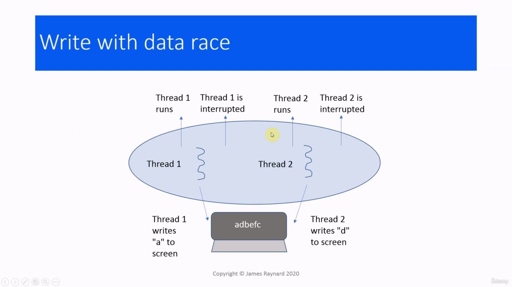

OK. There is another one. So I think you've got the idea by now. This is one that I prepared earlier, as the Children's TV program says. So you can see here we had interleaving where the first thread prints "a" and it gets interrupted, the second thread prints "d", the first thread runs again and prints "b", the second thread runs again and prints "e" and "f". And then the first thread can run and print "c". So the interleaving process: threads appear to run in between other threads. So we have the "abc" thread running here and the "def" thread appears to run in between what the "abc" thread is doing. And that is called interleaving. This oval is meant to be the program, this squiggle is meant to be one of the threads and this is meant

> 好的。还有一个。所以我想你现在已经有这个想法了。正如儿童电视节目所说，这是我之前准备的。所以你可以看到这里我们进行了交织，第一个线程打印“a”，然后它被中断，第二个线程打印了“d”，第一个再次运行并打印了“b”，第二线程再次运行并输出了“e”和“f”。然后第一个线程可以运行并打印“c”。所以交织过程：线程似乎在其他线程之间运行。
> 所以我们让“abc”线程在这里运行，而“def”线程似乎在“abc”任务之间运行。这就是所谓的交织。这个椭圆意味着程序，这个波形意味着线程之一，这意味着

## img - 317380

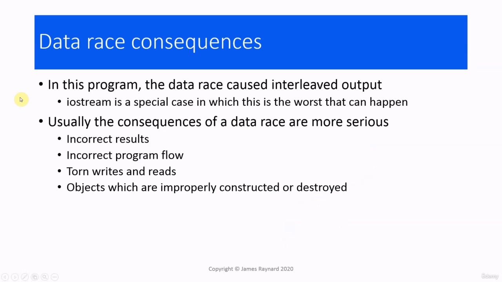

This oval is meant to be the program, this squiggle is meant to be one of the threads and this is meant to be another one of the threads. So if you imagine this is the "abc" thread and this is the "def" thread, this thread gets to run prints "a" to the screen and it gets interrupted. Then this thread can run, it prints "d" on the screen. Then it gets interrupted. And this thread runs again, prints "b" and so on. So we end up with this interleaved output.

> 这个椭圆意味着是程序，这个波形意味着是一个线程，这意味着是另一个线程。所以，如果你想象这是“abc”线程，这是“def”线程，这个线程将打印“a”到屏幕上，它就会被中断。然后这个线程可以运行，它在屏幕上打印“d”。然后它就被打断了。这个线程再次运行，打印“b”等等。所以我们最终得到了这个交错输出。

## img - 357030

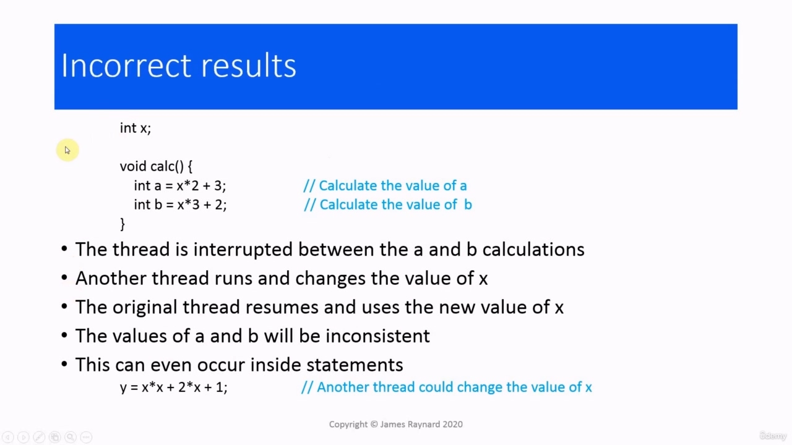

So we had a data race. We have several threads which are trying to access the same location, in this case, the output object cout. There was no ordering between the threads, so we did not have them "happening before" each other. And the access was not atomic. In our program, we saw interleaved output, but that was quite lucky, really. iostream is specially designed so nothing worse than that can happen, if you have threads trying to write to an iostream at the same time. You can get much worse consequences. For example, the results of computations can be incorrect. The program flow can be incorrect, so it does not execute in the way that it should do. We can get torn writes and reads, which mean that data is corrupted. And we can get objects which are not being properly constructed or destroyed. So let's go through these. By the way, the code in these examples is deliberately bad. I do not recommend

> 所以我们进行了一场数据竞争。我们有几个线程试图访问同一个位置，在本例中是输出对象 cout。线程之间没有排序，因此我们没有让它们“先于”发生。而且访问不是原子的。在我们的程序中，我们看到了交错输出，但真的很幸运。iostream 是专门设计的，如果您有线程试图同时写入 iostream，那么不会发生比这更糟糕的情况。你可能会得到更糟糕的后果。
> 例如，计算结果可能不正确。程序流可能不正确，因此它没有按应有的方式执行。我们可能会出现写入和读取撕裂，这意味着数据已损坏。我们可以得到没有被正确建造或破坏的物体。让我们来看看这些。顺便说一下，这些示例中的代码是故意编写的。我不建议

## img - 455580

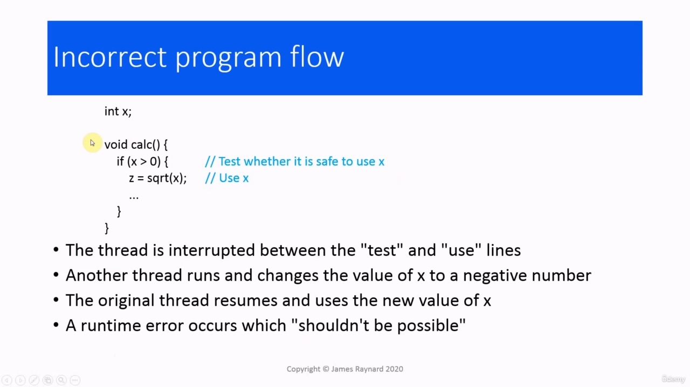

So let's go through these. By the way, the code in these examples is deliberately bad. I do not recommend that you write code like this! The reason I have done this is to demonstrate the problem in a very short, simple bit of code. We have a thread function which is doing some calculations on a shared variable x. So it does one calculation here, the statement to calculate a, and another one to calculate b. If the thread is interrupted between these two statements and another thread runs and changes the value of x, then the value of b is going to be calculated using a different value of x from the one that was used to calculate a. So the results a and b are going to be inconsistent. And this does not just happen between statements. It can also happen within statements. As we saw in the print program where we have output operator calls and threads could be interrupted between calling successive output operations. For example, if we're squaring x, then adding two times x to it, and adding one, that is two multiplication operations and two additions. And the thread could be interrupted between any of those. So when we are calculating x squared, we could use one value of x here. Then if we are interrupted before doing the multiplication, then we could use a different value of x here. Incorrect program flow. We are calculating a square root. We want to be careful and make sure that

> 让我们来看看这些。顺便说一下，这些示例中的代码是故意编写的。我不建议您编写这样的代码！我这样做的原因是为了用一小段简单的代码演示这个问题。我们有一个线程函数，它正在对一个共享变量 x 进行一些计算。因此，它在这里进行一次计算，一条语句计算 a，另一条计算 b。如果线程在这两条语句之间中断，另一个线程运行并更改 x 的值，那么 b 的值将使用与用于计算 a 的 x 值不同的 x 值来计算。因此结果 a 和 b 将不一致。这不仅仅发生在语句之间。它也可以发生在语句中。正如我们在打印程序中看到的那样，我们有输出运算符调用，线程可能在调用连续的输出操作之间中断。例如，如果我们将 x 平方，然后将 x 乘以两倍，再加一，这就是两个乘法运算和两个加法运算。而线程可能会在其中任何一个之间中断。所以当我们计算 x 平方时，我们可以在这里使用 x 的一个值。如果我们在乘法之前被中断，那么我们可以在这里使用不同的 x 值。程序流程不正确。我们正在计算平方根。我们要小心，确保

## img - 624790

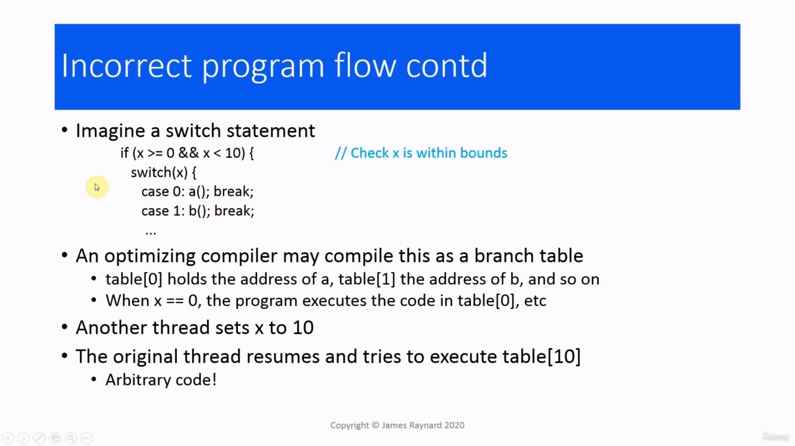

Incorrect program flow. We are calculating a square root. We want to be careful and make sure that the value is positive because it is an int and ints can have negative values. And if we take the square root of a negative number, we get a runtime error. So we test if it is safe to use x and then we take its square root. If the threat gets interrupted between doing the test and doing the square root and another thread sets the value of x to be negative, then we are going to get a run time exception here. But how is that possible? We checked the value of x, didn't we. Incorrect program flow.

> 程序流程不正确。我们正在计算平方根。我们需要小心，并确保值为正值，因为它是一个整数，整数可以有负值。如果我们取负数的平方根，就会得到一个运行时错误。所以我们测试使用 x 是否安全，然后取其平方根。如果在执行测试和执行平方根之间中断了威胁，并且另一个线程将 x 的值设置为负值，那么我们将在这里得到一个运行时异常。但这怎么可能呢？我们检查了 x 的值，不是吗。程序流程不正确。

## img - 657710

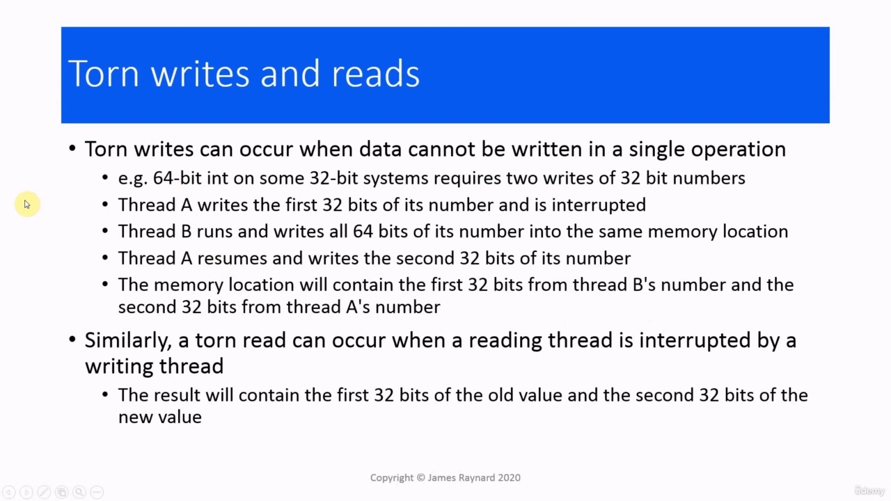

Incorrect program flow. We have a switch statement where we call different functions, depending on the value of x. We want to make sure that x is within range because our case statements go from zero to nine. So we check the value of x before we go into the switch. And - maybe you've guessed by now - if the thread gets interrupted between doing the check by some other thread that changes the value of x, then this is not going to work as expected. If it sets x to 10, then none of the cases will match and it will just jump over and out of the switch statement. And for bonus points, there is an even nastier bug hiding in here. Compilers are allowed to do lots of things to the code to optimize it. One of the common optimizations for a case statement is to convert it to a branch table. The compiler will generate some code which creates an array, the indexes of this array will be the case labels, and the elements will be pointers to the functions that get called. If, for example, the value of x is zero, then the program will go to the element with index zero and it will call the function in there, which will cause it to call a(). And the problem is, if we have an interruption which sets the value of x to 10, the program will go to the element within the index 10, which is not actually part of the array, because the highest index is nine, and it is going to execute the function there, which could be any arbitrary code. So who knows what could happen then! Torn writes and reads, These are actually very difficult to demonstrate on current hardware.

> 程序流程不正确。我们有一个 switch 语句，根据 x 的值调用不同的函数。我们希望确保 x 在范围内，因为 case 语句从 0 到 9。所以我们在进入开关之前检查 x 的值。而且-也许你已经猜到了-如果线程在执行检查之间被其他线程中断，而其他线程改变了 x 的值，那么这不会像预期的那样工作。如果它将 x 设置为 10，那么所有情况都将不匹配，它将跳过并退出 switch 语句。对于加分，这里隐藏着一个更可怕的 bug。编译器可以对代码做很多事情来优化它。case 语句的常见优化之一是将其转换为分支表。编译器将生成一些创建数组的代码，该数组的索引将是 case 标签，元素将是被调用函数的指针。例如，如果 x 的值为零，那么程序将转到索引为零的元素，并调用其中的函数，从而调用 a（）。问题是，如果我们有一个中断，将 x 的值设置为 10，程序将转到索引 10 中的元素，它实际上不是数组的一部分，因为最高索引是 9，它将在那里执行函数，这可以是任意代码。那么谁知道会发生什么呢！撕裂的写入和读取，这些在当前的硬件上很难演示。

## img - 846590

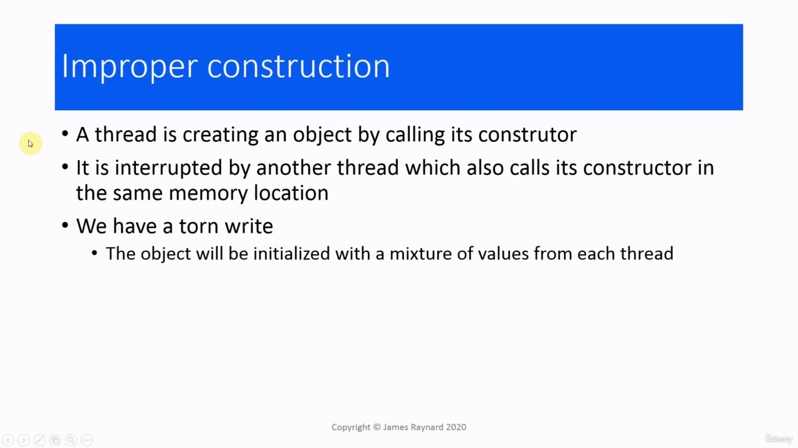

Torn writes and reads, These are actually very difficult to demonstrate on current hardware. If you're using something like ARM or PowerPC from the 2000s, then there are some cases where this could happen. These are 32 bit systems, but they have instructions which can take 64 bit arguments. So, for example, you can save a 64 bit integer. The addresses where the integer gets saved can only store 32 bits, so this is done by splitting the number into half. The first half gets written into one memory address and the second half is written into the memory address next to it. The problem occurs when we have two threads which are writing to that location at the same time, so the first thread will write the first half of this number to the first address. Then it gets interrupted. Another thread will run and write both halves of its number to the two addresses. So it is going to overwrite what is in the first half of the address. Then the original thread will start again. It'll write the second half of its number into the second half of the address. So that'll overwrite what the thread "B" just put there. So we're going to end up with a number that has the first half of thread A's number [sic] and the second half of thread B's number [sic]. It's as if you'd written down thread A's number and thread B's number on pieces of paper and then torn them in half and swapped them around. So we have the first half of A and the second half of B. Sorry, the first half... So we have the first half of B and the second half of A. And we can also have a torn read, which happens when a thread, which is reading, is interrupted by another thread which is writing. So the reading thread will get the first half of the number, then the writing thread will overwrite that and put a different value in the second half of that number. And then the reading thread will pick up that new value from the second half. So it will be the number, which again is a mixture of two different values. Improper construction. If we imagine a thread which is creating an object and it calls the object's

> 撕裂的写入和读取，这些在当前的硬件上很难演示。如果您使用的是 2000 年代的 ARM 或 PowerPC，那么在某些情况下可能会发生这种情况。这些是 32 位系统，但它们有可以接受 64 位参数的指令。
> 例如，您可以保存一个 64 位整数。保存整数的地址只能存储 32 位，因此这是通过将数字一分为二来实现的。前一半被写入一个内存地址，后一半被写入其旁边的内存地址。当我们有两个线程同时写入该位置时，就会出现问题，因此第一个线程会将这个数字的前一半写入第一个地址。然后它就被打断了。另一个线程将运行并将其数字的一半写入两个地址。所以它将覆盖地址前半部分的内容。然后原始线程将再次启动。它会将其数字的后半部分写入地址的后半部分。所以这将覆盖线程“B”刚才放在那里的内容。
> 因此，我们将得到一个具有线程 a 的前半部分编号[sic]和线程 B 的后半部分编号[sc]的数字。这就好像你在纸上写下了 A 线和 B 线的编号，然后把它们撕成两半，然后交换。所以我们有 A 的前半部分和 B 的后半部分。对不起，前半部分。。。所以我们有 B 的前半部分和 A 的后半部分。
> 我们也可以有一个撕裂的读取，当一个正在读取的线程被另一个正在写入的线程中断时，就会发生这种情况。因此，读取线程将获得该数字的前半部分，然后写入线程将覆盖该数字，并在该数字的后半部分放入不同的值。然后，读取线程将从下半部分获取新值。所以它将是一个数字，也是两个不同值的混合。施工不当。如果我们想象一个线程正在创建一个对象，它调用该对象的

## img - 1052860

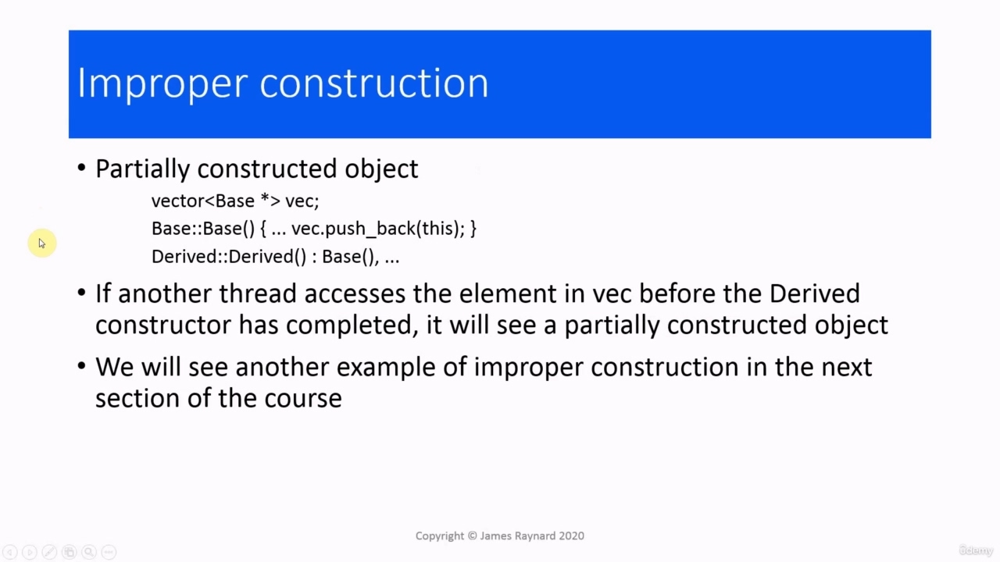

Improper construction. If we imagine a thread which is creating an object and it calls the object's constructor. While it is doing that, it is interrupted by another thread, which is also calling a constructor on the same memory location. And that's going to give us a torn write. If we imagine the constructor has several initialization statements and some of those get executed by one thread and some of those get executed by another thread, we are going to have a torn write. And the object is going to be initialized with a mixture of values from each thread. Another horrible bit of code!

> 施工不当。如果我们想象一个线程正在创建一个对象，它调用该对象的构造函数。当它这样做时，它被另一个线程中断，该线程也在同一内存位置上调用构造函数。这会让我们写得很糟糕。如果我们假设构造函数有几个初始化语句，其中一些由一个线程执行，而另一些由另一个线程运行，那么我们将有一个撕裂的写入。对象将用来自每个线程的混合值初始化。又一个可怕的代码！

## img - 1131790

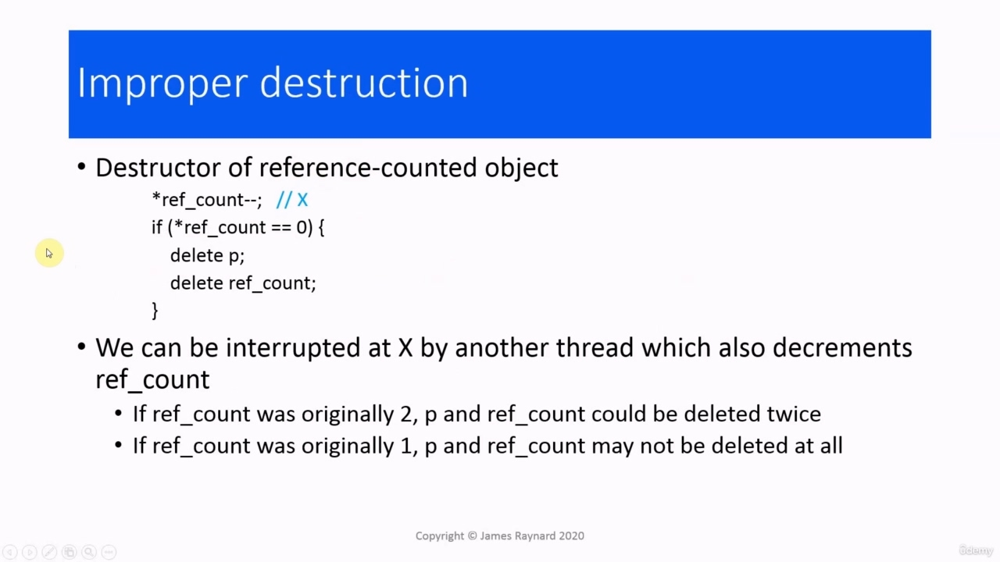

We have a situation where we have a class with inheritance and in the base class, the base class will push an instance of itself onto a vector of pointers to the base. As you probably know, when you have a derived class object, that contains an instance of the base class object and that base class object is created before the derived class constructor is called. So if we call the derived class constructor, it'll call the base class constructor. The base class constructor will push back a pointer to the partially constructed base object. And then if some other thread accesses that element of the vector before the derived class constructor has run, then it is only going to see a partially constructed object. And finally, improper destruction. You probably know about the shared_ptr in C++11, which is a reference

> 我们有一种情况，我们有一个带有继承的类，在基类中，基类将自己的一个实例推送到一个指向基类的指针向量上。正如您可能知道的，当您有一个派生类对象时，它包含基类对象的一个实例，并且该基类对象是在调用派生类构造函数之前创建的。因此，如果我们调用派生类构造函数，它将调用基类构造函数。
> 基类构造函数将向后推一个指向部分构造的基对象的指针。然后，如果其他线程在派生类构造函数运行之前访问向量的元素，那么它只会看到一个部分构造的对象。最后，不当破坏。您可能知道 C++11 中的 shared_ptr，这是一个参考

## img - 1221240

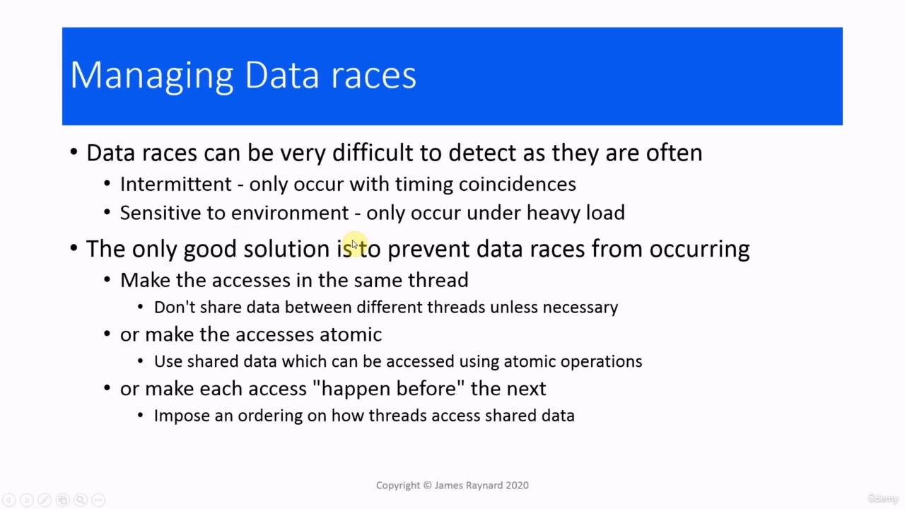

And finally, improper destruction. You probably know about the shared_ptr in C++11, which is a reference counted object. The idea is that every time a reference to the object is destroyed, a counter is decremented. When the counter goes down to zero, that means the last reference has been destroyed and then we can delete the object and its management data. So imagine we try to implement this ourselves. Obviously, the real shared_ptr does not suffer from this. It has been designed intelligently. But if we try to write it ourselves and get it wrong, then something like this could happen. We have an integer which is decremented, and then we check if it is equal to zero. In a threaded program, we could have two threads which are destroying their reference at the same time. And if one threat gets interrupted after doing the decrement, but before doing the check, then we can have the situation where the reference count has the wrong value. If the reference count is two, then one thread decrements it down to one and then it gets interrupted, then the next thread will take it down to zero. Then that thread will see the reference count equal to zero and the first thread, when it runs again, will also see that the reference count is equal to zero. So these deletions are done twice. On the other hand, if the reference count is one initially, then the first thread will decrement it to zero, then it gets interrupted. The second thread decrements it to minus one, then both sides will see a value of minus one. So this check fails and the deletion is not done. So in fact, we have a memory leak.

> 最后，不当破坏。您可能知道 C++11 中的 shared_ptr，它是一个引用计数对象。
> 其思想是，每次销毁对对象的引用时，计数器都会递减。当计数器降为零时，这意味着最后一个引用已被销毁，然后我们可以删除对象及其管理数据。所以想象一下，我们自己尝试实现这一点。显然，真正的 shared_ptr 不会因此而受损。它是经过智能设计的。
> 但如果我们试图自己写，并把它弄错，那么类似的事情可能会发生。我们有一个递减的整数，然后检查它是否等于零。在线程程序中，我们可以有两个线程同时销毁它们的引用。如果一个威胁在执行减量之后但在执行检查之前被中断，那么我们可能会出现引用计数值错误的情况。如果引用计数为 2，则一个线程将其减为 1，然后中断，然后下一个线程会将其减至 0。然后，该线程将看到引用计数等于零，当第一个线程再次运行时，也将看到引用数等于零。因此，这些删除操作进行了两次。另一方面，如果引用计数最初为 1，那么第一个线程将将其递减为零，然后中断。第二个线程将其减为-1，那么两边都将看到值减 1。因此，此检查失败，删除操作未完成。所以事实上，我们有一个内存泄漏。
