Hello again.In this video, we are going to start looking at things called "mutexes".We saw in the last section that data races can occur when multiple threads try to access the same memorylocation. And if we impose some sort of ordering on the threads as they access this location, then

> 大家好。在本视频中，我们将开始研究称为“互斥体”的东西。我们在上一节中看到，当多个线程试图访问同一内存位置时，可能会发生数据竞争。如果我们在线程访问这个位置时对它们施加某种排序，那么

## img - 21330

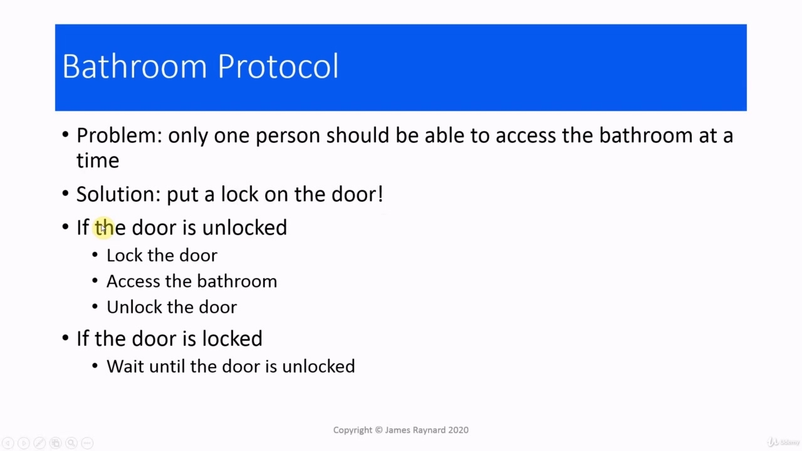

location. And if we impose some sort of ordering on the threads as they access this location, thenwe can avoid a data race.And a mutex is one of the tools for doing that.

> 地方如果我们在线程访问这个位置时对它们施加某种排序，那么我们就可以避免数据竞争。互斥锁是实现这一点的工具之一。

## img - 35550

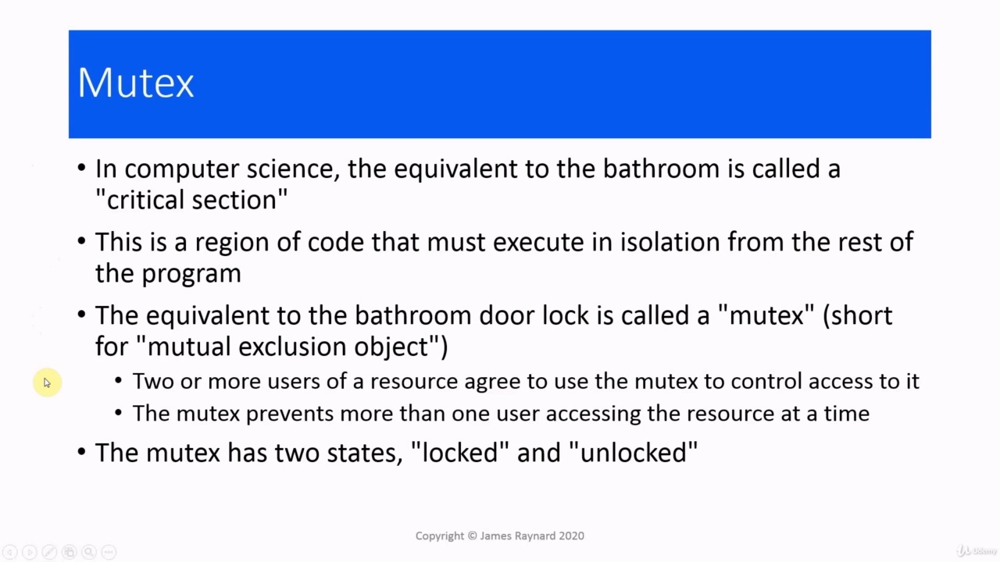

I am afraid this is rather a tasteless analogy, so I apologize to anyone who is offended by it.So let us step away from computers for a moment and go to more domestic matters.We have a situation where we want to impose a rule that only one person can access the bathroomat a time.So a common solution is to put a lock on the door and everyone who uses the bathroom has to agree ona protocol.If the door is unlocked, then you can lock it, access the bathroom, and then you unlock it so thenext person can access the bathroom. If the door is locked, then you have to wait until it becomesunlocked.In computer science, the bathroom would be regarded as a "critical section".This means some part of the program that must be able to execute without other parts of the programinterfering with it.The bathroom door lock would be called a mutual exclusion object or "mutex" for short.And we have this protocol in which two or more users of a resource agree that they will use the mutex to

> 我恐怕这是一个毫无趣味的类比，所以我向任何被冒犯的人道歉。所以让我们暂时离开电脑，去处理更多的家庭事务。我们有一种情况，我们想强制规定一次只能有一个人进入浴室。因此，一个常见的解决方案是在门上上锁，每个使用浴室的人都必须同意协议。如果门没有上锁，进入浴室，然后解锁，以便下一个人可以进入浴室。如果门是锁着的，那么你必须等到它解锁。在计算机科学中，浴室将被视为“关键部分”。这意味着程序的某些部分必须能够在不受程序其他部分干扰的情况下执行。浴室门锁将被称为互斥对象或简称“互斥锁”。我们有一个协议，其中两个或多个资源用户同意使用互斥锁

## img - 144780

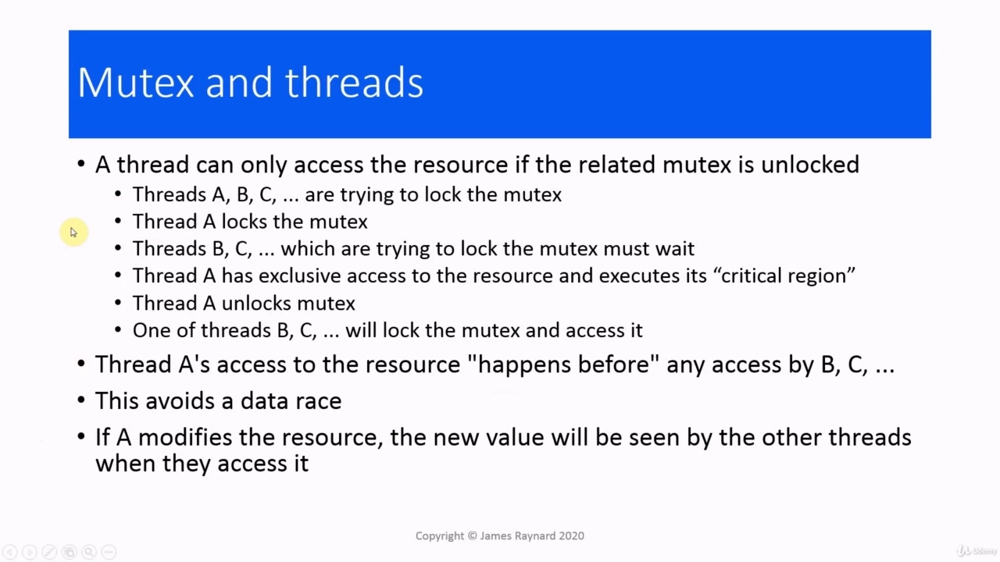

And we have this protocol in which two or more users of a resource agree that they will use the mutex tocontrol access to it. So provided everybody plays by the rules,the mutex will prevent more than one user accessing the resource and executing the critical sectionat any one time.The mutex is a data structure. It is a very simple object that just has two states: it is either lockedor unlocked.

> 我们有一个协议，其中一个资源的两个或多个用户同意他们将使用互斥锁来控制对它的访问。因此，如果每个人都遵守规则，互斥锁将阻止多个用户在任何时候访问资源并执行关键部分。互斥锁是一个数据结构。它是一个非常简单的对象，只有两种状态：锁定或解锁。

## img - 217600

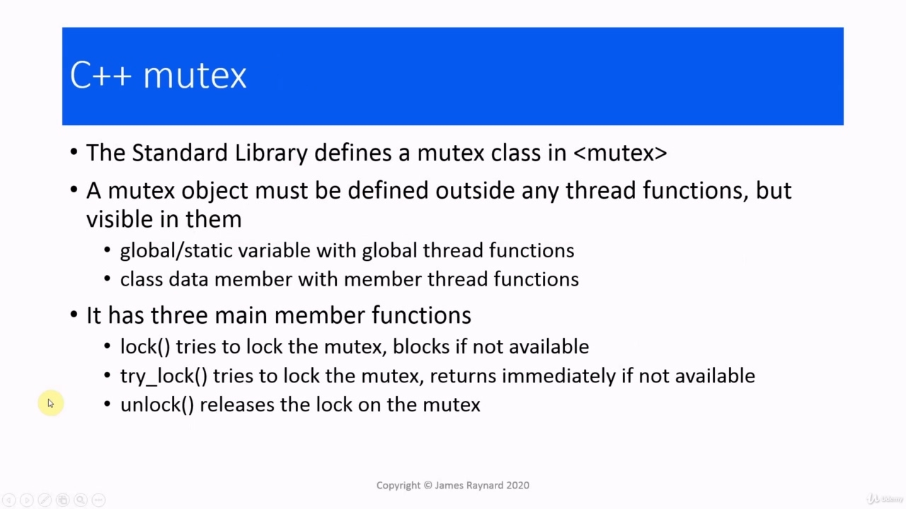

The way this works in threaded programs where we have multiple threads trying to access a resource is thatwe associate a mutex with the resource and a thread can only access the resource if the mutex is unlocked.So you can imagine we have several threads which want to access the resource.They try to get a lock on the mutex.Only one of them can succeed.So the first one there, thread A, will look the mutex and the other threads will have to wait until the mutexis unlocked by thread A.Meanwhile, thread A has exclusive access to the resource and it can execute its critical region withoutbeing interrupted [by another thread executing the same code]Then when thread A finishes executing its critical region, it will unlock the mutex. Then one of the otherthreads will be able to lock the mutex and access the resource.So this means that, by the time any of threads B, C, D, etcetera, gets to access the resource, thread A will havecompleted its access.So the access by thread A will "happen before" any access by the other threads.So we have been able to impose some ordering on the threads, how they access the resource.And that means we have avoided a data race.One other aspect of mutexes, which is more significant than it may sound: if a thread modifies theresource, then all the threads that run after it will see the result of that modification.So, for example, if thread A changes the value of a variable and then thread B runs, thread, B willsee the variable that was set by thread A.

> 在线程程序中，我们有多个线程试图访问一个资源，这是因为我们将互斥锁与资源关联起来，只有互斥锁未锁定时，线程才能访问该资源。所以你可以想象，我们有几个线程想要访问该资源，他们试图锁定互斥锁。只有其中一个线程可以成功，将查看互斥锁，而其他线程将不得不等待，直到互斥锁被线程 A 解锁。同时，线程 A 对资源具有独占访问权，它可以执行其关键区域，而不会被[执行相同代码的另一个线程]中断。然后，当线程 A 完成其关键区域的执行时，它将解锁互斥锁。然后，其他线程中的一个将能够锁定互斥锁并访问资源。这意味着，当线程 B、C、D 等中的任何一个访问资源时，线程 A 将完成其访问。因此，线程 A 的访问将“先于”其他线程的任何访问。因此我们能够对线程进行一些排序，他们如何访问资源。这意味着我们避免了数据竞争。互斥锁的另一个方面比听起来更重要：如果一个线程修改了源，那么在它之后运行的所有线程都将看到修改的结果。因此，例如，如果线程 a 更改了变量的值，然后线程 B 运行，B 将看到线程 A 设置的变量。

## img - 404500

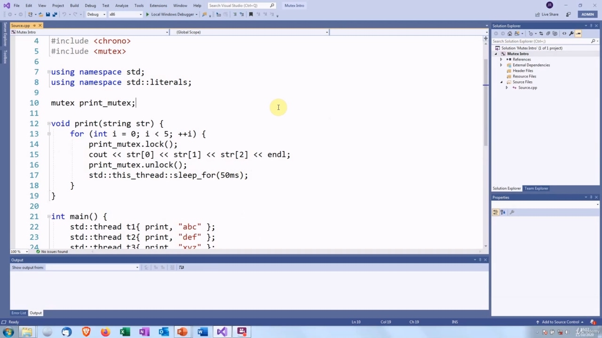

When C++ added multi-threading, it provided a mutex class.This is in the standard header.When we create a mutex object, it must be outside any of the thread [functions] that are going to use it, butit must be visible to all those thread [functions].This usually means that if we have thread functions which are global functions, then the mutex hasto be a global or a static variable.If the thread functions are member functions of a class, then the mutex will usually be a data member of that class,although it could still be a global or static variable.There are three main functions that we are interested in.The lock member function will try to lockthe mutex.And this call will not return until the mutex has been locked.So that is what is called a "blocking" call.If a thread tries to unlock the mutex and some other thread has got the mutex lock on, then this thread is goingto be stuck waiting for the call to return, until the other thread unlocks it and the thread is able to getthe lock.An alternative to that is the try_lock function, which will return immediately.This returns a boolean.If we have a lock on the mutex, the result is true.Otherwise, the return value is false.So that is useful if you do not want to wait an indefinite amount of time to get the lock. You coulddo something else and then try again.And then finally, the unlock member function, which does what you might expect.It releases the lockon the mutex.

> 当 C++添加多线程时，它提供了一个互斥类。这在标准头中。当我们创建一个互斥对象时，它必须在将要使用它的任何线程〔函数〕之外，但它必须对所有这些线程〔函数】可见。这通常意味着，如果我们有全局函数的线程函数，那么互斥锁必须是全局变量或静态变量。如果线程函数是类的成员函数，那么互斥锁通常是该类的数据成员，尽管它仍然可能是一个全局或静态变量。我们感兴趣的主要函数有三个。锁定成员函数将尝试锁定互斥锁。在互斥锁被锁定之前，这个调用不会返回。所以这就是所谓的“阻塞”调用。如果一个线程试图解锁互斥锁，而另一个线程打开了互斥锁，那么这个线程将一直等待调用返回，直到另一个线程解锁它，并且线程能够获得锁。另一个替代方法是 try_lock 函数，它将立即返回。这返回一个布尔值。如果我们对互斥锁有锁，则结果为真。否则，返回值为 false。因此，如果您不想等待无限长的时间来获取锁，那么这很有用。你可以做一些其他的事情，然后再试一次。最后，解锁成员函数，它完成了你可能期望的事情。它释放了互斥锁上的锁。

## img - 548860

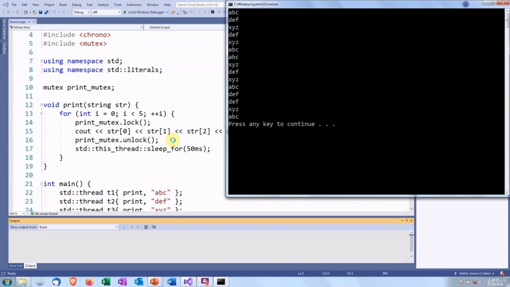

I have rewritten the code from the previous video to use a mutex. I have included the mutex header. I havecreated a global mutex instance because the thread function is a global function and then, here is the criticalregion of the thread function.And before that, I have put in a call to lock the mutex.And then after that I unlock the mutex.So when each thread goes into this loop, it is going to try to lock the mutex.When the lock call returns, that will mean the thread has [the lock on] the mutex.It will mean that no other thread can execute [this code] while this critical region is being executed and thenit will unlock the mutex afterwards.So let's see how that works.There we are. It looks perfect, but as we saw, that does not necessarily prove anything.So let's run it a few more timesand it looks through that has....And it looks as though this has fixed the problem.

> 我已经重写了前一段视频中的代码，以使用互斥锁。我已经包含了互斥标头。我创建了一个全局互斥锁实例，因为线程函数是一个全局函数，然后，这里是线程函数的关键区域。在此之前，我调用了一个锁定互斥锁的调用。然后，我解锁了互斥锁。因此，当每个线程进入这个循环时，它将尝试锁定互斥锁。当锁定调用返回时，这意味着线程拥有互斥锁。这意味着在执行此关键区域时，没有其他线程可以执行此代码，之后它将解锁互斥锁。所以让我们看看这是如何工作的。它看起来很完美，但正如我们所看到的，这并不一定能证明什么。所以让我们再运行几次，看看它有什么。。。。看来这已经解决了问题。

## img - 701750

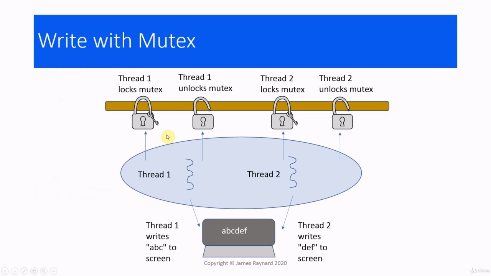

## img - 701750

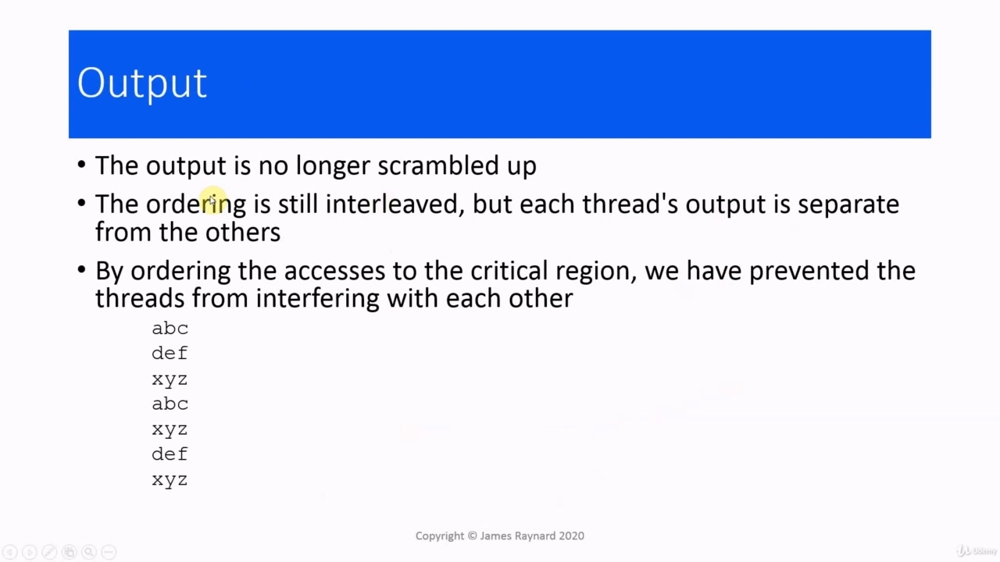

So this is what is happening. If we go back to the diagram that we had before, I have added these locks and themutex so this is meant to be the mutex and these are the threads which are locking and unlocking it.So thread one gets to run, it gets a lock on the mutex, and while thread one has a lock on the mutex,no other thread can have a lock.So thread one gets to write "abc" without being interrupted.Then when it has finished, it unlocks the mutex, then some other thread can lock the mutex.That thread can run one without being interrupted and that can write "def".So we are going to get the proper output on the screen.

> 这就是正在发生的事情。如果我们回到之前的图表，我已经添加了这些锁和互斥锁，所以这意味着这是互斥锁，而这些是正在锁定和解锁互斥锁的线程。所以线程 1 开始运行，它会获得互斥锁的锁，而线程 1 在互斥锁上有锁，但其他线程不能有锁。因此线程 1 可以在不被中断的情况下写入“abc”，它解锁互斥锁，然后其他线程可以锁定互斥锁。该线程可以运行一个互斥锁而不被中断，并且可以写入“def”。因此，我们将在屏幕上获得正确的输出。

## img - 742560

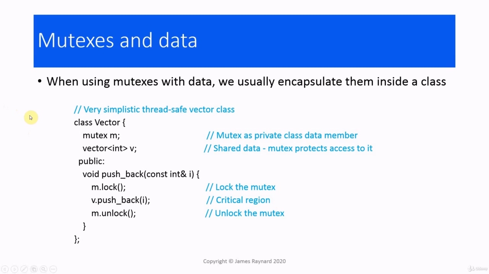

So that means that the output is no longer scrambled up.We still have interleaved ordering because the threads can be scheduled to run in any order, but eacheach thread's output is separate from the others.It is not mixed up.We have imposed a "happens before" relationship on the threats as they access the critical region, whichmeans they cannot interfere with each other.

> 因此，这意味着输出不再被打乱。我们仍然有交错排序，因为线程可以按任何顺序运行，但每个线程的输出都是独立的。它不是混合的。我们在威胁访问关键区域时对它们施加了“先发生”的关系，这意味它们不能相互干扰。

## img - 810290

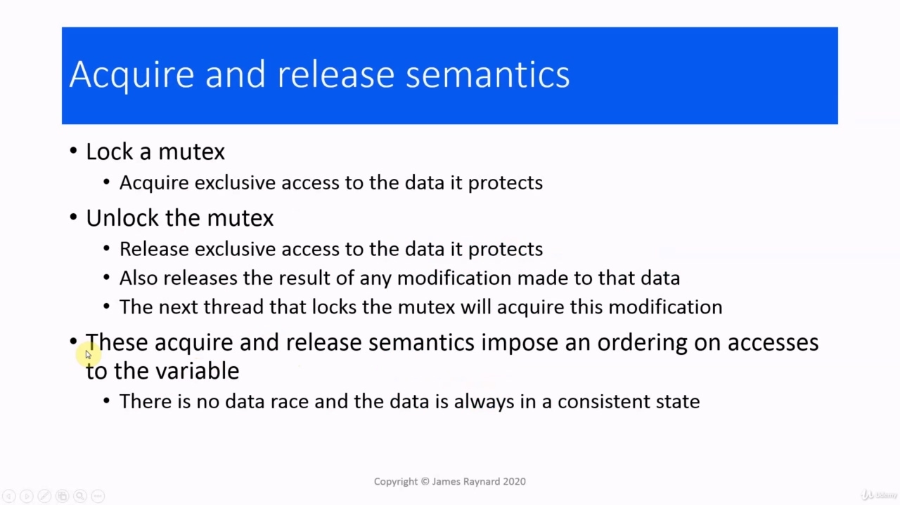

Usually when we are using mutexes with data, we encapsulate them inside a class.So, for example, if you want to have a vector, which is thread safe, we could create a classwhich has a vector as a member and a mutex as another data member.And then we have member functions which just forward to the vector's member functions, but with a lock, sofor example, when we call push_back on our thread safe class, this will get a lock on this mutex.Then when the thread has looked the mutex, it will call the push_back member function on the vector andthen it will unlock it.So this means that only one threadcan modify the vector at any one time.Obviously, this is a rather simplistic example.

> 通常，当我们对数据使用互斥锁时，我们会将它们封装在一个类中。因此，例如，如果你想要一个向量，这是线程安全的，我们可以创建一个类，该类将一个向量作为成员，将一个互斥锁作为另一个数据成员。然后，我们有一个成员函数，它只是转发到向量的成员函数，当我们在线程安全类上调用 push_back 时，这将获得该互斥锁的锁。然后当线程查看互斥锁时，它将调用向量上的 push_back 成员函数，然后将其解锁。因此，这意味着任何时候只有一个线程可以修改向量。显然，这是一个非常简单的示例。

## img - 903190

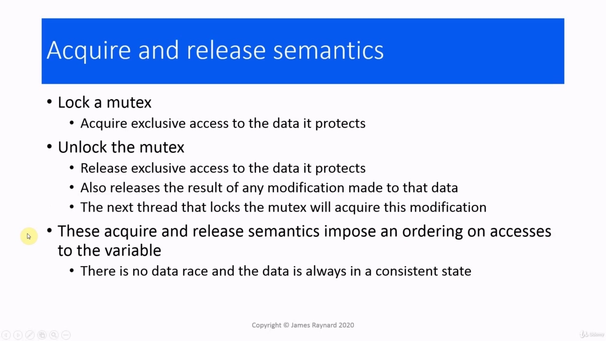

The mutex is an example of acquire and release semantics. When we lock the mutex, we acquire exclusiveaccess to the data it protects and to the critical region.When we unlock the mutex, it releases the exclusive access to the data and it will also release theresults of any modification made to that data.So the next thread which locks the mutex will acquire the results of that modification.So these are acquire and release semantics are what imposes the ordering on the accesses to the variable.There is no data race and the data will always be in a consistent state.

> 互斥锁是获取和释放语义的一个示例。当我们锁定互斥锁时，我们获得对它保护的数据和关键区域的独占访问。当我们解锁互斥锁时，它释放了对数据的独占访问，也将释放对该数据所做的任何修改的结果。因此，锁定互斥锁的下一个线程将获取该修改的结果，因此，这些是获取和释放语义，是对变量访问的排序。没有数据竞争，数据将始终处于一致状态。

## img - 937670

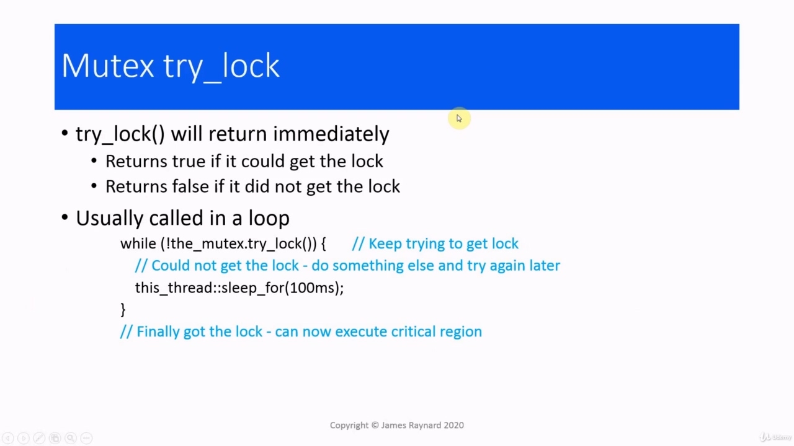

There is no data race and the data will always be in a consistent state.

> 没有数据竞争，数据将始终处于一致状态。

## img - 948270

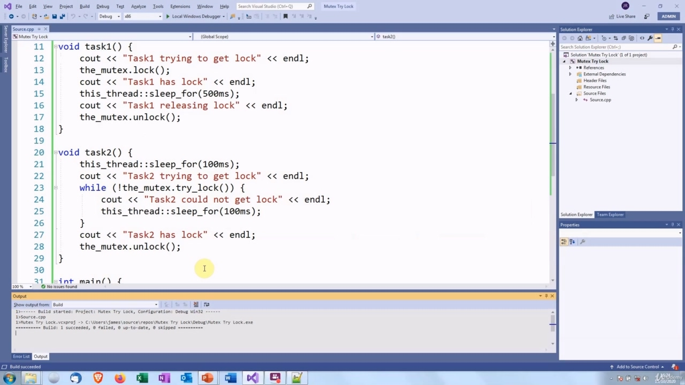

So we mentioned try_lock() before. This is typically how you use it. You have a loop in which youkeep calling try_lock().If it does not get the lock, then this returns false and then you can do something else, and thentry again a bit later.Then if the call does succeed, then it will returntrue.And you can carry on and do what... You can execute your critical region.So you keep trying to get the lock in a loop until you succeed.I have got some code which demonstrates this.

> 所以我们之前提到过 try_lock（）。这是您通常使用它的方式。您有一个循环，在该循环中，您一直调用 try_lock（）。如果它没有获得锁，则返回 false，然后您可以执行其他操作，稍后再重试。然后，如果调用成功，则返回 true。您可以继续并执行以下操作。。。你可以执行你的关键区域。所以你一直试图在循环中获得锁，直到你成功。我有一些代码可以证明这一点。

## img - 1023860

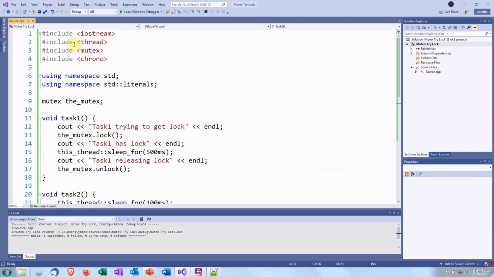

We just have the usual thread boilerplate at the top.

> 我们只是在顶部有通常的螺纹样板。

## img - 1023860

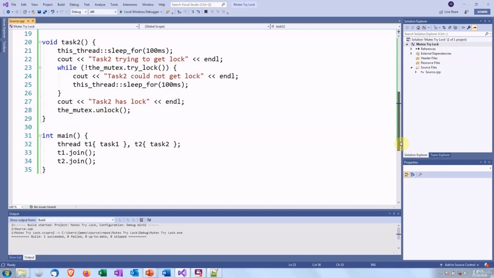

We just have the usual thread boilerplate at the top.We have a mutex which both these threads are trying to lock.Thread one will lock it immediately and then sleep for 500 milliseconds. Thread two will firstsleep and then try to get the lock.It is going to keep trying to get the lock in a loop until it eventually succeeds.At some point, thread one will wake up, it will unlock the mutex, and then thread two will getthe lock, this try_lock() call will succeed and the thread will jump out of the loop and execute itscritical region.The main function just launches the threads and joins on them.Nothing very exciting

> 我们只是在顶部有一个通常的线程样板。我们有一个互斥锁，这两个线程都试图锁定它。线程 1 将立即锁定它，然后休眠 500 毫秒。线程 2 将首先休眠，然后尝试获取锁。它将继续尝试在循环中获取锁，直到最终成功。在某个时刻，线程 1 将醒来，它将解锁互斥锁，然后线程 2 将获取锁，这个 try_lock（）调用将成功，线程将跳出循环并执行其关键区域。主函数只是启动线程并加入它们。没有什么令人兴奋的

## img - 1108990

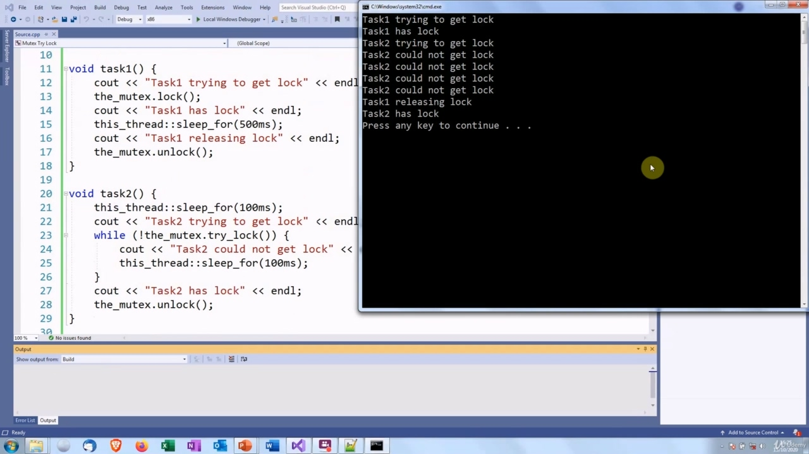

Nothing very excitingthere.

> 没有什么令人兴奋的。
