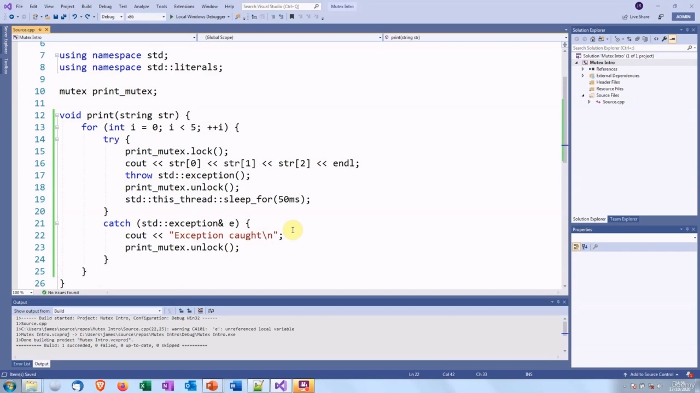
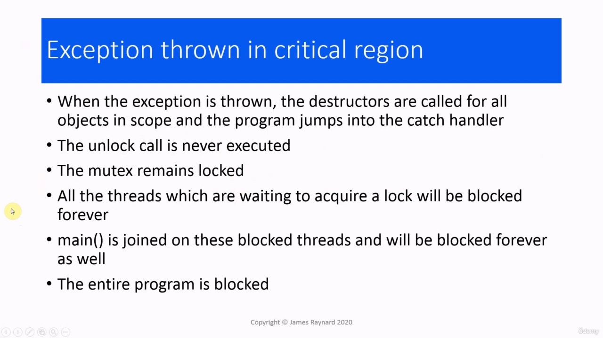

Hello again. In this video, we are going to look at the lock_guard class in the standard library. This solves one

> 再次问候。在本视频中，我们将查看标准库中的 lock_guard 类。这解决了一个问题

## img - 7500

In this video, we are going to look at the lock_guard class in the standard library. This solves one of the problems with mutexes.

> 在本视频中，我们将查看标准库中的 lock_guard 类。这解决了互斥锁的一个问题。

## img - 18280

The problem is that if an exception is thrown in the critical region, the mutex is left locked. So let's have a look at that.

> 问题是，如果在关键区域中抛出异常，互斥锁将被锁定。让我们来看看。

## img - 29280

So this is the code that we had before. When the thread goes into the loop, it looks the mutex. It can display its output without having any other thread interfere with this, and then it unlocks the mutex, which will allow some other thread to run. So what happens if we throw an exception in here?

> 这是我们以前的代码。当线程进入循环时，它看起来像互斥体。它可以在没有任何其他线程干扰的情况下显示其输出，然后解锁互斥锁，这将允许其他线程运行。那么如果我们在这里抛出一个异常会发生什么呢？

## img - 49450

Right.

> 正确的

## img - 49450

Right. Well, that is not very good! The program has been terminated. So we can see that one thread has managed to do one line of output.

> 正确的嗯，这不是很好！程序已终止。所以我们可以看到，一个线程已经完成了一行输出。

## img - 58250

So we can see that one thread has managed to do one line of output. What has happened is that the first thread to run has gone into the loop. It has locked its mutex, it has done its output, and then the exception is thrown. When that happens, the destructors are called for all the objects in the scope. Well, there are not really any, except for the variable i, I suppose. And then the thread will jump out of the loop and look for an exception handler. There aren't any. So the thread is terminated and that causes the entire program to terminate. So let's put in an exception handler.

> 所以我们可以看到，一个线程已经完成了一行输出。发生的情况是，要运行的第一个线程已进入循环。它锁定了互斥锁，完成了输出，然后抛出了异常。发生这种情况时，将为作用域中的所有对象调用析构函数。我想，除了变量 i 之外，真的没有。然后线程将跳出循环并寻找异常处理程序。没有。因此线程被终止，从而导致整个程序终止。因此，让我们放入一个异常处理程序。

## img - 148560

Okay, well, the program is still running, but it is not doing very much. So what happened this time, was that the first thread to run locked the mutex. It did some output, the exception was thrown, the thread that jumped into the catch handler. The problem is that the threat did not call unlock, so this mutex is still locked and all the threads which are waiting for a lock on that mutex are going to be waiting forever. The program is deadlocked because nothing can happen until this thread unlocks the mutex. But this thread has stopped running, so it cannot unlock the mutex. Okay, so the obvious way to do this is to unlock the mutex in the catch handler.

> 好吧，这个程序还在运行，但效果不太好。所以这次发生的事情是，第一个运行的线程锁定了互斥锁。它做了一些输出，抛出了异常，线程跳到了 catch 处理程序中。问题是威胁没有调用 unlock，所以这个互斥锁仍然被锁定，所有等待该互斥锁锁定的线程将永远等待。程序被死锁，因为在该线程解锁互斥锁之前，不会发生任何事情。但该线程已停止运行，因此无法解锁互斥锁。好的，那么最明显的方法就是在 catch 处理程序中解锁互斥锁。

## img - 237760

So let's see what effect that has. OK, so the program is now run and successfully completed - or some values of "successfully" anyway!

> 让我们看看这有什么影响。好的，所以程序现在运行并成功完成了-或者一些值“成功”！

## img - 247470

OK, so the program is now run and successfully completed - or some values of "successfully" anyway! Each thread has run once. The first thread to run locks the mutex and prints some output, then the exception is thrown and in the exception handler, it unlocks the mutex. Then the next thread can run and the same thing happens again. That throws an exception and unlocks the mutex. Then the third thread runs and - same problem again. We only get one output because the handler is outside the loop. So we could move the handler inside the loop.

> 好的，所以程序现在运行并成功完成了-或者一些值“成功”！每个线程运行一次。运行的第一个线程锁定互斥锁并打印一些输出，然后抛出异常，并在异常处理程序中解锁互斥锁。然后下一个线程可以运行，同样的事情再次发生。引发异常并解锁互斥锁。然后第三个线程运行，再次出现同样的问题。我们只得到一个输出，因为处理程序在循环之外。所以我们可以在循环中移动处理程序。

## img - 330340

(Now let's see what happens) OK, so each thread has been able to execute all the outputs in its loop, and then if we remove this

> （现在让我们看看会发生什么）好的，所以每个线程都能够执行其循环中的所有输出，然后如果我们删除这个

## img - 340120

OK, so each thread has been able to execute all the outputs in its loop, and then if we remove this print statement, then we should get what looks like a normal output. Yes, there we go. OK, so we have solved the problem.

> 好的，所以每个线程都能够执行其循环中的所有输出，然后如果我们删除这个 print 语句，那么我们应该得到看起来像正常输出的结果。是的，我们开始了。好的，我们已经解决了问题。

## img - 348690

OK, so we have solved the problem. So the problem again, the mutex is not unlocked if an exception is thrown.

> 好的，我们已经解决了问题。所以问题再次出现，如果抛出异常，互斥锁不会解锁。

## img - 356790

So the problem again, the mutex is not unlocked if an exception is thrown.

> 所以问题再次出现，如果抛出异常，互斥锁不会解锁。

## img - 401610

All the threads which are waiting to acquire the lock will be blocked. main() is joined on the blocked threads. So main() is going to be blocked as well, so the whole program is deadlocked.

> 所有等待获取锁的线程都将被阻止。main（）在被阻塞的线程上连接。所以 main（）也会被阻塞，所以整个程序都处于死锁状态。

## img - 418600

So this is a problem with the mutex. Whenever we call lock(), we must put in a corresponding call to unlock(), either in the code or an exception handler. If we have code which has many different return paths, then they all have to have an unlock() and we have to be careful not to unlock twice. So this is why programmers do not normally use the mutex directly.

> 所以这是互斥锁的问题。每当我们调用 lock（）时，我们必须在代码或异常处理程序中输入相应的 lock（）调用。如果我们的代码有很多不同的返回路径，那么它们都必须有一个 unlock（），我们必须小心不要两次解锁。这就是程序员通常不直接使用互斥锁的原因。

## img - 446400

There are some classes in the standard library which we can use to wrap the mutex, and these follow the RAII idiom for managing resources, "Resource Allocation Is Initialization", which means that we allocate the resource in the constructor and we release it in the destructor. Some examples you may have met are the fstream for managing files, unique_ptr for managing allocated memory. In both cases, the file is opened in the constructor and closed in the destructor. The memory is allocated by the unique_ptr constructor and released in the destructor. In this case, the resource that the class manages is a lock on a mutex. The constructor will take the mutex object as its argument and it will lock it and the destructor will unlock it. If we create an object of one of these classes as a local variable, that means that the mutex will be automatically unlocked when the object goes out of scope. If an exception is thrown, Or you have 57 different return paths from your thread function and someone adds a 58th, then the mutex will always be unlocked.

> 标准库中有一些类可以用来包装互斥体，这些类遵循 RAII 管理资源的习惯用法“资源分配是初始化”，这意味着我们在构造函数中分配资源，然后在析构函数中释放它。您可能遇到过的一些示例是用于管理文件的 fstream，用于管理分配的内存的 unique_ptr。在这两种情况下，文件都在构造函数中打开，在析构函数中关闭。内存由 unique_ptr 构造函数分配，并在析构函数中释放。在这种情况下，类管理的资源是互斥锁上的锁。构造函数将互斥对象作为其参数，它将锁定它，析构函数将解锁它。如果我们将这些类之一的对象创建为本地变量，这意味着当对象超出范围时，互斥对象将自动解锁。如果抛出异常，或者您的线程函数有 57 个不同的返回路径，并且有人添加了第 58 个，那么互斥锁将始终被解锁。

## img - 607510

The first wrapper class we are going to look at is lock_guard. This is a very basic wrapper class. It only has two member functions, the constructor and the destructor which lock and unlock the mutex. We need to give the type of the mutex as a parameter to the lock_guard, unless we're using C++ 17, in which case the compiler can work it out. So we just put lock_guard, the name of the variable and the mutex argument.

> 我们要看的第一个包装类是 lock_guard。这是一个非常基本的包装类。它只有两个成员函数，构造函数和析构函数，用于锁定和解锁互斥锁。我们需要将互斥锁的类型作为 lock_guard 的参数，除非我们使用的是 C++17，在这种情况下编译器可以解决它。因此，我们只需输入 lock_guard、变量名和互斥参数。

## img - 640530

So we do not need to put an explicit lock() and unlock() calls to the mutex, we just create a lock_guard instance and we pass the mutex as its argument, and then we do that just before the critical region. And then when we get to the end of the scope, the local variable will be destroyed. The destructor is called and that will unlock the mutex. Let's try this out.

> 因此，我们不需要对互斥对象进行显式的 lock（）和 unlock（）调用，我们只需创建一个 lock_guard 实例，然后将互斥对象作为其参数传递，然后在关键区域之前执行该操作。然后，当我们到达作用域的末尾时，局部变量将被销毁。调用析构函数，将解锁互斥锁。让我们试试看。

## img - 701630

There we are. Lovely! So when we create the lock_guard instance here, that will lock the mutex and then that will mean that the critical

> 我们到了。美丽的因此，当我们在这里创建 lock_guard 实例时，这将锁定互斥锁，然后这将意味着

## img - 708900

So when we create the lock_guard instance here, that will lock the mutex and then that will mean that the critical region can only be executed by this thread, and then the mutex will always be unlocked, even if we throw an exception...

> 因此，当我们在这里创建 lock_guard 实例时，这将锁定互斥锁，然后这将意味着关键区域只能由该线程执行，然后互斥锁将始终被解锁，即使我们抛出异常。。。

## img - 731370

So there it is. We do not need to do anything in the exception handler concerning the mutex. When the exception is thrown, the destructor is called for the lock_guard and that unlocks the mutex. So the mutex has always been unlocked by the time we get to the catch handler.

> 就是这样。我们不需要在异常处理程序中做任何与互斥锁有关的事情。当抛出异常时，为 lock_guard 调用析构函数，并解锁互斥锁。因此，当我们到达 catch 处理程序时，互斥锁一直处于解锁状态。

## img - 755240

So there we are again: when it goes out of scope, the destructor is called and the mutex is unlocked without any extra work by the programmer. Which is always good news. If you can get the compiler or the library to do work for you, that is always a good thing. There is just one problem with that, actually, if we go back and look at this again, the mutex is

> 因此，我们再次看到：当它超出范围时，调用析构函数，互斥锁被解锁，程序员无需做任何额外的工作。这总是好消息。如果你能让编译器或库为你工作，那总是一件好事。实际上，这只是一个问题，如果我们回头再看一遍，互斥锁是

## img - 810480

There is just one problem with that, actually, if we go back and look at this again, the mutex is not unlocked until the end of the scope. So this means that we're locking the mutex while we are sleeping. While we have the lock on the mutex no other thread can execute this critical section. So we are basically shutting out all the other threads while we're sleeping. That is one issue with lock_guard. We will look in the next video at another wrapper which solves that problem.

> 实际上，这只是一个问题，如果我们回头再看一次，互斥锁直到作用域结束才解锁。这意味着我们在睡觉时锁定了互斥锁。当我们锁定互斥锁时，没有其他线程可以执行这个关键部分。所以我们基本上是在睡觉时关闭所有其他线程。这是 lock_guard 的一个问题。我们将在下一个视频中查看解决该问题的另一个包装器。

## img - 835260

That is one issue with lock_guard. We will look in the next video at another wrapper which solves that problem. In C++17, there is a scoped_lock, which is exactly the same. The only difference is it can lock

> 这是 lock_guard 的一个问题。我们将在下一个视频中查看解决该问题的另一个包装器。在 C++17 中，有一个 scoped_lock，它完全相同。唯一的区别是它可以锁定

## img - 843650

In C++17, there is a scoped_lock, which is exactly the same. The only difference is it can lock more than one mutex at the same time. So we can create a scoped_lock and give it several mutexes and it will lock them. You notice that we don't give the template parameter here because this is C++17. The mutexes are always locked in the order that they are given in the constructor call, which is very useful. We will see later on that another way to create deadlock is to have threads locking mutexes in different orders. In the structure, the mutexes will be unlocked and they will be unlocked in the reverse order that they were locked in. So this can avoid a lot of problems that can occur when you are dealing with multiple mutexes. Just one thing to watch out for when you are using scoped_lock.

> 在 C++17 中，有一个 scoped_lock，它完全相同。唯一的区别是它可以同时锁定多个互斥锁。因此，我们可以创建一个 scoped_lock，并给它几个互斥锁，它将锁定它们。您注意到，这里没有给出模板参数，因为这是 C++17。互斥锁总是按照构造函数调用中给出的顺序锁定，这非常有用。稍后我们将看到创建死锁的另一种方法是让线程以不同的顺序锁定互斥锁。在该结构中，互斥锁将被解锁，并且它们将按照锁定的相反顺序被解锁。因此，这可以避免在处理多个互斥锁时可能出现的许多问题。使用 scoped_lock 时，只需注意一件事。
