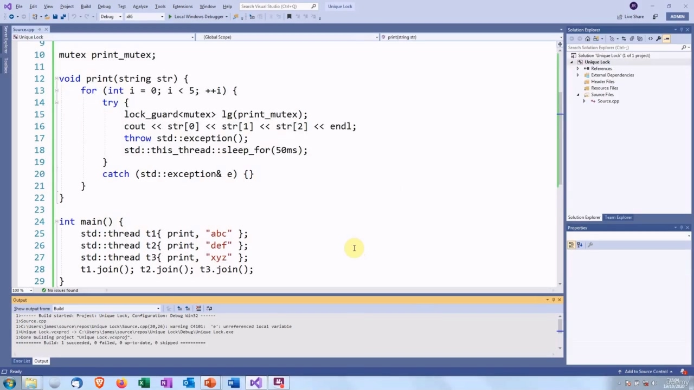
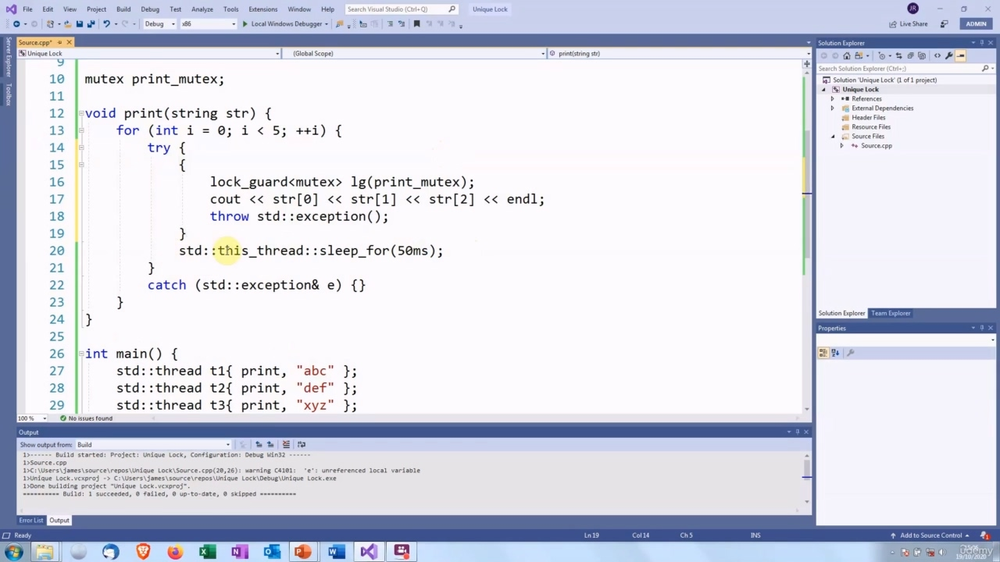
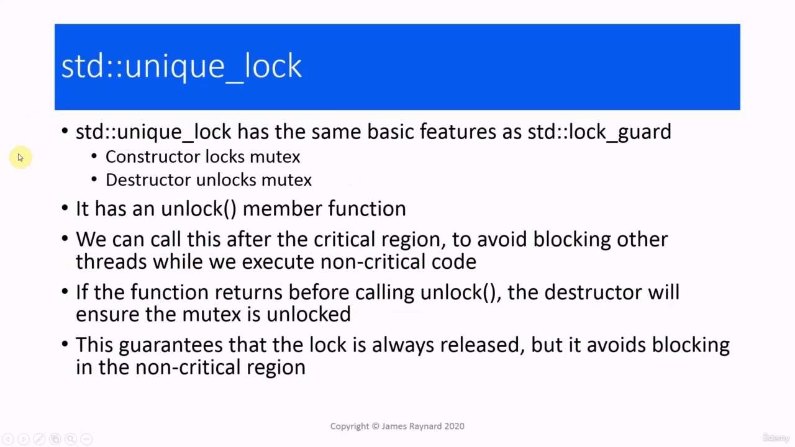
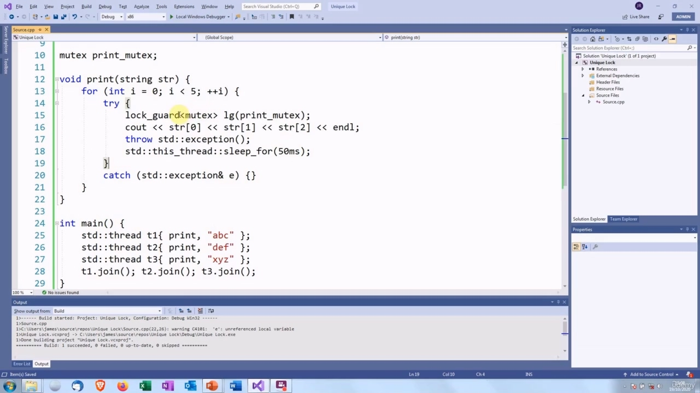
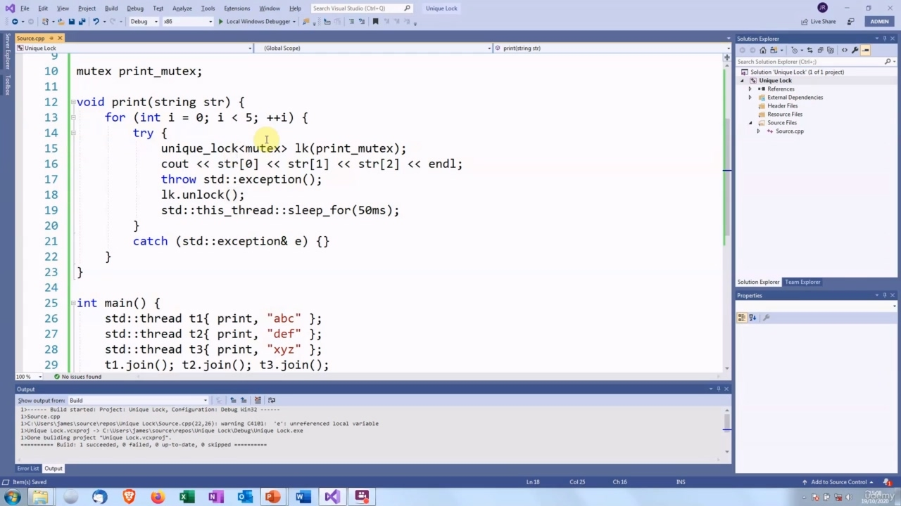
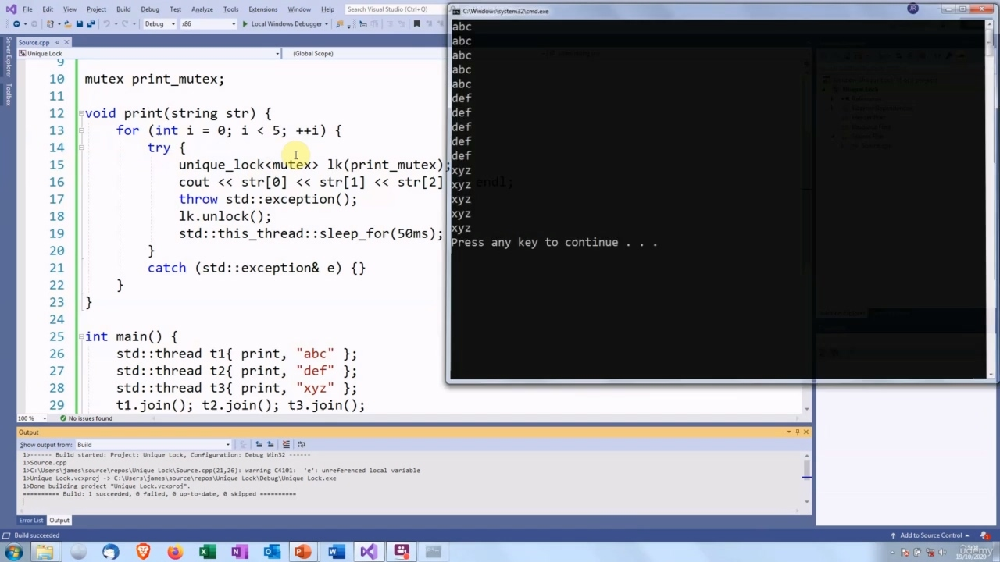
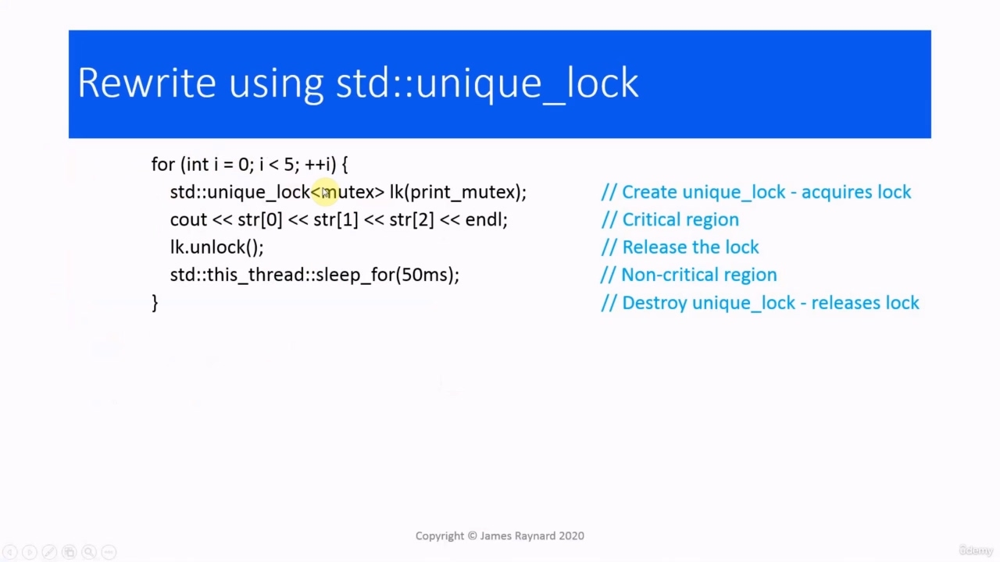
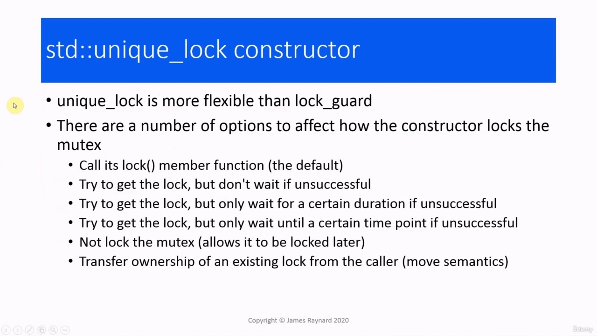
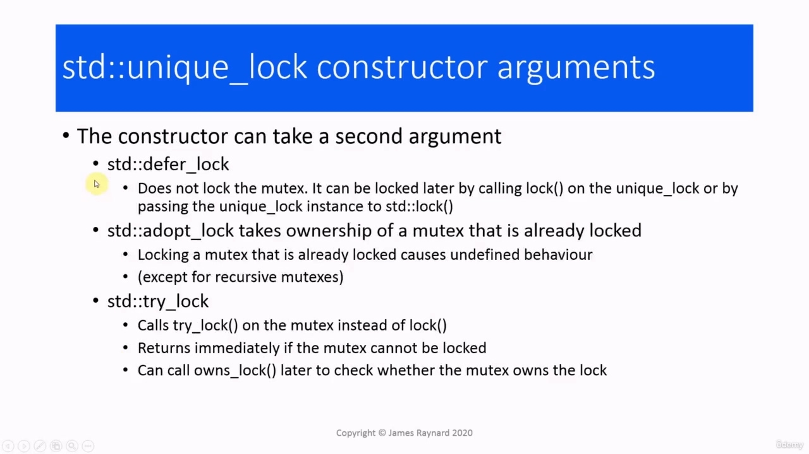
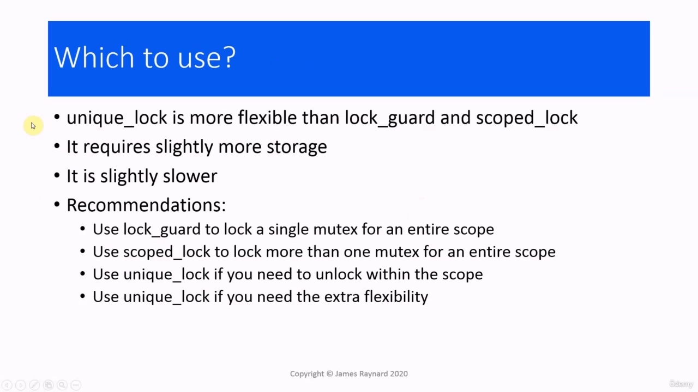

## img - 9000

In this video, we are going to look at the unique_lock class. In the last video, we looked at the lock

> 在本视频中，我们将查看 unique_lock 类。在上一段视频中，我们查看了锁

## img - 9000

In this video, we are going to look at the unique_lock class. In the last video, we looked at the lock guard. If we create a lock_guard instance, then it will automatically release the look at the end of the scope, even if the function returns due to an exception or a break or an early return. The problem is that the unlock does not occur until the end of the scope. If we have some code which is not critical but is in the same scope, such as this sleep, for example, then the mutex will remain locked while we execute that code. And while this is locked, no other thread can execute the critical region. So we are holding up the rest of the threads. One way to address this: we could put the lock_guard into its own scope within the critical region, and then this code does not get executed until the mutex has been released.

> 在本视频中，我们将查看 unique_lock 类。在最后一段视频中，我们看到了锁闩。如果我们创建了一个 lock_guard 实例，那么它将自动释放作用域末尾的外观，即使函数由于异常、中断或提前返回而返回。问题是，直到作用域结束，解锁才会发生。例如，如果我们有一些不是关键的但在同一范围内的代码，例如这个休眠，那么在执行该代码时互斥锁将保持锁定。并且，当这被锁定时，没有其他线程可以执行关键区域。因此，我们保留了其余的线程。解决这个问题的一种方法是：我们可以将 lock_guard 放入关键区域内的自身范围，然后在互斥锁释放之前，不会执行此代码。

## img - 100990

and then this code does not get executed until the mutex has been released. So just to prove that that works... Good!

> 然后直到互斥锁被释放，这个代码才被执行。所以为了证明这是有效的。。。好的

## img - 115880

When it comes down to the basics, unique_lock and lock_guard do the same thing. The constructor will take a mutex and lock it and the destructor will unlock the mutex. unique_lock also has an unlock() member function so we can call that after the critical region to avoid the problem of blocking other threads while doing non-critical work. If the function returns before calling unlock(), then the unique_lock destructor will ensure that the mutex is unlocked. If it does return normally and we unlock the mutex, then the destructor will check. It will see that the mutex has already been unlocked and it will not unlock it twice, which is a very bad thing to do. So let's see how this works.

> 说到基础，unique_lock 和 lock_guard 的作用是一样的。构造函数将获取一个互斥锁并锁定它，析构函数将解锁互斥锁。uniquelock 还有一个 unlock（）成员函数，因此我们可以在关键区域之后调用它，以避免在执行非关键工作时阻塞其他线程的问题。如果函数在调用 unlock（）之前返回，那么 unique_lock 析构函数将确保互斥锁被解锁。如果它确实正常返回并且我们解锁互斥锁，那么析构函数将进行检查。它会看到互斥锁已经解锁，而且不会解锁两次，这是一件非常糟糕的事情。

## img - 159780

So we create a unique lock... OK. And then after we execute the critical region, we unlock it. lk dot unlock. So let's see how that works.

> 所以我们创建了一个独特的锁。。。好的。然后在我们执行关键区域之后，我们解锁它。让我们来看看它是如何工作的。

## img - 214460

So let's see how that works. Yep, there we go. Again, we have no unwanted blocking. So that is what we do, we create the unique_lock

> 让我们来看看它是如何工作的。是的，我们开始了。同样，我们没有多余的阻塞。这就是我们要做的，我们创建 unique_lock

## img - 224540

Yep, there we go. Again, we have no unwanted blocking. So that is what we do, we create the unique_lock instance and then we unlock it after the critical region.

> 是的，我们开始了。同样，我们没有多余的阻塞。这就是我们要做的，我们创建 unique_lock 实例，然后在关键区域之后解锁它。

## img - 227610

instance and then we unlock it after the critical region. unique_lock has more to it than the unlock() member function.

> 实例，然后我们在关键区域之后解锁它。unique_lock 比 unlock（）成员函数更重要。

## img - 233350

unique_lock has more to it than the unlock() member function. There is also quite a variety of different ways in which you can construct it. The way that we constructed just called the lock member function on the mutex, which is the default. You can also try to get the lock, but not wait for it. There are also some options with time outs. You can try to get the lock for a certain amount of time. So if you can not get it within half a second, for the sake of argument, then you give up. You can also wait until a certain point in time, so if it is 11.34 seconds past the minute, you can wait until it is 12 minutes exactly. You can even not lock the mutex at all, which presumably means that you want to lock it later on. In effect, you can also have move semantics, the caller can give you a mutex that is already locked and you acquire ownership of that lock on the mutex. There are some second arguments we can give to the constructor for this. The defer_lock argument

> unique_lock 比 unlock（）成员函数更重要。还有很多不同的方法可以构造它。我们构造的方法只是调用互斥锁上的锁成员函数，这是默认的。你也可以尝试获取锁，但不要等待它。还有一些超时选项。您可以尝试在一定时间内获取锁。所以，如果你不能在半秒内得到它，为了争论，那么你就放弃了。你也可以等到某个时间点，所以如果是一分钟后 11.34 秒，你可以等到 12 分钟。你甚至可以完全不锁定互斥锁，这大概意味着你想稍后锁定它。实际上，你也可以有移动语义，调用者可以给你一个已经锁定的互斥锁，你可以获得互斥锁的所有权。我们可以为此向构造函数提供一些第二个参数。defer_lock 参数

## img - 336740

There are some second arguments we can give to the constructor for this. The defer_lock argument will prevent the mutex from being locked immediately. We can call lock() later on. We can also call the global lock() function with the unique lock instance as an argument. If we pass the adopt_lock argument, then the object will take ownership of a mutex that is already locked. As with double unlocking, double locking is very bad unless you have a recursive mutex, which we will look at a bit later. And try_lock will call the try_lock member function instead of lock. You may be wondering with these versions that do not lock the mutex immediately, how does that work? How do you know if it has been locked or not? The answer is that there's a member function owns_lock() and you can call that later on to check if the mutex has been locked. As with many of the classes in the concurrency library, unique_lock instances cannot be copied, but they can be moved. So we can get a lock on a mutex and transfer it to a different unique_lock instance. Although that can only be done within the same thread. This gives us the opportunity of writing something which follows the factory design pattern. We can write a function which creates a lock and returns it, and the type of lock that it will create will depend on its arguments. So we could have locks on different types of mutex. Or we could have different types of look. The caller of the function will now own that lock and will be responsible for unlocking it, or they can just let it go out of scope.

> 我们可以为此向构造函数提供一些第二个参数。defer_lock 参数将防止互斥锁立即被锁定。我们可以稍后调用 lock（）。我们也可以使用唯一的锁实例作为参数调用全局 lock（）函数。
> 如果我们传递 adopt_lock 参数，那么对象将拥有已经锁定的互斥锁。与双重解锁一样，双重锁定非常糟糕，除非您有一个递归互斥锁，稍后我们将对此进行讨论。
> try_lock 将调用 try_lock 成员函数而不是 lock。您可能想知道，这些版本不会立即锁定互斥锁，这是如何工作的？你怎么知道它是否被锁住了？答案是有一个成员函数 owns_lock（），您可以稍后调用它来检查互斥锁是否被锁定。
> 与并发库中的许多类一样，unique_lock 实例不能复制，但可以移动。因此，我们可以获得互斥锁的锁，并将其传输到不同的 unique_lock 实例。
> 尽管这只能在同一线程内完成。这让我们有机会写出符合工厂设计模式的东西。我们可以编写一个函数来创建一个锁并返回它，它将创建的锁的类型将取决于它的参数。所以我们可以在不同类型的互斥锁上设置锁。或者我们可以有不同类型的外观。函数的调用方现在将拥有该锁，并负责解锁它，或者他们可以让它超出范围。
