Hello again. In this video, we are going to look at time outs and mutexes.

> 再次问候。在本视频中，我们将讨论超时和互斥。

## img - 4350

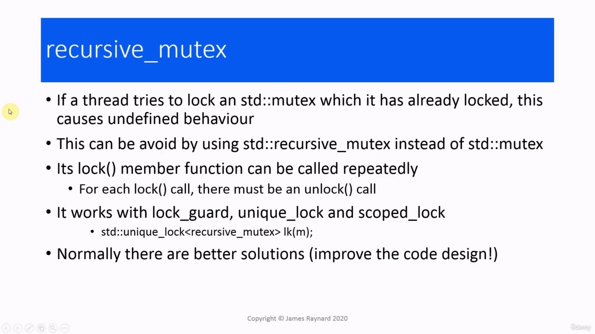

In this video, we are going to look at time outs and mutexes. First, we are going to take a slight diversion into recursive mutexes. Sometimes you may run into

> 在本视频中，我们将讨论超时和互斥。首先，我们将稍微转向递归互斥锁。有时你可能会遇到

## img - 14160

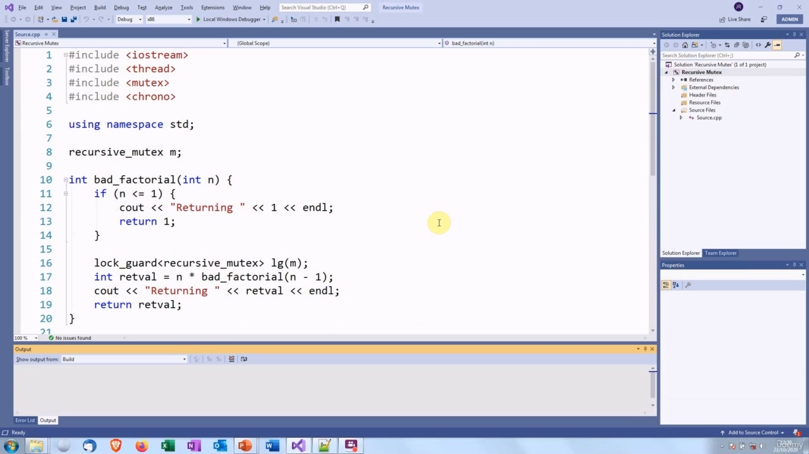

First, we are going to take a slight diversion into recursive mutexes. Sometimes you may run into situations where you want to lock a mutex which is already locked, and generally you cannot do that. The usual result will be that the program deadlocks. C++ provides a recursive_mutex, which can be locked multiple times. So you can just call the lock function and call it again. The mutex will not actually be unlocked until you have done an unlock() call for every lock() call. If you are not sure that you're going to be able to do that manually, then you can use lock_guard, a unique_lock or scoped_lock to make sure that the mutex eventually gets unlocked. And of course, you would give recursive mutex as the parameter type for the lock guard or unique lock. Usually when you think you want to use a recursive mutex, it means there is something wrong with the design and you need to think a bit harder about your code. But there are occasionally situations where it is useful. I have got some code here, which is an extremely inefficient way to calculate a factorial. I am sure

> 首先，我们将稍微转向递归互斥锁。有时，您可能会遇到这样的情况：您想锁定一个已经锁定的互斥锁，但通常无法做到这一点。通常的结果是程序死锁。C++提供了一个递归\_mutex，它可以被多次锁定。因此，您可以调用 lock 函数并再次调用它。在您对每个 lock（）调用执行了一次 unlock（）之后，互斥锁才会真正解锁。如果您不确定是否能够手动执行此操作，那么可以使用 lock_guard、unique_lock 或 scoped_lock 来确保互斥锁最终解锁。当然，您可以将递归互斥锁作为锁保护或唯一锁的参数类型。通常，当您认为要使用递归互斥锁时，这意味着设计有问题，您需要更仔细地思考代码。但有时情况下，它是有用的。我这里有一些代码，这是一种非常低效的计算阶乘的方法。我确信

## img - 128520

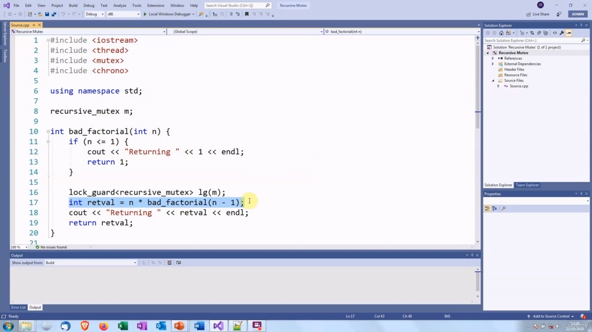

I have got some code here, which is an extremely inefficient way to calculate a factorial. I am sure you have all seen the basic recursive implementation where you have a factorial of n. It calls the factorial of n minus one and multiplies the result by n. And that factorial(n-1) will call factorial(n-2) and multiply that by n minus one and so on. If for some bizarre reason you want to calculate a factorial in a thread and lock the recursive calls, then you would need to use a recursive mutex. So here it is. We have the recursive call.

> 我这里有一些代码，这是一种非常低效的计算阶乘的方法。我相信大家都看过基本的递归实现，其中阶乘为 n。它调用 n 减 1 的阶乘，并将结果乘以 n。阶乘（n-1）将调用阶乘（n-2）并将其乘以 n 减 1，依此类推。如果出于某种奇怪的原因，您想在线程中计算阶乘并锁定递归调用，那么您需要使用递归互斥锁。这就是。我们有递归调用。

## img - 209560

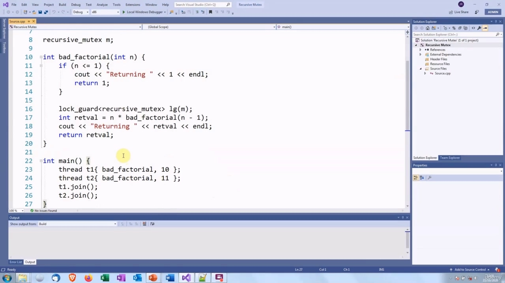

And then we lock the mutex just before we call the function recursively. I am using a lock_guard here, but whatever it is, there needs to be an unlock after the function returns. And of course, we have the terminating condition. If the argument is one or less, then we stop recursing and start returning and then all the locks will be unlocked. I have also provided a main function, which is going to call this in two separate threads.

> 然后我们在递归调用函数之前锁定互斥锁。我在这里使用的是 lock_guard，但无论是什么，函数返回后都需要解锁。当然，我们有终止条件。如果参数为 1 或更少，那么我们停止递归并开始返回，然后所有锁将被解锁。我还提供了一个主函数，它将在两个单独的线程中调用它。

## img - 232270

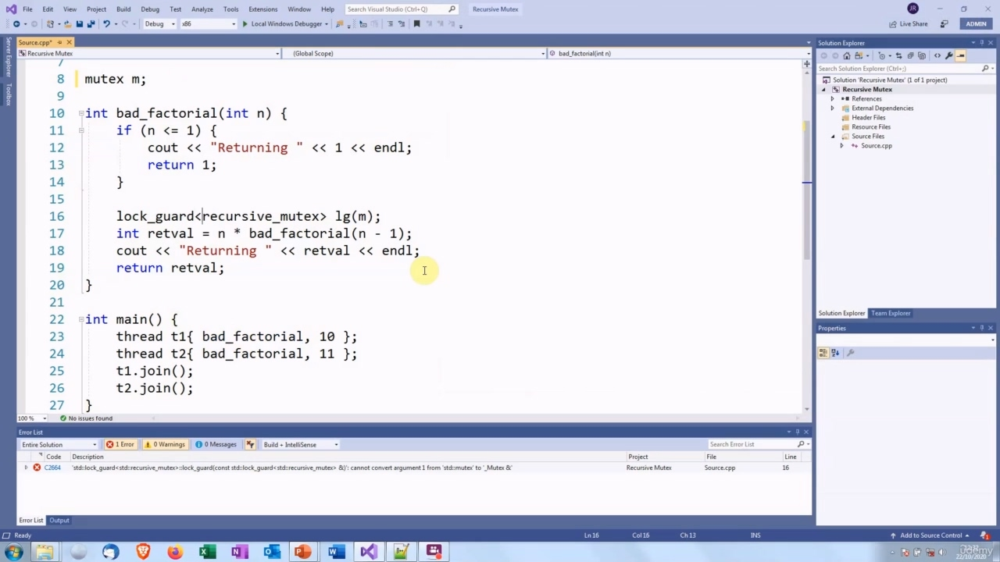

I have also provided a main function, which is going to call this in two separate threads. So let's see what happens. Well, the first thread has run, and then it does these calculations with the lock and it starts returning. So this is going to unlock, this is going to unlock and so on. So there we are, we have done it all, with no deadlocks. If we had used a normal mutex... (remember to change this one as well!)

> 我还提供了一个主函数，它将在两个单独的线程中调用它。让我们看看会发生什么。好吧，第一个线程已经运行，然后它用锁进行这些计算，然后开始返回。所以，这将要解锁，这将解锁等等。所以，我们已经完成了这一切，没有死锁。如果我们使用了正常的互斥锁。。。（记住也要更换这个！）

## img - 257160

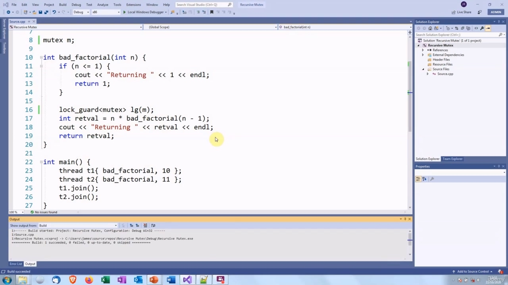

change this one as well!)

> 也改变这个！）

## img - 302340

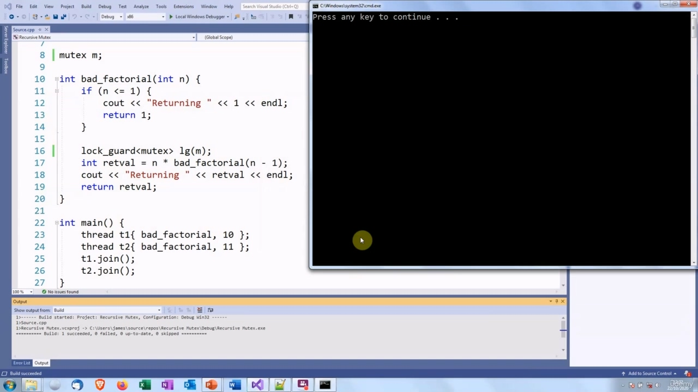

There we are! It all goes horribly wrong. And the reason for that is that every time we call this function, we lock the same mutex and you can

> 我们到了！这一切都出了可怕的错误。原因是每次调用这个函数时，我们都会锁定相同的互斥锁

## img - 312930

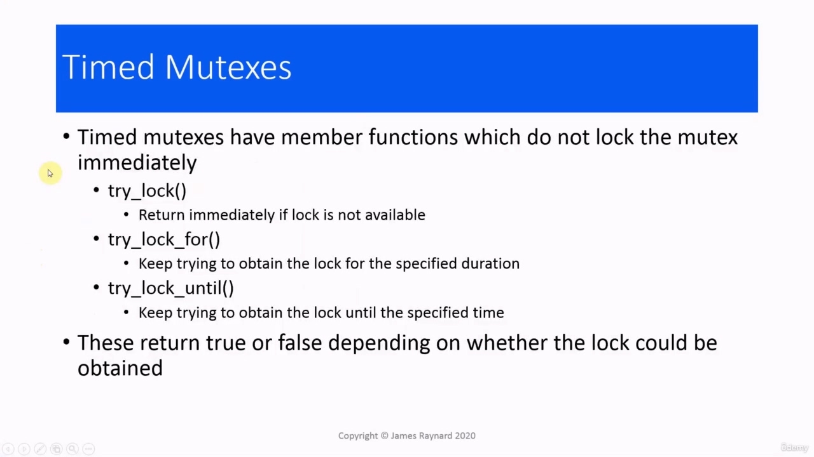

And the reason for that is that every time we call this function, we lock the same mutex and you can only lock a mutex once. So on to timed mutexes. We have seen with plain mutexes you can either lock(), in which case the

> 原因是，每次调用这个函数时，我们都会锁定同一个互斥锁，而您只能锁定一个互斥。定时互斥锁也是如此。我们已经看到，对于普通互斥锁，您可以锁定（），在这种情况下

## img - 322550

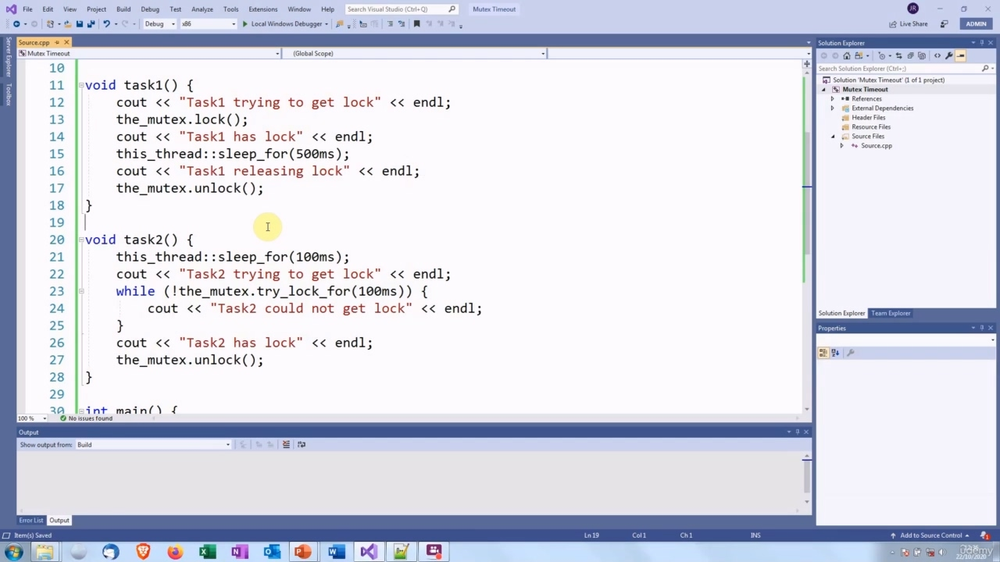

So on to timed mutexes. We have seen with plain mutexes you can either lock(), in which case the mutex will wait until the lock becomes available or else you can call try_lock(), which will return immediately, even if the lock is not available. There are timed mutexes. In fact, C++ has quite a zoo full of mutexes and things to do with mutexes, so I'm just trying to introduce them gradually. With a timed mutex, it has the try_lock() member function, which does not wait at all. It also has a try_lock_for() member function, which will wait for a certain interval, for example, 500 milliseconds. And a try_lock_until() member function, which will wait until a certain time point. So, for example, 12 seconds past the minute. And these have the same interface as try_lock(). If the lock is available, then it'll return true; if it cannot get the lock, it will return false. I have rewritten the program we used with try_lock().

> 定时互斥锁也是如此。我们已经看到，对于普通互斥锁，您可以使用 lock（），在这种情况下，互斥锁将等待锁变为可用，或者您可以调用 try_lock（），即使锁不可用，它也会立即返回。有定时互斥锁。事实上，C++有一个充满互斥锁和互斥锁的动物园，所以我只是尝试逐步引入它们。对于定时互斥锁，它有 try_lock（）成员函数，它根本不等待。它还有一个 try_lock_for（）成员函数，它将等待一定的时间间隔，例如 500 毫秒。以及一个 try_lock_until（）成员函数，它将等待到某个时间点。例如，一分钟过去 12 秒。并且它们具有与 try_lock（）相同的接口。如果锁可用，那么它将返回 true；如果无法获取锁，则返回 false。我已经重写了我们在 try_lock（）中使用的程序。

## img - 427130

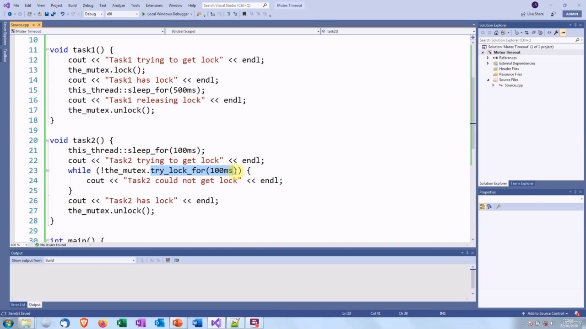

I have rewritten the program we used with try_lock(). This time it is using try_look_for() and I have given it a duration of 100 milliseconds.

> 我已经重写了我们在 try_lock（）中使用的程序。这次它使用的是 try_look_for（），我给它的持续时间是 100 毫秒。

## img - 435430

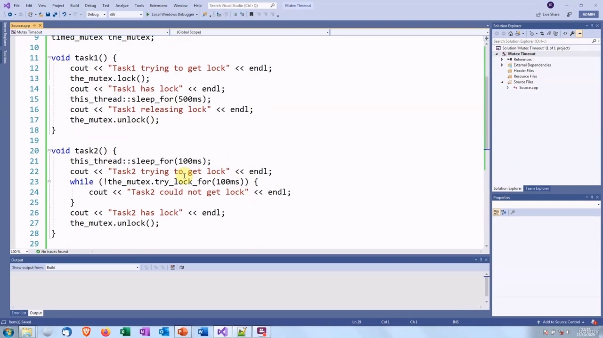

This time it is using try_look_for() and I have given it a duration of 100 milliseconds. The rest of the program is the same. So we have task one which locks it and sleeps. Task two, which tries to get the lock repeatedly. If it cannot get the lock, it tries again. And then

> 这次它使用的是 try_look_for（），我给它的持续时间是 100 毫秒。程序的其余部分是相同的。所以我们有一个任务，锁定它并休眠。任务二，它尝试重复获取锁。如果无法获得锁，则会重试。然后

## img - 454710

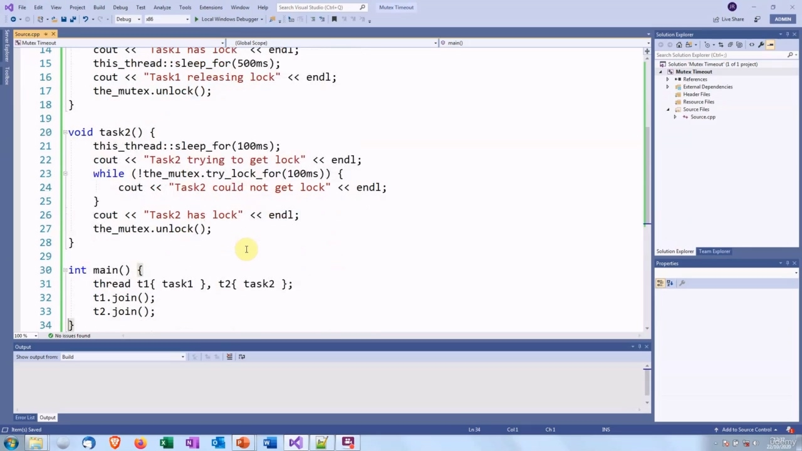

Task two, which tries to get the lock repeatedly. If it cannot get the lock, it tries again. And then a main function, which starts these two threads.

> 任务二，它尝试重复获取锁。如果无法获得锁，则会重试。然后是一个主函数，它启动这两个线程。

## img - 457530

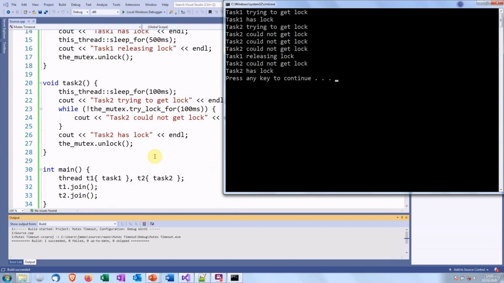

a main function, which starts these two threads. So there we are.

> 一个主函数，它启动这两个线程。我们就在这里。

## img - 509920

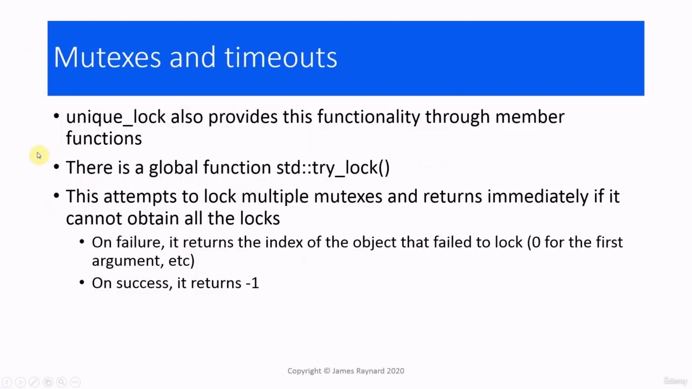

The first thread locks the mutex, then the second thread tries to get it. It cannot lock the mutex because the first thread has already locked it. And then it keeps trying every hundred milliseconds and eventually the first thread will unlock the mutex and the second thread succeeds in getting the lock.

> 第一个线程锁定互斥锁，然后第二个线程尝试获取互斥锁。它无法锁定互斥锁因为第一个线程已经锁定了互斥锁。然后它每 100 毫秒尝试一次，最终第一个线程将解锁互斥锁，第二个执行器成功获取锁。

## img - 531580

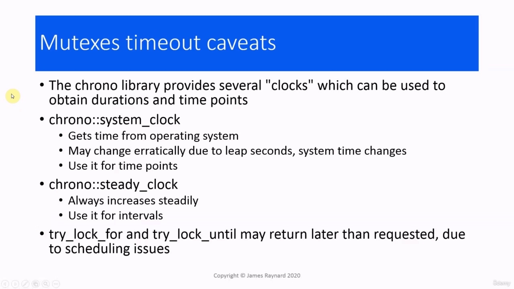

This may all sound a bit familiar. In fact, we have seen that unique_lock will provide this functionality for any mutex not just timed mutexes. So what is the point of having timed mutexes? I suppose the reason is, if you want the functionality without the extra overhead of unique_lock, you could use a lock_guard with a timed mutex. There's also a global function, try_lock(). You can pass multiple mutexes to that. It will try to lock them in the order that you pass them. If it cannot obtain all the locks, it returns immediately and it will give you a return value, which indicates which mutex caused the problem. The index is zero based, so it is zero for the first argument, one for the second and so on. And on success, confusingly, it returns minus one. How do you get these timeouts? The chrono library provides several clocks which we can use for durations and time points.

> 这听起来可能有点熟悉。事实上，我们已经看到 unique_lock 将为任何互斥体提供此功能，而不仅仅是定时互斥体。
> 那么拥有定时互斥锁有什么意义呢？我想原因是，如果您希望功能没有 unique_lock 的额外开销，那么可以使用带有定时互斥锁的 lock_guard。还有一个全局函数 try_lock（）。您可以将多个互斥体传递给它。它将尝试按照您传递它们的顺序锁定它们。如果它无法获得所有锁，它将立即返回，并将给您一个返回值，该值指示导致问题的互斥锁。索引是从零开始的，所以第一个参数为零，第二个参数为一，依此类推。如何获得这些超时？计时库提供了几个时钟，我们可以使用它们来计算持续时间和时间点。

## img - 636590

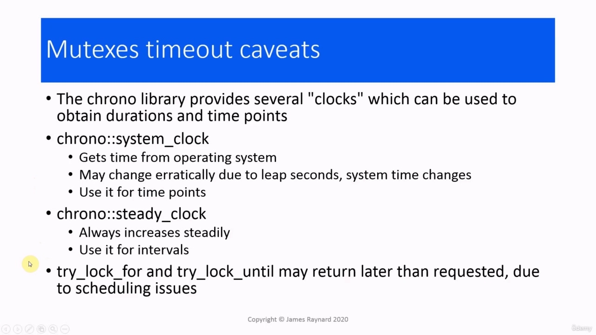

How do you get these timeouts? The chrono library provides several clocks which we can use for durations and time points. There is a system clock which will return whatever time the operating system thinks it is. There are things like leap seconds which can cause the system clock to jump ahead by two seconds occasionally. Usually on New Year's Eve when nobody is noticing. It is also possible that the system time could be changed, either because someone has changed it at the console or there's some kind of synchronization that keeps the time in sync with an atomic clock. This will always return the correct time as far as the operating system is able to determine it. So you should use that for time points. There is also a steady clock, which, as the name suggests, it increases steadily. It does not go backwards, unlike the system clock. So this will always give a precise interval and we should use that for intervals. One other thing to bear in mind is that try*lock for() and try* lock_until() may not actually return

> 如何获得这些超时？计时库提供了几个时钟，我们可以使用它们来计算持续时间和时间点。有一个系统时钟，它会在操作系统认为的任何时间返回。有些事情，比如闰秒，会导致系统时钟偶尔提前两秒。通常在除夕夜，没有人注意到。系统时间也有可能被更改，可能是因为有人在控制台更改了它，也可能是因为某种同步使时间与原子钟保持同步。只要操作系统能够确定，这将始终返回正确的时间。因此，您应该将其用于时间点。还有一个稳定的时钟，顾名思义，它在稳步增长。与系统时钟不同，它不会后退。所以这将总是给出一个精确的间隔，我们应该将其用于间隔。还有一点要记住，try*lock for（）和 try*lock_until（）实际上可能不会返回

## img - 738010

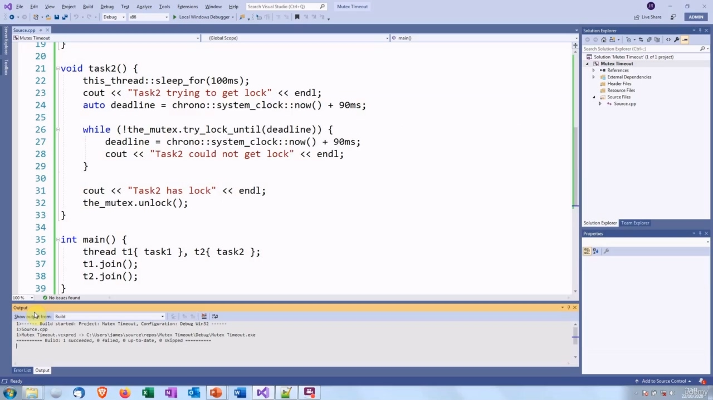

One other thing to bear in mind is that try*lock for() and try* lock_until() may not actually return when you expect them to. They may be delayed by the scheduler if the scheduler is running something else, or it thinks that your thread is not sufficiently important to be woken up just yet. OK, so let's look at try_lock_until(). We are going to use the system clock.

> 还有一点需要记住的是，try*lock for（）和 try*lock_until（）可能不会在您期望的时候返回。如果调度程序正在运行其他程序，或者它认为您的线程还不够重要，无法被唤醒，那么它们可能会被调度程序延迟。好的，让我们看看 try_lock_until（）。我们将使用系统时钟。

## img - 755820

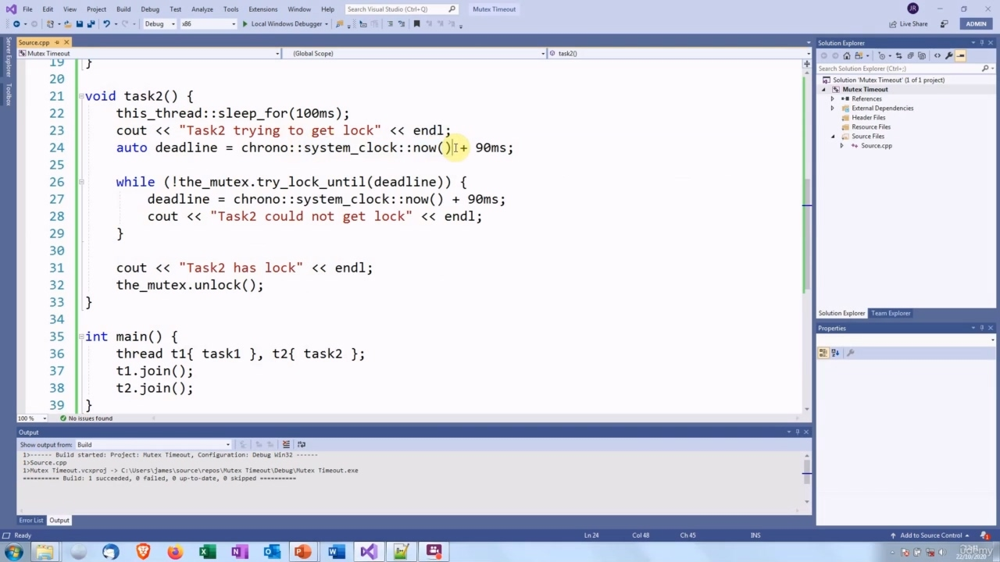

OK, so let's look at try_lock_until(). We are going to use the system clock. And we are going to say that we have a deadline which is 90 milliseconds from now.

> 好的，让我们看看 try_lock_until（）。我们将使用系统时钟。我们会说，我们有一个 90 毫秒后的最后期限。

## img - 800740

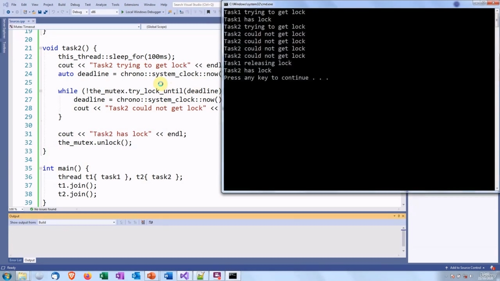

And we are going to say that we have a deadline which is 90 milliseconds from now. So system_clock::now() plus 90 milliseconds. now() will return the current time. So then this thread is going to try the lock until the deadline. If it fails, it will try again and it is going to keep on, missing these deadlines, until eventually it gets the lock. The rest of the program is exactly the same. So let's try that. So we get the same output.

> 我们会说，我们有一个 90 毫秒后的最后期限。所以 system_clock::now（）加上 90 毫秒。now（）将返回当前时间。因此，这个线程将尝试锁定，直到最后期限。如果失败了，它会再试一次，它会继续下去，错过这些最后期限，直到最终锁定。程序的其余部分完全相同。所以让我们试试看。所以我们得到了相同的输出。

## img - 827310

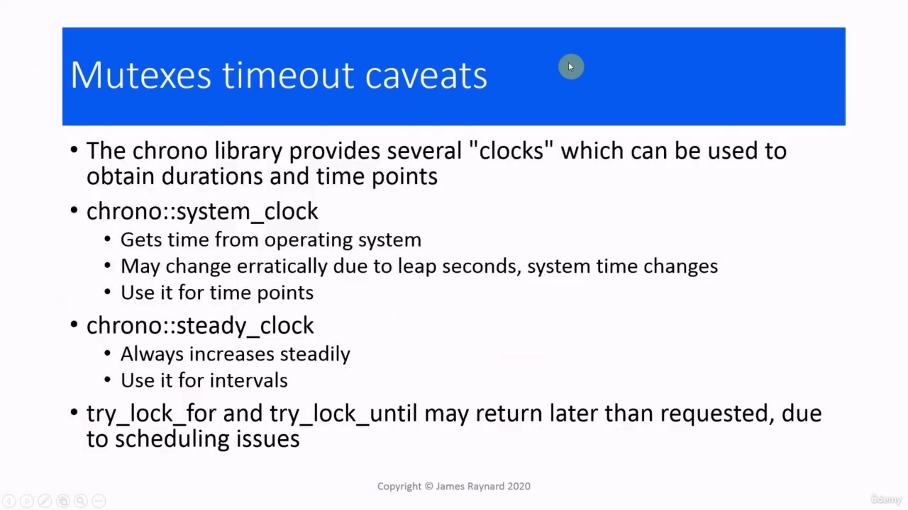

So let's try that. So we get the same output. The first task locks the mutex, the second task keeps trying to get it. Eventually, the first task releases the lock and the second task can run.

> 所以让我们试试看。所以我们得到了相同的输出。第一个任务锁定互斥锁，第二个任务继续尝试获取互斥锁。最终，第一个任务释放锁定，第二任务可以运行。
