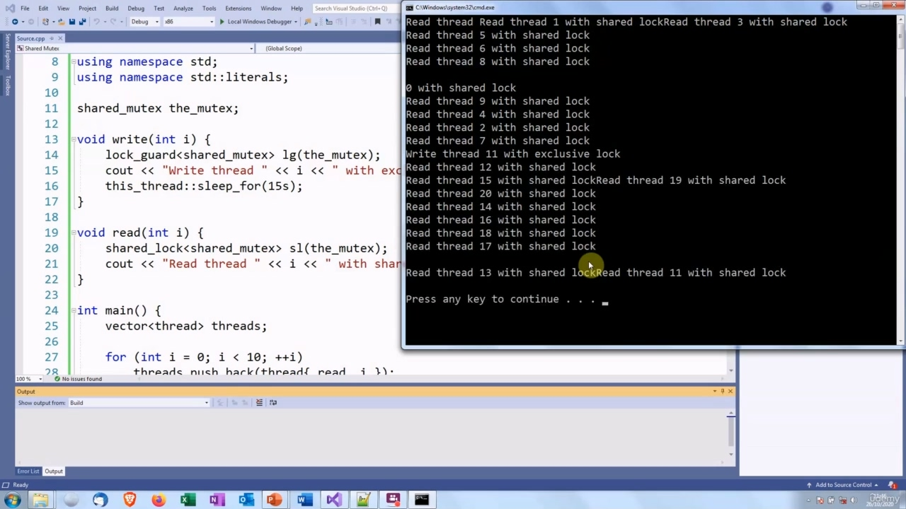

Hello again. In this video, we are going to look at shared mutexes.

> 再次问候。在本视频中，我们将讨论共享互斥锁。

## img - 3870 

In this video, we are going to look at shared mutexes. So we now know how to use mutexes to make sure that only one thread can execute in a critical region

> 在本视频中，我们将讨论共享互斥锁。因此，我们现在知道如何使用互斥锁来确保在关键区域中只能执行一个线程

## img - 11610 

So we now know how to use mutexes to make sure that only one thread can execute in a critical region at any one time. That is very useful, but occasionally it is a bit too restrictive. Let's imagine that we have a situation where we have some data which is accessed for reading very frequently, but only very rarely modified. If we use the techniques we have learnt so far, this means that every time a thread wants to read this shared data, it has to get an exclusive lock on it and no other threads can access it, even if it is just to read it. So this means if we have, say, 1000 threads which read the data and only one thread which writes to it, then 999 times out of 1000, we are looking the mutex when we do not need to. And that is going to have a big effect on performance. On the other hand, on the occasional time when there is a thread which modifies the data, then we want to make sure that all the reading threads are locked out to prevent a data race. So we cannot just take the mutexes off. If you were using C++11, there was not very much you could do about this, at least not using standard

> 因此，我们现在知道如何使用互斥锁来确保在任何时候只有一个线程可以在关键区域中执行。这是非常有用的，但有时会有点过于限制。让我们想象一下，我们有一种情况，我们有一些数据可以非常频繁地访问，但很少修改。如果我们使用到目前为止学到的技术，这意味着每当一个线程想要读取这个共享数据时，它必须获得一个独占锁，并且其他线程都不能访问它，即使只是读取它。所以这意味着，如果我们有 1000 个线程读取数据，而只有一个线程写入数据，那么 1000 个线程中有 999 个线程，我们在不需要时查看互斥锁。这将对性能产生很大影响。另一方面，在偶尔有线程修改数据时，我们希望确保所有读取线程都被锁定，以防止数据竞争。因此，我们不能仅仅取消互斥锁

## img - 121140 

If you were using C++11, there was not very much you could do about this, at least not using standard C++. C++14 provided a mutex which could be used for this and a type of lock. C++17 improved the mutex by removing the timeout functions, which the C++14 mutex had. So let's find out how all this works,

> 如果您使用的是 C++11，那么您对此无能为力，至少不使用标准 C++。C++14 提供了一个可用于此目的的互斥锁和一种锁。C++17 通过删除超时函数改进了互斥锁，而 C++14 互斥锁具有超时函数。所以让我们来看看这一切是如何运作的，

## img - 149400 

The C++17 shared mutex, which we are going to look at, is defined in the header. There are actually two different ways in which it can be locked. The first one is exactly the same as every other mutex that we have looked at so far, which is to get an exclusive lock. If a thread has an exclusive lock on this mutex, then no other thread can acquire a lock until this thread releases the lock. There is also a shared lock. When a threat has a shared lock, any other thread can also acquire a shared lock on the mutex. It does not have to wait for this thread to release the lock. If another thread wants to get an exclusive lock, it has to wait until all the threads which have shared locks release them. And also if the thread has an exclusive lock, then no one can get a shared lock until that is released.

> 我们将要讨论的 C++17 共享互斥锁在头中定义。实际上有两种不同的锁定方式。第一个互斥锁与我们目前所看到的其他互斥锁完全相同，即获得一个互斥锁。如果一个线程对此互斥锁具有独占锁，那么在该线程释放锁之前，其他线程都无法获取锁。还有一个共享锁。当威胁具有共享锁时，任何其他线程也可以获取互斥锁上的共享锁。它不必等待该线程释放锁。如果另一个线程想要获得独占锁，它必须等待所有共享锁的线程释放它们。此外，如果线程具有独占锁，则在释放该锁之前，任何人都无法获得共享锁。

## img - 249140 

To get an exclusive lock is exactly the same as the other mutexes, so we can use lock_guard, unique_lock or scoped_lock as we wish. This will give the thread exclusive access to the critical region. Only one thread can access it. If another thread wants to access the critical region, it will have to wait until this thread releases the exclusive lock. There is also a shared_lock which provides shared access.

> 获取互斥锁与其他互斥锁完全相同，因此我们可以根据需要使用 lock_guard、unique_lock 或 scoped_lock。这将赋予线程对关键区域的独占访问权。只有一个线程可以访问它。如果另一个线程想要访问关键区域，它必须等待该线程释放独占锁。还有一个 shared_lock，它提供共享访问。

## img - 311450 

There is also a shared_lock which provides shared access. Any thread can share access to the critical region with other threads which also have shared locks. If there is a thread which has an exclusive lock, then the thread will have to wait to acquire its shared lock. So how would we use this in code?

> 还有一个 shared_lock，它提供共享访问。任何线程都可以与其他具有共享锁的线程共享对关键区域的访问。如果有一个线程具有独占锁，那么该线程必须等待获取其共享锁。那么我们如何在代码中使用它呢？

## img - 329090 

So how would we use this in code? We would create an instance of the shared mutex. We would create read and write task functions. The write function will get an exclusive lock on the mutex, so only one thread can write to the shared data at any one time. The reader threads will get shared locks on the mutex so any thread can read the data provided that no-one is writing to it. So let's have a look at some code that does this. So here we are.

> 那么我们如何在代码中使用它呢？我们将创建共享互斥体的一个实例。我们将创建读写任务函数。write 函数将获得互斥锁，因此任何时候只有一个线程可以写入共享数据。读取器线程将获得互斥锁上的共享锁，因此任何线程都可以读取数据，前提是没有人向其写入数据。我们到了。

## img - 400100 

So let's have a look at some code that does this. So here we are. I have got a write task function. This gets a lock guard on the mutex.

> 因此，让我们看看一些实现这一点的代码。我们到了。我有一个写任务功能。这会在互斥锁上设置一个锁。

## img - 406470 

This gets a lock guard on the mutex. So this is going to acquire an exclusive look. While this write task is executing its critical region, no other thread can access it. The read test function takes a shared lock on the mutex, so we could have many threads executing this read task at the same time. And instead of sharing data, I am just going to print out a number, which depends on the threads.

> 这会在互斥锁上设置一个锁。因此，这将获得一种独特的外观。当这个写任务正在执行它的关键区域时，没有其他线程可以访问它。读测试函数在互斥锁上获取共享锁，因此我们可以让多个线程同时执行这个读任务。而不是共享数据，我只是打印一个数字，这取决于线程。

## img - 441920 

I have included the shared_mutex header. In the main() function, I am creating lots of threads which read

> 我已经包含了 shared_mutex 标头。在 main（）函数中，我创建了许多线程

## img - 441920 

I have included the shared_mutex header. In the main() function, I am creating lots of threads which read and one thread which writes. When you want to create lots of threat objects, it is useful to put them into a vector. Then when you populate the vector, the thread objects cannot be copied, but they can be moved. So this is going to transfer ownership of the underlying system thread from the thread object into the vector element. So I create some reading threads here, I create a writer thread, and then I create some more reading threads. And then finally I iterate over the threads and join each one. I need to use the reference version of auto here because the thread objects cannot be copied. Okay, so let's see how this works.

> 我已经包含了 shared_mutex 标头。在 main（）函数中，我创建了许多读线程和一个写线程。当您想要创建大量威胁对象时，将它们放入向量中非常有用。然后，当您填充向量时，无法复制线程对象，但可以移动它们。所以这将把底层系统线程的所有权从线程对象转移到向量元素中。所以我在这里创建了一些阅读线程，创建了一个编写线程，然后创建了更多的阅读线程。最后，我遍历线程并连接每个线程。我需要在这里使用 auto 的引用版本，因为无法复制线程对象。好的，让我们看看这是如何工作的。

## img - 527140 

So we have some reading threads start up. They all get a shared lock and they can all access the critical region. The write thread gets an exclusive lock and now all the read threads which come afterwards have to wait. And when - yes, there it is! - the write thread releases its look and then the other reading threads

> 因此，我们启动了一些阅读线程。他们都有一个共享锁，他们都可以访问关键区域。写线程得到一个独占锁，现在所有随后到来的读线程都必须等待。当-是的，就在那里！-写线程释放其外观，然后其他读线程

## img - 543430 

And when - yes, there it is! - the write thread releases its look and then the other reading threads can run. And you will notice the output is slightly scrambled up. OK. Let's remind ourselves about the conditions for a data race.

> 当-是的，就在那里！-写线程释放其外观，然后其他读线程可以运行。你会注意到输出有点乱。好的。让我们提醒自己数据竞赛的条件。

## img - 555720 

Let's remind ourselves about the conditions for a data race. I am going to keep displaying this slide until you see it in your dreams! Or perhaps that should be nightmares!! So the condition for a data race is when we have: two or more threads which access the same memory location and at least one of the threads modifies the memory location. So that is the case here. We have a reading thread and writing thread. These are safe only if the accesses are synchronized in some way. Each access is made to happen before the next, or the accesses are made atomically. So how does using a shared mutex help us prevent a data race?

> 因此，数据竞争的条件是：两个或多个线程访问相同的内存位置，并且至少有一个线程修改内存位置。
> 我们有读线程和写线程。只有当访问以某种方式同步时，这些才是安全的。每次访问都是在下一次访问之前进行的，或者访问是以原子方式进行的。那么，使用共享互斥体如何帮助我们防止数据竞争？

## img - 644390 

So we have these potentially conflicting reader and writer threads. The writer threat cannot get an exclusive lock and execute the critical region until all the reader threads, which are currently accessing the critical section, release their shared locks. So this means that the accesses by these reader threads will happen before the access by the writer thread. If the writing thread has an exclusive lock and reader threads want to get a shared lock, they cannot do that until the writer has finished accessing the critical section and releases the exclusive lock. So the access by the writing thread will happen before the access by these other reader threads.

> 所以我们有这些潜在冲突的读写线程。**写入程序威胁无法获得独占锁并执行关键区域，直到当前正在访问关键区域的所有读取器线程释放其共享锁。**因此，这意味着这些读取器线程的访问将发生在写入线程的访问之前。如果写入线程具有独占锁，而读取器线程希望获得共享锁，则在写入程序完成对关键部分的访问并释放独占锁之前，它们无法执行此操作。因此，写线程的访问将先于其他读线程的访问。
