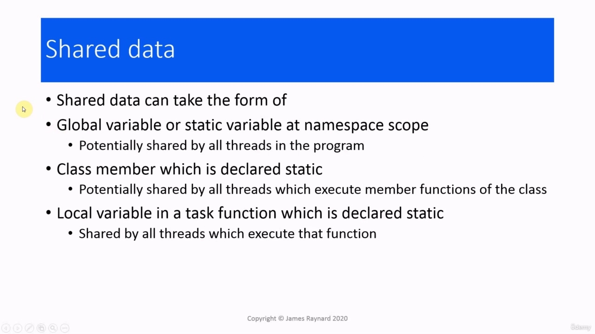

## img - 8340

In this video, we are going to look at shared data initialization. There are various ways we can create

> 在本视频中，我们将讨论共享数据初始化。我们可以通过多种方式创建

## img - 8340

In this video, we are going to look at shared data initialization. There are various ways we can create shared data. We could use a global variable or a static variable, which is declared in the namespace scope. And that could be shared by all the threads in the program, including main(). We could have a class member which is declared static and that is potentially shared by all threads which execute a member function of the class. And then finally, we can have a local variable in a task function and we declare that variable static. And this is shared by all threads which execute that function. There are actually two different rules for initialization. One is for local variables, which we will look at in a minute, but for everything else, the variable is initialized when the program starts up. And at that point, there is only going to be one thread running. main() has not even been called yet. So there cannot be a data race because there are not any conflicting threads.

> 在本视频中，我们将讨论共享数据初始化。我们可以通过多种方式创建共享数据。我们可以使用在命名空间范围中声明的全局变量或静态变量。这可以由程序中的所有线程共享，包括 main（）。我们可以有一个声明为静态的类成员，它可能由执行该类成员函数的所有线程共享。最后，我们可以在任务函数中使用一个局部变量，并将该变量声明为静态。这是由执行该函数的所有线程共享的。实际上有两种不同的初始化规则。一个是局部变量，我们将在一分钟内查看，但对于其他所有变量，该变量在程序启动时初始化。此时，只有一个线程在运行。main（）尚未调用。因此，不会有数据竞争，因为没有任何冲突的线程。

## img - 116080

When we have a local variable, so we have a function with a static local variable, C++ says this variable will be initialized the first time that the program executes this code. And in a single threaded program, that is all very straightforward. But what happens when we have threads? I would like you to pause the video for a moment and think about whether there could be any issues with this.

> 当我们有一个局部变量，所以我们有一一个带有静态局部变量的函数时，C++表示该变量将在程序第一次执行该代码时初始化。在单线程程序中，这一切都非常简单。但当我们有线程时会发生什么？我希望你暂停一下视频，思考一下是否会有任何问题。

## img - 141610

Just in case you have forgotten, here is the definition of a data race.

> 万一你忘了，这里是数据竞赛的定义。

## img - 141610

Just in case you have forgotten, here is the definition of a data race. So we have potentially conflicting accesses. We could have multiple threads accessing the shared local variable, and one or more of these threads could be trying to initialize it. So we have the usual potential for a data race. But do we actually get one?

> 万一你忘了，这里是数据竞赛的定义。因此，我们的访问可能存在冲突。我们可能有多个线程访问共享的本地变量，其中一个或多个线程可能正在尝试初始化它。但我们真的有一个吗？

## img - 209460

In older versions of C++, there was no acknowledgement of the existence of threads, so the behaviour was undefined. In C++11, it actually specifies that only one thread can perform the initialization. If any other thread tries to access the local variable while it is being initialized, it will be blocked until the first thread has finished initializing it. So this means that the initialization "happens before" any other access and therefore we do not get a data race. Obviously, that only applies when we are initializing the variable. If we modify it later on, then it is exactly the same as any other type of variable. And we need to protect against a data race.

> 在旧版本的 C++中，没有确认线程的存在，因此行为未定义。在 C++11 中，它实际上指定只有一个线程可以执行初始化。如果任何其他线程在初始化本地变量时试图访问它，它将被阻止，直到第一个线程完成对它的初始化。因此，这意味着初始化“发生在”任何其他访问之前，因此我们不会出现数据争用。显然，这只适用于初始化变量时。如果我们稍后修改它，那么它与任何其他类型的变量完全相同。我们需要防止数据竞赛。

## img - 256970

Moving away from built in types, a more interesting example of shared data is the Singleton class. There is a famous book about design patterns, and if you ask people for an example of a design pattern, they will say Singleton, even if they have never read the book or heard of any other design pattern. A singleton is a class that is written in such a way that there can only be one global instance of it in the program. You would use this if you need to have only one instance of something. For example, if you have a class that writes to an audit trail, there is no point having different instances writing to the same log file. That just complicates things. You would implement a Singleton class in C++ by deleting the copy and move operators, so that prevents the program from creating a new instance and then you provide a global function which returns the instance This will check if the instance already exists. If it does not exist, it will create it and initialize it and then return it. If it already exists, then it just returns it. So this is a classic 1990s style implementation of a singleton.

> 与内置类型不同，共享数据的一个更有趣的例子是 Singleton 类。有一本关于设计模式的著名书籍，如果你问人们一个设计模式的例子，他们会说 Singleton，即使他们从未读过这本书或听说过任何其他设计模式。单例是一个类，它的编写方式使得程序中只能有它的一个全局实例。如果你只需要一个实例，你可以使用这个。例如，如果您有一个写入审计跟踪的类，那么没有必要让不同的实例写入同一个日志文件。这只会使事情变得复杂。您可以通过删除复制和移动运算符来实现 C++中的 Singleton 类，从而防止程序创建新实例，然后提供一个返回实例的全局函数。这将检查实例是否已存在。如果它不存在，它将创建它并初始化它，然后返回它。如果它已经存在，那么它只返回它。所以这是一个经典的 90 年代风格的单例实现。

## img - 404450

So this is a classic 1990s style implementation of a singleton. We have the class that is defined somewhere. We have a global variable, which is a pointer to the Singleton instance. And we initialize this with the null pointer to indicate that it is not pointing to a valid Singleton instance. This is a global variable. So it's going to be initialized at runtime before any separate threads are started. So there are no issues about data races with this assignment here. Then we have a function which returns a pointer to the singleton. This will check if the instance has been initialized. If the variable single is equal to null pointer, then the instance has not been initialized, so it will create it and return it and initialize it, otherwise it will just return it straightaway. And if you have a single threaded program, it all works perfectly. However, if we have multiple threads, then there is a data race and I would like you to pause the video again and try and work out where the data race is. OK, did you find it? There are actually two data races in here, but the second one is rather subtle.

> 这是一个经典的 90 年代风格的单例实现。我们有一个在某处定义的类。我们有一个全局变量，它是指向 Singleton 实例的指针。我们用空指针初始化它，以表明它没有指向有效的 Singleton 实例。这是一个全局变量。因此，它将在运行时初始化，然后再启动任何单独的线程。因此，这里没有关于数据竞赛的问题。然后我们有一个函数，它返回指向单例的指针。这将检查实例是否已初始化。如果变量 single 等于空指针，则该实例尚未初始化，因此它将创建并返回它并初始化它，否则它将直接返回它。如果你有一个单线程的程序，它都能完美地工作。然而，如果我们有多个线程，那么会出现数据竞赛，我希望您再次暂停视频，并尝试找出数据竞赛的位置。好，您找到了吗？这里实际上有两种数据竞赛，但第二种竞赛相当微妙。

## img - 523980

There are actually two data races in here, but the second one is rather subtle. We will talk about it in another video. But if you spotted that one as well, then put a gold star on your screen! The race condition is in here. If we have multiple threads calling this function, then we have multiple threads which are accessing "single" and the possibility that threads are modifying "single". I have actually spared you the data race [definition]. I hope it's still fresh from the last time!

> 这里实际上有两种数据竞赛，但第二种竞赛相当微妙。我们将在另一个视频中讨论它。但如果你也发现了那个，那就在你的屏幕上放一颗金星吧！比赛条件在这里。如果我们有多个线程调用这个函数，那么我们就有多个正在访问“single”的线程，并且线程可能正在修改“single”。事实上，我已经避免了数据竞赛[定义]。我希望它还是上次的新鲜感！

## img - 550410

I have actually spared you the data race [definition]. I hope it's still fresh from the last time! So what can we do about this? As it happens, the guarantees about initializing static local variables in C++11 mean that it's very straightforward to write a function that returns a Singleton instance. This is it. Yes, all of it! We don't have the global pointer anymore. We just have a static instance, which is a local variable in the Singleton function. And then instead of returning a pointer, we return a reference to it. So how does this work? The rules for initializing local static variables say that the first thread to execute this code will initialize it and it cannot be interrupted until it has finished the initialization. So by the time another thread runs, this single variable has already been initialized. So the first time through, it is going to initialize this variable and return it. The second time through, it is just going to return it. So here is a Singleton instance. It is just a very trivial class. I have deleted the copy constructor,

> 事实上，我已经避免了数据竞赛[定义]。我希望它还是上次的新鲜感！那么我们该怎么办呢？事实上，C++11 中关于初始化静态局部变量的保证意味着编写一个返回 Singleton 实例的函数非常简单。这就是它。是的，全部！我们没有全局指针了。我们只有一个静态实例，它是 Singleton 函数中的一个局部变量。然后，我们不返回指针，而是返回对它的引用。那么这是如何工作的呢？初始化本地静态变量的规则规定，执行此代码的第一个线程将对其进行初始化，并且在完成初始化之前不能中断。因此，当另一个线程运行时，这个变量已经初始化。所以第一次通过，它将初始化这个变量并返回它。第二次通过，只返回它。这里是一个 Singleton 实例。这只是一个很琐碎的课程。我已经删除了复制构造函数，

## img - 703060

So here is a Singleton instance. It is just a very trivial class. I have deleted the copy constructor, copy assignment operator, move constructor and move assignment operator.

> 这里有一个 Singleton 的例子。这只是一个很琐碎的课程。我删除了复制构造函数、复制赋值运算符、移动构造函数和移动赋值运算符。

## img - 715500

These have private access, so in fact, they do not actually need to be deleted. Because they are private, they cannot be called from outside the class. But putting equals delete means it is obvious that I want these functions never to be called. This, by the way, is a C++11 feature. I have got a constructor, which is just a trivial one. It will print something out, so we can see if the constructor has been called. I also have a forward declaration for the function to get the Singleton instance. That function is just the same as the one on the slide.

> 这些文件具有私人访问权限，因此实际上不需要删除。因为它们是私人的，所以不能从班级外调用它们。但放置等于删除意味着很明显，我希望永远不要调用这些函数。顺便说一下，这是 C++11 的一个特性。我有一个构造函数，这只是一个微不足道的构造函数。它将打印出一些内容，这样我们就可以看到是否调用了构造函数。我还有一个函数的前向声明，用于获取 Singleton 实例。该功能与幻灯片上的功能完全相同。

## img - 749000

That function is just the same as the one on the slide. Then there is a main function. It starts up some threads. The task function for the threads will just call get_singleton() and then we are going to print out the address of this instance, which is returned by the function, so we can see whether it really is the same object. OK, let's try that out. So there we are, we get the constructor output once, so that looks as though the object has only

> 该功能与幻灯片上的功能完全相同。然后是一个主要功能。它启动了一些线程。线程的任务函数将只调用 get_singleton（），然后我们将打印出该实例的地址，该地址由该函数返回，因此我们可以看到它是否真的是同一个对象。好的，让我们试试看。因此，我们得到了一次构造函数输出，所以看起来对象只有

## img - 818220

So there we are, we get the constructor output once, so that looks as though the object has only been created once, and we get the same address. (Obviously, we get the interleaving because the output hasn't been protected by a mutex)

> 因此，我们得到了一次构造函数输出，所以看起来对象只创建了一次，并且得到了相同的地址。（显然，我们得到了交错，因为输出没有受到互斥锁的保护）
