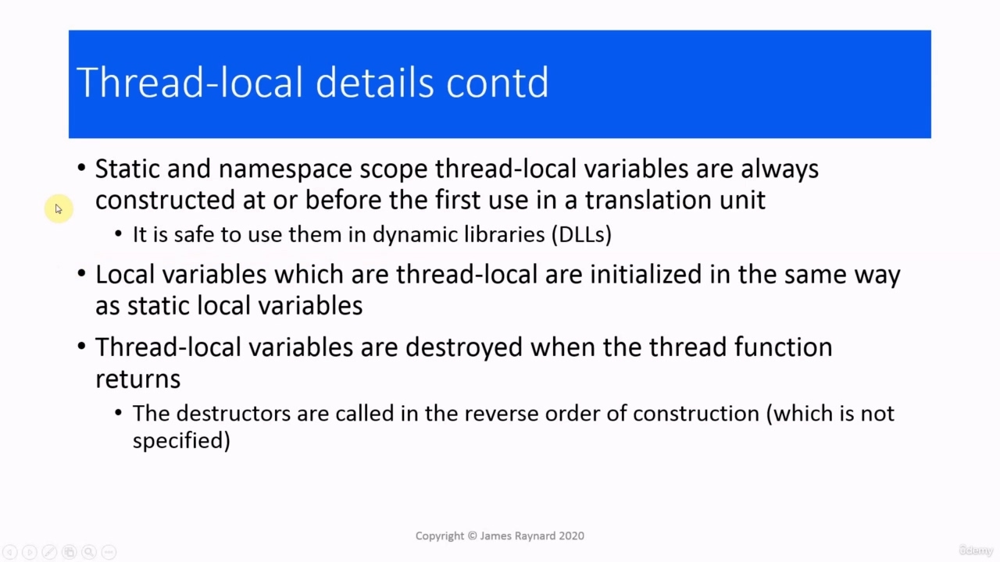
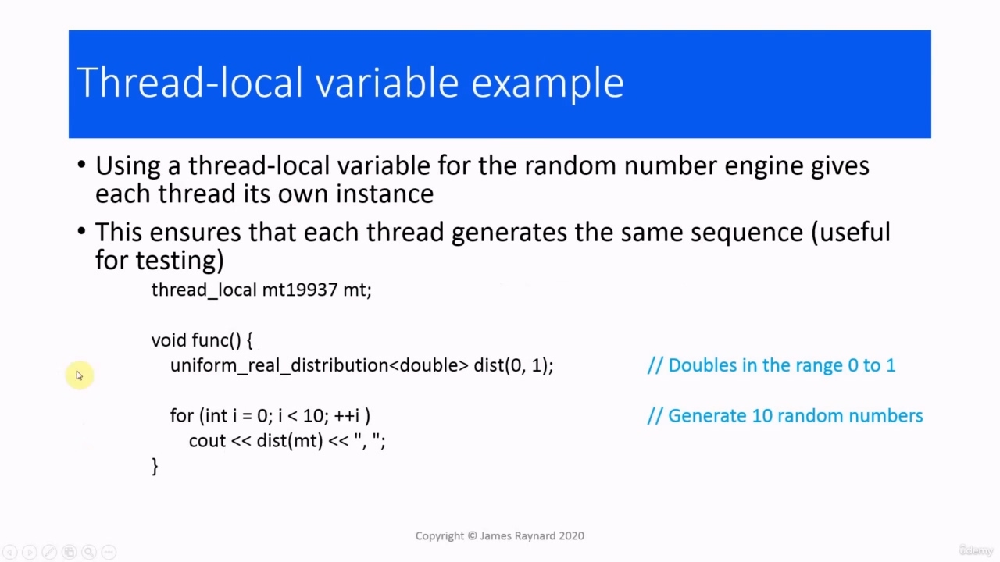
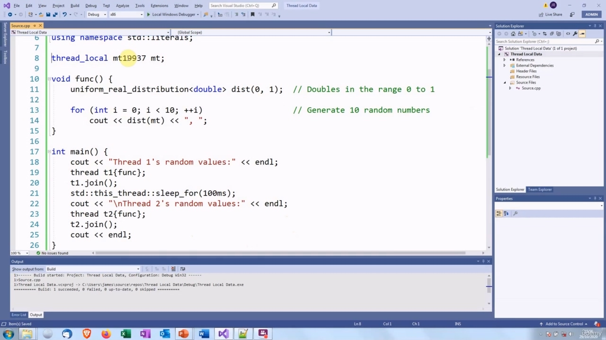
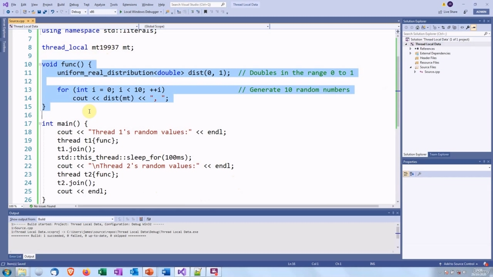
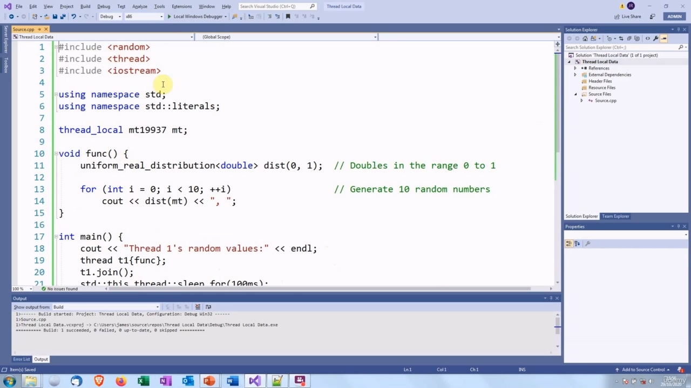
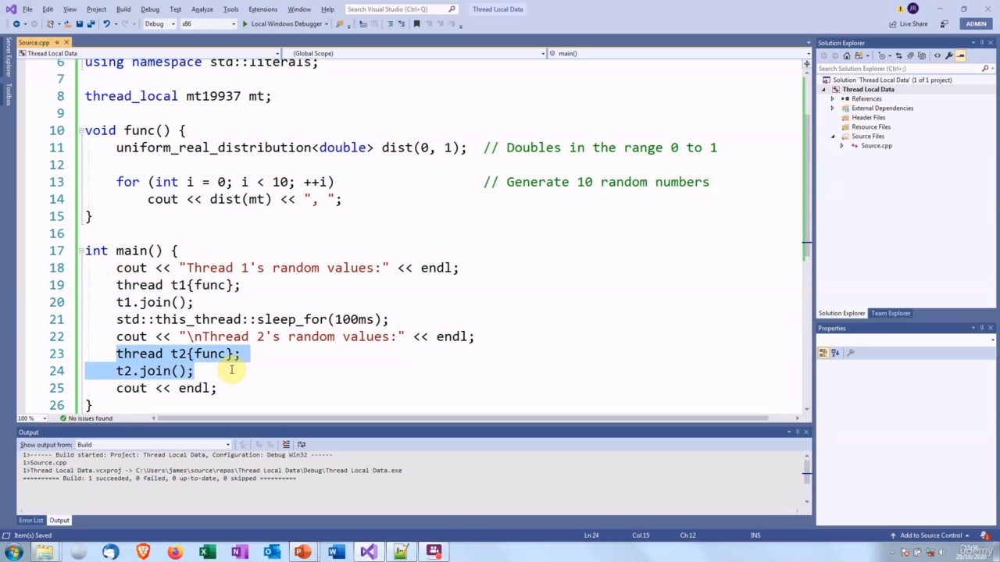
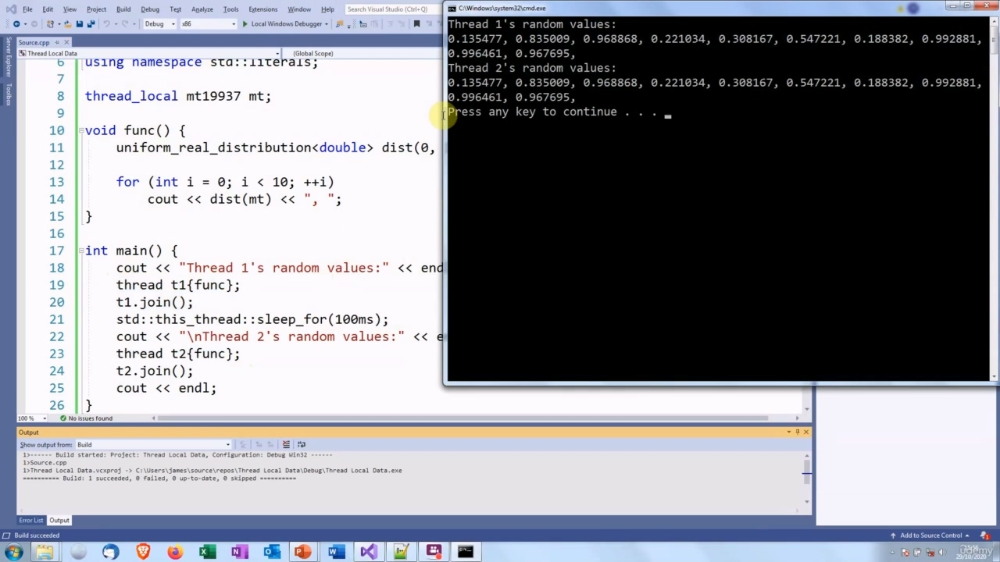
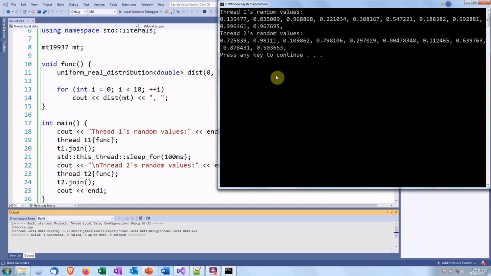

Hello there! In this video, we're going to talk about thread-local variables. C++ supports variables which Hello there! In this video, we're going to talk about thread-local variables. C++ supports variables which are thread-local. We use the thread underscore local keyword to declare a variable as being local to a thread. So these are quite similar to static variables. The difference is, with a static variable, you get a single instance which is shared by all the threads. With a thread_local variable, Each thread has its own instance.

> 你好！在本视频中，我们将讨论线程局部变量。C++支持变量，您好！在本视频中，我们将讨论线程局部变量。C++支持线程本地变量。我们使用thread下划线local关键字将变量声明为线程的本地变量。所以这些和静态变量非常相似。不同的是，使用静态变量，您可以得到一个由所有线程共享的实例。使用thread_local变量，每个线程都有自己的实例。

## img - 42490

We can declare thread-local variables anywhere that we can declare a static variable. We can declare them at namespace scope, we can make them static data members of a class and we can make them local variables in a function.

> 我们可以在任何可以声明静态变量的地方声明线程局部变量。我们可以在命名空间范围内声明它们，我们可以使它们成为类的静态数据成员，我们可以在函数中使它们成为本地变量。

## img - 101260

When they are at static and name space scope, they will be constructed at or before the first time they are used in a translation unit. And just to remind you, a translation unit is a source code file in which all the header files have been included and preprocessed. So that means they avoid the problems that can arise in Windows when you are sharing variables across different translation units in a dynamic library. Local variables, which are thread-local, are initialized in the same way as static local variables. There will not be a data race, of course, because only one thread can access a thread-local variable. Thread-local variables are destroyed when the thread function returns. There is no guarantee about the order in which local variables are constructed, but they are destroyed in the reverse order in which they were constructed.

> 当它们处于静态和名称空间范围时，它们将在翻译单元中首次使用时或之前构建。为了提醒您，翻译单元是一个源代码文件，其中包含了所有的头文件并进行了预处理。因此，这意味着当您在动态库中跨不同的转换单元共享变量时，它们可以避免Windows中可能出现的问题。**本地变量是线程本地变量，其初始化方式与静态本地变量相同。当然，不会有数据竞争，因为只有一个线程可以访问线程本地变量。**当线程函数返回时，线程局部变量被销毁。无法保证局部变量的构造顺序，但它们的破坏顺序与构造顺序相反。

## img - 203120

One application of local variables: if we are using the C++11 features for random numbers, we can arrange things so that each thread has its own access of a random number engine. And if we do not seed the engine, or we use the same seed for all the engines, then that means that each thread will generate the same sequence of random numbers. And that's useful if you are testing. If you are not familiar with the C++11 random numbers, it is quite different from the old rand() function from C. So we create an instance of the random number engine. This has an overloaded function call operator, and every time you call that operator, you get the next random number in the sequence. Normally you use random numbers with a distribution which will scale the numbers. In this case, we have a uniform distribution of real numbers which are doubles in the range from zero to one. So this avoids having to work out how to divide by RAND_MAX and add numbers and then worry about whether you have introduced bias into the distribution. This will always return uniformly distributed random numbers. So in this case, we are creating the random number engine. And then the distribution will also have a function call operator. Then every time we call that, we give the number [engine] instance as the argument, and then that will get the next random number from the sequence and it will scale it to fit into the distribution. So we call it like that. We are going to call it 10 times, so it is going to generate ten random numbers between zero and one. I have got some code here which demonstrates this.

> 局部变量的一个应用：如果我们对随机数使用C++11特性，我们可以安排事情，使每个线程都有自己的随机数引擎访问权限。如果我们不为引擎设置种子，或者我们对所有引擎使用相同的种子，那么这意味着每个线程将生成相同的随机数序列。如果你在测试，这很有用。如果您不熟悉C++11随机数，它与C中的旧rand（）函数截然不同。因此，我们创建了一个随机数引擎的实例。这有一个重载的函数调用运算符，每次调用该运算符时，都会得到序列中的下一个随机数。
> 通常情况下，你使用随机数，其分布将对数字进行缩放。在这种情况下，我们有一个均匀分布的实数，它们是从零到一范围内的两倍。因此，这就避免了如何除以RAND_MAX并相加，然后担心是否在分布中引入了偏差。这将始终返回均匀分布的随机数。所以在本例中，我们创建了随机数引擎。然后，分布还将具有函数调用运算符。然后，每次调用它时，我们都将数字[引擎]实例作为参数，然后将从序列中获得下一个随机数，并将其缩放以适合分布。所以我们这样称呼它。我们将它称为10次，所以它将生成10个介于0和1之间的随机数。我这里有一些代码可以演示这一点。

## img - 340330

I have got some code here which demonstrates this. So this is the thread function from the slide.

> 我这里有一些代码可以演示这一点。这是幻灯片中的线程函数。

## img - 343300

So this is the thread function from the slide. I have got some headers.

> 这是幻灯片中的线程函数。我有一些头球。

## img - 346690

I have got some headers. I have also written a main function, which is going to create a thread and that will print out 10 random

> 我有一些头球。我还编写了一个主函数，它将创建一个线程，并将随机打印出10个

## img - 355780

I have also written a main function, which is going to create a thread and that will print out 10 random numbers. Then it creates another thread and prints out 10 numbers.

> 我还编写了一个主函数，它将创建一个线程，并将打印出10个随机数。然后它创建另一个线程并打印出10个数字。

## img - 359810

Then it creates another thread and prints out 10 numbers. So let's see how that works. So you can see that both threads are printing out the same random numbers.

> 然后它创建另一个线程并打印出10个数字。让我们来看看它是如何工作的。因此，您可以看到两个线程都在打印相同的随机数。

## img - 409400

So you can see that both threads are printing out the same random numbers. The reason for this is this each thread has its own instance of the engine, which is not seeded. So each thread is going to print out the first 10 numbers from the random engine's sequence. Now, let's see what happens if we remove that. So this is now just an ordinary global variable.

> 因此，您可以看到两个线程都在打印相同的随机数。原因是每个线程都有自己的引擎实例，而不是种子。因此，每个线程将从随机引擎的序列中打印出前10个数字。现在，让我们看看如果我们去掉它会发生什么。所以这只是一个普通的全局变量。

## img - 428650

So this is now just an ordinary global variable. It is shared by all the threads. So each time a thread calls it, it is going to get the next number from the sequence.

> 所以这只是一个普通的全局变量。它由所有线程共享。所以每次线程调用它时，它都会从序列中获取下一个数字。
