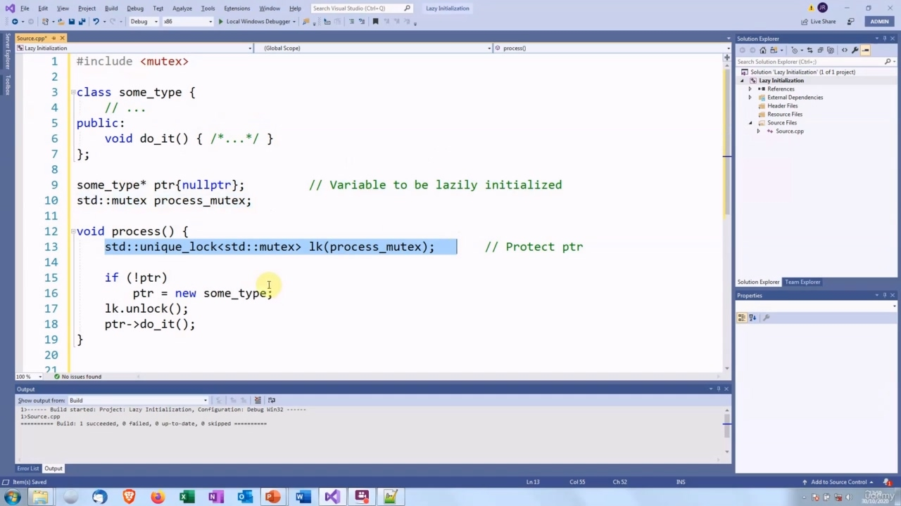
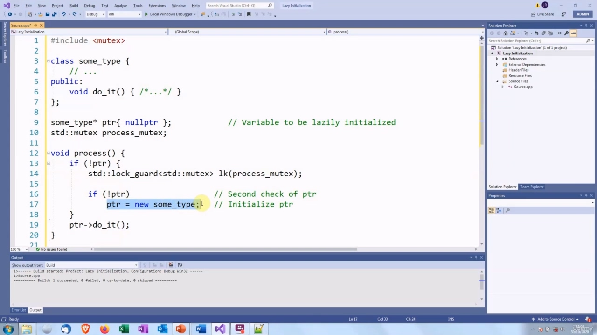

Hello again! In this video, we are going to talk about lazy initialization. The usual advice is to initialize Hello again! In this video, we are going to talk about lazy initialization. The usual advice is to initialize variables at the point where they are declared. This is known as "eager" initialization. It is a good practice because for built-in types, it ensures they have a defined value. And for class types, it ensures that they are properly set up and ready for use. So there is no danger that we might accidentally use a variable that is not a well defined state. However, there is an alternative, "lazy" initialization. This means that a variable is not initialized until the first time it is used. This is mainly used when there is quite a bit of overhead involved in creating or initializing the variable. For example, if we need to get data from a database or set up a network connection. If they are paths through the program in which the variable is not used or if it is not actually convenient to have that overhead at the point where it is declared, then you can declare it uninitialized and initialize it later. This is the traditional way to do it in C++.

> 你好！在本视频中，我们将讨论延迟初始化。通常的建议是再次初始化 Hello！在本视频中，我们将讨论延迟初始化。通常的建议是在声明变量时初始化变量。这就是所谓的“急切”初始化。这是一个很好的做法，因为对于内置类型，它可以确保它们具有定义的值。对于类类型，它确保它们已正确设置并准备好使用。因此，不存在意外使用未定义好状态的变量的危险。然而，还有一种替代方法，即“惰性”初始化。这意味着变量在第一次使用之前不会初始化。这主要在创建或初始化变量时涉及大量开销时使用。例如，如果我们需要从数据库获取数据或建立网络连接。如果它们是程序中未使用变量的路径，或者如果在声明变量时不方便使用该开销，则可以将其声明为未初始化，稍后再进行初始化。这是用 C++实现的传统方法。

## img - 114160

This is the traditional way to do it in C++. We have a class of some type, it does not really matter what it does. We have a global variable, which is a pointer to some instance of this class. We give it the initial value null, to indicate that it has not been initialized. And then before we use it, we check whether it has been initialized. If it is the first time and it is not initialized then we initialize it. And then, once we know that it is safe to use it, we can do something with it. And this works fine in single threaded programs, but is it safe in multithreaded programs?

> 这是用 C++实现的传统方法。我们有一个某种类型的类，它做什么并不重要。我们有一个全局变量，它是这个类的某个实例的指针。我们给它初始值 null，表示它尚未初始化。然后在使用它之前，我们检查它是否已初始化。如果它是第一次，并且没有初始化，那么我们就初始化它。然后，一旦我们知道使用它是安全的，我们就可以用它做一些事情。这在单线程程序中很好，但在多线程程序中安全吗？

## img - 159180

Well, I hope you considered the possibility of a data race. So we have multiple threads which will access this, because they all need to check this value, and we have threads which may modify them because one thread will need to write to the variable. So we do have the potential for a data race. So let's fix that by putting a mutex in.

> 我希望你考虑过数据竞赛的可能性。因此，我们有多个线程将访问这个值，因为它们都需要检查这个值，我们有线程可以修改它们，因为一个线程需要写入变量。因此，我们确实有可能进行数据竞赛。所以让我们通过加入互斥锁来解决这个问题。

## img - 230820

So there we are, we have a mutex instance here and then we lock the mutex before we do the check.

> 现在，我们有一个互斥体实例，然后在检查之前锁定互斥体。

## img - 238790

And then once we get past the critical region in which we have potential conflict, then we unlock the mutex. And that will work perfectly well. But again, this might remind you of something. This is the situation where we had multiple readers and few writers. In this case, we only have one writer, which is the first thread that calls this. So we need to lock the threads to prevent that thread from being interrupted. But once the value has been initialized and we are just reading it, we do not need to lock it again. So all these mutex lock() and unlock() calls are actually a waste of time once we get past that first initialization. The problem here is that we are going to all this trouble with lazy initialization to avoid unnecessary overhead when we initialize this variable at some time. But then we add lots more unnecessary overhead with all this locking. The next attempt is that we only look the mutex if we need to. So first we check the pointer, then we lock the mutex if we need to and initialize it. Otherwise, we jump straight to the use of the variable. So that means we only lock the mutex the first time when the value is being written to. So is this thread-safe? Well, no, still not quite. We still have a data race. It is possible that the first thread can check ptr and then get interrupted, and then another thread runs. It checks the pointer. It gets the lock, initializes and releases the lock.

> 然后，一旦我们通过了可能发生冲突的关键区域，我们就会解锁互斥锁。这将非常有效。但是，这可能再次提醒你一些事情。这就是我们有多个读者而很少有作者的情况。在这种情况下，我们只有一个编写器，这是第一个调用它的线程。因此，我们需要锁定线程以防止该线程被中断。但是，一旦该值被初始化并且我们只是读取它，我们就不需要再次锁定它。因此，一旦我们完成了第一次初始化，所有这些互斥锁 lock（）和 unlock（）调用实际上都是在浪费时间。这里的问题是，为了避免在某个时候初始化这个变量时产生不必要的开销，我们将使用惰性初始化来解决所有这些问题。但是，通过所有这些锁定，我们增加了更多不必要的开销。下一个尝试是，我们只在需要时查看互斥体。因此，首先我们检查指针，然后在需要时锁定互斥体并初始化它。否则，我们直接跳转到变量的使用。所以这意味着我们只在第一次写入值时锁定互斥锁。那么这个线程安全吗？嗯，不，还是不太好。我们仍在进行数据竞赛。第一个线程可能会检查 ptr，然后被中断，然后另一个线程运行。它检查指针。它获取锁，初始化并释放锁。

## img - 423170

Then the first thread runs again, gets the lock and initializes the pointer again. So we have initialized it twice, which is not what we intended to do. So what we can do then is to check the pointer a second time.

> 然后第一个线程再次运行，获取锁并再次初始化指针。所以我们已经初始化了两次，这不是我们想要做的。所以我们可以做的是再次检查指针。

## img - 442640

This check is inside the lock, so we are the only thread that can be doing this check. So if some other thread has come along and initialized the pointer in between these two statements, then when we check it here, the test will fail and we do not create a second variable. OK, so is this thread-safe? And the answer, believe it or not, is that it is not thread-safe. You may recall that when we were talking about the Singleton, I said there are actually two race conditions

> 此检查位于锁内，因此我们是唯一可以执行此检查的线程。因此，如果其他线程出现并初始化了这两个语句之间的指针，那么当我们在这里检查它时，测试将失败，我们不会创建第二个变量。好的，这个线程安全吗？不管你信不信，答案是它不是线程安全的。你可能还记得，当我们谈论单打时，我说过实际上有两种比赛条件

## img - 514510

You may recall that when we were talking about the Singleton, I said there are actually two race conditions and this is where it comes in. The problem is that this is actually three separate operations, so let's try and find out what is going

> 你可能还记得，当我们谈论单打时，我说过实际上有两种比赛条件，这就是它的来源。问题是，这实际上是三种不同的操作，所以让我们试着了解一下到底发生了什么

## img - 526640

The problem is that this is actually three separate operations, so let's try and find out what is going on here. When we call the new operator to create a variable on the heap, there are actually three separate things

> 问题是这实际上是三个独立的操作，所以让我们来看看这里发生了什么。当我们调用 new 运算符在堆上创建变量时，实际上有三个不同的事情

## img - 534870

When we call the new operator to create a variable on the heap, there are actually three separate things that happen. The first one is that we allocate the money on the heap and the program will make sure there is enough memory for the object to be stored there. Then we need to create an object in that memory, which is calling the constructor. And then finally, we need to save the address of this memory that has been allocated. So you may expect that they are done in that order, that the allocation is done first, then the constructor call and then the store of the address. Unfortunately, however, C++ allows lots of scope for reordering operations and this is one of the situations where it allows it. So it is quite possible that the program could allocate the memory and then save the address of that memory and then go back and construct the object in this memory. It is possible that the thread could be interrupted between these two operations, so the value of ptr has been set, it is no longer null. Any other thread that checks that will think that the initialization has been done. However, the constructor call has not yet been done. And then when the second thread goes ahead and accesses that memory, it will access an object that has not been constructed and that will be very bad. So we have a threat A, which is going through these steps. It is allocated the memory and it gets suspended.

> 当我们调用 new 运算符在堆上创建变量时，实际上会发生三种不同的情况。第一个是我们将钱分配到堆上，程序将确保有足够的内存来存储对象。然后我们需要在该内存中创建一个对象，该对象正在调用构造函数。最后，我们需要保存已分配内存的地址。因此，您可能会期望它们按顺序完成，首先完成分配，然后是构造函数调用，然后是地址存储。然而，不幸的是，C++为重新排序操作提供了很大的空间，这是它允许的情况之一。因此，程序很有可能分配内存，然后保存该内存的地址，然后返回并在该内存中构造对象。线程可能会在这两个操作之间中断，因此 ptr 的值已设置，不再为空。任何其他检查线程都会认为初始化已经完成。但是，构造函数调用尚未完成。然后，当第二个线程继续访问该内存时，它将访问一个尚未构建的对象，这将非常糟糕。所以我们有一个威胁 a，它正在经历这些步骤。它被分配了内存并被挂起。

## img - 714400

So ptr has been set, but the memory does not contain any actual data. Then a thread B calls this function. It tests the ptr to see whether it needs to acquire a lock. Then it will see that ptr is not null it will not try to get a look, it will jump straight to the call. And then it is going to call a member function of an unconstructed object, and that is undefined behaviour. So the problem is that thread A could come through here and it gets as far as this and then gets suspended, when it has set ptr, but it has not created the object. Then a second thread runs, it checks ptr, ptr is not null, so it jumps straight to this function call even though ptr does not contain a properly constructed object. By the way, this is known as double-checked locking. This is a very popular algorithm, but it does not work, at least not the way that it has been written here. There are various ways to address this.

> 因此，ptr 已设置，但内存中不包含任何实际数据。然后线程 B 调用此函数。它测试 ptr 以查看是否需要获取锁。然后它将看到 ptr 不为空，它不会尝试查看，它将直接跳转到调用。然后它将调用未构造对象的成员函数，这是未定义的行为。所以问题是，线程 A 可能会通过这里，并到达这里，然后在它设置了 ptr，但尚未创建对象时被挂起。然后，第二个线程运行，它检查 ptr，ptr 不为空，因此它直接跳转到此函数调用，即使 ptr 不包含正确构造的对象。顺便说一下，这被称为双重检查锁定。这是一个非常流行的算法，但它不起作用，至少不像这里写的那样。有多种方法可以解决这一问题。

## img - 818590

There are various ways to address this. One is to use a function called call_once, which does what the name suggests. It ensures that a function is only called once. It also guarantees that it is done in one thread and the thread that is doing the call cannot be interrupted until the function call has completed. To use that, we need to create a global instance of a once_flag variable, and then we pass that instance and the function that wants to be called, to call_once. So it will look like this. We have our once_flag. This flag is used by the program to store synchronization data.

> 有多种方法可以解决这一问题。一种方法是使用一个名为 call_once 的函数，该函数执行名称所暗示的操作。它确保函数只调用一次。它还保证它在一个线程中完成，并且在函数调用完成之前，执行调用的线程不能被中断。要使用它，我们需要创建一个 once_flag 变量的全局实例，然后将该实例和要调用的函数传递给 call_once。所以它看起来像这样。我们有一次时差。程序使用此标志来存储同步数据。

## img - 858210

We have our once_flag. This flag is used by the program to store synchronization data. So there is quite a lot going on behind the scenes. And then we call the function call_once, we pass this once_flag as the first argument and then, as

> 我们有一次时差。程序使用此标志来存储同步数据。所以幕后有很多事情要做。然后我们调用函数 call_once，将这个 once_flag 作为第一个参数传递，然后作为

## img - 910120

And then we call the function call_once, we pass this once_flag as the first argument and then, as the second argument, we pass the function that we want to have called. In this case, we just want to execute the call to new(), which sets the value of the ptr.

> 然后我们调用函数 call_once，我们将这个 once_flag 作为第一个参数传递，然后作为第二个参数传递我们想要调用的函数。在这种情况下，我们只需要执行对 new（）的调用，该调用设置 ptr 的值。
