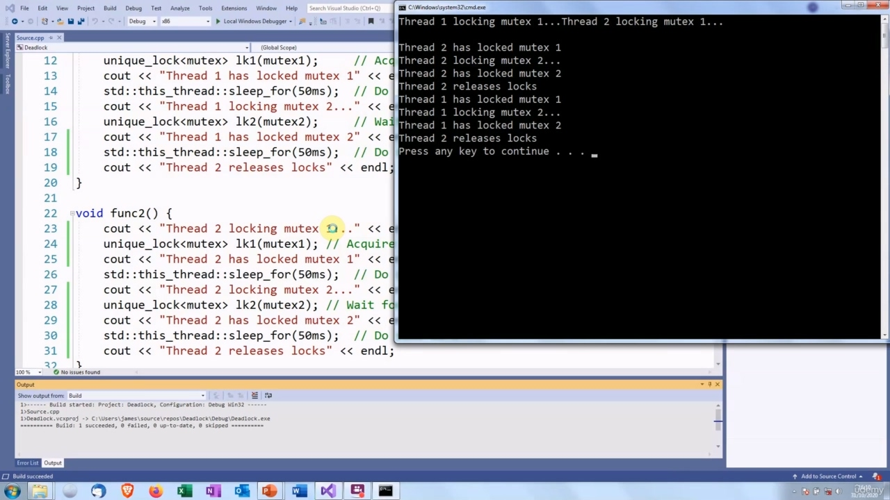
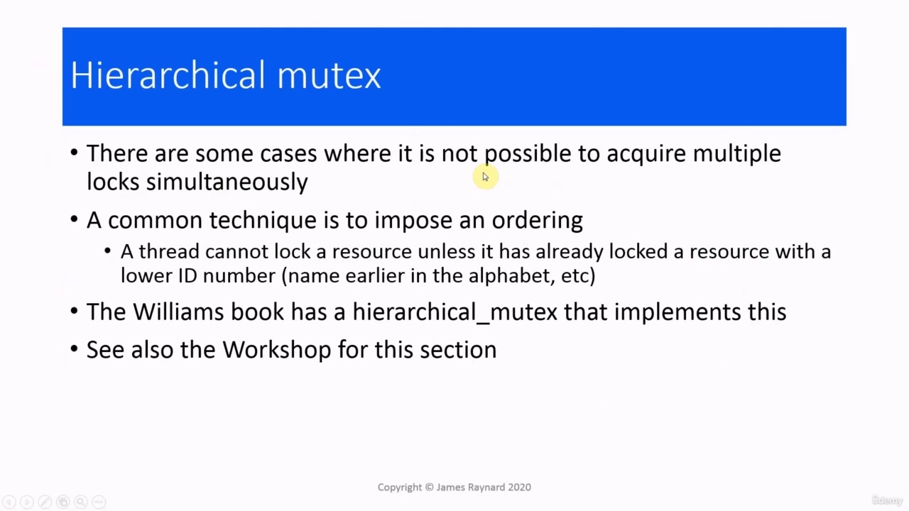

Hello there. In this video, we are going to look at deadlock. We have mentioned deadlock a few times, so let's try

> 你好。在本视频中，我们将讨论死锁。我们已经多次提到死锁，所以让我们尝试一下

## img - 7110

In this video, we are going to look at deadlock. We have mentioned deadlock a few times, so let's try and find out exactly what we mean by it. We say that a thread is deadlocked when it cannot run at all.

> 在本视频中，我们将讨论死锁。我们已经多次提到死锁，所以让我们试着找出它的确切含义。

## img - 22580

There are times when a thread gets interrupted and it cannot run, but then it will wake up again and it should be able to run. If a thread is deadlocked, it cannot run at all. It is completely stuck. Deadlock often occurs when we have two or more threads waiting for each other. We have a thread A which is waiting for some other thread B to do something or to finish doing something, but B cannot finish until it gets something from A. But B cannot get anything from A because A is not running, because it is waiting for B. So threads A and B are stuck waiting for each other. They are both waiting for something which will never happen. The classic way to demonstrate this is waiting for locks on mutexes. But there are other situations in which threads can be deadlocked. If thread A is waiting for the results of some computation that thread B is doing. If it is waiting for a message to be sent by thread B. Or it could be waiting for thread B to produce some sort of GUI event.

> 有时线程被中断，无法运行，但随后它会再次唤醒，应该可以运行。如果线程处于死锁状态，则它根本无法运行。它完全卡住了。当我们有两个或多个线程彼此等待时，通常会发生死锁。我们有一个线程 a，它在等待其他线程 B 做一些事情或完成一些事情，但 B 无法完成，直到它从 a 获得一些东西。但 B 无法从 a 获得任何东西，因为 a 没有运行，因为它在等待 B。所以线程 a 和 B 一直在等待对方。他们都在等待永远不会发生的事情。演示这一点的经典方法是等待互斥锁上的锁。但还有其他情况下线程可能会死锁。如果线程 A 正在等待线程 B 正在进行的某些计算的结果。如果它正在等待线程 B 发送消息，或者它可能在等待线程 B 生成某种 GUI 事件。

## img - 128730

The simplest way to get a deadlock is to have two threads trying to look the same mutexes in different orders. So we have the first thread, which looks mutex number one, and the second thread looks mutex number two. Then this thread wants to lock mutex number two, but it has to wait because that is already locked by thread two. Meanwhile, thread two is waiting for a lock on mutex one, which is locked at by thread one. So thread two cannot run until thread one releases the lock and thread one cannot run until thread two releases the lock. So both these threads are stuck waiting for a lock on the mutex.

> 获得死锁的最简单方法是让两个线程尝试以不同的顺序查看相同的互斥锁。所以我们有第一个线程，它看起来是互斥锁，第二个线程看起来是互斥。然后这个线程想要锁定第二个互斥锁，但它必须等待，因为第二个线程已经锁定了互斥锁。同时，线程 2 正在等待互斥锁 1 上的锁，互斥锁 1 被线程 1 锁定。因此，线程 2 在线程 1 释放锁之前无法运行，而线程 1 在线程 2 释放锁之前不能运行。所以这两个线程都在等待互斥锁的锁定。

## img - 216950

The code would look like this, so thread one's function will get a lock on mutex one, then try to get a lock on mutex two. The other thread will get a lock on mutex number two, then it tries to get a lock on mutex number one. So once this thread gets the look on mutex number two, it will exit and release the lock on one, which would allow thread two to run. But it cannot run yet because the lock has not been released. But thread two cannot run yet because it is waiting for the lock on mutex one.

> 代码看起来像这样，所以线程 1 的函数将在互斥锁 1 上获得锁，然后尝试在互斥锁 2 上获得锁。另一个线程将获得第二个互斥锁的锁，然后尝试获得第一个互斥锁。因此，一旦这个线程获得了第二个互斥锁的外观，它将退出并释放第一个互斥锁，这将允许第二个线程运行。但它还无法运行，因为锁尚未释放。但是线程 2 还不能运行，因为它正在等待互斥锁 1 上的锁。

## img - 258290

So here is the code with some debug information added. So we get the lock on mutex one and then we try to get the look on mutex two. In the other thread function, we get the lock on mutex two, then we try to get the lock on mutex one. And there is a main function, which does nothing very exciting. Okay, so let's see how that works.

> 这里是添加了一些调试信息的代码。所以我们得到互斥锁 1 的锁，然后我们尝试得到互斥锁 2 的锁。在另一个线程函数中，我们获取互斥锁 2 的锁，然后尝试获取互斥锁 1 的锁。还有一个主要功能，它没有做什么非常令人兴奋的事情。好吧，让我们看看它是如何工作的。

## img - 330050

So thread 1 and thread 2 are both trying to lock their mutexes, thread 2 locks mutex number two and thread 1 looks mutex number one, and then they try to lock the other thread's mutex. So thread one is waiting for a lock on mutex two, which is already locked by thread two and thread two is waiting for a lock on mutex one, which is already locked by third one. So the program is completely deadlocked. You can see nothing is happening. I have to press control-C to get out of it. Now, if we change this, so the the threads get the mutexes in the same order...

> 因此，线程 1 和线程 2 都试图锁定它们的互斥锁，线程 2 锁定互斥锁，而线程 1 看起来是互斥锁，然后它们试图锁定另一个线程的互斥锁。所以线程 1 正在等待互斥锁 2 上的锁，互斥锁 2 已经被线程 2 锁定，线程 2 正在等待互斥一上的锁。互斥锁 1 已经被第三个线程锁定。所以程序完全陷入僵局。你看不到发生了什么。我必须按 control-C 退出。现在，如果我们改变这个，那么线程以相同的顺序获得互斥锁。。。

## img - 400130

Now, if we change this, so the the threads get the mutexes in the same order...

> 现在，如果我们改变这个，那么线程以相同的顺序获得互斥体。。。

## img - 415010

Let's see what difference that makes.

> 让我们看看这有什么不同。

## img - 415010

Let's see what difference that makes. So there we are, the program has actually run and completed.

> 让我们看看这有什么不同。现在，程序已经运行并完成了。

## img - 420720

So there we are, the program has actually run and completed. So both sides are trying to lock mutex number one. Thread two gets there first, locks mutex one then it tries to lock mutex two, then it reaches the end of the thread function and it releases all the locks. Then thread one can lock mutex number one. Then it tries to lock mutex two. There is no one holding a lock in it. So it can do that and then that can run to completion. And then the entire program finishes normally.

> 现在，程序已经运行并完成了。所以双方都试图锁定一号互斥锁。线程 2 首先到达那里，锁定互斥锁 1，然后尝试锁定互斥锁 2，然后到达线程函数的末尾，然后释放所有锁。然后线程 1 可以锁定 1 号互斥锁。然后它尝试锁定互斥锁二。没有人锁在里面。所以它可以做到这一点，然后就可以完成。然后整个程序正常结束。

## img - 453560

So here are some guidelines on how to avoid deadlock. The basic rule is never wait for a thread if there is any chance it could be waiting for your thread at some point. And it may not just be a simple two thread situation where A waits for B and B waits for A, you could have cycles where A waits for B, B waits for C, and C waits for A. Avoid nested locks. If your thread already has a lock, do not acquire another one, even if it is on a different mutex. If you need multiple locks, acquire them in a single operation. I will show you how to do that in a minute. If you do need multiple locks and you cannot acquire them in a single operation, then acquire them in the same order in every thread. So that was how I avoided deadlock in the code just then. I made sure that the threads acquire the locks in the same order.

> 因此，这里有一些关于如何避免死锁的指南。基本规则是，如果某个线程有可能在某个时刻等待您的线程，则永远不要等待它。这可能不仅仅是一个简单的双线程情况，a 等待 B，B 等待 a，您可以有 a 等待 B、B 等待 C 和 C 等待 a 的循环。避免嵌套锁。如果您的线程已经有一个锁，即使它在不同的互斥锁上，也不要获取另一个锁。如果需要多个锁，请在一次操作中获取它们。我马上告诉你怎么做。如果您确实需要多个锁，并且无法在单个操作中获取它们，那么在每个线程中以相同的顺序获取它们。这就是我当时避免代码死锁的方法。我确保线程以相同的顺序获取锁。

## img - 552570

Another piece of advice: do not call code within a critical section unless you know exactly what it does. I mean, these are all basically code that could do anything and you do not have control over [them]. These are all types of code in which other people can add locks without you knowing about it, and if you do not know where the locks are, you do not know what order the locks are going to be taken in, in different threads. However, if you do know that the code does not take locks and you know it is not going to be changed, then that is okay.

> 另一条建议：不要在关键部分中调用代码，除非您确切知道它的作用。我的意思是，这些基本上都是可以做任何事情的代码，你无法控制它们。这些都是其他人可以在你不知道的情况下添加锁的所有类型的代码，如果你不知道锁在哪里，你也不知道锁将在不同的线程中按什么顺序使用。然而，如果您确实知道代码不带锁，并且您知道它不会被更改，那么这是可以的。

## img - 629550

Yes, so as we said, we acquire the locks in the same order, but that's not always ideal. It does rely on the programmer to get it right. In a simple example like that one, it is not difficult. But if you have a large program, you may easily lose track of where the locks are taken. This is not really a viable strategy.

> 是的，正如我们所说，我们以相同的顺序获得锁，但这并不总是理想的。它确实依赖于程序员来完成它。在这样一个简单的例子中，这并不难。但如果你有一个大型程序，你可能很容易忘记锁的位置。这并不是一个可行的策略。

## img - 652160

A better option is to use the features provided by the C++ library, which will allow you to lock both mutexes at the same time. In C++17, we can use a scoped_lock. So we just have a scoped_lock, which will try to lock both the mutexes in a single call. And it does not matter what order you put them in. This will either lock both mutexes or not lock either of them.

> 更好的选择是使用 C++库提供的特性，这将允许您同时锁定两个互斥锁。在 C++17 中，我们可以使用 scoped_lock。所以我们只有一个 scoped_lock，它将尝试在一次调用中锁定两个互斥锁。你把它们按什么顺序排列并不重要。这要么锁定两个互斥体，要么不锁定其中任何一个。

## img - 724200

So here is that code with a bit more debugging information and some sleeps added. So we have a thread that calls scoped_lock and another thread that calls scoped_lock with the mutexes in a different order. Again, the same boring main function.

> 这是一段添加了更多调试信息和一些睡眠的代码。所以我们有一个线程调用 scoped_lock，另一个线程则以不同的顺序调用带有互斥锁的 scoped_lock。同样，无聊的主要功能。

## img - 745440

So this looks OK, both the threads try to look the mutexes, thread two gets there first, then it will do some work, then it will exit, which will release the mutexes. Then thread one will lock both mutexes. It will do some work and it will exit. So this all works normally.

> 这看起来不错，两个线程都试图查看互斥锁，线程 2 首先到达那里，然后它会做一些工作，然后退出，这将释放互斥锁。然后线程 1 将锁定两个互斥锁。它会做一些工作，然后退出。所以这一切都正常工作。

## img - 811440

If you are using C++11 or 14, you can use the lock function to lock both mutexes and then we create unique_lock instances which will adapt those mutexes. So these are just ordinary mutexes which happen to be locked. These objects are unique_lock objects which will acquire ownership of the lock on the mutex, and we can either manually unlock them or else they will go out of scope, and that will cause the lock to be released by the destructor call. There seem to be a lot of alternative ways of doing things with mutexes, so you can also create the locks first with the defer_lock argument and then do the call later. So we have the unique_lock objects which own a lock on the mutexes, but the mutexes do not actually get locked until later on.

> 如果您使用的是 C++11 或 14，您可以使用 lock 函数来锁定两个互斥体，然后我们创建 unique_lock 实例来适应这些互斥体。所以这些只是普通的互斥锁，碰巧被锁定了。这些对象是 unique_lock 对象，它将获得互斥锁的所有权，我们可以手动解锁它们，否则它们将超出作用域，这将导致析构函数调用释放锁。似乎有很多使用互斥锁的替代方法，因此您也可以先使用 defel_lock 参数创建锁，然后再进行调用。所以我们有 unique_lock 对象，它们拥有互斥锁，但互斥锁直到稍后才真正被锁定。

## img - 901550

So, again, I put some debugging information into the code.

> 因此，我再次在代码中添加了一些调试信息。

## img - 910780

So we have the lock() call, then we have the unique look with adopt_lock. Thread two is the same with the mutexes in the reverse order. So this works more or less the same. The threads try to lock their mutexes, thread 2 gets there first. It locks the mutexes, it does some work and then it exits, which releases the mutexes when the destructors are called on the unique lock objects. And then thread one can get the locks and do some work and release the mutexes when it goes out of scope.

> 因此，我们调用了 lock（），然后我们就有了 adopt_lock 的独特外观。线程 2 与互斥体的顺序相反。所以这或多或少都是一样的。线程试图锁定它们的互斥锁，线程 2 首先到达。它锁定互斥锁，它做一些工作，然后退出，当对唯一的锁对象调用析构函数时，它释放互斥锁。然后线程 1 可以获取锁并执行一些工作，当互斥体超出范围时释放互斥体。

## img - 950740

There are some cases where it is not possible to acquire multiple locks simultaneously because of the nature of the problem. In that case, you impose some kind of ordering. For example, you could say that a thread cannot lock a resource, unless it has already locked something which has a lower identifier and for the identifier, you could use names or numbers. The book that I recommend by Anthony Williams, it has the code for a hierarchical mutex that will implement this. I have also got a simpler example of that in the workshop for this section. So when you get to the end of the section and get stuck into the workshop, you will be able to do that for yourself.

> 在某些情况下，由于问题的性质，不可能同时获取多个锁。在这种情况下，您可以强制执行某种排序。例如，您可以说线程无法锁定资源，除非它已经锁定了具有较低标识符的对象，对于标识符，可以使用名称或数字。我推荐安东尼·威廉姆斯（Anthony Williams）的这本书，其中包含了实现这一点的分层互斥锁的代码。在本节的研讨会中，我还得到了一个更简单的例子。因此，当你走到本节的末尾并被困在车间时，你将能够自己完成这项工作。
