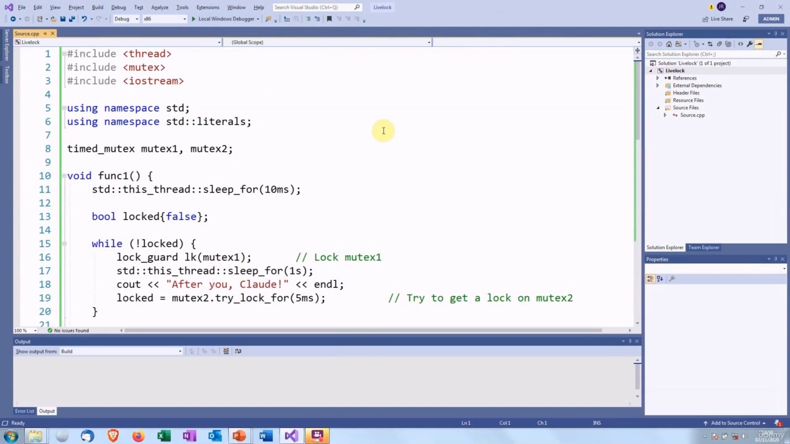
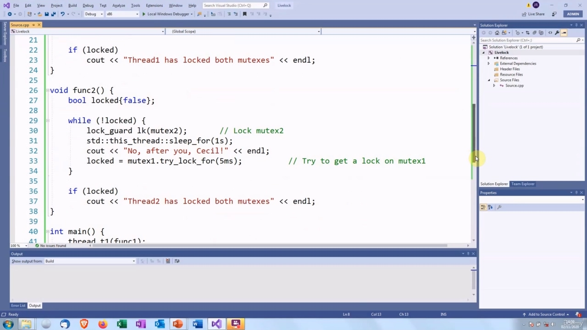
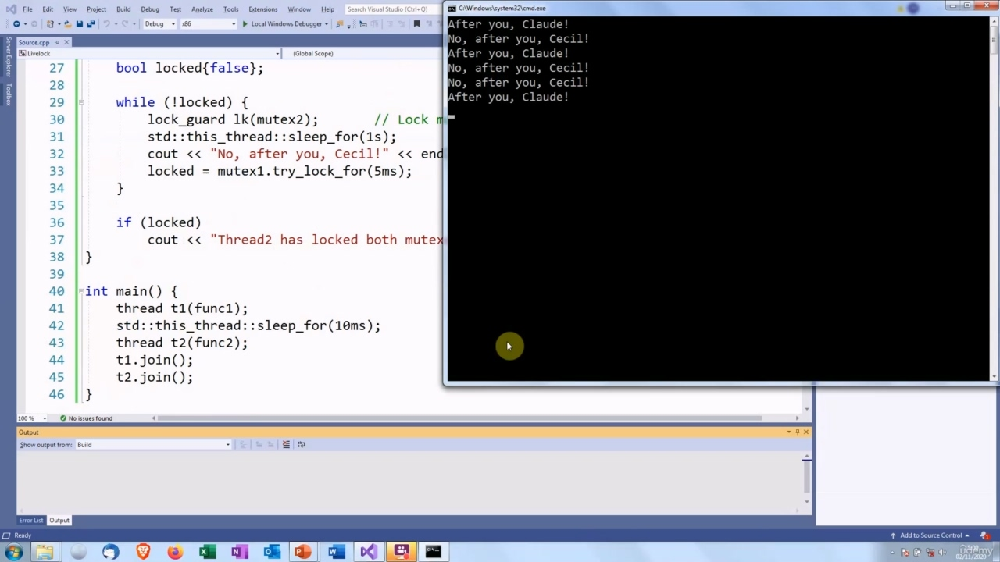
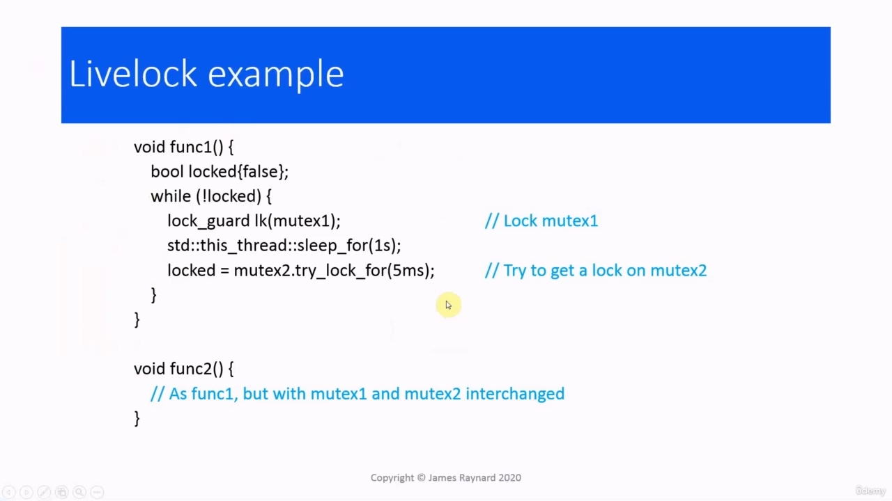
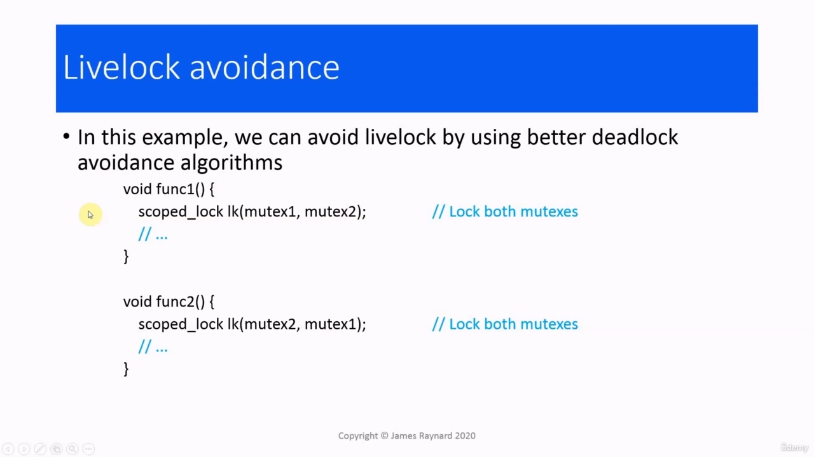
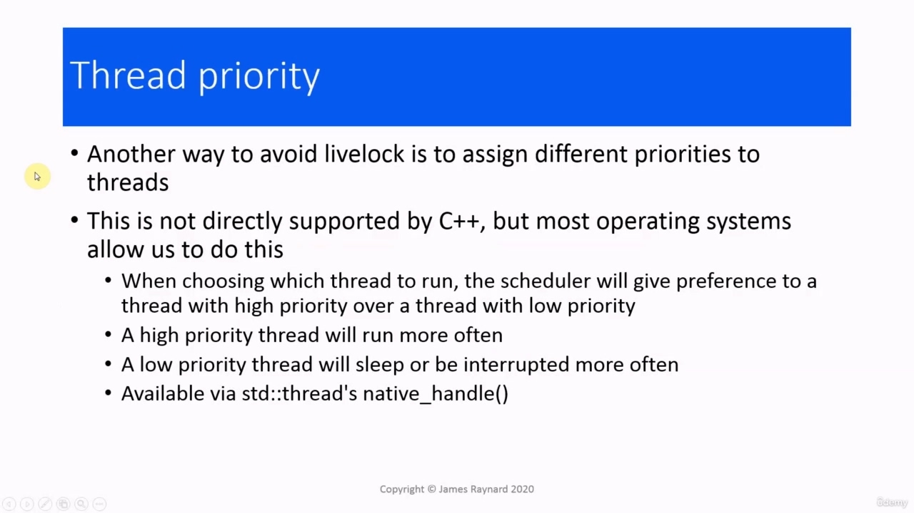
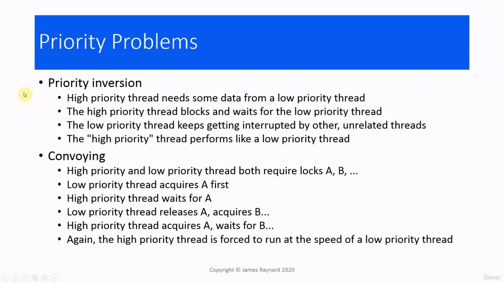
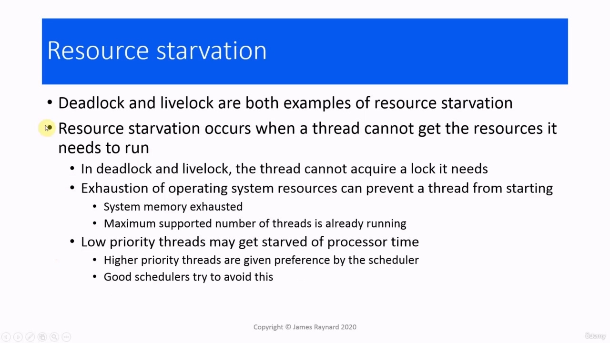

Hello again. In this video, we are going to talk about livelock. Livelock is related to deadlock. Hello again. In this video, we are going to talk about livelock. Livelock is related to deadlock. The difference is that when we have a livelock, all the threads are still active, whereas when we have deadlock, there are some threads which are no longer active. They are waiting forever. So when we have deadlock, everything grinds to a halt. When we have livelock, things are still happening. One of the most common causes of livelock is badly doing deadlock avoidance. If we think back to the

> 再次问候。在本视频中，我们将讨论活锁。Livelock 与死锁有关。再次问候。在本视频中，我们将讨论活锁。Livelock 与死锁有关。不同的是，当我们有一个动态锁时，所有线程仍然处于活动状态，而当我们有死锁时，有些线程不再处于活动状态。他们永远在等待。因此，当我们陷入僵局时，一切都会陷入停顿。当我们有活力时，事情仍在发生。活锁最常见的原因之一是避免死锁做得不好。如果我们回想一下

## img - 38370

One of the most common causes of livelock is badly doing deadlock avoidance. If we think back to the situation we had before, where we had two threads and each one was waiting to get a lock on a mutex that was already locked by the other thread, that was deadlock. We could try and avoid that by saying that instead of waiting for the mutex indefinitely, we are going to wait with a timeout and then if we cannot get it, we are going to start all over again. So we're going to release our own lock and then try and get the other thread's. lock. As an analogy for this, there was a British comedy program in the 1940s, I think, certainly well before even my time. And one of the sketches on that was two civil servants trying to go through a door at the same time. You can imagine the situation. You have two people walking along a corridor side by side, and then they come to a door which is only wide enough for one person, and they both try to get in, then they realize they are making a mistake and they back off and say, "Oh, terribly sorry", "No, my mistake!" "No, after you", "No, no after you" and then they wait for the other person, then they both try to go through it again at the same time. Then they both back off and then they wait, then they go again. A very British problem! But livelock is rather like that. Here is some code which will implement this. So we have the lock on mutex number

> 活锁最常见的原因之一是避免死锁做得不好。如果我们回想一下以前的情况，我们有两个线程，每个线程都在等待对已经被另一个线程锁定的互斥锁的锁定，那就是死锁。我们可以尝试避免这种情况，我们可以说，不是无限期地等待互斥锁，而是等待一个超时，如果我们无法获得它，我们将重新开始。所以我们要释放自己的锁，然后尝试获取其他线程的锁。锁作为类比，我想，早在我的时代之前，1940 年代就有一个英国喜剧节目。其中一张草图是两名公务员同时试图穿过一扇门。你可以想象情况。你有两个人并排走在走廊上，然后他们走到一个只够一个人走的门前，他们都试图进去，然后他们意识到自己犯了错误，他们退后说，“哦，非常抱歉”，“不，我的错误！”“不，在你之后”，“没有，在你以后”，然后他们等待另一个人，然后他们都试图同时再次经历。然后他们都后退，然后他们等待，然后他们又走了。一个非常英国的问题！但活锁是这样的。下面是一些实现这一点的代码。所以我们锁定了互斥锁号码

## img - 159790

Here is some code which will implement this. So we have the lock on mutex number one in the thread number one. And then instead of getting a lock guard, which will wait indefinitely to lock mutex two, we use a try lock with a timeout. So this will spend five milliseconds trying to get the lock. And then at the end of this scope, the lock guard will be destroyed. The lock on the first mutex will be released. And then it goes back into the loop and tries again. So it locks the first mutex and then waits for the timeout for the lock on the second mutex. And eventually this will succeed and in theory, this should drop out of the loop. The other thread function is exactly the same, except the mutexes are the other way around. So first it looks mutex two then it tries to look mutex one with a timeout.

> 下面是一些实现这一点的代码。所以我们锁定了线程 1 中的互斥锁 1。然后，我们使用一个带有超时的 try 锁，而不是获得一个锁保护（它将无限期地等待锁定互斥锁 2）。因此，这将花费 5 毫秒来获取锁。然后在这个范围结束时，锁护板将被摧毁。第一个互斥锁上的锁将被释放。然后它返回循环并重试。因此，它锁定第一个互斥锁，然后等待第二个互斥锁的锁定超时。最终，这将成功，理论上，这将退出循环。另一个线程函数完全相同，只是互斥锁是相反的。因此，首先它查看互斥体 2，然后尝试查看带有超时的互斥体 1。

## img - 301220

So here is some code to do that. We are using a timed_mutex so we can have the time out. I have added some sleeps and print messages so we can see what's happening. And then we lock the first mutex, we try to lock the second and we do that in a loop. And then we have the other thread function, which is the same, but it locks mutex two first and then

> 所以这里有一些代码来实现这一点。我们使用了 timed_mutex，这样我们就可以超时了。我添加了一些睡眠和打印消息，以便我们可以看到发生了什么。然后我们锁定第一个互斥锁，我们尝试锁定第二个互斥锁并在一个循环中完成。然后我们有另一个线程函数，这是相同的，但它先锁定互斥锁，然后锁定互斥锁

## img - 322880

And then we have the other thread function, which is the same, but it locks mutex two first and then tries to lock mutex one with a timeout. And then the main function to launch the threads. So here we are. They're both busy apologizing to each other and nobody actually gets through the door.

> 然后我们有另一个线程函数，这是相同的，但它首先锁定互斥锁二，然后尝试用超时锁定互斥锁一。然后是启动线程的主函数。我们到了。他们都在忙着向对方道歉，但实际上没有人进门。

## img - 338080

They're both busy apologizing to each other and nobody actually gets through the door.

> 他们都在忙着向对方道歉，但实际上没有人进门。

## img - 344080

How can we prevent this? Well, the obvious way is to use a proper deadlock avoidance technique, for example, we could use the scoped lock from C++17 or the unique lock with extra arguments and the global lock function from

> 我们如何防止这种情况？好吧，显而易见的方法是使用适当的死锁避免技术，例如，我们可以使用 C++17 中的作用域锁或具有额外参数的唯一锁以及

## img - 358600

use the scoped lock from C++17 or the unique lock with extra arguments and the global lock function from C++11. I will let you try that out for yourselves. It is pretty straightforward.

> 使用 C++17 中的作用域锁或带有额外参数的唯一锁以及 C++11 中的全局锁函数。我会让你自己试试。这很简单。

## img - 412440

Another way to avoid livelock is to assign different priorities to the threads. The operating system actually does that for us, although it is not directly supported by C++. When the scheduler is deciding which thread to allow to run next, it goes by the priority of the thread, so the highest priority thread will get the most opportunities to run. So threads with high priority will get the most opportunities to run. And threads with the lowest priorities will get the least opportunities to run. They are more likely to be sleeping, or when they do run, they are more likely to be interrupted. We can call the native_handle member function of the thread object, and that will give us the data which we need to pass as an argument to some operating system API, and that can set the priority of the thread. I will not show you how to do that, because it depends on the operating system.

> 避免活锁的另一种方法是为线程分配不同的优先级。操作系统实际上为我们做到了这一点，尽管 C++并不直接支持它。当调度器决定下一个允许运行哪个线程时，它会根据线程的优先级进行排序，因此优先级最高的线程将获得最多的运行机会。因此，具有高优先级的线程将获得最多的运行机会。优先级最低的线程将获得最少的运行机会。他们更有可能在睡觉，或者当他们跑步时，他们更有可能被打断。我们可以调用线程对象的 native_handle 成员函数，这将为我们提供需要作为参数传递给某些操作系统 API 的数据，并可以设置线程的优先级。我不会向您展示如何做到这一点，因为这取决于操作系统。

## img - 508640

Some issues you need to think about when you are doing that. One of them is priority inversion. We have a high priority thread, but it needs to wait for something that is a low priority thread is doing. So it is going to stop what it is doing and it is going to wait until the low priority thread has done what it needs. However, because the low priority thread has low priority, it keeps getting interrupted by other threads which are not relevant to what we are waiting for. The high priority thread is actually running at the same speed as a low priority thread, so that is why it is called priority inversion. We have a high priority thread, which behaves like a low priority thread. Another problem is convoying. We have a high priority thread which requires a lock, which is held by a low priority thread. So the high priority thread cannot get that lock until the low priority thread has released it. And then if the high priority thread requires another lock, which is already held by the low priority thread, then it has to wait until that runs, and so on. So it keeps getting, er, bumping up against the low priority thread. It is like having a sports car following a slow lorry up a hill [on a narrow road]. It wants to go faster, but it cannot.

> 当你这样做时，你需要考虑一些问题。其中之一是优先级反转。我们有一个高优先级线程，但它需要等待低优先级线程正在做的事情。所以它将停止它正在做的事情，并等待低优先级线程完成它需要的事情。然而，由于低优先级线程具有低优先级，因此它总是被其他线程中断，而这些线程与我们正在等待的内容无关。高优先级线程实际上以与低优先级线程相同的速度运行，因此它被称为优先级反转。我们有一个高优先级线程，其行为类似于低优先级线程。另一个问题是护送。我们有一个需要锁的高优先级线程，锁由一个低优先级线程持有。因此，在低优先级线程释放锁之前，高优先级线程无法获得该锁。然后，如果高优先级线程需要另一个锁，而该锁已经由低优先级线程持有，则它必须等待该锁运行，依此类推。因此，它不断地碰到低优先级线程。这就像有一辆跑车跟着一辆慢卡车上山[在狭窄的道路上]。它想跑得更快，但做不到。
