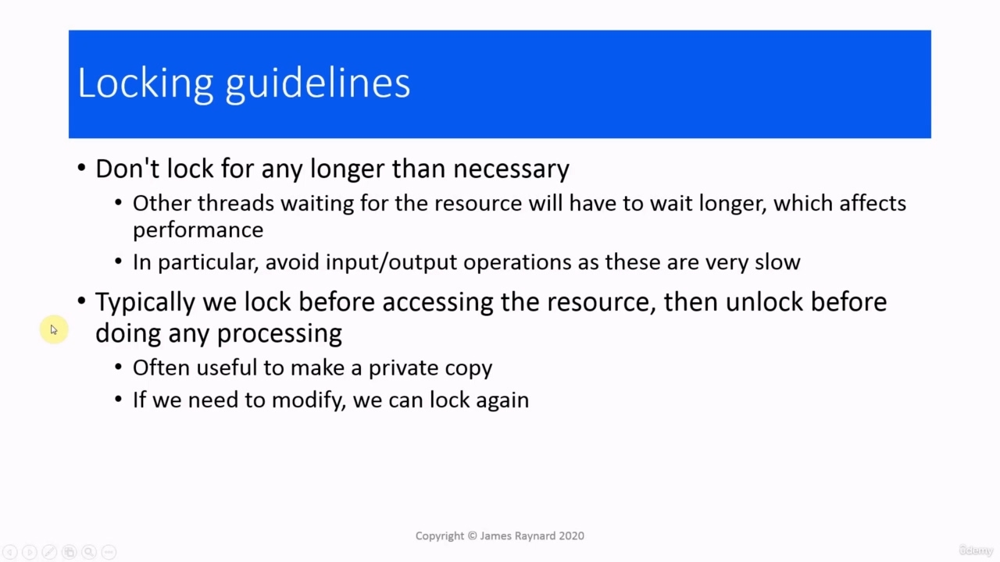
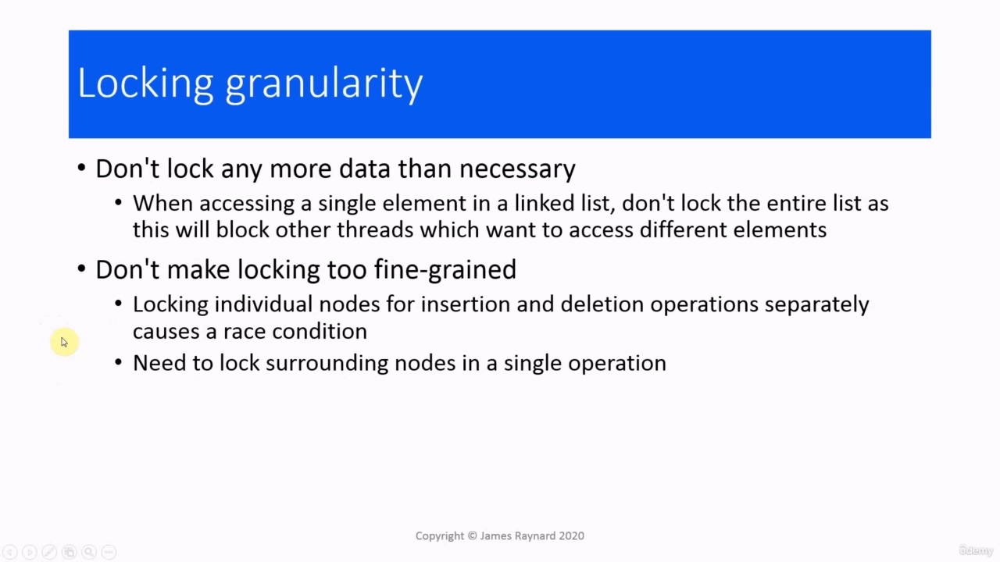
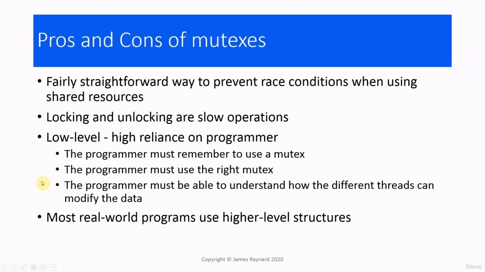
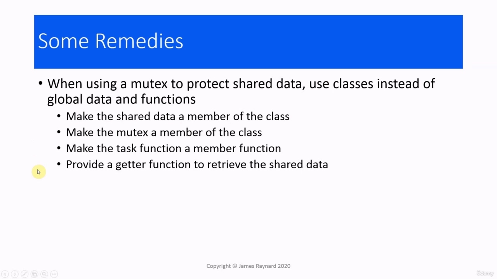

Hello again. In this video, we are going to make some final remarks about mutexes before we finish Hello again. In this video, we are going to make some final remarks about mutexes before we finish off this section and go on to the next part of the course. These are mainly tips on how to use

> 再次问候。在本视频中，我们将在再次完成 Hello 之前对互斥体做一些最后的评论。在本视频中，我们将在结束本节并进入课程的下一部分之前，对互斥锁做一些最后的评论。以下是有关如何使用

## img - 13530

These are mainly tips on how to use mutexes effectively. The first tip is, do not look a mutex for any longer than you need to. If you are using a mutex to protect a shared resource, when a thread has a lock on that mutex every other thread that needs to access the resource will have to stop and wait, which means all those threads are going to take longer to execute. And the program as a whole is going to take longer to execute. If we lock for longer than we need to, for example, in the lock guard example where we kept a lock while we were sleeping, then that is going to slow down the program. We should also avoid doing input/output operations while holding a lock, as these are very slow. And yes, I know that we did do input/output while holding a lock, but those were just to demonstrate things. You would not write those in a real program. The typical pattern for using a mutex with a resource is that we lock the mutex just before we access the resource and unlock it immediately afterwards, before we do any processing. For example, if we are reading data from a file, we lock the mutex, read the data, then we unlock the mutex and then we start processing the data that we just read. If we need to access the file later on, if we need to save something to it, for example, then we would lock it again. So by doing that, we give other threads, more opportunities to run.

> 这些主要是关于如何有效使用互斥锁的提示。第一个提示是，不要在需要的时间内查看互斥锁。如果您使用互斥锁来保护共享资源，那么当一个线程锁定了互斥锁时，其他需要访问该资源的线程都必须停止并等待，这意味着所有这些线程都需要更长的时间才能执行。整个程序将需要更长的时间来执行。如果我们锁的时间超过了我们需要的时间，例如，在锁保护示例中，我们在睡觉时锁着一把锁，那么这会减慢程序的速度。我们还应该避免在持有锁时执行输入/输出操作，因为这些操作非常慢。是的，我知道我们确实在持有锁的情况下进行输入/输出，但这些只是为了演示。你不会在真正的程序中写这些。对资源使用互斥锁的典型模式是，我们在访问资源之前锁定互斥锁，然后在执行任何处理之前立即解锁互斥锁。例如，如果我们从文件中读取数据，我们锁定互斥锁，读取数据，然后解锁互斥锁，然后开始处理刚刚读取的数据。例如，如果我们稍后需要访问该文件，如果我们需要将某些内容保存到其中，那么我们将再次锁定该文件。因此，通过这样做，我们给了其他线程更多的运行机会。

## img - 154190

When working with shared data, it is often useful to make our own private copy of the data and then we can do the processing on that private copy without a lock. And again, if we needed to update the shared version of the data, then we just acquire another lock on it.

> 在处理共享数据时，制作数据的私有副本通常很有用，然后我们可以在没有锁的情况下对该私有副本进行处理。同样，如果我们需要更新数据的共享版本，那么我们只需要获取另一个锁。

## img - 214870

When we have complex data structures or compound variables, how many of the elements do we lock? And the answer, which I hope should be common sense, is that we do not look any more elements than we need to. As an example, if you are writing a linked list implementation, it is not a good idea to have a single lock which covers every access to the list. For example, if you want to access the first element, then you have to put a lock on it, which excludes every other thread. Even if you have a thread which wants to access a completely unrelated element, that thread would be locked out. So it is better to have locks which are specific to a particular element or group of elements. On the other hand, if you have one lock per element, then that can be too fine-grained.

> 当我们有复杂的数据结构或复合变量时，我们锁定了多少元素？答案（我希望这应该是常识）是，我们不需要查看更多的元素。例如，如果您正在编写一个链接列表实现，那么使用一个锁来覆盖对列表的每个访问不是一个好主意。例如，如果你想访问第一个元素，那么你必须在它上加一个锁，这将排除所有其他线程。即使您有一个线程想要访问完全无关的元素，该线程也会被锁定。因此，最好具有特定于特定元素或元素组的锁。另一方面，如果每个元素有一个锁，那么这可能太细粒度了。

## img - 259350

On the other hand, if you have one lock per element, then that can be too fine-grained. If you consider removing a node from a linked list, that will affect the nodes before and after that node because their pointers need to be updated. If you just have a lock which applies only to that node, then there is a race condition, because other threads could interrupt and modify those surrounding nodes. So in that case, you would need to have a lock, which also covers the surrounding nodes and it needs to acquire those locks in a single operation. In fact, writing a thread-safe linked list is surprisingly difficult. And certainly not something we are going to cover in this course.

> 另一方面，如果每个元素有一个锁，那么这可能太细粒度了。如果考虑从链接列表中删除节点，则会影响该节点之前和之后的节点，因为它们的指针需要更新。如果您只有一个仅应用于该节点的锁，则存在竞争条件，因为其他线程可能会中断并修改这些周围的节点。因此，在这种情况下，您需要有一个锁，它还覆盖了周围的节点，并且需要在单个操作中获取这些锁。事实上，编写一个线程安全链接列表非常困难。当然，我们不会在本课程中讨论这些内容。

## img - 344800

So what are the advantages and disadvantages of mutexes? Well, mutexes allow us to prevent race conditions when we are using shared resources and they are fairly straightforward, provided you take a little care. Locking and unlocking mutexes are very slow operations because they require help from the operating system. Mutexes are rather a low level concept. They place a lot of reliance on the programmer to remember to use a mutex. The programmer must remember to use the right mutex. If we have our linked list, we have different mutexes for different groups of elements. And it is quite easy to go wrong. And the programmer must be able to understand how all these different mutexes work and how different

> 那么互斥锁的优点和缺点是什么？嗯，互斥锁允许我们在使用共享资源时防止竞争条件，只要您稍微小心，互斥锁非常简单。锁定和解锁互斥锁是非常缓慢的操作，因为它们需要操作系统的帮助。互斥是一个相当低级的概念。他们非常依赖程序员记住使用互斥锁。程序员必须记住使用正确的互斥锁。如果我们有链接列表，那么对于不同的元素组，我们有不同的互斥锁。而且很容易出错。程序员必须能够理解所有这些不同的互斥锁是如何工作的

## img - 427500

And the programmer must be able to understand how all these different mutexes work and how different threads can modify the data. And that takes quite a lot of mental bandwidth. For that reason, most real world programs do not use mutexes directly; they use higher level structures.

> 程序员必须能够理解所有这些不同的互斥锁是如何工作的，以及不同的线程如何修改数据。这需要相当多的脑力。出于这个原因，大多数真实世界的程序不直接使用互斥锁；它们使用更高级别的结构。

## img - 449780

And finally, to avoid some of the problems with using mutexes with shared data or resources, do not use global data and global functions, use classes. You would make the shared data or the handle to the shared resource a member of the class. You would also make the mutex a member of the class. You make the task function, a member function. And then you provide a getter function, so it is possible to retrieve the shared data even when there are not any threads running.

> 最后，为了避免在共享数据或资源中使用互斥锁时出现一些问题，不要使用全局数据和全局函数，请使用类。您将使共享数据或共享资源的句柄成为类的成员。您还可以使互斥对象成为类的成员。您使任务函数成为成员函数。然后您提供了一个 getter 函数，因此即使没有任何线程在运行，也可以检索共享数据。
