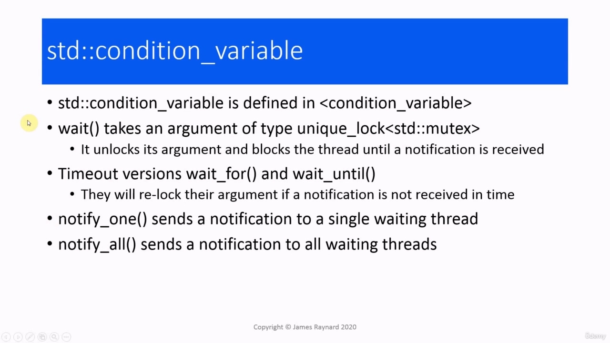

Hello again. In this video, we are going to look at condition variables. A common problem that occurs in many

> 再次问候。在本视频中，我们将查看条件变量。常见的问题

## img - 7980

In this video, we are going to look at condition variables. A common problem that occurs in many workplaces, even including software development. You are ready to start work, but you cannot actually do anything yet because you need something from someone else. They need to finish what they are doing or they need to do something or some kind of event needs to occur. A common solution to this is to have someone such as a foreman or a supervisor who can coordinate the different workers. So, for example, if we have person A who is doing some work and person B is waiting for something

> 在本视频中，我们将查看条件变量。这是一个常见的问题，在许多工作场所都会出现，甚至包括软件开发。你已经准备好开始工作了，但实际上你还不能做任何事情，因为你需要别人的帮助。他们需要完成他们正在做的事情，或者他们需要做一些事情，或者需要发生某种事件。解决这个问题的一个常见方法是找一个领班或主管之类的人来协调不同的工人。因此，例如，如果我们有人 A 在做一些工作，而人 B 在等待什么

## img - 42790

So, for example, if we have person A who is doing some work and person B is waiting for something from person A. Then person A finishes their work and then they communicate with the foreman to say that they have finished what is needed. Then the foreman will signal to person B and then person B can start doing their work.

> 因此，例如，如果我们有人 A 正在做一些工作，而人 B 正在等待人 A 的东西。然后人 A 完成了他们的工作，然后他们与领班沟通，说他们已经完成了所需的工作。然后领班将向 B 人员发出信号，然后 B 人员可以开始工作。

## img - 110950

And we often get this situation in threaded programs as well, a thread has to wait for another thread to return some data or to do something or for an event to occur before the first thread can proceed. If we consider we have a program which is fetching some data over the network.

> 我们经常在线程程序中遇到这种情况，一个线程必须等待另一个线程返回一些数据或执行某些操作或事件发生，然后第一个线程才能继续。如果我们考虑我们有一个程序，它通过网络获取一些数据。

## img - 124160

If we consider we have a program which is fetching some data over the network. This could start up some threads. It could start up one thread, which actually fetches the data. Another thread which displays a progress bar. This thread will monitor the data as it comes in. And from time to time, it will update itself. And then another threat which will process the data. When all the data has been received, the thread that is fetching the data will terminate. The thread with the progress bar will also terminate. And then the thread which is going to process this data, will be able to run. So you might want to pause the video for a moment and think about how you might implement this.

> 如果我们考虑我们有一个程序，它通过网络获取一些数据。这可能会启动一些线程。它可以启动一个线程，实际获取数据。另一个显示进度条的线程。这个线程将在数据传入时监视数据。它会不时地更新自己。然后是处理数据的另一个威胁。当接收到所有数据后，获取数据的线程将终止。带有进度条的线程也将终止。然后将处理这些数据的线程将能够运行。因此，您可能需要暂停视频片刻，并思考如何实现这一点。

## img - 203940

So you might want to pause the video for a moment and think about how you might implement this.

> 因此，您可能需要暂停视频片刻，并思考如何实现这一点。

## img - 214570

Well, one solution is to use a boolean variable, which will be shared and can be seen by all the threads. This will be set to true when all the data has been fetched and before that, it will be false. So the fetching thread will set this to true when it finishes. And the other threads will check this flag so they can tell with the data has been fetched or not. Obviously, this will need to be protected by a mutex to avoid a data race, because we can have multiple threads which are accessing this variable and the possibility of modification. So we would do this by having loops in the progress bar thread and the processing thread. These will check the variable and when the variable becomes true, these loops will terminate. And the progress bar thread will exit and the processing thread will start doing its processing. This will work and it is thread-safe, but it is not very efficient. These loops in the waiting threads are going to spin around using up lots of CPU cycles. And also, while these threads are checking the flag, they will have a lock on the mutex and that will prevent the fetching thread from setting the flag. The loops do not have to run flat out. We could put a sleep in them, so we only check every hundred milliseconds, half a a second, a second, but then you have to decide what is the optimal time to wait. There is a nicer solution which is supported by C++, and that's something called a condition variable.

> 好吧，一个解决方案是使用布尔变量，它将被共享，并且可以被所有线程看到。当提取完所有数据后，该值将设置为 true，在此之前，该值为 false。因此，提取线程将在完成时将其设置为 true。其他线程将检查此标志，以便它们可以判断数据是否已获取。显然，这将需要通过互斥锁来保护，以避免数据竞争，因为我们可以有多个线程访问这个变量，并有可能进行修改。因此，我们可以通过在进度条线程和处理线程中设置循环来实现这一点。这些将检查变量，当变量变为真时，这些循环将终止。进度条线程将退出，处理线程将开始执行其处理。这会起作用，而且是线程安全的，但效率不是很高。等待线程中的这些循环将循环使用大量 CPU 周期。此外，当这些线程检查标志时，它们将锁定互斥锁，这将阻止获取线程设置标志。循环不必完全耗尽。我们可以让他们睡觉，所以我们只检查每 100 毫秒，半秒，一秒，但然后你必须决定什么是最佳等待时间。C++支持一个更好的解决方案，这就是所谓的条件变量。

## img - 355990

When we have two or more threads which have critical sections which are protected by a mutex, a condition variable will use the mutex to coordinate the threads. In our example, the processing thread would tell the condition variable that it is waiting. And then it goes to sleep. The fetching thread would send a notification to the condition variable that it has finished, and then the condition variable will wake up the processing thread, which can then run and do its processing. So it would look something like this. We have the processing thread, which sends a "wait" message to the condition variable and then goes to sleep.

> 当我们有两个或多个线程具有受互斥锁保护的关键部分时，条件变量将使用互斥锁来协调线程。在我们的示例中，处理线程将告诉条件变量它正在等待。然后它就睡着了。提取线程将向条件变量发送一个已完成的通知，然后条件变量将唤醒处理线程，然后该线程可以运行并执行其处理。所以它看起来像这样。我们有一个处理线程，它向条件变量发送“等待”消息，然后进入睡眠状态。

## img - 431690

We have the processing thread, which sends a "wait" message to the condition variable and then goes to sleep. When the fetching thread finishes, it will send a "notify" message to the condition variable and then the condition variable will send a "wake up!" message to the processing thread. The processing thread creates a unique lock instance to lock the mutex. It then calls wait() on the condition

> 我们有一个处理线程，它向条件变量发送“等待”消息，然后进入睡眠状态。当提取线程完成时，它将向条件变量发送“通知”消息，然后条件变量将向处理线程发送“唤醒！”消息。处理线程创建一个唯一的锁实例来锁定互斥锁。然后对条件调用 wait（）

## img - 454040

The processing thread creates a unique lock instance to lock the mutex. It then calls wait() on the condition variable. The condition variable releases the lock and it will block the thread. So that is why we have to use a unique lock instance, because the condition variable needs to be able to call unlock(). The fetching thread creates a lock guard instance. We do not require anything more complicated. And that will give it a lock on the mutex. Then it fetches the data, it releases the lock and it notifies the condition variable. And then when the condition variable is notified, it will wake up the processing thread. The processing thread will get a lock on the mutex, It will resume execution and it will process the data. The way that the locks work means that the critical section is always protected. The critical section in the processing thread is locked until it sleeps. Then it is locked again when it wakes up and the critical section in the fetching thread is locked all the time it needs to be. So it may take a while to actually grasp how this all works, but it does work.

> 处理线程创建一个唯一的锁实例来锁定互斥锁。然后，它对条件变量调用 wait（）。条件变量释放锁，它将阻塞线程。这就是为什么我们必须使用唯一的锁实例，因为条件变量需要能够调用 unlock（）。获取线程创建一个锁保护实例。我们不需要更复杂的东西。这将给它一个互斥锁。然后它获取数据，释放锁并通知条件变量。然后，当条件变量被通知时，它将唤醒处理线程。处理线程将获得互斥锁，它将继续执行并处理数据。锁的工作方式意味着关键部分始终受到保护。处理线程中的关键部分被锁定，直到它休眠。然后，当它醒来时，它会再次被锁定，并且提取线程中的关键部分会一直被锁定。因此，可能需要一段时间才能真正了解这一切是如何工作的，但它确实工作了。

## img - 604490

So let's look at the C++ conditional variable. It is defined in the header, there is

> 我们来看一下 C++条件变量。它在标题中定义，有

## img - 604490

So let's look at the C++ conditional variable. It is defined in the header, there is a wait() function which takes an argument, which must be a unique lock on a standard mutex. This will unlock the argument and block the thread until the condition variable gets a notification. And there are also versions with time outs, wait_for() and wait_until(). If the notification is not received in time, then the mutex will be relocked. So you could run that in a loop. So these functions would be called by the processing thread. Then there are two functions which would be called by the fetching thread to send the notification. There is notify_one() which will send a notification to a single waiting thread. The thread which gets the notification is chosen by the system. You cannot decide which one it is going to be. And there is also notify_all() which will send a notification to every thread that is waiting on that condition Let's have an example of this. We are going to have something very similar, a reading thread

> 我们来看一下 C++条件变量。它在头中定义，有一个 wait（）函数接受一个参数，该参数必须是标准互斥锁上的唯一锁。这将解锁参数并阻塞线程，直到条件变量收到通知。还有超时的版本，wait_fr（）和 wait_until（）。如果未及时收到通知，则互斥锁将被重新锁定。所以你可以循环运行。因此，这些函数将由处理线程调用。然后有两个函数将由获取线程调用以发送通知。有 notify_one（）将向单个等待线程发送通知。获得通知的线程由系统选择。你无法决定它将是哪一个。还有 notify_all（），它将向等待该条件的每个线程发送通知。让我们举个例子。我们将有一个非常类似的东西，一个阅读线程

## img - 710140

Let's have an example of this. We are going to have something very similar, a reading thread and a writing thread. The writing thread is going to modify a shared string and the reading thread is going to stop and wait until the string has been modified. And then once the string is modified, the reader will start up again and it will have access to the new value of the shared string. We are going to use a condition variable to coordinate these two threads and we are also going to use a mutex to protect the shared data. So this is the code that's going to implement this.

> 让我们举个例子。我们将有非常相似的东西，一个阅读线程和一个写作线程。写入线程将修改共享字符串，而读取线程将停止并等待该字符串被修改。然后，一旦字符串被修改，读取器将再次启动，它将可以访问共享字符串的新值。我们将使用一个条件变量来协调这两个线程，我们还将使用互斥锁来保护共享数据。这就是要实现这一点的代码。

## img - 743310

So this is the code that's going to implement this. We have got the condition variable as a global. We have got the mutex, which is going to protect the critical sections and this is the shared data that is going to be modified. This is the reader thread, the one that is going to wait for the data to be modified. We create a unique look on the mutex. Then we call wait() on the condition variable. We pass the unique lock at its argument. So that is going to cause the thread to go to sleep. It will unlock the mutex and then the thread will sleep. In the modifying thread, we lock the mutex ourselves. Then we modify the data. So this is our critical section. We put the lock guard in its own scope so that the lock will be released. And then we notify the condition So that is going to send a signal to the condition variable, saying that the data has been modified. And then below that, we have a thread which will start up a thread.

> 这就是要实现这一点的代码。我们将条件变量作为全局变量。我们得到了互斥锁，它将保护关键部分，这是要修改的共享数据。这是读取器线程，它将等待修改数据。我们在互斥体上创建了一个独特的外观。然后我们对条件变量调用 wait（）。我们在其参数处传递唯一锁。所以这将导致线程进入睡眠状态。它将解锁互斥锁，然后线程将休眠。在修改线程中，我们自己锁定互斥锁。然后我们修改数据。这是我们的关键部分。我们把锁罩放在它自己的范围内，这样锁就会松开。然后我们通知条件，这将向条件变量发送一个信号，表示数据已被修改。然后在下面，我们有一个线程，它将启动一个线程。

## img - 850540

And then below that, we have a thread which will start up a thread. It also prints out the initial value of the data, just so we can see what is going on. So there we are.

> 然后在下面，我们有一个线程，它将启动一个线程。它还打印出数据的初始值，这样我们就可以看到发生了什么。

## img - 907770

So we started off by printing out the initial value of the data in main(). Then the writer thread ran, so that

> 因此，我们首先在 main（）中打印数据的初始值。然后编写器线程运行，这样

## img - 907770

So we started off by printing out the initial value of the data in main(). Then the writer thread ran, so that modified the data. When it had modified it, it sent a notification. And then that woke up the reader thread, which printed out the value of the data.

> 因此，我们首先在 main（）中打印数据的初始值。然后，编写器线程运行，从而修改了数据。当它修改它时，它发送了一个通知。然后唤醒了读取器线程，它打印出数据的值。
