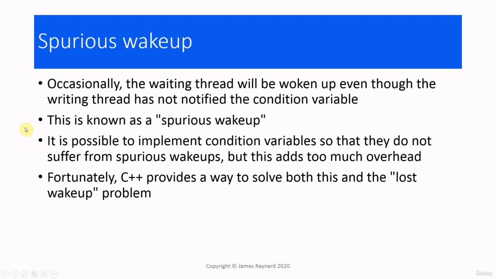

Hello again. In this video, we are going to look at using condition variables with a predicate.

> 再次问候。在本视频中，我们将讨论使用条件变量和谓词。

## img - 5190

In this video, we are going to look at using condition variables with a predicate. In fact, there is a rather serious problem with the code that I showed you in the last video. You may

> 在本视频中，我们将讨论使用条件变量和谓词。事实上，我在上一段视频中向您展示的代码有一个相当严重的问题。你可以

## img - 15600

In fact, there is a rather serious problem with the code that I showed you in the last video. You may have noticed that I started the write thread before the reader thread. It would have made more sense in the discussion to start the reader thread first. In fact, I was using some code that was meant to demonstrate the problem that I am talking about.

> 事实上，我在上一段视频中向您展示的代码有一个相当严重的问题。您可能已经注意到，我在读线程之前启动了写线程。在讨论中，首先启动读者线程会更有意义。事实上，我使用了一些代码来演示我所讨论的问题。

## img - 39800

So let's go ahead and do that now, actually. So I am going to put a sleep in here to make sure that

> 所以，让我们现在就开始吧。所以我要在这里睡一觉，以确保

## img - 39800

So let's go ahead and do that now, actually. So I am going to put a sleep in here to make sure that the writer thread completes before the reading thread starts up. And let's change that to one second just to make sure that it does finish. And then when we run this...

> 所以，让我们现在就开始吧。所以我将在这里进行睡眠，以确保写入线程在读取线程启动之前完成。让我们将其更改为一秒钟，以确保它完成。然后当我们运行这个。。。

## img - 51380

And then when we run this... So we're waiting... Still waiting...

> 然后当我们运行这个。。。所以我们在等待。。。仍在等待。。。

## img - 58900

So we're waiting... Still waiting... We are going to wait forever, in fact. (Let's get out of that) So what is happening? So the writer thread, it runs first. It sends the notification to the condition variable. Then the writer thread will exit. Then the reader thread will run. It will call wait. And the problem is that this call will block indefinitely until the condition variable receives the notification, but the notification has already been received.

> 所以我们在等待。。。仍在等待。。。事实上，我们将永远等待。（让我们离开）那么发生了什么？因此，编写器线程首先运行。它将通知发送到条件变量。然后写入线程将退出。然后读取器线程将运行。它将调用等待。问题是，这个调用将无限期地阻塞，直到条件变量收到通知，但通知已经收到。

## img - 131280

notification, but the notification has already been received. So this waits for ever.

> 通知，但通知已收到。所以这是永远的等待。

## img - 141880

So this is the problem. wait() will block until the notification is received. If the writing thread sends the notification before the reading thread calls wait(), then the reader will block further. The "wake up!" has been lost. So, in fact, this is a race condition. There is also a very obscure problem, so there are actually two problems with the code.

> 这就是问题所在。wait（）将阻止，直到收到通知。如果写线程在读线程调用 wait（）之前发送通知，那么读取器将进一步阻塞。“醒醒！”已丢失。所以，事实上，这是一个种族条件。还有一个非常模糊的问题，所以代码实际上有两个问题。

## img - 157860

There is also a very obscure problem, so there are actually two problems with the code. It is possible for the waiting thread to be woken up, for the wait() call to return, even though the writing thread has not actually notified the condition variable. And this is known as a spurious wake up.

> 还有一个非常模糊的问题，所以代码实际上有两个问题。等待线程可能被唤醒，等待（）调用返回，即使写入线程实际上没有通知条件变量。这就是所谓的虚假唤醒。

## img - 223490

This is actually due to a race condition in the condition variable itself. So it is not just application programmers who have problems with data races! It is actually possible to implement the condition variable in such a way that it does not suffer from spurious wakeups, but that would involve too much overhead. Fortunately, there is a solution that C++ provides for this. And even better, it also solves the problem with the lost wakeup.

> 这实际上是由于条件变量本身中的竞争条件。因此，不仅仅是应用程序程序员在数据竞赛方面存在问题！实际上，可以以这样一种方式实现条件变量，即它不会受到虚假唤醒的影响，但这将涉及太多的开销。幸运的是，C++提供了一种解决方案。更妙的是，它还解决了失去唤醒的问题。

## img - 255360

The solution is that wait() will take a second argument, which is some kind of callable argument, it is a predicate function. The typical scenario is that this predicate function will check the value of a shared boolean. Initially this bool has the value false and then when the writing thread modifies the data, it sets it to true. The waiting thread will check this bool by calling this predicate, and it will only continue executing if the predicate returns true. So to use this, you need to first add a shared boolean flag to the code and then in the wait() call,

> 解决方案是 wait（）将接受第二个参数，这是一种可调用的参数，它是一个谓词函数。典型的情况是，这个谓词函数将检查共享布尔值。最初，此布尔值为 false，然后当写入线程修改数据时，将其设置为 true。等待线程将通过调用这个谓词来检查这个 bool，并且只有当谓词返回 true 时，它才会继续执行。所以要使用这个，首先需要向代码中添加一个共享布尔标志，然后在 wait（）调用中，

## img - 336230

So to use this, you need to first add a shared boolean flag to the code and then in the wait() call, we need to provide a callable object, which is going to check this flag. So here we have got our wait() call on the unique lock. And then as the second argument, we have the predicate function. And lambda functions are ideal for this.

> 所以要使用这个，首先需要向代码中添加一个共享的布尔标志，然后在 wait（）调用中，我们需要提供一个可调用对象，它将检查这个标志。所以这里我们得到了对唯一锁的 wait（）调用。然后作为第二个参数，我们有谓词函数。lambda 函数是这方面的理想选择。

## img - 403450

So here is some code that will do this. I have adapted the previous code to use the predicate. Here is the boolean flag with the initial value false.

> 所以这里有一些代码可以做到这一点。我已经修改了前面的代码以使用谓词。这里是初始值为 false 的布尔标志。

## img - 415970

Here is the call to wait() with the predicate as the second argument, which just checks the value of that flag. I have also added a print statement so we can see when the threads actually run. And then in the writing thread, we set the condition to true. Notice that we do this when the mutex is locked, so this will prevent a race condition on the boolean. As far as the reader is concerned, the mutex will be temporarily locked while this is checked. So there is no possibility of a data race. And the rest of the program is the same, I think... Yes. I have put in a sleep and...

> 这里是对 wait（）的调用，谓词作为第二个参数，它只检查该标志的值。我还添加了一个 print 语句，以便我们可以看到线程实际运行的时间。然后在编写线程中，我们将条件设置为 true。注意，当互斥锁被锁定时，我们会这样做，所以这将防止布尔值上的竞争条件。就读取器而言，在检查此项时，互斥锁将被暂时锁定。因此，不存在数据竞赛的可能性。其余的节目都是一样的，我想。。。对我已经睡着了。。。

## img - 457050

Okay, so let's try this. So there we are, we can see that the writing thread finishes before the reading thread starts, but

> 好吧，让我们试试这个。因此，我们可以看到写入线程在读取线程开始之前完成，但是

## img - 504970

So there we are, we can see that the writing thread finishes before the reading thread starts, but the reading thread is able to return from the call to wait() and access the modified value of the shared data. So how does this prevent the lost wakeup scenario? When the wait() function is called by the reader,

> 因此，我们可以看到写入线程在读取线程开始之前完成，但是读取线程能够从 wait（）调用返回并访问共享数据的修改值。那么，这是如何防止丢失唤醒场景的呢？当读取器调用 wait（）函数时，

## img - 524040

So how does this prevent the lost wakeup scenario? When the wait() function is called by the reader, the wait() function will call the predicate internally. At that point, the mutex is still locked. If the predicate returns true, this means that the writing thread has already set the condition to true. So that means it must have already sent a notification. And in that case, the thread will resume execution with the mutex still locked, and it will carry on and do something with the shared data. If the predicate function returns false, that means the writer has not yet sent a notification. And then we have the normal scenario. So we release the lock and wait for a notification to be sent by the condition variable.

> 那么，这是如何防止丢失唤醒场景的呢？当读取器调用 wait（）函数时，wait（函数将在内部调用谓词。此时，互斥锁仍被锁定。如果谓词返回 true，这意味着编写线程已经将条件设置为 true。这意味着它必须已经发送了通知。在这种情况下，线程将在互斥锁仍然锁定的情况下继续执行，并继续对共享数据执行某些操作。如果谓词函数返回 false，则表示编写器尚未发送通知。然后我们有一个正常的场景。因此，我们释放锁并等待条件变量发送通知。

## img - 616940

For avoiding spurious wakeup. Remember, this is when the condition variable notifies the waiting thread. Even though the writing thread hasn't sent a notification. So when the waiting thread gets the notification, it will acquire a lock on the mutex. If the predicate returns true, then we know that the writing thread must have sent a notification because it has set the condition variable, which is all part of the same code. And in that case, it is safe to resume execution and we are still executing under the lock. If the predicate returns false, that means the writing threat has not set the boolean, so it cannot have sent a notification. So this is a false wake up. In that case, we release the lock and continue waiting. So you can see that this completely solves the problem with lost wakeups and spurious wake ups. So we should always use a predicate function when we are using a condition variable. So always add a second argument to wait(). And finally, the real value from condition variables is when you have multiple threads waiting for

> 用于避免虚假唤醒。记住，这是条件变量通知等待线程的时候。即使编写线程没有发送通知。因此，当等待线程收到通知时，它将获取互斥锁的锁。如果谓词返回 true，那么我们知道编写线程必须发送了通知，因为它设置了条件变量，这是同一代码的一部分。在这种情况下，恢复执行是安全的，我们仍然在锁下执行。如果谓词返回 false，则表示写入威胁未设置布尔值，因此无法发送通知。所以这是一次错误的觉醒。在这种情况下，我们释放锁并继续等待。所以你可以看到，这完全解决了丢失唤醒和虚假唤醒的问题。因此，当我们使用条件变量时，我们应该始终使用谓词函数。因此，始终向 wait（）添加第二个参数。最后，当您有多个线程等待

## img - 722090

And finally, the real value from condition variables is when you have multiple threads waiting for the same event. As we said, there are two different member functions that can be called by the writing They can call notify underscore all which will cause all the threads which are waiting on that condition variable to be woken up. The threads can wake up in any order, and this will cause all the reader threads to start processing their data. Alternatively, we can call notify underscore one. And in this case, only one of the threads which is waiting on that condition variable will be woken up. And it could be any one of the waiting threads. The other threads which have called wait() will remain blocked until they eventually get their wake up call. And then once one thread has been notified, it cannot be notified again by the same condition variable. So we get a different thread processing the data each time. In this version, I am going to start up three reading threads.

> 最后，当您有多个线程等待同一事件时，条件变量的实际值。正如我们所说的，有两个不同的成员函数可以通过编写来调用。它们可以调用 notify 下划线 all，这将导致所有等待该条件变量的线程被唤醒。线程可以按任何顺序唤醒，这将导致所有读取器线程开始处理其数据。或者，我们可以调用 notify 下划线一。在这种情况下，只有一个等待该条件变量的线程将被唤醒。它可以是任何一个等待线程。调用 wait（）的其他线程将保持阻塞状态，直到它们最终得到唤醒调用。然后，一旦一个线程被通知，它就不能再被同一个条件变量通知。所以我们每次都会得到一个不同的线程来处理数据。在这个版本中，我将启动三个阅读线程。

## img - 819710

In this version, I am going to start up three reading threads. Each reading threat is going to print out its ID so we can see what is happening. The rest of the code is the same. In the modifying thread, we were originally calling notify_one, so let's call that first and then see what happens.

> 在这个版本中，我将启动三个阅读线程。每个阅读威胁都会打印出它的 ID，这样我们就能看到发生了什么。其余代码相同。在修改线程中，我们最初调用的是 notify_one，所以让我们先调用它，然后看看会发生什么。

## img - 842050

In the modifying thread, we were originally calling notify_one, so let's call that first and then see what happens. OK, so all of the three reading threads have started running. Then the data has been written, but only

> 在修改线程中，我们最初调用的是 notify_one，所以让我们先调用它，然后看看会发生什么。好的，所有三个读取线程都已开始运行。然后数据已写入，但仅

## img - 855670

OK, so all of the three reading threads have started running. Then the data has been written, but only one of the reading threads has actually been woken up and is processing the data. The other two are still waiting. And because we are only sending the notification once, the other two threads will not get a notification. So they're going to wait forever. So I will have to interrupt that. Now I am going to call notify_one() three times, once for each thread. So we should expect to see all the threads getting data and yes, there we are.

> 好的，所有三个读取线程都已开始运行。然后数据被写入，但实际上只有一个读取线程被唤醒并正在处理数据。其他两人仍在等待。因为我们只发送一次通知，所以其他两个线程不会收到通知。所以他们将永远等待。所以我不得不打断一下。现在我将调用 notify_one（）三次，每个线程一次。因此，我们应该期待看到所有线程都在获取数据，是的，就是这样。

## img - 923690

So we should expect to see all the threads getting data and yes, there we are.

> 因此，我们应该期待看到所有线程都在获取数据，是的，就是这样。

## img - 927960

And the three threads have been able to get their data. And then finally, I am going to call notify_all().

> 这三个线程已经能够获取它们的数据。最后，我将调用 notify_all（）。

## img - 935210

And then finally, I am going to call notify_all().

> 最后，我将调用 notify_all（）。
