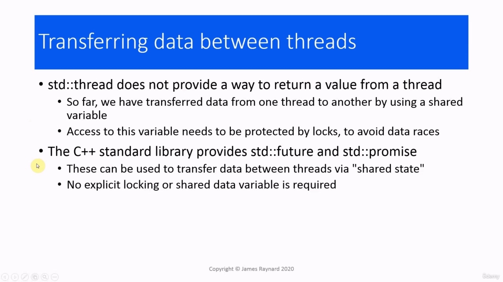
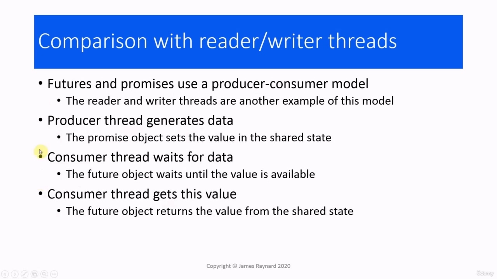
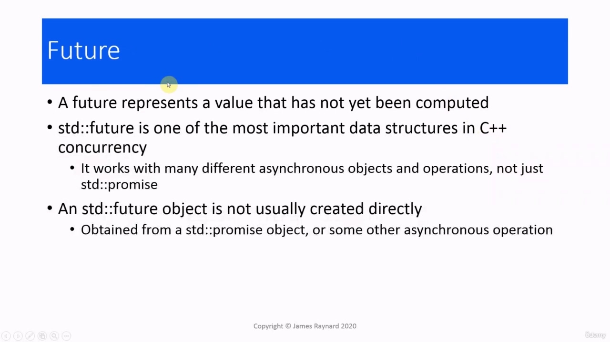
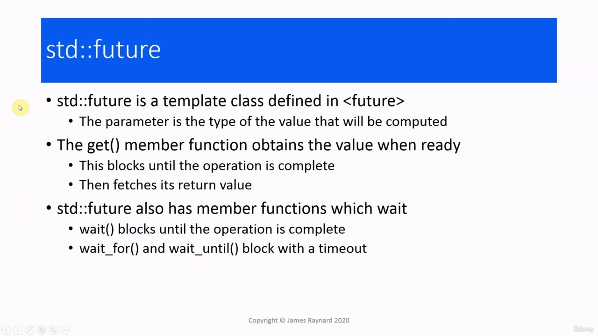
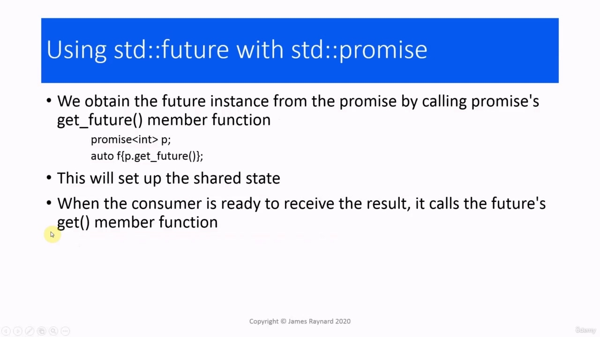

Hello there! In this video, we are going to talk about futures. Hello there! In this video, we are going to talk about futures.

> 你好！在这个视频中，我们将谈论 future。你好！在这个视频中，我们将谈论 future。

## img - 12870

One of the drawbacks of the C++ thread is that it does not provide any direct way to return a value. We have been using shared variables to transfer data from one thread to another. However, this raises the issue of data races. So we had to use locks to protect access to this variable. In this section, we are moving away from threads towards higher level objects. We have already looked at the condition variables which help us synchronize different threads. And now we are going to look at the future and promise classes which help us transfer data between threads. We can set up a shared state between a future object and a promise object, and this can be used to

> C++线程的缺点之一是它不提供任何直接返回值的方法。我们一直在使用共享变量将数据从一个线程传输到另一个线程。然而，这引发了数据竞赛的问题。所以我们必须使用锁来保护对这个变量的访问。
> 在本节中，我们将从线程转向更高级别的对象。我们已经研究了帮助我们**同步不同线程的条件变量**。现在，我们将着眼于 future，并 promise 帮助我们在线程之间传输数据的类。我们可以在 future 对象和 promise 对象之间设置共享状态，这可以用于

## img - 55750

We can set up a shared state between a future object and a promise object, and this can be used to transfer data in a thread-safe way. We do not need to provide any shared data variables or any explicit locking. Obviously, there will be something like that happening in the background, but we do not need to know about it. We can just concentrate on what our program does.

> 我们可以在 future 对象和 promise 对象之间设置共享状态，这可以用于以线程安全的方式传输数据。我们不需要提供任何共享数据变量或任何显式锁定。显然，在后台会有类似的事情发生，但我们不需要知道。我们可以专注于我们的程序做什么。

## img - 121570

In the last couple of videos, we were using read and write threads. These are an example of what is known as the producer-consumer model. You have a thread called the producer, which generates some data or calculates a result and another thread, which is the consumer, which is going to use that data. We have a promise object in the producer thread, which will set the value in the shared state, so that is similar to the writer thread which updated the value of a shared variable. We have a consumer thread which is waiting for that data. The future object is waiting for the shared state to be updated. So that is similar to calling wait() in the reader thread. And then when the shared state is updated, the future object will return the value. So that is equivalent to the reader thread returning from wait() and being able to access the shared variable.

> 在最后几段视频中，我们使用了读写线程。这些就是所谓的生产者-消费者模型的一个例子。您有一个名为生产者的线程，它生成一些数据或计算结果，另一个线程是消费者，它将使用这些数据。我们在生产者线程中有一个 promise 对象，它将设置共享状态中的值，这与更新共享变量值的编写器线程类似。我们有一个消费者线程正在等待该数据。future 对象正在等待更新共享状态。因此，这类似于在读取器线程中调用 wait（）。然后，当共享状态更新时，future 对象将返回该值。因此，这相当于读取器线程从 wait（）返回并能够访问共享变量。

## img - 224820

In computing, a "future" represents a value which has not been computed yet. In C++ concurrency, the future class is one of the most important data structures. It is not only used with the promise, it is also used in lots of asynchronous operations. We do not normally create it directly. When we have a promise and a future, we create the promise first and that will give us a future which is associated with it. There are also other asynchronous operations which will return a future, so these operations will go and run in the background and then when they finish, the future will hold the result. The future class is defined in the header. It is templated. The parameter is the type of the

> 在计算中，“future”表示尚未计算的值。在 C++并发中，future 类是最重要的数据结构之一。它不仅用于 promise，还用于许多异步操作。我们通常不会直接创建它。当我们有一个 promise 和一个 future 时，我们首先创建 promise，这将给我们一个与之相关的 future。还有其他异步操作将返回一个 future，因此这些操作将在后台运行，然后当它们完成时，future 将保存结果。future 类在标题中定义。它是模板化的。参数是

## img - 311380

The future class is defined in the header. It is templated. The parameter is the type of the value that we are going to receive. It has a get() member function which will obtain the value when it is ready. This member function will block until the operation is complete and then it will return, and the return value will be the return value from the operation. They are also member functions which wait without fetching. The wait() member function will block until the operation is complete and there are wait_for() and wait_until() which block with a timeout. If you call get() and the operation has already finished, then it willl return immediately. So as an alternative to calling get(), you could call one of these member functions to see when the operation is completed and then call get() to get the results immediately.

> future 类在标题中定义。它是模板化的。参数是我们要接收的值的类型。它有一个 get（）成员函数，当它准备好时，它将获取值。此成员函数将阻塞，直到操作完成，然后返回，返回值将是操作的返回值。它们也是等待而不获取的成员函数。wait（）成员函数将阻塞，直到操作完成，并且有 wait_fr（）和 wait_until（）两个块超时。如果调用 get（）并且操作已经完成，那么它将立即返回。因此，作为调用 get（）的替代方法，您可以调用这些成员函数中的一个来查看操作何时完成，然后调用 get（（）立即获得结果。
