Hello again! In this video, we are going to talk about promises. Hello again! In this video, we are going to talk about promises.

> 你好！在本视频中，我们将讨论承诺。你好！在本视频中，我们将讨论承诺。

## img - 12800

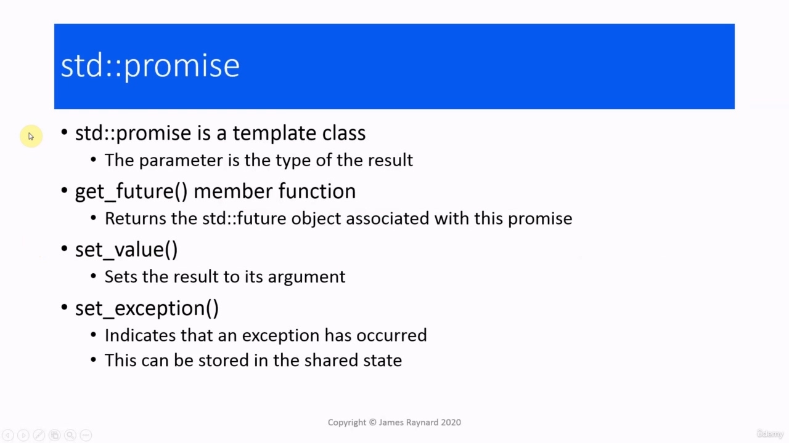

As we saw in the last video, a promise object is associated with a future object, and between them they set up a shared state. The promise object will set a value in the shared state and the future object can wait and then get the value from the shared state. So as a very rough analogy, the get() call by the future is analogous to the consumer calling the producer thread and the set() operation by the promise is analogous to the producer thread returning a value to the consumer thread. But do not take this too seriously. The future and promise are both template classes. The parameter is the type of the result that is being

> 正如我们在上一个视频中看到的，一个 promise 对象与一个未来对象相关联，它们之间建立了一个共享状态。promise 对象将在共享状态中设置一个值，未来对象可以等待，然后从共享状态中获取值。因此，作为一个非常粗略的类比，future 的 get（）调用类似于消费者调用生产者线程，promise 的 set（）操作类似于生产者线程向消费者线程返回值。但不要太严肃。未来和承诺都是模板类。参数是正在执行的结果的类型

## img - 53510

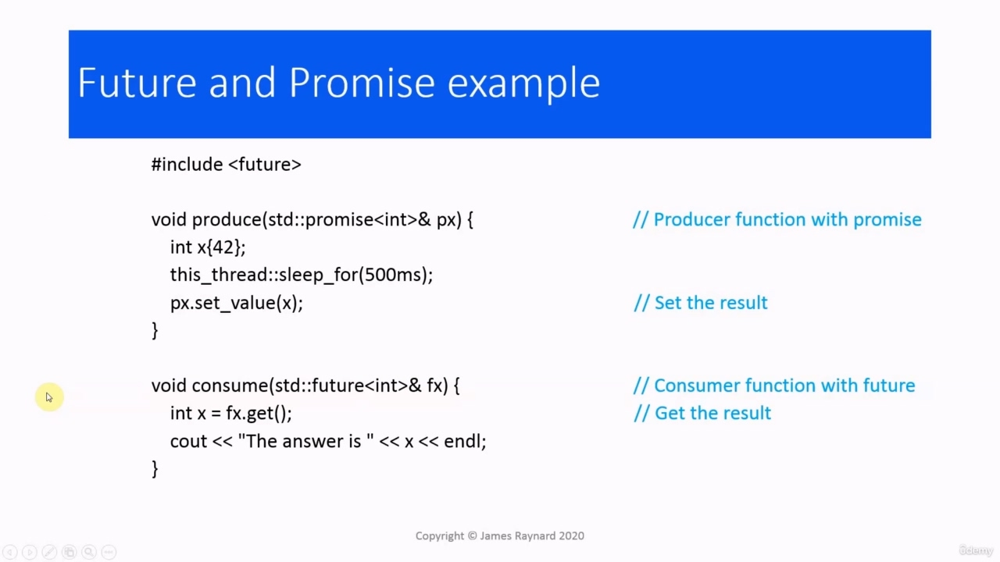

The future and promise are both template classes. The parameter is the type of the result that is being passed from the promise to the future. The get underscore future member function will return the associated future object. set underscore value will store the argument in the shared state. And there is also a set underscore exception function which can be used with exceptions. And we will look at that at the end of this video.

> 未来和承诺都是模板类。参数是从 promise 传递给未来的结果的类型。get 下划线 future 成员函数将返回关联的 future 对象。set 下划线值将以共享状态存储参数。还有一个设置下划线的异常函数，可以用于异常。我们将在这段视频的结尾看到这一点。

## img - 124880

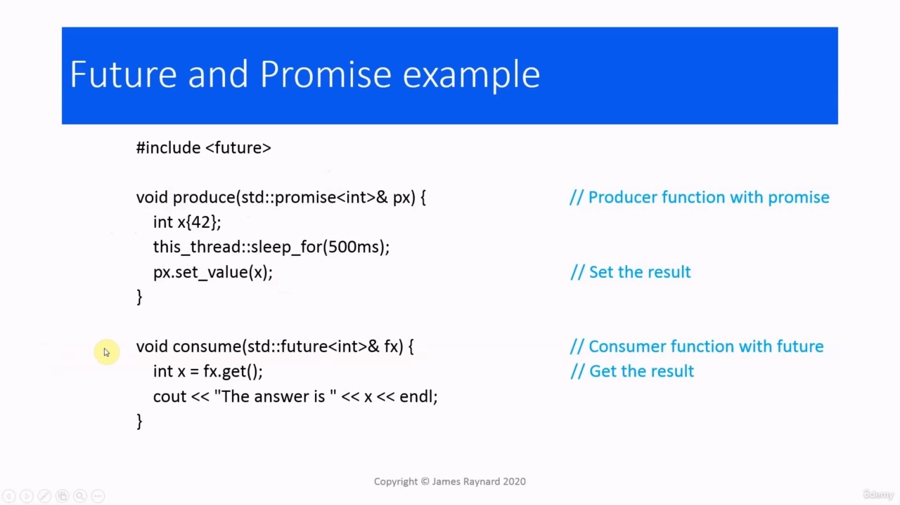

So here is how we would use the future and promise together. We have a producer which takes the promise as argument. It generates a value and then it calls set_value and that will store the value of x in the shared state. We have this consumer function, which takes a future as argument. It calls get() on that future.

> 下面是我们如何共同利用未来和承诺。我们有一个以承诺为论据的制片人。它生成一个值，然后调用 set_value，将 x 的值存储在共享状态中。我们有一个消费者函数，它以未来为论据。它在未来调用 get（）。

## img - 140130

We have this consumer function, which takes a future as argument. It calls get() on that future. This will wait until the shared state is updated and then the function call will return and the value from the shared state will be stored in x.

> 我们有一个消费者函数，它以未来为论据。它在未来调用 get（）。这将等待共享状态更新，然后函数调用将返回，共享状态的值将存储在 x 中。

## img - 157920

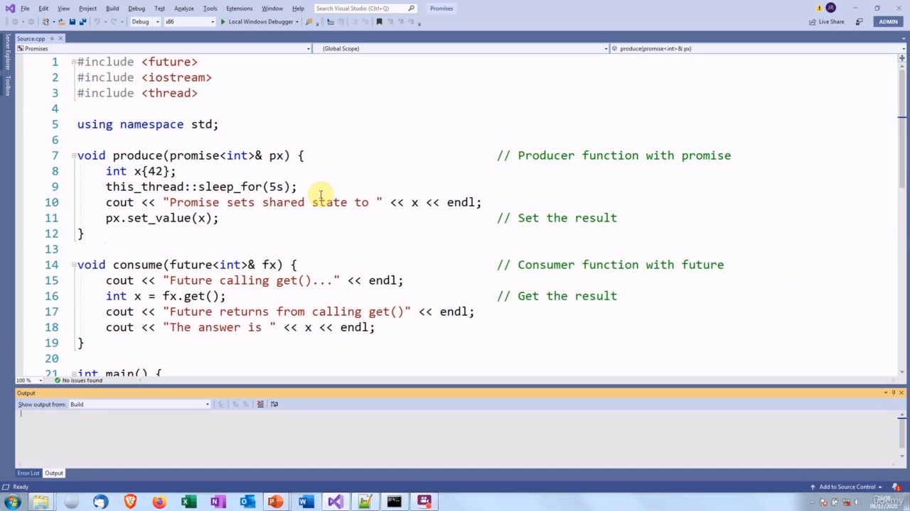

Then in the main function, we create the promise instance. We get the associated future. We start a consumer thread with the future as argument and the producer thread with the promise as argument.

> 然后在主函数中，我们创建 promise 实例。我们得到了相关的未来。我们以 future 作为参数启动消费线程，以 promise 作为参数启动生产者线程。

## img - 208270

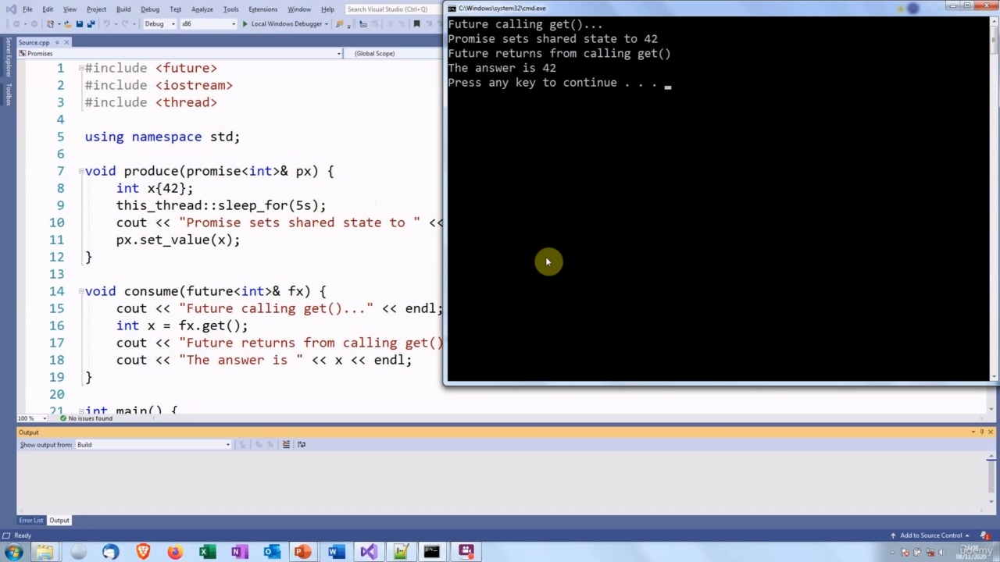

So let's see this code in action. This is the same code. I have made the sleep a bit longer and added some print statements so we can see what is happening. The consumer thread calls get() and goes to sleep. The producer thread sets the value in the shared state.

> 让我们来看看这段代码的作用。这是相同的代码。我把睡眠时间延长了一点，并添加了一些打印声明，这样我们就可以看到发生了什么。使用者线程调用 get（）并进入睡眠状态。生产者线程将值设置为共享状态。

## img - 224110

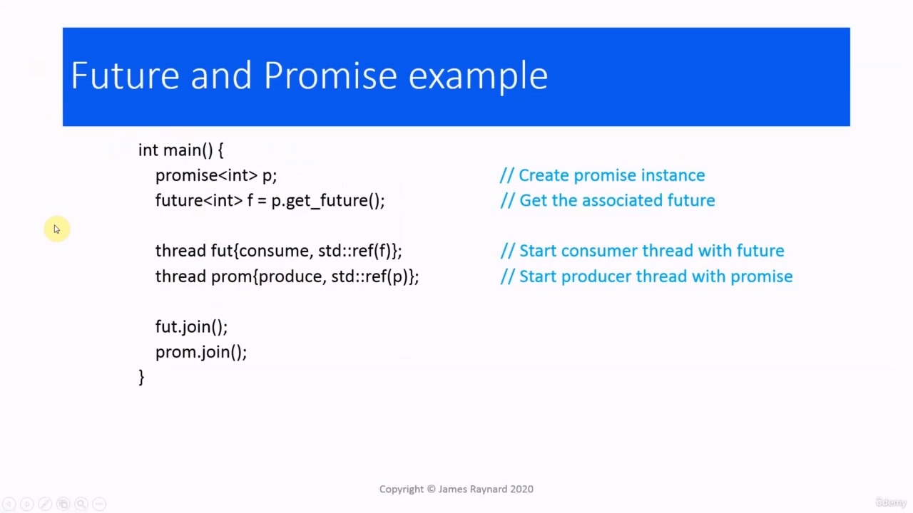

The consumer thread calls get() and goes to sleep. The producer thread sets the value in the shared state. The consumer thread wakes up, get() returns the new value, and then x is 42.

> 使用者线程调用 get（）并进入睡眠状态。生产者线程将值设置为共享状态。消费线程唤醒，get（）返回新值，然后 x 为 42。

## img - 242290

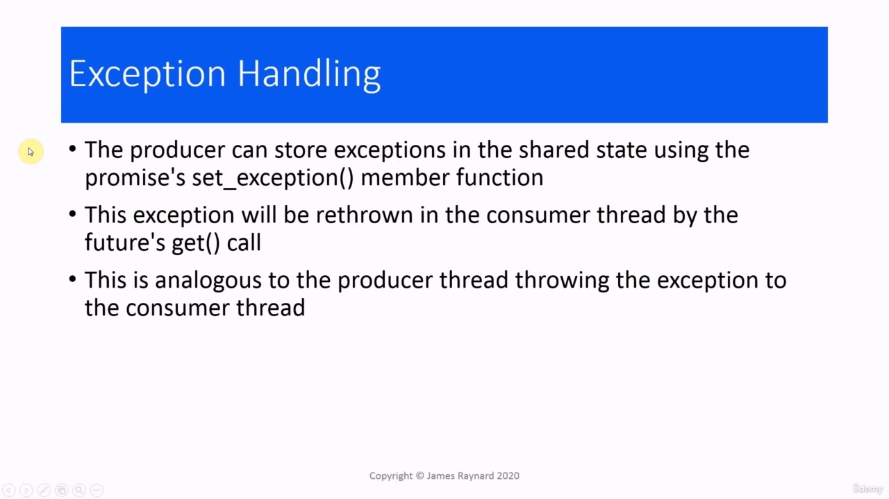

## img - 242290

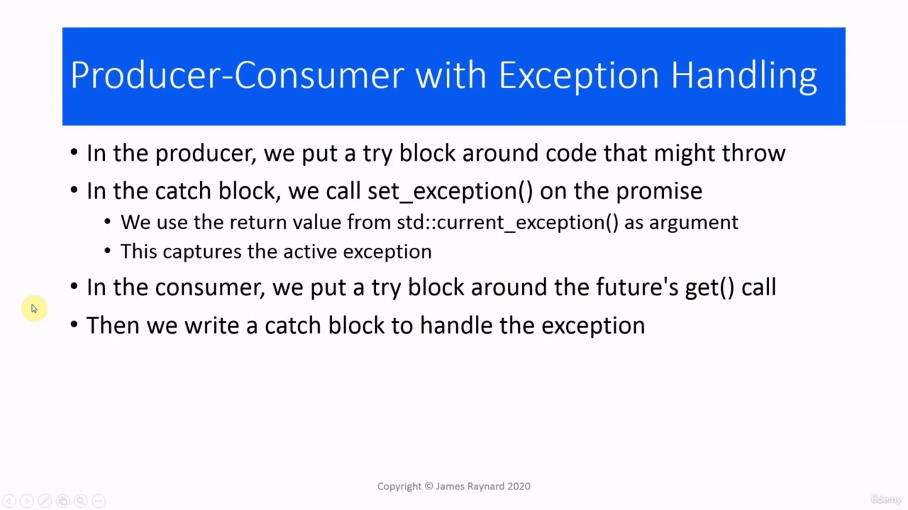

We also said that this can be used for handling exceptions. The producer can store exceptions in the shared state by calling the set_exception() member function on the promise. That will cause the exception to be thrown in the consumer thread by the get() call. So, again, using our poor analogy, the get() call by the future is the consumer thread calling the producer. The producer throws an exception and then the set_exception will in effect rethrow the exception back to the consumer.

> 我们还说过，这可以用于处理异常。生产者可以通过调用 promise 上的 set_exception（）成员函数将异常存储在共享状态中。这将导致 get（）调用在使用者线程中引发异常。因此，再次使用我们糟糕的类比，future 的 get（）调用是调用生产者的消费线程。生产者抛出一个异常，然后 set_exception 实际上会将该异常重新抛出给消费者。

## img - 320640

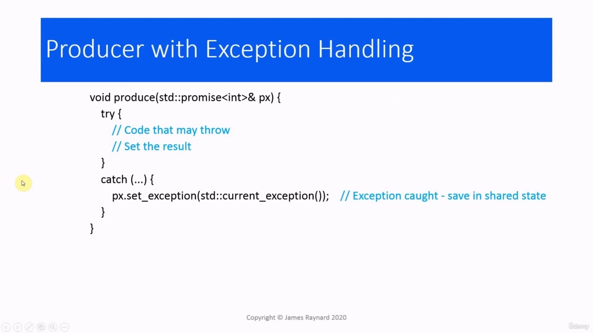

If we want to do this, we put a try block in the producer around code that might throw. So that's normal. In the catch block, this is slightly different. Normally, you would use a copy of the exception or a reference to the exception in a catch block. Instead, there's a function current underscore exception which will return the active exception, and we can use the return value from that. Then we call the set underscore score exception member function of the promise, and that will save the active exception in the shared state. Then in the consumer, the get() call is going to throw. So we need to put a block around that and then we write a catch block, which will handle the exception. So that is fairly normal. You would have some code like this. The producer will have a try block and then the catch block. We call

> 如果我们想这样做，我们就在生产者中放置一个 try 块，围绕可能抛出的代码。这很正常。在捕捉块中，这略有不同。通常，您会在 catch 块中使用异常的副本或对异常的引用。相反，有一个函数当前下划线异常，它将返回活动异常，我们可以使用其中的返回值。然后我们调用 promise 的 set 下划线分数异常成员函数，这将将活动异常保存在共享状态。然后在使用者中，get（）调用将抛出。因此，我们需要在其周围放置一个块，然后编写一个 catch 块，它将处理异常。这很正常。你会有这样的代码。生产者将有一个 try 块，然后是 catch 块。我们打电话

## img - 408120

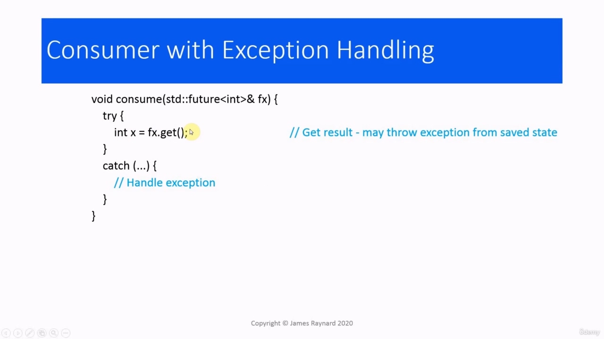

You would have some code like this. The producer will have a try block and then the catch block. We call current_exception() to get the active exception, then we pass that to set underscore exception.

> 你会有这样的代码。生产者将有一个 try 块，然后是 catch 块。我们调用 current_exception（）获取活动异常，然后将其传递给设置下划线异常。

## img - 423260

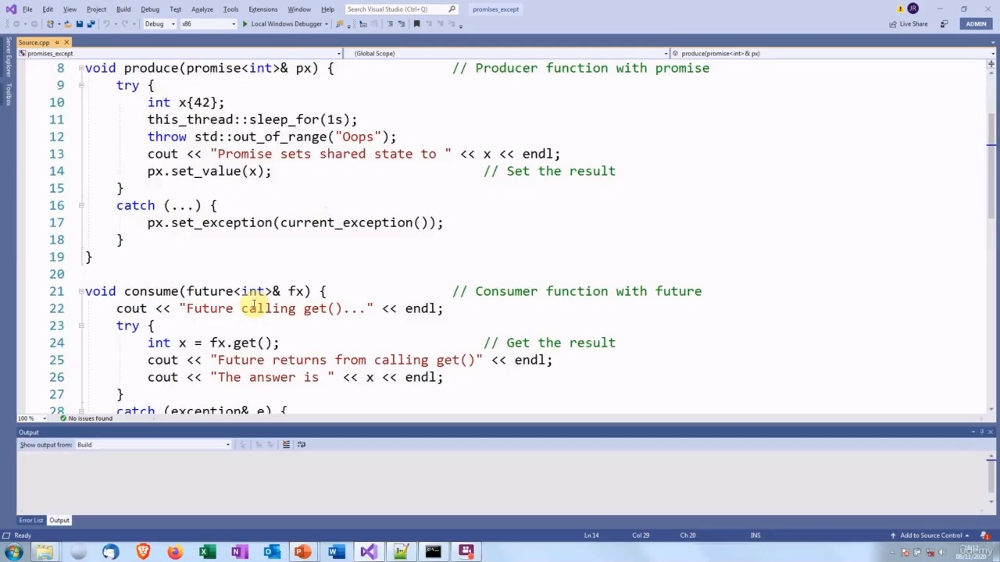

And then in the consumer, the get() call will through, we put a try block around that and then we write a catch block to handle that exception.

> 然后在 consumer 中，get（）调用将通过，我们在其周围放置一个 try 块，然后编写一个 catch 块来处理该异常。

## img - 435350

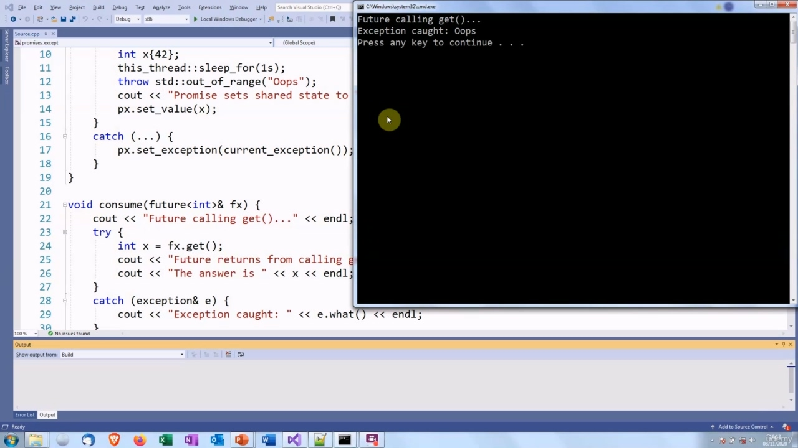

So this is the same code again, with some sleeps and print statements. In the producer, we are going to throw an exception. Then we have a catch block. This catch block is going to save the exception to the shared state. In the consumer, we have a try block around the get() call and then we have a catch block, which will handle the exception. So let's see how this works. So we call get(), then the exception is thrown.

> 这是同样的代码，有一些睡眠和打印语句。在生产者中，我们将抛出一个异常。然后我们有一个拦网。这个 catch 块将把异常保存到共享状态。在消费者中，我们在 get（）调用周围有一个 try 块，然后我们有一个 catch 块，它将处理异常。让我们来看看这是如何工作的。所以我们调用 get（），然后抛出异常。

## img - 510360

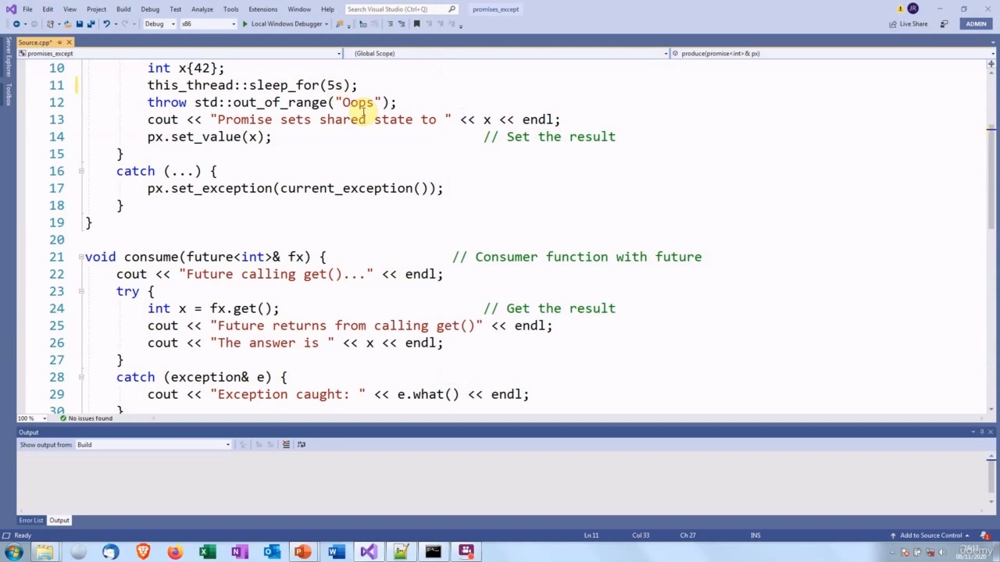

So let's see how this works. So we call get(), then the exception is thrown. (Let's change that to five seconds, actually. Give us some more time to - give me some more time to talk

> 让我们来看看这是如何工作的。所以我们调用 get（），然后抛出异常。（实际上，让我们把时间改为 5 秒。给我们更多的时间——给我更多的时间说话

## img - 518770

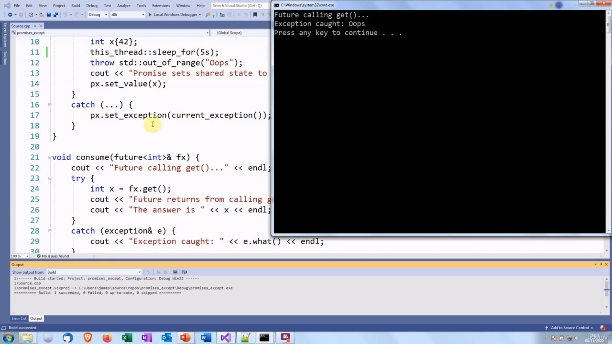

(Let's change that to five seconds, actually. Give us some more time to - give me some more time to talk about it) So the future calls get()

> （实际上，让我们把它改为 5 秒。给我们更多的时间-给我更多的时间来讨论它）所以未来调用 get（）
