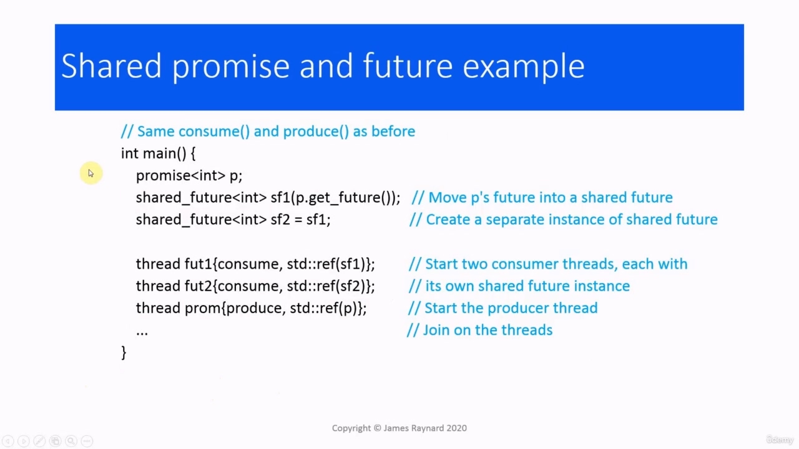

Hello again! In this video, we are going to look at using promises when there are multiple waiting Hello again! In this video, we are going to look at using promises when there are multiple waiting threads. We have learned how to write applications where there is one producer thread and one consumer thread, but

> 你好！在本视频中，我们将探讨当有多人等待时使用承诺Hello！在本视频中，我们将讨论当有多个等待线程时使用promise。我们已经学习了如何在有一个生产者线程和一个消费者线程的情况下编写应用程序，但是

## img - 12460

We have learned how to write applications where there is one producer thread and one consumer thread, but there are many applications where you need to have a single producer thread and multiple consumers. We cannot do this with std::future because only one consumer can get the value from the producer. The future class is designed so that it has exclusive access to the shared state with the promise. Future instances cannot be copied for the same reason that unique pointers cannot be copied. If more than one thread calls get() on the same future, then there is a data race because multiple threads are accessing the same shared state and there is modification occurring.

> 我们已经学习了如何在有一个生产者线程和一个消费者线程的情况下编写应用程序，但是在很多应用程序中，您需要有一个单独的生产者线程和多个消费者线程。我们不能用std:：future这样做，因为只有一个消费者可以从生产者那里获得价值。未来类的设计使得它可以独占访问带有promise的共享状态。无法复制未来实例的原因与无法复制唯一指针的原因相同。如果多个线程在同一未来调用get（），则会出现数据竞争，因为多个线程访问同一共享状态，并且会发生修改。

## img - 100050

C++ provides a shared underscore future, which is similar to a shared underscore pointer. You can have multiple copies, which each have a reference to the same shared state. And it also synchronizes the access to that shared state. So this allows multiple consumers to wait for a result from a producer thread. Typically, we would make a copy so that each thread has its own instance. And provided we are doing it on different copies, we can call get() repeatedly.

> C++提供了一个共享下划线future，它类似于共享下划线指针。可以有多个副本，每个副本都引用相同的共享状态。它还同步对共享状态的访问。因此，这允许多个使用者等待来自生产者线程的结果。通常，我们会创建一个副本，以便每个线程都有自己的实例。如果我们在不同的副本上执行，我们可以重复调用get（）。

## img - 133250

As with the future class, we do not normally create a shared future instance directly. Usually we have a future object which we convert to a shared future. We can either use move to move it into the shared future, or we can call the share() member function of the future, which will return a shared future object. And we can also obtain a shared future directly from the promise. If we call get_future(), that will return a future which can be moved into the shared future instance.

> 与未来类一样，我们通常不会直接创建共享的未来实例。通常我们有一个未来对象，我们将其转换为共享的未来。我们可以使用move将其移动到共享未来，也可以调用未来的share（）成员函数，该函数将返回共享未来对象。我们也可以直接从承诺中获得共同的未来。如果我们调用get_future（），那么将返回一个可以移动到共享未来实例中的未来。

## img - 211950

Then to write a program which has multiple consumers, we have the same producer function as before. The consumer function is the same as before, except we need to use a shared future instead of a regular future. In the main() function, we create the promise instance. Then we create a shared future for each consumer thread. Then we start up the consumer threads with those shared futures as argument, and we can start up the producer thread, and of course we need to join at the end.

> 然后，为了编写一个具有多个消费者的程序，我们使用了与以前相同的生产者函数。消费者功能与以前相同，只是我们需要使用共享的未来，而不是常规的未来。在main（）函数中，我们创建promise实例。然后我们为每个使用者线程创建一个共享的未来。然后，我们用这些共享的期货作为参数启动消费线程，我们可以启动生产者线程，当然，我们需要在最后加入。

## img - 246640

So let's try this code out. As usual, I have added some print statements so we can see what is going on. We are going to have multiple consumer threads printing output at the same time. So I have also put a lock guard to avoid the output getting scrambled up.

> 所以让我们试试这个代码。像往常一样，我添加了一些打印语句，这样我们就可以看到发生了什么。我们将有多个消费线程同时打印输出。所以我还设置了一个锁，以避免输出被打乱。
