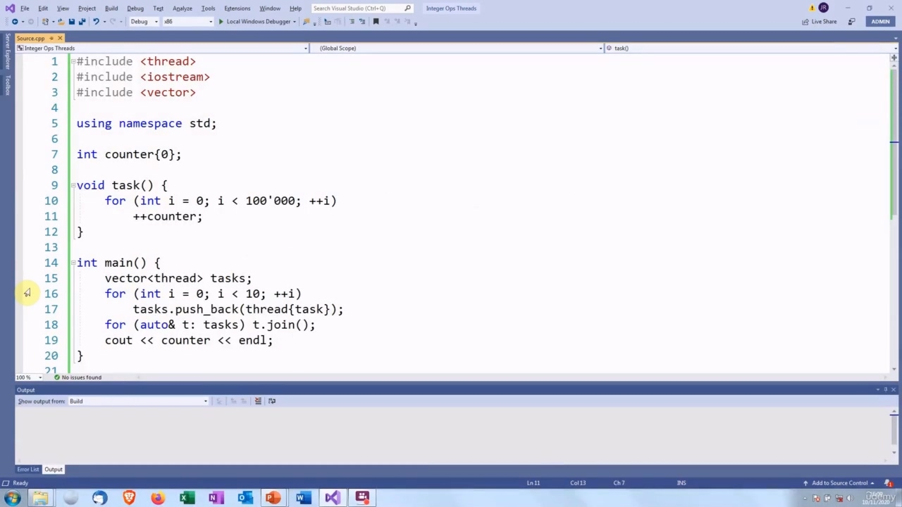
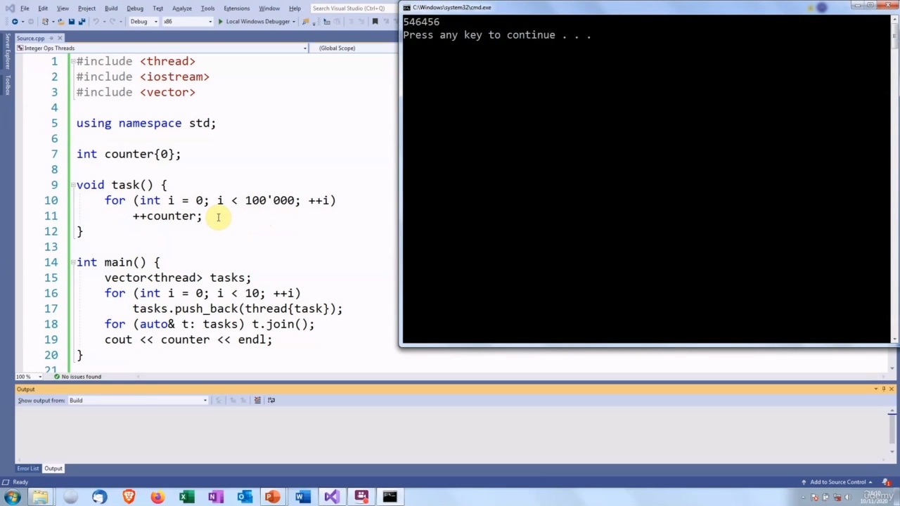
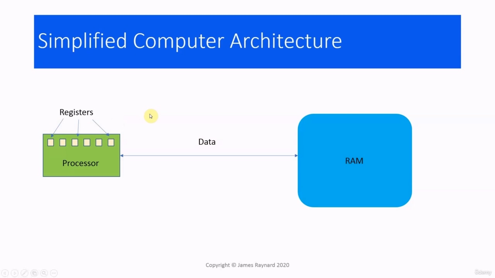
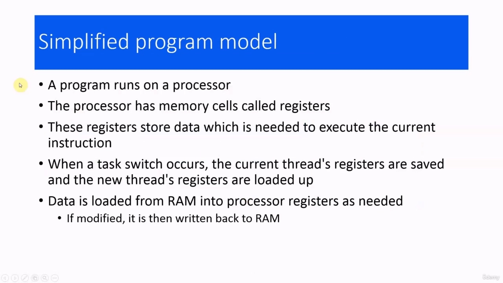
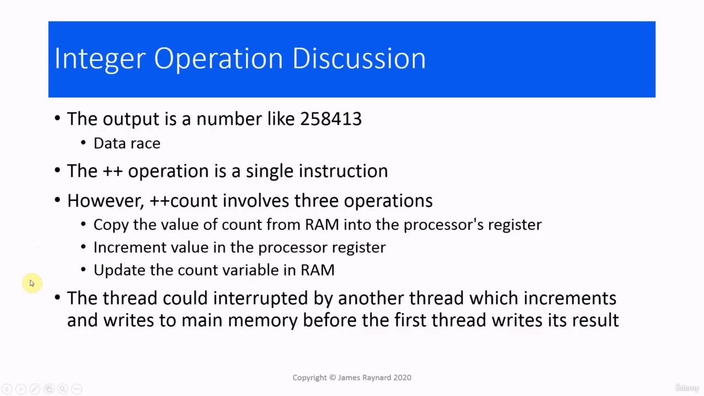
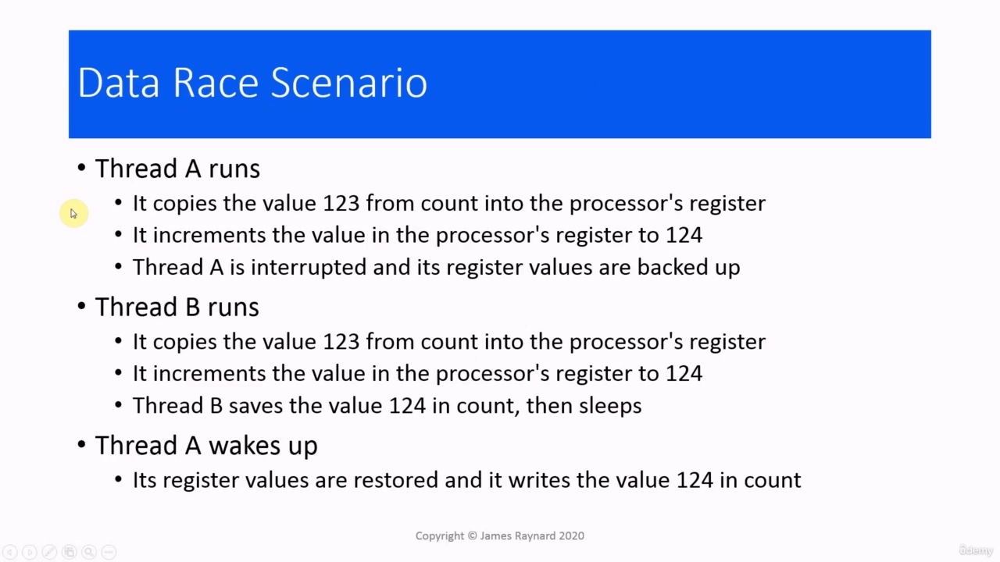
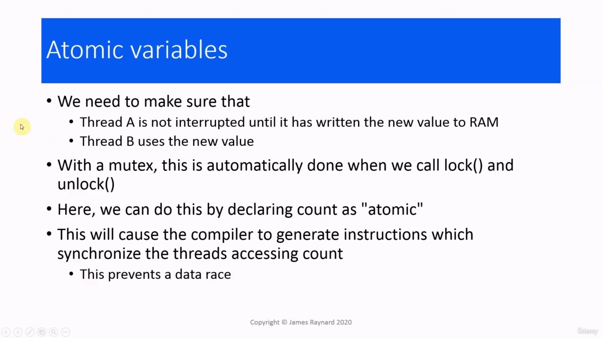

Hello again! In this video, we are going to look at integer operations and threads. On modern hardware, integer operations are always performed as a single processor instruction.

> 你好！在本视频中，我们将学习整数运算和线程。在现代硬件上，整数运算总是作为单处理器指令执行。

## img - 13220

On modern hardware, integer operations are always performed as a single processor instruction. There are some exceptions. If the data does not fit into a single word, if it is spread across more than one word, that does not apply. But otherwise, it does. A processor cannot be interrupted while it is performing a instruction. So this means that if we have a thread that is performing an integer operation, it cannot be interrupted. So this raises an interesting possibility. If we're using an integer for shared data, do we still need to lock it? Well, let's find out.

> 在现代硬件上，整数运算总是作为单处理器指令执行。有一些例外。如果数据不适合一个单词，如果数据分布在多个单词中，则不适用。但除此之外，它确实如此。处理器在执行指令时不能中断。因此，这意味着如果我们有一个线程正在执行整数运算，它就不能被中断。因此，这提出了一个有趣的可能性。如果我们对共享数据使用整数，我们还需要锁定它吗？好吧，让我们来看看。

## img - 52390

I have got some code here which uses a shared integer variable. We have a task function which is going to increment this 100,000 times. You will notice there are no mutexes, but this cannot be interrupted, and then we are going to have some threads which execute this 10 times. So if we do ten lots of 100,000 increments, we should have a final value of one million. Obviously, if we are going by the classic C++ definition, we have a data race because we have a single memory location which is accessed by multiple threads with modification. So let's see if it works. No! No, it does not.

> 我这里有一些使用共享整数变量的代码。我们有一个任务函数，它将增加 100000 倍。您将注意到没有互斥锁，但这不能被中断，然后我们将有一些线程执行这 10 次。所以，如果我们做 10 次 10 万次的增量，我们的最终值应该是一百万。显然，如果我们遵循经典的 C++定义，我们会有一个数据竞争，因为我们有一个单独的内存位置，可以由多个线程修改访问。让我们看看它是否有效。不不，它没有。

## img - 134530

No! No, it does not. The answer is five hundred and forty six thousand, four hundred and fifty six, which is less than one million. So some of the increments are being lost, it looks like. So we must have gone wrong somewhere. The reason is that our assumption is that the plus plus operation cannot be interrupted, which is correct. However, if we are incrementing a variable, there is actually three separate operations. So that is actually interruptible To understand the problem a bit better, we need to learn something about how computers work.

> 不不，它没有。答案是五十四万六千四百五十六，不到一百万。因此，看起来有些增量正在丢失。所以我们一定是哪里出了问题。原因是我们的假设是加号操作不能中断，这是正确的。然而，如果我们递增一个变量，实际上有三个独立的操作。所以这实际上是可以中断的。为了更好地理解这个问题，我们需要了解一些计算机的工作原理。

## img - 215140

This is very, very simplified. Modern computers are very complicated. I am not going to make things any more complicated than they have to be. So let's pretend it is 1980, 1985, we have a computer which has a single processor and some RAM. And screen, obviously, and maybe a hard disk or floppy disk drive, but that is not important. The processor has some memory cells which are called registers, and these are used for storing data, which the processor is working on. When we execute a C++ program, the instructions are executed by the processor, the variables are stored in RAM, and when the processor needs to do some operation on a variable, it fetches the value from RAM into a register. Then it does its operation and then it will save the new value of the variable back to RAM. So data is constantly being copied from RAM into registers and back again.

> 这非常非常简单。现代计算机非常复杂。我不会让事情变得更复杂。所以，让我们假设是 1980 年、1985 年，我们有一台计算机，它有一个处理器和一些 RAM。屏幕，显然，可能还有硬盘或软盘驱动器，但这并不重要。处理器有一些被称为寄存器的存储单元，这些存储单元用于存储处理器正在处理的数据。当我们执行 C++程序时，指令由处理器执行，变量存储在 RAM 中，当处理器需要对变量进行某些操作时，它将 RAM 中的值取入寄存器。然后执行操作，然后将变量的新值保存回 RAM。因此，数据不断地从 RAM 复制到寄存器中，然后再复制回来。

## img - 327270

If we imagine that we are running a threaded program on this very simple computer. Every time a thread is interrupted, a task switch occurs. This means that the values of the registers are backed up on the processor and the values that the new thread needs for its registers are loaded up. And then when that thread gets interrupted, its registers are backed up and another thread's registers are loaded up and so on. And data is loaded from RAM into processor registers as needed and if necessary, written back to RAM after it has been modified.

> 如果我们想象我们在这台非常简单的计算机上运行一个线程程序。每次线程中断时，都会发生任务切换。这意味着在处理器上备份寄存器的值，并加载新线程为其寄存器所需的值。然后当该线程被中断时，它的寄存器被备份，另一个线程的寄存器被加载，依此类推。数据根据需要从 RAM 加载到处理器寄存器中，如果需要，在修改后写回 RAM。

## img - 409490

So getting back to our program, we got a strange number because there is a data race, but why is there a data race? And the answer is that incrementing a variable involves three operations. We need to copy the value of the variable from RAM into the register. Then the processor will increment the value in its register and then the new value of the variable has to be written back to the storage in RAM. These are being executed as threads, which run concurrently, so they could be interrupted at any time and another threat could run and do any one of these steps. In particular, if we get interrupted after we do the increment, but before we do the update and then another thread runs which will do the update. So the second thread will write some value into count, and then when this thread wakes up, it will write its own value into count and overwrite the value from the previous thread. To see why this could be a problem, let's say we have a thread which runs. It gets the value of count, which could be 123. It will copy that into the processor's register, then the increment

> 回到我们的程序，我们得到了一个奇怪的数字，因为有数据竞赛，但为什么有数据竞赛？答案是增加一个变量需要三个操作。我们需要将变量的值从 RAM 复制到寄存器中。然后处理器将增加其寄存器中的值，然后变量的新值必须写回 RAM 中的存储器。这些都是作为线程执行的，并发运行，因此它们可以随时被中断，另一个威胁可以运行并执行这些步骤中的任何一个。特别是，如果在执行增量操作之后，但在执行更新操作之前，我们被中断，然后另一个线程将执行更新操作。因此，第二个线程会将一些值写入 count，然后当这个线程醒来时，它会将自己的值写入 count 并覆盖上一个线程的值。为了了解为什么这可能是一个问题，假设我们有一个线程正在运行。它得到 count 的值，可能是 123。它会将其复制到处理器的寄存器中，然后将增量

## img - 522020

which could be 123. It will copy that into the processor's register, then the increment will take it to 124. And then at that point, the thread is interrupted. The register values are backed up. Thread B runs. Its register values are loaded up. It copies the value of count, which is still 123, because Threat A has not updated it yet. Then thread B will increment it to 124, then thread B will save the value 124 in RAM and go to sleep. Then thread A will wake up. Its register values are going to be restored. It has the value 124 in its register, and it is going to write 124 in count. So at the start of this, the value of count was 123. It has been incremented twice, but its value is finally 124. So one of the increments has been lost, due to thread A overwriting thread B's value. So we need to ensure somehow that thread A cannot be interrupted until it has written its value and then when thread B runs, it will get the new value.

> 其可以是 123。它会将其复制到处理器的寄存器中，然后增量将使其达到 124。然后在这一点上，线程被中断。将备份寄存器值。线程 B 运行。其寄存器值被加载。它复制了 count 的值，仍然是 123，因为威胁 A 尚未更新它。然后，线程 B 将其递增到 124，然后线程 B 将值 124 保存在 RAM 中并进入休眠。然后线程 A 将被唤醒。将恢复其寄存器值。它的寄存器中有值 124，它将在 count 中写入 124。所以在开始的时候，count 的值是 123。它已增加了两次，但其值最终为 124。因此，由于线程 A 覆盖了线程 B 的值，其中一个增量已经丢失。因此，我们需要以某种方式确保线程 A 在写入其值之前不会被中断，然后当线程 B 运行时，它将获得新值。
