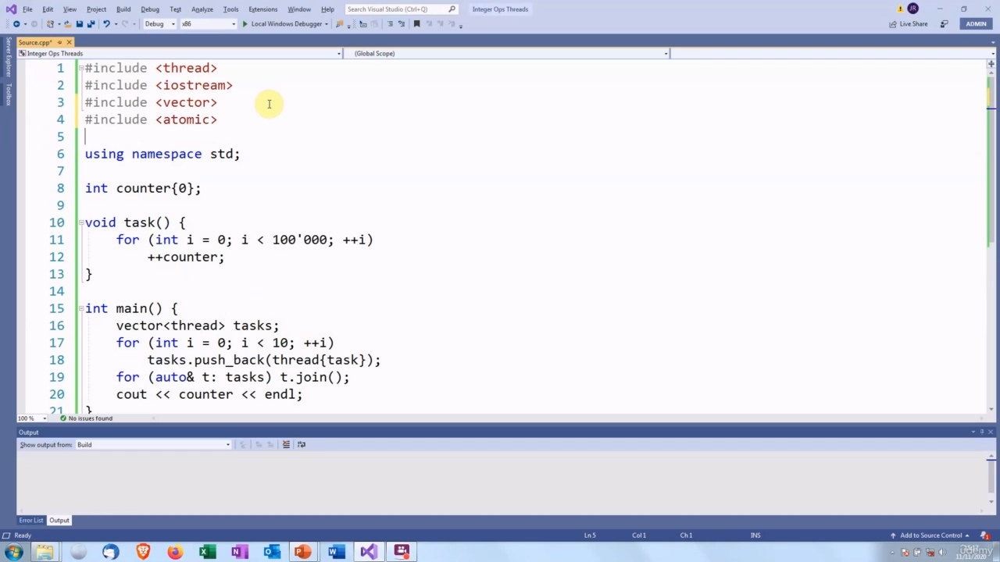
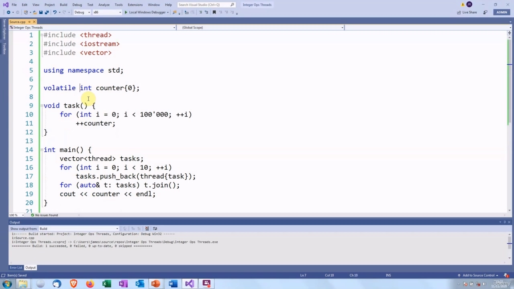

Hello again! In this video, we are going to talk about atomic types. We discussed in the last video that if we

> 你好！在本视频中，我们将讨论原子类型。我们在上一个视频中讨论过，如果我们

## img - 6990

In this video, we are going to talk about atomic types. We discussed in the last video that if we make a variable atomic, that will have the same effect as using mutex locks around accesses to that variable. So let's find out how to do that.

> 在本视频中，我们将讨论原子类型。我们在上一个视频中讨论过，如果我们创建一个原子变量，这将与在访问该变量时使用互斥锁具有相同的效果。所以让我们来看看如何做到这一点。

## img - 23290

C++ 11 has an header which defines a template called atomic. The parameter for this template must be trivially copyable. So that could be a built-in type or a class for which the copy and move constructors do nothing or have been deleted. Usually only bool, integer types and pointers are made atomic. You can use more complex types, but there is a risk that locks will be added, which rather defeats the point of trying to avoid locks. If that is the case, then you can use a pointer which will not be locked. By the way, if you are using C++17, then you can use the standard library shared_ptr as the template type without it being locked.

> C++11 有一个标头，它定义了一个名为 atomic 的模板。此模板的参数必须是可复制的。因此，这可能是一个内置类型或类，复制和移动构造函数对其不做任何操作或已被删除。通常只有布尔值、整数类型和指针是原子的。您可以使用更复杂的类型，但存在添加锁的风险，这反而会破坏避免锁的目的。如果是这种情况，那么可以使用不会被锁定的指针。顺便说一句，如果您使用的是 C++17，那么您可以使用标准库 shared_ptr 作为模板类型，而不会锁定它。

## img - 116930

To create an atomic variable, we put the type of the variable as the parameter. So here we've got x, which is an atomic int. Atomic objects must be initialized. So we set this equal to zero. We can assign to this. x equals two will atomically assign two to x. And we can assign from it y equals x will atomically assign y to have the value of x. And note that y does not need to be atomic. It could just be a normal int. Each of these operations is atomic in itself, but the two together are not. It is quite possible that another thread could run between these two statements and modify the value of x. So let's modify the program that we had before to use an atomic variable. We need to include the

> 为了创建原子变量，我们将变量的类型作为参数。这里我们得到了 x，它是一个原子整数。原子对象必须初始化。所以我们把它设为零。我们可以分配给这个。x 等于 2 将原子地分配给 x。我们可以从中分配 y 等于 x 将原子地指定 y，使其值为 x。注意，y 不需要是原子的。它可能只是一个普通的整数。这些操作中的每一个本身都是原子的，但两者加在一起就不是了。很有可能在这两个语句之间运行另一个线程，并修改 x 的值。因此，让我们修改之前使用的程序，以使用原子变量。我们需要包括

## img - 210040

So let's modify the program that we had before to use an atomic variable. We need to include the header...

> 所以，让我们修改之前的程序，使用原子变量。我们需要包括标题。。。

## img - 221230

And then we need to make counter an atomic int...

> 然后我们需要使计数器成为原子整数。。。

## img - 228120

It is already initialized to zero, so we don't need to do that. Now, let's see if that works... Yes, there we are. The correct answer! One million.

> 它已经初始化为零，所以我们不需要这样做。现在，让我们看看这是否可行。。。是的，我们到了。正确答案！一百万。

## img - 237300

One million.

> 一百万。

## img - 250960

I want to talk about the "volatile" keyword, because this sometimes causes confusion. In Java and C#, it has a special meaning in threaded programs. As I understand this, it does not provide locking. So you still need to use a synchronized method. If the variable is volatile within that method, then any modifications will immediately be visible in every other thread. So that's the second half of atomic, releasing the value, but not the first half, which makes the accesses uninterruptible. In C++, that is not the case. It has exactly the same meaning as it does in single threaded code, which is that the value of the variable may change, even if there is not any code which explicitly modifies it. The main use for this is when you are working with hardware. You will have some device which appears as a memory address. And then when you read from that address, you will get data from the device. So you could, for example, read five times from the same address, to get five lots of data. The reason for making it volatile is that the compiler will see this when it is optimizing and think that it can remove the surplus statements and just have one read. The volatile keyword will tell it not to perform this optimization, so it will actually generate code for five separate reads. Before the threading support was added to C++11 in the standard some programmers used volatile for when we now use atomic, which was a mistake. And just to confuse things even further - I think it was 2005 - Visual C++ had a non-standard volatile keyword, which had the Java/C# behaviour, but they took that out once the new standard came in. So just to prove that volatile will not solve the problem...

> 我想谈谈“volatile”关键字，因为这有时会引起混淆。在 Java 和 C#中，它在线程程序中具有特殊的含义。据我所知，它不提供锁定。所以您仍然需要使用同步方法。如果该变量在该方法中是可变的，那么任何修改都将立即在每个其他线程中可见。这是 atomic 的后半部分，释放值，但不是前半部分，这使得访问不间断。在 C++中，情况并非如此。它与单线程代码中的含义完全相同，即变量的值可能会发生变化，即使没有任何代码对其进行显式修改。它的主要用途是在使用硬件时。您将拥有一些显示为内存地址的设备。然后，当您从该地址读取时，您将从设备中获取数据。例如，您可以从同一地址读取五次，以获得五批数据。使其易失性的原因是编译器在优化时会看到这一点，并认为它可以删除多余的语句，只需读取一次即可。volatile 关键字将告诉它不要执行此优化，因此它实际上将生成五次单独读取的代码。在标准中为 C++11 添加线程支持之前，一些程序员在我们现在使用原子时使用了 volatile，这是一个错误。为了进一步混淆，我认为是 2005 年，Visual C++有一个非标准的 volatile 关键字，它具有 Java/C#行为，但一旦新标准出现，他们就把它去掉了。所以，为了证明 volatile 不会解决问题。。。

## img - 442530

So just to prove that volatile will not solve the problem...

> 所以，为了证明易变性不会解决问题。。。

## img - 459080

So there we are. 335,000. So we still have the problem with increments being lost.

> 我们就在这里。因此，我们仍然存在增量丢失的问题。

## img - 459080

So there we are. 335,000. So we still have the problem with increments being lost. So in C++, making this counter volatile has no effect on the behaviour of the multithreaded program.

> 我们就在这里。因此，我们仍然存在增量丢失的问题。因此，在 C++中，使计数器易失性对多线程程序的行为没有影响。
