Hello there! In this video, we are going to look at atomic operations.

> 你好！在本视频中，我们将讨论原子操作。

## img - 4050 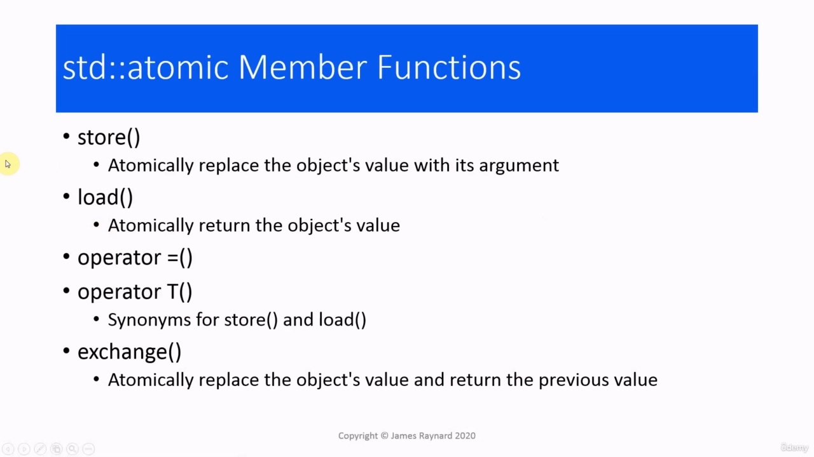

In this video, we are going to look at atomic operations. The atomic type supports a number of operations. We can store(), which will atomically replace the object's

> 在本视频中，我们将讨论原子操作。原子类型支持许多操作。我们可以 store（），它将自动替换对象的

## img - 14920 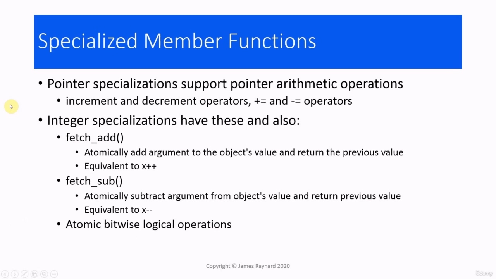

The atomic type supports a number of operations. We can store(), which will atomically replace the object's value with its argument and load() which will atomically return the object's value. These are equivalent to assigning to and assigning from an atomic variable. And in fact, you can write it using the normal equals sign. It is probably better, though, if you do use the names which are specific for atomic variables, as that will make it easier to see that the variable is atomic. There's also an exchange() member function, which will replace the object's value and return the previous value. So this is a bit like doing a postfix increment where you increment and get the old value, except it can be any value. It does not have to be old value plus one.

> 原子类型支持许多操作。我们可以 store（），它将用参数原子地替换对象的值，而 load（）将原子地返回对象的值。这些等价于对原子变量赋值和从原子变量赋值。事实上，你可以用普通的等号来写它。不过，如果你使用原子变量特有的名称，这可能会更好，因为这样会更容易看出变量是原子的。还有一个 exchange（）成员函数，它将替换对象的值并返回上一个值。所以这有点像做后缀递增，在这里你递增并得到旧值，除了它可以是任何值。它不必是旧值加 1。

## img - 109520 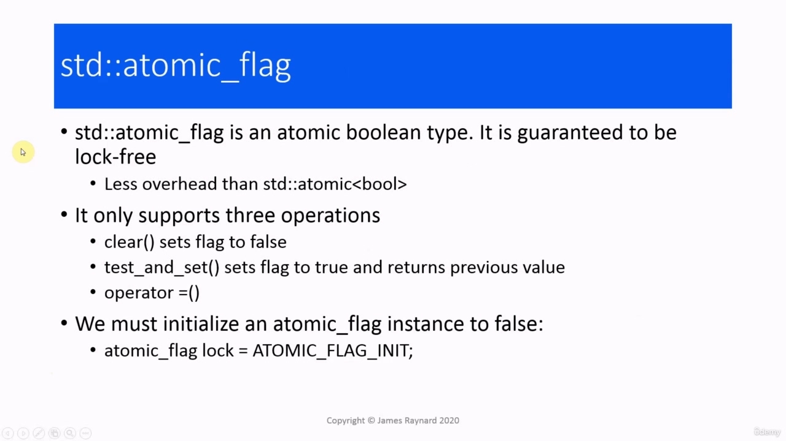

Those member functions are common to all the atomic specializations. If we have pointers and integers, we can also do increment and decrement, += and -=. The integer specialisations also have a fetch_add() and a fetch_sub() which are atomic versions of postfix increment and decrement, and there are some operators for doing bitwise logical operations atomically. So that is "and" with the single ampersand &, "or" with a single bar | and "exor" ^.

> 这些成员函数对于所有原子专门化都是通用的。如果我们有指针和整数，我们也可以做增量和减量，+=和-=。整数专用化还具有 fetch_add（）和 fetch_sub（），它们是后缀递增和递减的原子版本，并且有一些运算符可以原子地执行逐位逻辑运算。这就是“and”和“&”，或者“with a single bar|”和“exor”^。

## img - 144820 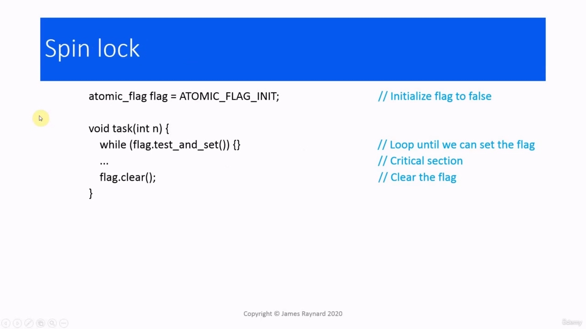

There is another atomic type which comes in useful. This is atomic underscore flag, which is an atomic boolean type. It is guaranteed to be lock free and it has less overhead than the bool instantiation of the atomic template. It only supports three operations. We can call clear(), which will set the Boolean to be false. We can call test_and_set() which will set the flag to be true. And the interesting bit is that it will return the previous value. So, again, this is rather like a postfix operation. Like doing the postfix increment, we do the operation and we get the previous value. And we will see in a minute why that is useful. And there is also the assignment operator. Instances of atomic_flag must be initialized, and the only possibility is ATOMIC_FLAG_INIT, which is equivalent to false. So the idea is that you create a shared atomic_flag variable, which is initially false, and then you have several threads which try to call test_and_set(). So all these threads are trying to change the value of the flag. If the return value is true, then that means that the flag already had the value true, so we have not changed it. If the returned value is false, then that means we have changed the value of the flag. And we can use this property to impose a "happens before" ordering on the threats that are checking this flag. So this needs a bit of thinking about. Let's try and break it down. So the code would look like this.

> 还有一种原子类型很有用。这是原子下划线标志，它是一种原子布尔类型。它保证是无锁的，并且比原子模板的布尔实例化开销更少。它只支持三种操作。我们可以调用 clear（），它将布尔值设置为 false。我们可以调用 test_and_set（），它将标志设置为 true。有趣的是，它将返回上一个值。因此，再次强调，这相当于一个后缀操作。与执行后缀增量一样，我们执行操作，然后获得上一个值。我们将在一分钟后看到为什么这是有用的。还有赋值运算符。必须初始化 atomic_flag 的实例，唯一的可能性是 atomic_flag_INIT，这相当于 false。因此，我们的想法是创建一个共享的 atomic_flag 变量，该变量最初为 false，然后有几个线程尝试调用 test_and_set（）。因此，所有这些线程都试图更改标志的值。如果返回值为真，则意味着标志的值已经为真，因此我们没有更改它。如果返回的值为假，则表示我们已经更改了标志的值。我们可以使用此属性对检查此标志的威胁施加“发生前”命令。所以这需要一点思考。让我们试着把它分解。所以代码应该是这样的。

## img - 325560 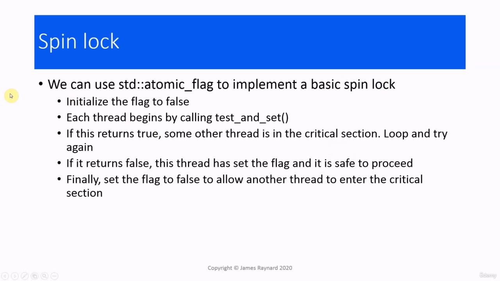

Let's try and break it down. So the code would look like this. We create the flag value and initialize it to false. We have a thread function which calls test_and_set() on this flag variable. This is in a loop. The way this works is that if test_and_set() returns false, then we are the thread that got to change the value and none of the other threads can do that. So if we execute the critical section, we will be the only thread that can do that. While are we doing that, all the other threads are calling test_and_set() and getting the return value true, which indicates that they have not changed the value, so they continue looping. Eventually, we get to the end of our critical section. We clear the flag. We set it to false. And then the next thread that calls test_and_set() will be able to change the value and then that thread can run its critical section. So let's go over this again. We initialize the flag to false, then each thread starts by calling

> 让我们试着把它分解。所以代码应该是这样的。我们创建标志值并将其初始化为 false。我们有一个线程函数，它对这个标志变量调用 test_and_set（）。这是一个循环。这样做的方式是，如果 test_and_set（）返回 false，那么我们就是要更改值的线程，其他线程都不能这样做。因此，如果我们执行关键部分，我们将是唯一可以执行该操作的线程。当我们这样做时，所有其他线程都在调用 test_and_set（）并获得返回值 true，这表明它们没有更改值，因此它们继续循环。最终，我们到达了关键部分的结尾。我们清除了国旗。我们将其设置为 false。然后，调用 test_And_set（）的下一个线程将能够更改该值，然后该线程可以运行其关键部分。所以让我们再复习一遍。我们将标志初始化为 false，然后每个线程通过调用

## img - 428540 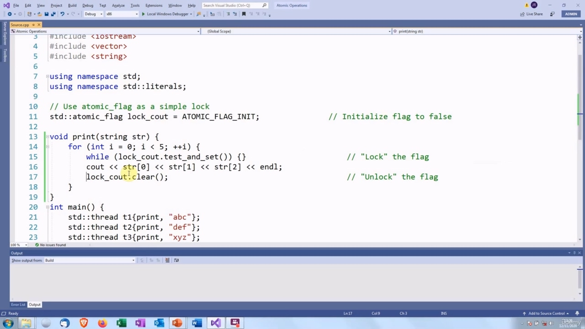

So let's go over this again. We initialize the flag to false, then each thread starts by calling test_and_set(). If this returns true, then it means some other thread is executing the critical section. So we loop and try again. If test_and_set() returns false, that means that we have set the flag and we can proceed into the critical section. And then when we exit the critical section, we set the flag to false. And that will allow another thread to enter the critical section. This is something that is known as a spin lock.

> 所以让我们再复习一遍。我们将标志初始化为 false，然后每个线程通过调用 test_and_set（）开始。如果返回 true，则表示其他线程正在执行关键部分。所以我们循环并重试。如果 test_and_set（）返回 false，这意味着我们已经设置了标志，可以进入关键部分。然后当我们退出关键部分时，我们将标志设置为 false。这将允许另一个线程进入关键部分。这就是所谓的旋转锁。

## img - 502330 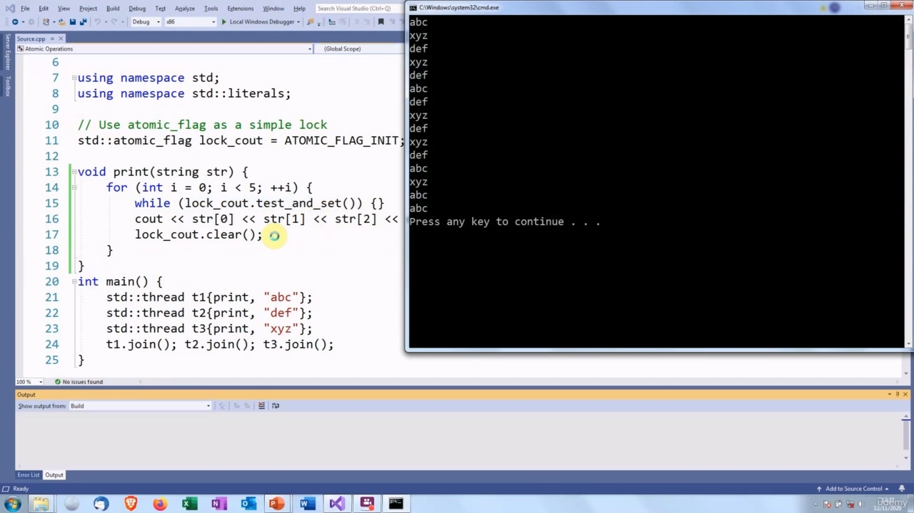

So let's have a look at this. We have gone back to the example we had near the start where we were printing out strings in threads within loops. In our print function, instead of having a mutex or a lock guard or a unique lock, we have this spinning test_and_set(). So there is our atomic flag. Initialized to false. Then each thread is calling test_and_set() before the critical region. If this returns true, we know some other thread is executing this code. And if it returns false then we know that we are the only one. And then we clear the flag at the end of the section. So let's see if this works. So there we are.

> 让我们来看看这个。我们回到了开始时的例子，我们在循环中的线程中打印字符串。在我们的 print 函数中，我们使用了这个旋转的 test_and_set（），而不是互斥锁、锁保护或唯一锁。这就是我们的原子旗。已初始化为 false。然后，每个线程在关键区域之前调用 test_and_set（）。如果返回 true，我们知道其他线程正在执行此代码。如果它返回错误，那么我们知道我们是唯一的一个。然后我们清除该部分末尾的标志。让我们看看这是否可行。我们就在这里。

## img - 550900 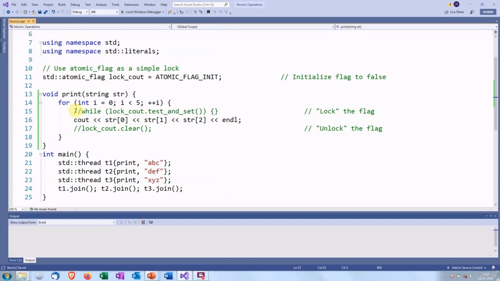

So there we are. That looks OK. Try it a few more times to make sure there are not any... No, we do not seem to be triggering it. And just to prove that this is doing something, let's comment these calls out.

> 我们就在这里。看起来不错。再尝试几次，以确保没有。。。不，我们似乎没有触发它。为了证明这是在做什么，让我们评论一下这些呼吁。

## img - 615010 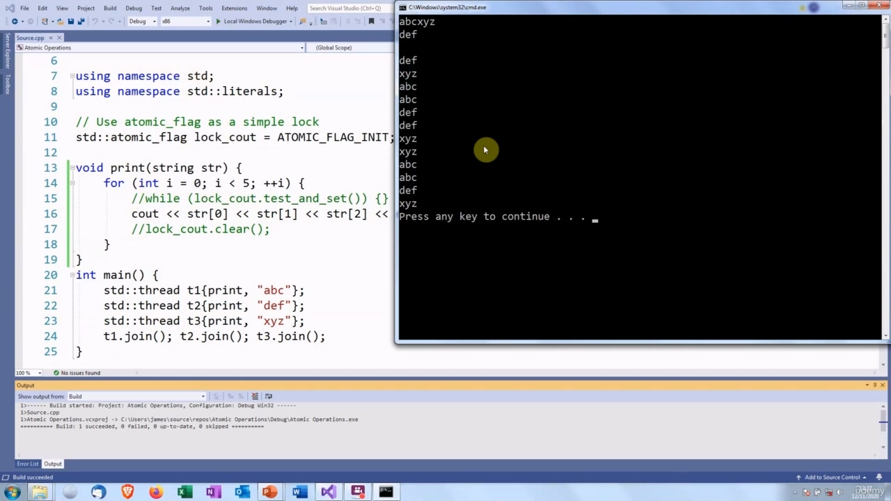

So it does not look quite so good.

> 所以看起来不太好。

## img - 615010 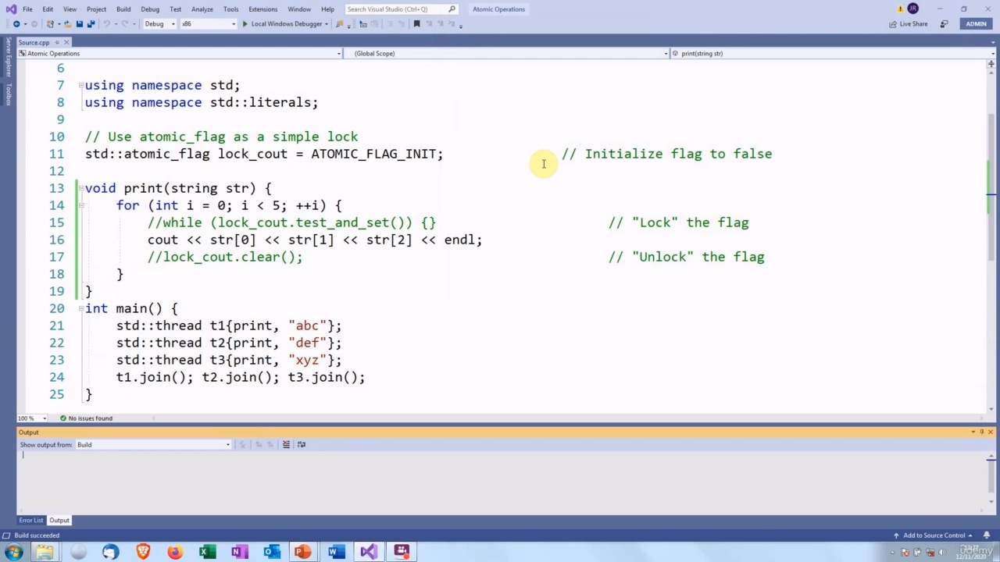

So it does not look quite so good. Let's see if we can get the race condition.

> 所以看起来不太好。让我们看看是否能得到比赛条件。

## img - 618260 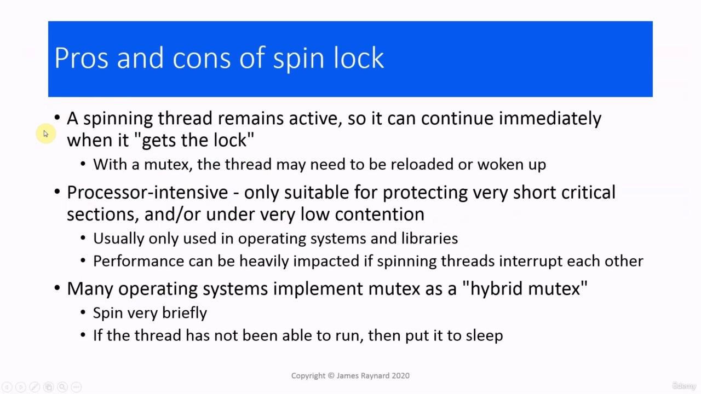

Let's see if we can get the race condition. There we are. So we have "abc" and "xyz" mixed up. So we get the data race when we remove the spin lock. And then if we put it back, it should work again. Okay. And then the headers are just normal ones. We use the header for atomic flag as well as for the atomic type.

> 让我们看看是否能得到比赛条件。我们到了。所以我们把“abc”和“xyz”混在一起了。因此，当我们移除旋转锁时，我们会进行数据竞赛。然后，如果我们把它放回去，它应该会再次工作。可以然后标题只是普通的标题。我们为原子标志和原子类型使用标头。

## img - 700700 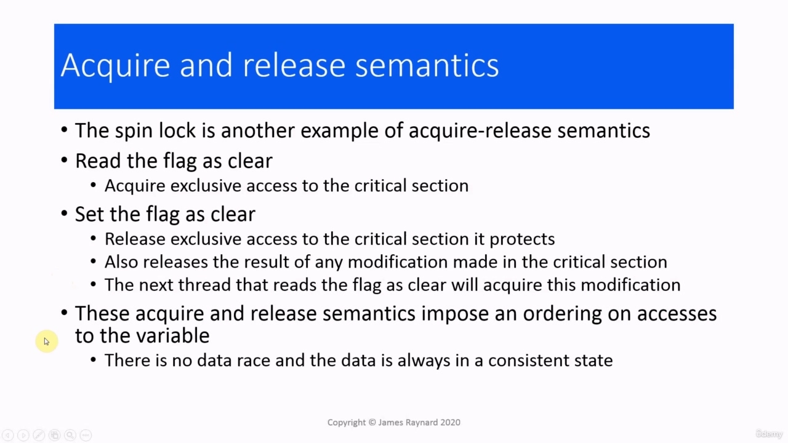

What are the advantages of a spin lock? One advantage is that when a thread is spinning, it remains active. It can execute immediately when the call to test_and_set() returns. With a mutex, the thread may have been put to sleep while it was waiting and the thread may need to be reloaded or even woken up. On the other hand, it is processor intensive. We have all these threads which are executing tight while loops. So all these processors are going to be running red hot! We should only do this for a very short period of time. So we need to keep the critical section very short when we are doing this. And also, if there is very low contention, if there are not many threads which are competing for the same spin lock. Because of this, spin locks tend to be used in operating systems and libraries rather than in application code. And one serious problem, if we have threads which are spinning and they interrupt each other, that can really hammer performance. So it does really need to be done by people who know what they are doing. One of the main applications of a spin lock is for implementing a mutex. Obviously, spin locks are not suitable for all mutexes if they have to wait a long time or if there is lots of contention. But many operating systems implement what is called a hybrid mutex. So they spin briefly to see if they can get the lock straight away. And if they cannot get the lock, then they do the full mutex. Let's quickly go through the reasons why the spin lock is thread-safe. Again, it comes down to acquire-release semantics. When a thread reads the flag as clear, it acquires exclusive access to the critical section. When a thread sets the flag as clear, it will release exclusive access to the critical section. And it will also release the result of any modification which was made in the critical section. The next thread that reads the flag as clear and requires exclusive access will also acquire the result of those modifications. So when we have one thread that prints some output and then the next thread prints some output, the second thread will get the modified state of the output stream and it will not interleave its output. So these acquire and release semantics impose the "happens before" ordering on accesses to the variable or critical section. There is no data race and the program is always in a consistent state. Okay, so that's it for this video. I'll see you next time.

> 旋转锁的优点是什么？一个优点是，当线旋转时，它保持活动。它可以在调用 test_and_set（）返回时立即执行。使用互斥锁时，线程在等待时可能已进入休眠状态，线程可能需要重新加载甚至唤醒。另一方面，它是处理器密集型的。我们有所有这些线程都在紧密地执行 while 循环。因此，所有这些处理器都将运行得异常火爆！我们只能在很短的时间内这样做。所以我们在做这件事的时候，需要把关键部分保持得很短。而且，如果争用非常低，如果没有太多线程在竞争同一个自旋锁。因此，自旋锁往往用于操作系统和库中，而不是应用程序代码中。还有一个严重的问题，如果我们有线程在旋转，它们会相互中断，这会严重影响性能。因此，这确实需要知道自己在做什么的人来做。自旋锁的主要应用之一是实现互斥锁。显然，如果自旋锁必须等待很长时间或存在大量争用，那么它们并不适合所有互斥锁。但许多操作系统实现了所谓的混合互斥。因此，他们短暂地旋转，看看能否立即锁定。如果他们无法获得锁，那么他们会执行完全互斥。让我们快速了解自旋锁是线程安全的原因。再次，它归结为获取发布语义。当线程将标志读取为 clear 时，它将获得对关键部分的独占访问权。当线程将标志设置为清除时，它将释放对关键部分的独占访问。它还将发布关键部分所做的任何修改的结果。下一个将标志读取为 clear 并需要独占访问的线程也将获取这些修改的结果。因此，当我们有一个线程打印一些输出，然后下一个线程输出一些输出时，第二个线程将获得输出流的修改状态，并且不会交错其输出。因此，这些获取和释放语义对变量或关键部分的访问施加了“发生在”排序。没有数据竞争，程序始终处于一致状态。好了，这个视频就到此为止。下次见。
