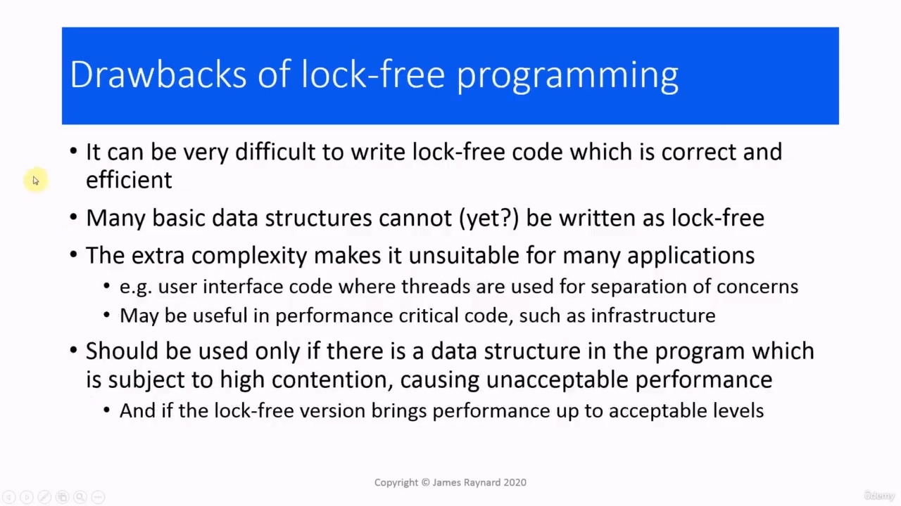
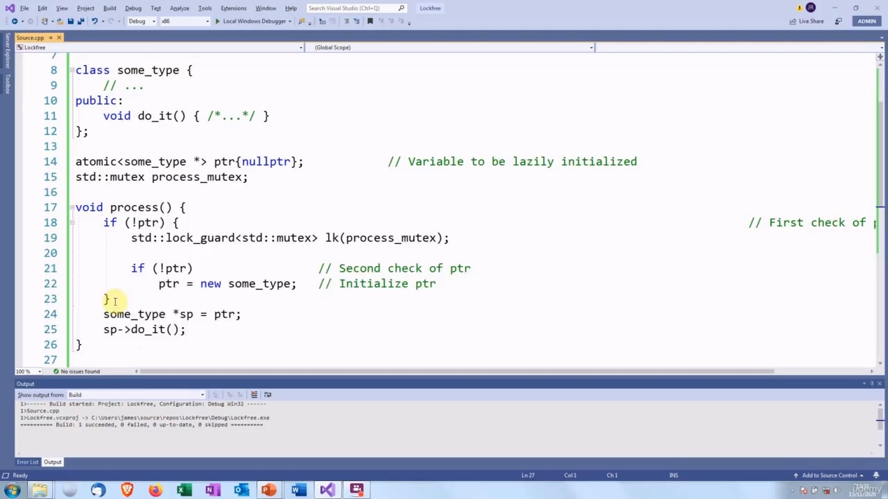

Hello again! In this video, we are going to talk about lock-free programming.

> 你好！在本视频中，我们将讨论无锁编程。

## img - 3990

In this video, we are going to talk about lock-free programming. A lock-free program is one in which threads can safely execute critical sections without needing help from

> 在本视频中，我们将讨论无锁编程。无锁程序是线程可以安全地执行关键部分而不需要来自

## img - 12960

A lock-free program is one in which threads can safely execute critical sections without needing help from the operating system to provide locks. A lock-free programs can avoid or at least reduce some of the drawbacks to using locks. We have seen you can get a race condition, if you do not lock or if you use the wrong mutex. If you have multiple mutexes there is the risk of deadlock. Something we have not mentioned - I don't think - is the overhead of using mutexes. Mutexes are actually managed by the operating system. So when a program locks or unlocks a mutex, it has to make a call to the operating system. It will stop running its own code. It will wait for the operating system to respond. And then the operating system will need to update some of its internal data structures before the program can continue. If we have a linked list with one mutex which is used for every access, then that means that only one thread can access any element in that list at any one time. And that reduces the scalability because in effect, when the program accesses that list, it becomes a single threaded program. At the opposite extreme, if we have fine-grained locking in a linked list, we lock the element and the ones surrounding it, that will make the program much more complex and add more overhead because we are doing all this locking.

> 无锁程序是一种线程可以安全地执行关键部分而无需操作系统帮助提供锁的程序。无锁程序可以避免或至少减少使用锁的一些缺点。我们已经看到，如果您不锁定或使用了错误的互斥锁，您可以获得竞争条件。如果您有多个互斥锁，则存在死锁的风险。我们没有提到（我不认为）使用互斥锁的开销。互斥体实际上由操作系统管理。因此，当程序锁定或解锁互斥锁时，它必须调用操作系统。它将停止运行自己的代码。它将等待操作系统响应。然后，操作系统需要更新一些内部数据结构，程序才能继续。如果我们有一个链接列表，其中有一个互斥锁用于每次访问，那么这意味着在任何时候只有一个线程可以访问该列表中的任何元素。这降低了可伸缩性，因为实际上，当程序访问该列表时，它变成了一个单线程程序。在相反的极端，如果我们在链接列表中有细粒度的锁定，我们将锁定元素及其周围的元素，这将使程序更加复杂，并增加更多的开销，因为我们正在进行所有这些锁定。

## img - 143300

Using locks also affects composability. If you have a function which takes a lock, then you should not call any functions which might take a lock, even if it is a different mutex.

> 使用锁也会影响可组合性。如果您有一个接受锁的函数，那么您不应该调用任何可能接受锁的功能，即使它是不同的互斥锁。

## img - 156880

The great advantage of lock-free programming is, if you do it correctly, threads can never get blocked. Unless they actually want to. You cannot have deadlock or livelock because there are not any locks. If a thread is blocked, waiting for a resource, other threads can still continue to execute.

> 无锁编程的最大优点是，如果正确执行，线程永远不会被阻塞。除非他们真的想这样做。你不能有死锁或活锁，因为没有锁。如果一个线程被阻塞，等待资源，其他线程仍然可以继续执行。

## img - 208020

If a thread is blocked, waiting for a resource, other threads can still continue to execute. And this is very useful if you have work that must be done within a fixed time limit. For example, real time systems where something has to be done in the next so many milliseconds or by a certain time. Some applications where this is useful: double-checked locking, reference counters and spin locks.

> 如果一个线程被阻塞，等待资源，其他线程仍然可以继续执行。如果你有工作必须在固定的时间内完成，这是非常有用的。例如，在实时系统中，某些事情必须在接下来的几毫秒内或某个时间内完成。在一些应用中，这是有用的：双重检查锁定、引用计数器和自旋锁。

## img - 237600

One way you can think about programming with and without locks is to think about traffic intersections. So the traffic junction corresponds to the critical section and the actual different vehicles in the traffic correspond to different threads. Obviously, all these vehicles want to get through the intersection as quickly as possible. But if they try to do that, there will be a horrible collision. One way to do this is to have traffic lights or a policeman who will control access. Everyone has to stop and wait until they can go into the critical section. And that is analogous to locks. Another alternative is the kind of intersections that you have on motorways [freeways]. So big, complex roundabouts in the air, slip roads, and that is analogous to lock free. Instead of having one central person organizing everything, the traffic organizes itself or at least tries to. In this kind of intersection, traffic from different levels can go over the same section at the same time, and the traffic from one level, that is one thread, can merge with traffic from a different level without having to stop. Obviously, this all has to be done very carefully, otherwise there will be a collision.

> 一种可以考虑带锁和不带锁编程的方法是考虑交通路口。因此，交通路口对应于关键路段，交通中的实际不同车辆对应于不同的线程。显然，所有这些车辆都希望尽快通过十字路口。但如果他们试图这样做，就会发生可怕的碰撞。这样做的一种方法是让交通灯或警察控制出入。每个人都必须停下来等待，直到他们可以进入关键部分。这类似于锁。另一种选择是高速公路上的交叉口。如此大、复杂的空中环形交叉口、支路，类似于无锁。在这种交叉口中，来自不同级别的交通可以同时通过同一路段，而来自一个级别（即一个线程）的交通可以与来自另一级别的交通合并，而不必停止。显然，这一切都必须非常小心地进行，否则会发生冲突。

## img - 345380

Obviously, this all has to be done very carefully, otherwise there will be a collision. The drawbacks of lock-free programming are that it is very difficult. Writing lock-free code, which

> 显然，这一切都必须非常小心地进行，否则会发生冲突。无锁编程的缺点是非常困难。编写无锁代码

## img - 355520

The drawbacks of lock-free programming are that it is very difficult. Writing lock-free code, which is correct and efficient, can often defeat experts. I have seen examples of code that was written by an expert and checked by another expert, that still had a subtle bug in it. Many basic data structures cannot be written as lock-free. For example, the basic double-linked list,

> 无锁编程的缺点是非常困难。编写正确且高效的无锁代码常常会击败专家。我见过由一位专家编写并由另一位专家检查的代码示例，其中仍然有一个微妙的错误。许多基本数据结构不能写成无锁的。例如，

## img - 416790

Many basic data structures cannot be written as lock-free. For example, the basic double-linked list, which is fairly straightforward, you might think. No one has yet found an algorithm for writing that in a lock-free way. Or at least that was the case a couple of years ago. Lock-free programming is conceptually very complicated.

> 许多基本数据结构不能写为无锁。例如，基本的双链接列表，您可能会认为它相当简单。目前还没有人找到一种以无锁方式编写该代码的算法。或者至少几年前就是这样。无锁编程在概念上非常复杂。

## img - 430890

Lock-free programming is conceptually very complicated. We are not really going to go into that. But a lot of the assumptions that you normally make about programs will break down. For example, one of the basic assumptions we make is that we write some code and it is going to be executed in the order that we wrote it. That's not necessarily true in lock-free programming. And this complexity makes it unsuitable for many applications.

> 无锁编程在概念上非常复杂。我们真的不打算对此进行讨论。但你通常对程序所做的许多假设都会失败。例如，我们所做的一个基本假设是，我们编写了一些代码，它将按照我们编写的顺序执行。这在无锁编程中不一定是正确的。这种复杂性使得它不适合许多应用。

## img - 455020

And this complexity makes it unsuitable for many applications. If, for example, you are writing a GUI application where you are using threads to keep the various functional features of the program separate, then there is no advantage to making that lock-free. On the other hand, if you have something where performance really is critical, such as infrastructure in a financial system, for example, then there may be some benefit from using lock-free programming. In general, lock-free programming should only be used if there is some data structure in the program

> 这种复杂性使得它不适合许多应用。例如，如果您正在编写一个 GUI 应用程序，其中使用线程来保持程序的各种功能特性分离，那么释放锁没有任何好处。另一方面，如果您有一些性能非常关键的东西，例如金融系统中的基础设施，那么使用无锁编程可能会带来一些好处。通常，只有在程序中有一些数据结构时，才应使用无锁编程

## img - 527930

In general, lock-free programming should only be used if there is some data structure in the program which is subject to high contention. In a financial application, this could be the buffer which receives all the incoming orders and using locks causes unacceptable performance. In that example, there would be a good case for writing a lock-free version, provided, of course, it does actually offer the performance that is needed. Right, one last thing before we finish this section. Let's come back to double checked looking.

> 一般来说，只有当程序中有一些数据结构受到高度竞争时，才应该使用无锁编程。在金融应用程序中，这可能是接收所有传入订单的缓冲区，使用锁会导致无法接受的性能。在那个例子中，编写一个无锁版本是一个很好的例子，当然前提是它确实提供了所需的性能。好的，在我们完成本节之前还有最后一件事。让我们回到仔细检查。

## img - 555360

Right, one last thing before we finish this section. Let's come back to double checked looking. We've seen it several different ways and now we are going to look at the classic way of solving it. Before C++11, this was the only way to do it.

> 好的，在我们完成本节之前还有最后一件事。让我们回到仔细检查。我们已经看到了几种不同的方法，现在我们来看看解决它的经典方法。在 C++11 之前，这是唯一的方法。

## img - 609870

Obviously, C++ did not support threads or atomic variables, but there were libraries that allowed you to do this. You will remember that the double checked looking problem, is to initialize a variable and make sure it only gets initialized once. The classic solution is that we make the variable that we are initializing atomic. So we have a pointer to some type and then we make that atomic. And that will solve the problem where we had the race condition with the value of the pointer not necessarily being updated when the object was initialized. One slight complication is that atomic types do not have any dereferencing operators. If we want to do anything with this pointer, we will will have to copy it to a normal non-atomic pointer before we can use it. So we could do something like that. Well, we could use a cast, but generally casts are a bad idea. And in any case, the cast will do exactly the same thing. So there is no gain from doing that. So the code would look like this, we have the class that we want to create an instance of. We have

> 显然，C++不支持线程或原子变量，但有一些库允许您这样做。您将记住，双重检查问题是初始化一个变量，并确保它只初始化一次。经典的解决方案是，我们将初始化的变量设为原子变量。所以我们有一个指向某种类型的指针，然后我们把它变成原子。这将解决这样一个问题，即在初始化对象时，指针的值不必被更新。一个稍微复杂的问题是原子类型没有任何解引用运算符。如果我们想用这个指针做任何事情，我们必须在使用它之前将它复制到一个普通的非原子指针。所以我们可以这样做。嗯，我们可以使用石膏，但通常石膏是个坏主意。无论如何，演员们都会做同样的事情。所以这样做没有好处。所以代码看起来像这样，我们有一个要创建其实例的类。我们有

## img - 717320

So the code would look like this, we have the class that we want to create an instance of. We have the instance that we have made atomic. We have the mutex that is going to do the locking. And then the actual code for doing the double checked looking is exactly the same. The difference is that this ptr variable is atomic, so we are guaranteed that the assignment is not interruptible. So there is no possibility another thread could come in and see a partially initialized or uninitialized object. And then we have to get a normal, non-atomic pointer to actually do anything with it. And the rest of the program is just normal stuff, we just create some threads.

> 所以代码看起来像这样，我们有一个要创建其实例的类。我们有一个例子，我们制造了原子。我们有一个互斥锁来执行锁定。然后，进行双重检查的实际代码完全相同。不同的是，这个 ptr 变量是原子的，所以我们保证赋值不可中断。因此，不可能有其他线程进入并看到部分初始化或未初始化的对象。然后我们必须得到一个正常的非原子指针来实际使用它。程序的其余部分只是正常的东西，我们只是创建一些线程。

## img - 805160

And join on them. The headers are what you would expect.

> 加入他们。标题是您所期望的。

## img - 810780

OK.

> 好啊
