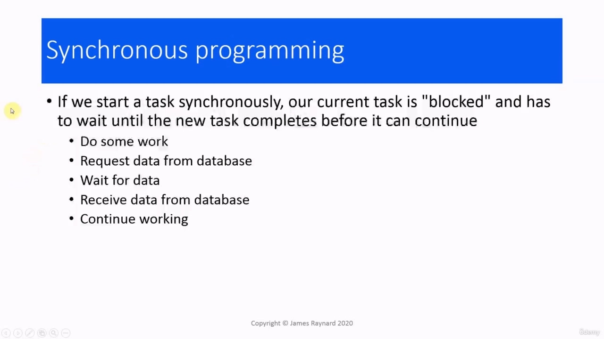
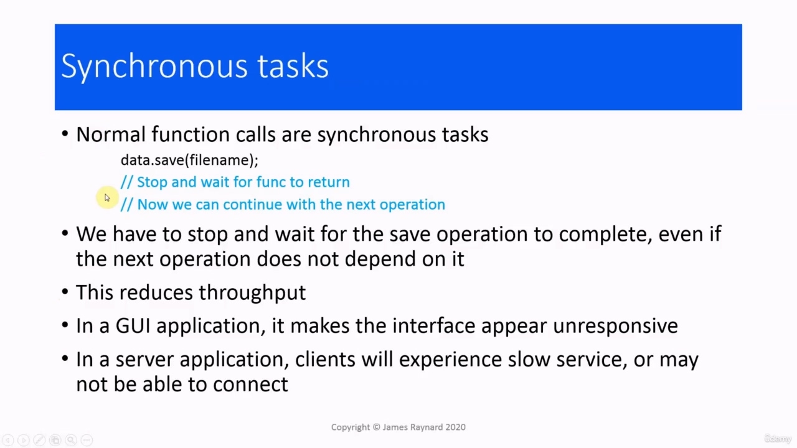
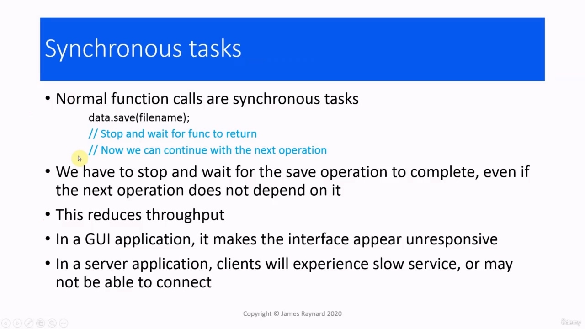
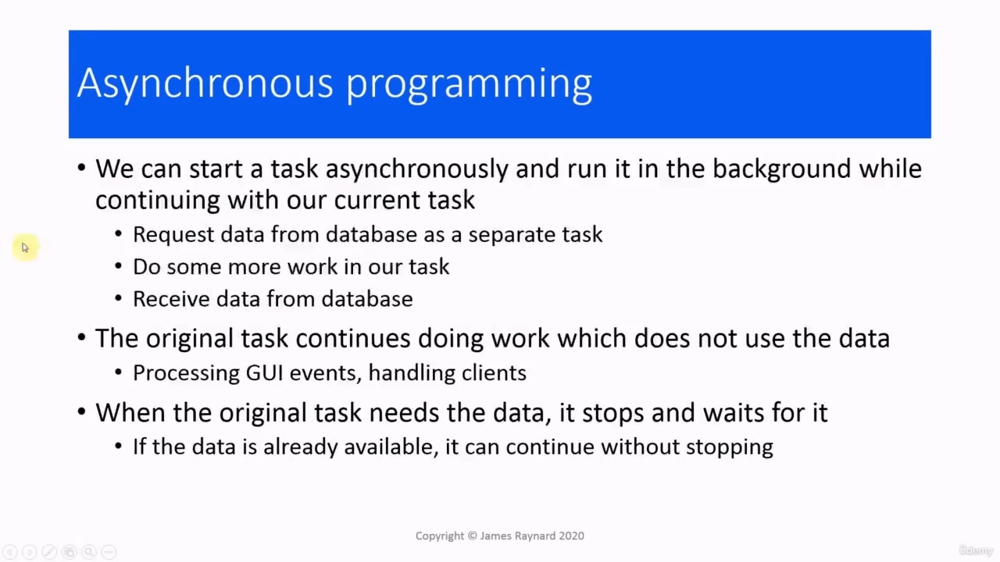
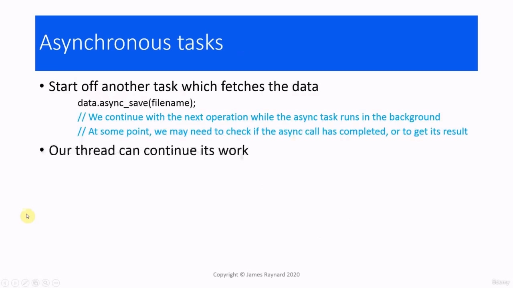
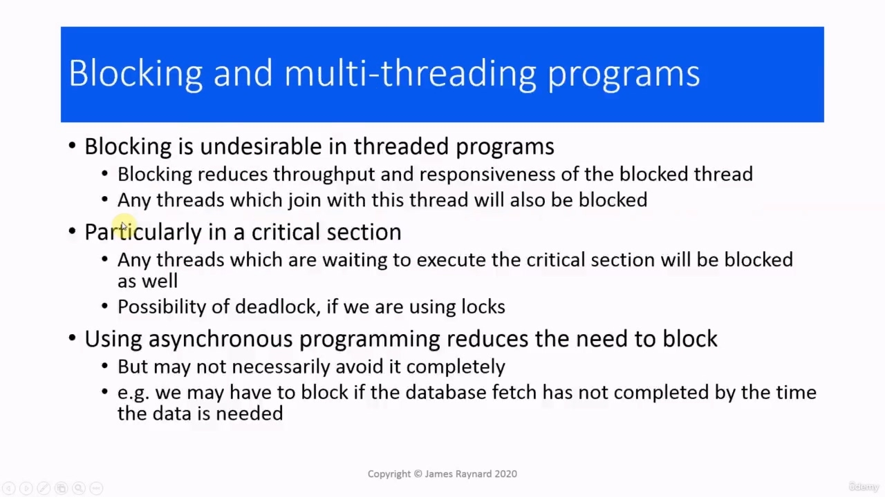
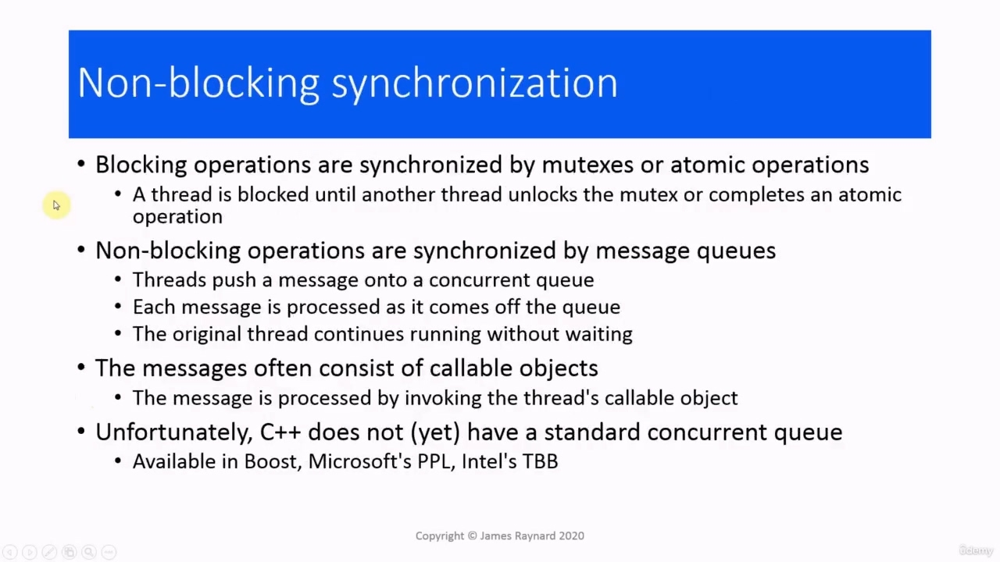
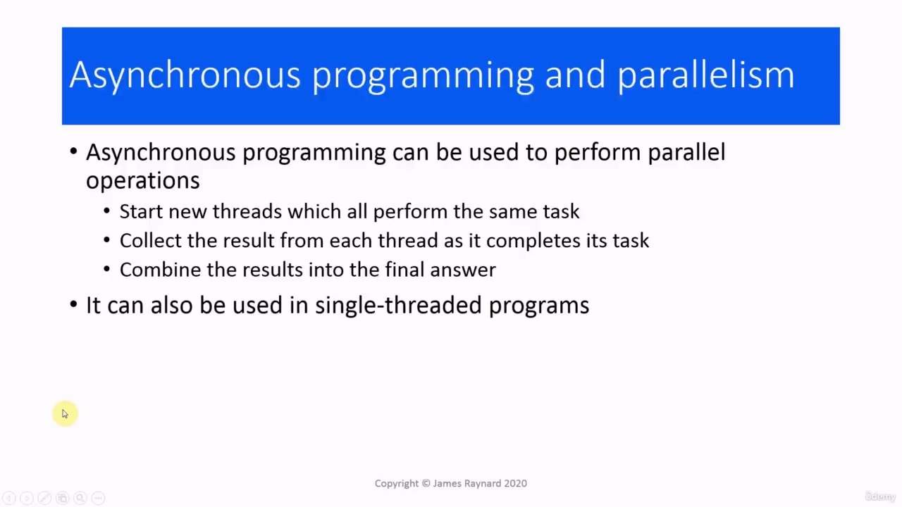
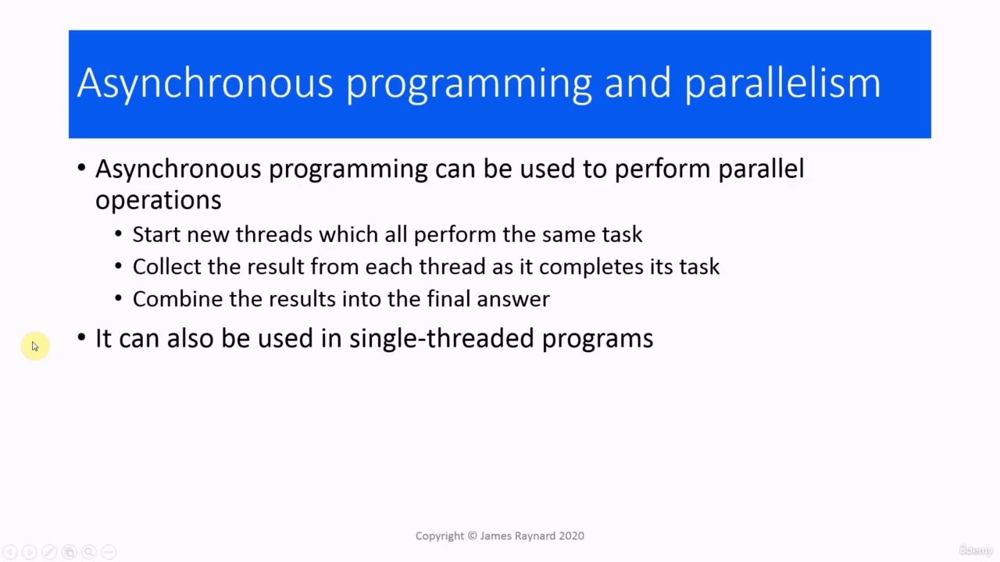

Hello there! In this video, we are going to talk about asynchronous programming Hello there! In this video, we are going to talk about asynchronous programming Operations can be performed synchronously or asynchronously. When they are synchronous,

> 你好！在本视频中，我们将讨论异步编程大家好！在本视频中，我们将讨论异步编程操作可以同步或异步执行。当它们是同步的时，

## img - 12000 

Operations can be performed synchronously or asynchronously. When they are synchronous, this means that when we start an operation, we wait until it finishes before we start the next one. When we are doing asynchronous operations, it means we can start another one straight away. We do not need to wait for the first one to complete. As an analogy, you can think of a synchronous operation as being like buying things in a shop. If something goes wrong with your computer and you need a new part, then you go to the shop, you wait to be served, you ask for the part, you agree to buy it, you pay for it. Then you come home and then you can plug in the new part and use your computer. With an asynchronous operation, you would do some clicks, then you would go away and do something else which does not involve your computer (if there is such a thing!) And then some time later on, the part will arrive and then you can plug it into your computer. So you can go in and do other things without waiting for the computer parts to arrive.

> 操作可以同步或异步执行。当它们是同步的时，这意味着当我们开始一个操作时，我们会等到它完成后再开始下一个操作。当我们进行异步操作时，这意味着我们可以立即开始另一个操作。我们不需要等待第一个任务完成。作为一个类比，你可以把同步操作想象成在商店里买东西。如果你的电脑出了问题，你需要一个新的部件，那么你去商店，等待服务，你要这个部件，你同意购买它，你支付它。然后你回家，然后你可以插上新的部件并使用你的电脑。在异步操作中，你会点击几下，然后你会走开，做一些其他不涉及你的电脑的事情（如果有这样的事情！），然后过一段时间，零件会到达，然后你可以将它插入你的电脑。这样你就可以进去做其他事情，而不必等待电脑部件的到来。

## img - 118550 

In synchronous programming, if we start a new task to do some work, then our current task will have to stop and wait until the new task completes. For example, we could do some work, then request data from the database, so we start a new task which will fetch the data. Then we wait for the data. Then this task will complete and then we get the data and then we can continue with the next stage in our program.

> 在同步编程中，如果我们启动一个新任务来做一些工作，那么我们的当前任务将不得不停止并等待新任务完成。例如，我们可以做一些工作，然后从数据库中请求数据，因此我们启动一个新的任务来获取数据。然后我们等待数据。然后这个任务就完成了，然后我们得到了数据，然后我们可以继续我们程序的下一个阶段。

## img - 153790 

An example of a synchronous task is a normal C++ function call. For example, if we call a member function to save some data in a file, we stop and wait until the function returns. And then we execute

> 同步任务的一个示例是正常的 C++函数调用。例如，如果我们调用一个成员函数将一些数据保存在文件中，我们会停止并等待该函数返回。然后我们执行

## img - 200930 

function to save some data in a file, we stop and wait until the function returns. And then we execute the next operation in the program.

> 函数将一些数据保存在文件中，我们停止并等待函数返回。然后我们执行程序中的下一个操作。

## img - 203380 

the next operation in the program. We have to stop and wait for this to complete, even if we go on to do something that does not actually rely on the data being saved. So this time that we stop and wait for the data is "dead" time really, and this reduces the throughput of the program. If we have a GUI application, then the program will not be able to process user events and the program will appear unresponsive. If we are writing a server application, clients will notice that the website is getting slow or they may even not be able to connect.

> 程序中的下一个操作。我们必须停下来等待完成，即使我们继续做一些实际上不依赖于保存的数据的事情。所以这一次我们停止并等待数据真的是“死”时间，这降低了程序的吞吐量。如果我们有一个 GUI 应用程序，那么程序将无法处理用户事件，并且程序将显示为无响应。如果我们正在编写服务器应用程序，客户会注意到网站速度变慢，甚至无法连接。

## img - 250480 

When we start a task asynchronously, it will continue to run in the background while we can carry on doing our current task. So in the database example, we would start a new task which requests the data. Then we would carry on in the current task and do some more work. And then at some point we would get the data from the database. And we can carry on doing work in our original task so long as we do not actually need the data. So we can process GUI events, handle client connections and so on. When we get to the point where we really cannot manage without it, we have to stop and wait. So if we ordered our computer parts online and this has not arrived yet, we just have to sit in front of our computer and wait for it. On the other hand, if the data is already available, we can continue without stopping. If the part has arrived, we can just plug it in and carry on.

> 当我们异步启动任务时，它将继续在后台运行，而我们可以继续执行当前任务。因此，在数据库示例中，我们将启动一个请求数据的新任务。然后我们将继续当前的任务，并做更多的工作。然后在某个时候，我们会从数据库中获取数据。而且，只要我们实际上不需要数据，我们就可以继续执行我们原来的任务。因此，我们可以处理 GUI 事件，处理客户端连接等等。当我们到了没有它确实无法管理的地步时，我们必须停止并等待。因此，如果我们在网上订购了电脑部件，但这些部件还没有到货，我们就只能坐在电脑前等待。另一方面，如果数据已经可用，我们可以继续，不停地等待。如果零件到了，我们可以插上电源继续工作。

## img - 348330 

As an example of an asynchronous task, we could save the data to file asynchronously. And then we can carry on executing instructions in our own task while the disks are spinning around. At some point, we may need to check whether the asynchronous operation is completed or we may need to get some results from it.

> 作为异步任务的示例，我们可以将数据异步保存到文件中。然后，当磁盘旋转时，我们可以在自己的任务中继续执行指令。在某些时候，我们可能需要检查异步操作是否完成，或者我们可能需要从中获得一些结果。

## img - 412240 

When we are writing threaded programs, we try to avoid blocking (when the thread has to stop and wait). This reduces the throughput and responsiveness of the thread which is being blocked. And also any threads which are joined on that thread are also going to be blocked. Blocking in a critical section is particularly bad. Any other threads which wants to execute that critical section are going to be blocked as well. And if we are using locks to protect the critical section, then there is the risk of deadlock. If we use asynchronous programming techniques, we can reduce the need for threads to block. We cannot actually avoid it completely. It may be that the asynchronous operation does not complete in time, so we have to stop and wait for it. But even in that case, we can at least get some work done instead of just sitting there and idly waiting.

> 当我们编写线程程序时，我们尽量避免阻塞（当线程必须停止并等待时）。这会降低被阻塞线程的吞吐量和响应能力。而且，连接到该线程上的任何线程也将被阻塞。关键部位的堵塞尤其严重。任何其他想要执行该关键部分的线程也将被阻止。如果我们使用锁来保护关键部分，那么就有死锁的风险。如果我们使用异步编程技术，我们可以减少线程阻塞的需要。我们实际上无法完全避免。可能是异步操作没有及时完成，所以我们必须停止并等待它。但即使在这种情况下，我们至少可以完成一些工作，而不是坐在那里无所事事地等待。

## img - 507560 

When we have operations that block, they are synchronized by mutexes or operations on atomic variables. A thread will remain blocked until another thread unlocks the mutex that it is waiting for, or completes an operation on an atomic variable that it wants to access. When we have non-blocking operations, these are synchronized by message queues. The threads will push a message onto a queue. This is a concurrency queue, so it is thread-safe. Each of these messages is processed as it comes off the queue. Then the threads which pushed the messages will continue running without waiting. So, in effect, each thread is sending an order to Amazon and Amazon is processing the orders as they come in. This is often implemented by using messages which consist of callable objects, and the message processing involves invoking that callable object as a thread. Unfortunately, writing a safe and efficient concurrent queue with multiple consumers and producers

> 当我们有阻塞的操作时，它们会通过互斥锁或对原子变量的操作进行同步。一个线程将保持阻塞状态，直到另一个线程解锁它正在等待的互斥锁，或者完成对它想要访问的原子变量的操作。当我们有非阻塞操作时，这些操作由消息队列同步。线程会将消息推送到队列中。这是一个并发队列，因此它是线程安全的。这些消息中的每一条都在离开队列时进行处理。然后，推送消息的线程将继续运行而无需等待。因此，实际上，每个线程都向 Amazon 发送一个订单，Amazon 在收到订单时处理订单。这通常是通过使用由可调用对象组成的消息来实现的，消息处理包括将可调用对象作为线程调用。不幸的是，与多个消费者和生产者一起编写安全高效的并发队列

## img - 610820 

Unfortunately, writing a safe and efficient concurrent queue with multiple consumers and producers is very difficult. C++ does not have one yet. It is not going to be in C++ 20, unfortunately. There are implementations in various libraries, including Boost, Microsoft's parallel processing library and Intel's thread building blocks. We are also going to have a go at writing one later in this course, although it will be a bit simpler.

> 不幸的是，编写一个具有多个消费者和生产者的安全高效的并发队列非常困难。C++还没有。不幸的是，它不会出现在 C++20 中。在各种库中都有实现，包括 Boost、Microsoft 的并行处理库和 Intel 的线程构建块。在本课程的后面，我们还将尝试编写一个，尽管它会更简单一些。

## img - 643700 

Finally, we can also use asynchronous programming techniques for parallel operations. For example, computations involving large arrays or matrixes. So we start some new threads which all perform the same task, but give them different parts of the data to operate on. Then when each thread completes the task, we collect its results and then we go through and combine all these partial results to get the final answer. One other point: asynchronous programming is not thread specific. There are asynchronous programming techniques which can be used in single-threaded programs. Even in old MS-DOS you could print something out in the background, but that is getting away from threads really.

> 最后，我们还可以将异步编程技术用于并行操作。例如，涉及大型阵列或矩阵的计算。因此，我们启动一些新的线程，这些线程都执行相同的任务，但给它们不同的数据部分进行操作。然后，当每个线程完成任务时，我们收集其结果，然后我们遍历并组合所有这些部分结果以获得最终答案。还有一点：异步编程不是特定于线程的。有异步编程技术可用于单线程程序。即使在旧的 MS-DOS 中，您也可以在后台打印一些内容，但这实际上是在远离线程。
