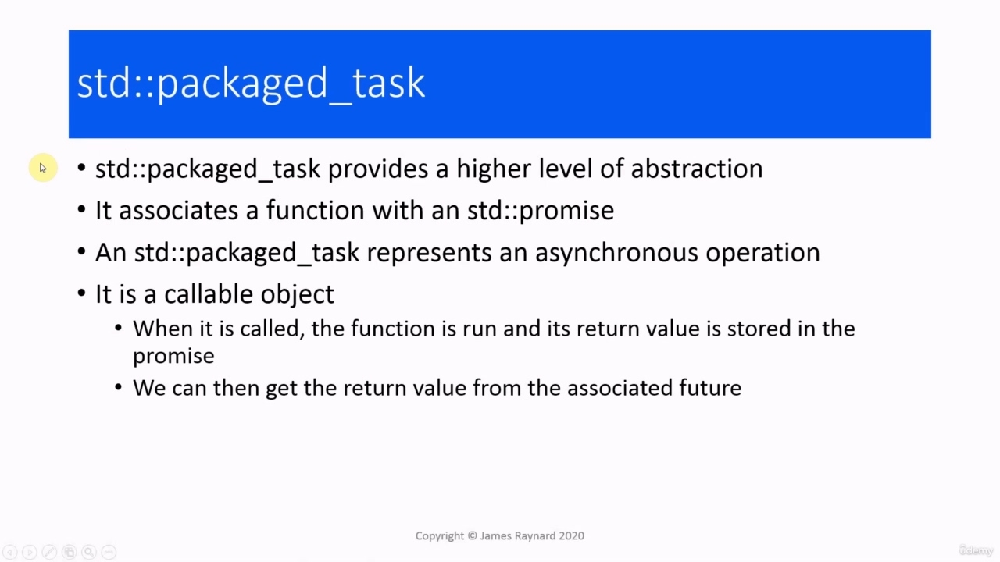
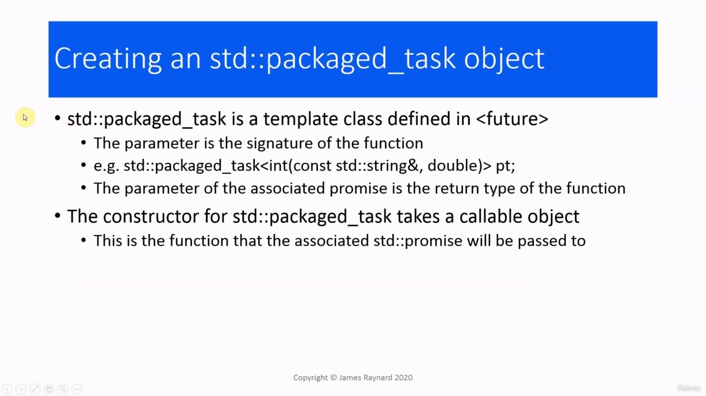
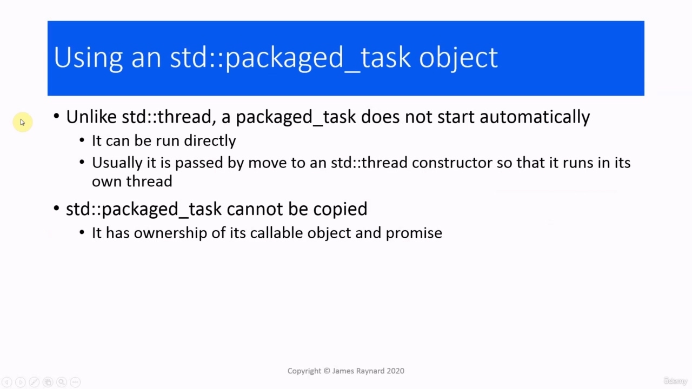
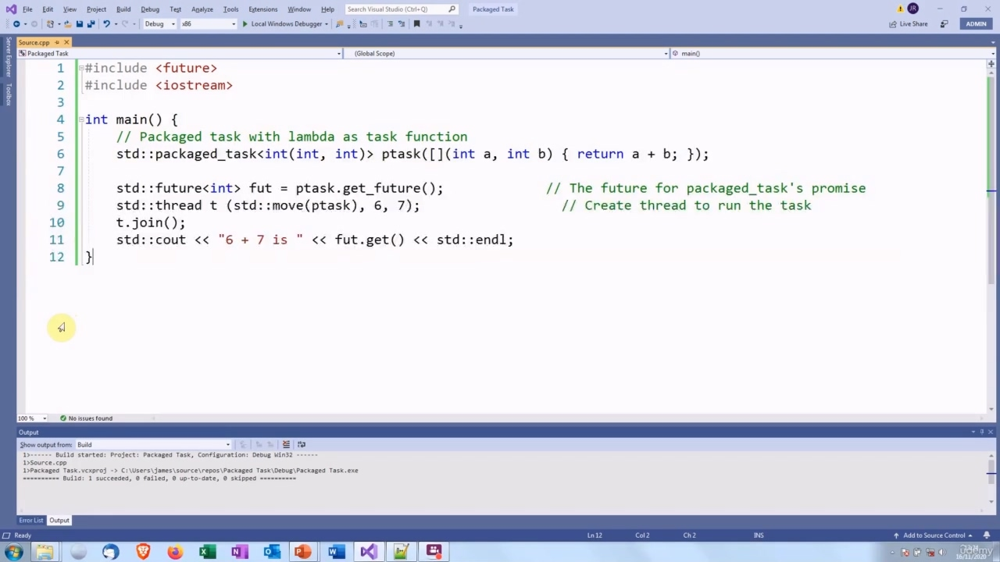
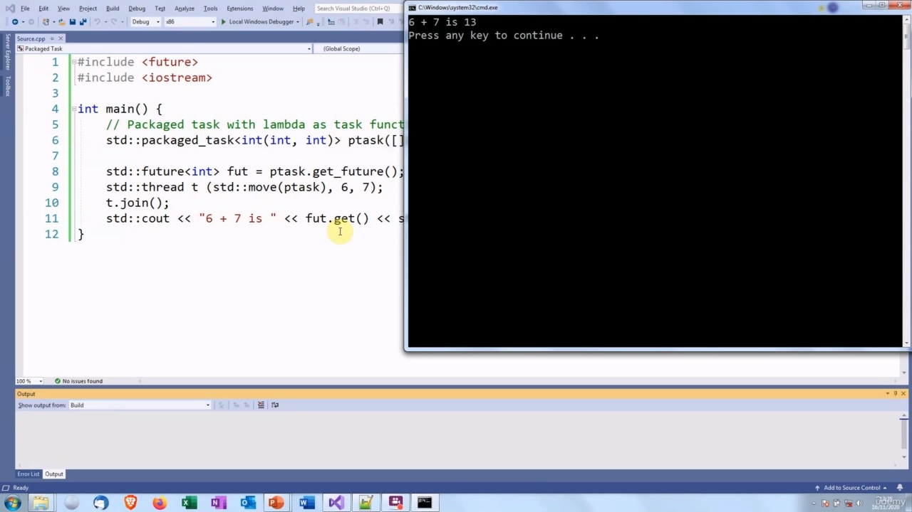
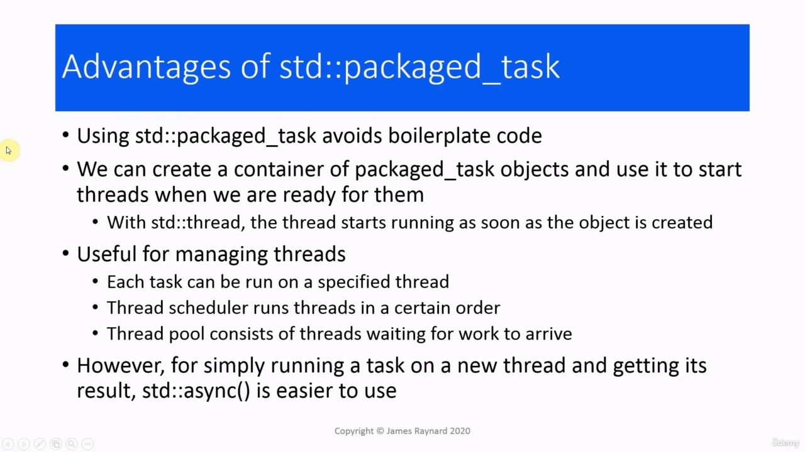

Hello again! In this video, we are going to look at the packaged task. In the last video we spoke about asynchronous programming and that may have reminded you of futures, and futures are very much connected with asynchronous

> 你好！在本视频中，我们将查看打包的任务。在上一个视频中，我们谈到了异步编程，这可能让您想起了未来，而未来与异步编程有着密切的联系

## img - 13500

programming and that may have reminded you of futures, and futures are very much connected with asynchronous programming. So this is the first example in which we are going to use futures with asynchronous programming.

> 编程，这可能让你想起了期货，期货与异步编程有着密切的联系。这是我们将在异步编程中使用期货的第一个示例。

## img - 27190

The packaged task class really bundles together everything you need to run a thread and to get a return from it, so it is a higher level of abstraction than using threads directly. The packaged task will associate a function with a promise object, so this is a bit like the producer function in the producer-consumer model we had earlier. We had a producer function which takes a promise as argument. The packaged task represents an asynchronous operation. A packaged task object is callable. When we invoke it, the associated function is run and the return value from the function is stored in the promise. So this is rather like the producer function, which is run in a thread and the return value is stored We can also obtain the future which is associated with the promise inside the packaged task, and then we can call get() on that future and that will return the value from the function.

> 打包的任务类实际上将运行线程并从中获得回报所需的一切打包在一起，因此它比直接使用线程更高级别的抽象。打包的任务会将一个函数与一个 promise 对象相关联，所以这有点像我们之前使用的生产者-消费者模型中的生产者函数。我们有一个生产者函数，它将承诺作为参数。打包的任务表示异步操作。打包的任务对象是可调用的。当我们调用它时，关联的函数将运行，函数的返回值将存储在 promise 中。因此，这相当于生产者函数，它在线程中运行，返回值被存储。我们还可以获得与打包任务中的 promise 相关联的 future，然后我们可以对该 future 调用 get（），这将从函数返回值。

## img - 129070

The packaged_task class is templated. It is in the header. The parameter for the packaged test is - well, more or less - the signature of the function. If we have a function which takes a string by const reference and double and returns an int, the template parameter would be int, open bracket then const reference to string, comma double, close bracket. The promise associated with that packaged task also has a parameter and that will be the return type So that will be set up by the packaged task. When we create an instance of packaged_task, we pass it a callable object. And that will be the equivalent of the producer function with the promise.

> packaged_task 类已模板化。它在页眉中。打包测试的参数或多或少是函数的签名。如果我们有一个函数，它通过 const 引用和 double 获取字符串并返回一个 int，那么模板参数将是 int，开括号，然后 const 引用字符串，逗号 double，闭括号。与打包任务相关联的 promise 也有一个参数，它将是由打包任务设置的返回类型 So。当我们创建 packaged_task 的实例时，我们传递给它一个可调用的对象。这将等同于生产者函数和承诺。

## img - 225730

When we create a packaged task, nothing will actually happen. By default, the thread will not be run until the packaged task is started. It is possible to start a packaged task directly, but normally we would create a thread instance which has the packaged task as its argument. The packaged task will be passed by move and that will cause the packaged task function to run in its own thread. The packaged task has ownership of the callable object and the promise, so it can be moved but not copied.

> 当我们创建打包任务时，实际上不会发生任何事情。默认情况下，在启动打包任务之前，不会运行线程。可以直接启动打包任务，但通常我们会创建一个以打包任务为参数的线程实例。打包任务将通过 move 传递，这将导致打包任务函数在自己的线程中运行。打包的任务拥有可调用对象和 promise 的所有权，因此可以移动但不能复制。

## img - 256780

So let's have a look at some code. So we are creating a packaged task. The associated function will take two ints and return another int. The instance is called ptask. We give it the function as argument. We are using a lambda expression which will add two arguments and return their sum. We call get_future() on the packaged task to get the future, which will be associated with the promise inside the task. And then we create a thread. We move the packaged_task instance into it, and then we give the arguments to the function as the arguments to the threat. So this is going to create a new thread which will call this lambda function, and it will pass it the arguments, six and seven. And then this will return the sum in the promise, and then we can call get on the future associated with that promise. And that will give us the answer. So let's try this out... six plus seven is 13. So the result is obtained by calling get() on this future.

> 让我们来看看一些代码。因此，我们正在创建一个打包任务。关联函数将接受两个 int 并返回另一个 int。该实例称为 ptask。我们给它函数作为自变量。我们使用的是一个 lambda 表达式，它将添加两个参数并返回它们的和。我们对打包的任务调用 get_future（）来获取未来，它将与任务中的承诺相关联。然后我们创建一个线程。我们将 packaged_task 实例移入其中，然后将函数的参数作为威胁的参数。因此，这将创建一个新的线程，它将调用这个 lambda 函数，并将传递给它六个和七个参数。然后这将返回承诺中的金额，然后我们可以调用与该承诺相关的未来。这将给我们答案。所以让我们试试看。。。六加七等于 13。因此，通过在这个将来调用 get（）来获得结果。

## img - 415890

So let's try this out... six plus seven is 13. So the result is obtained by calling get() on this future. This future is associated with a promise. The promise is associated with the packaged task that runs this function. And then we start up a thread which runs that function with the arguments six and seven. Then we call the get on the future and the future will wait. In this case, the function will return instantly. So we get the results instantly.

> 所以让我们试试看。。。六加七等于 13。因此，通过在这个将来调用 get（）来获得结果。这个未来与一个承诺联系在一起。promise 与运行此函数的打包任务相关联。然后我们启动一个线程，该线程运行参数为 6 和 7 的函数。然后我们称之为未来的开始，未来将等待。在这种情况下，函数将立即返回。所以我们立即得到结果。

## img - 446410

The advantages of using a packaged task are that we do not have to write lots of boilerplate with promises and so on. Another useful property is that we can create a container with packaged task objects which will store all these threads which are waiting to start, and then when we are ready, we can go through the container and start the threads up. If we tried to do that with thread objects, the threads would start running as soon as the object is created, so we would have a container full of threads that are already running, which might not necessarily be what we wanted. The packaged task is useful for managing threads. We can arrange things so that each task can be run on a particular thread. We can write a thread scheduler, which will run threads in a certain order, and we can create a thread pool which consists of threads which are waiting for work to arrive. And we are going to be looking at thread pools later on in the course. However, if you just want to run a task on a new thread and get its results, there is an easier alternative which we will look at in the next video. OK, so that's it for this video.

> 使用打包任务的优点是，我们不必编写大量带有承诺等的模板。另一个有用的特性是，我们可以创建一个包含打包任务对象的容器，该容器将存储所有等待启动的线程，然后当我们准备就绪时，我们可以遍历容器并启动线程。如果我们尝试对线程对象执行此操作，那么一旦创建对象，线程就会立即开始运行，因此我们将拥有一个容器，其中充满了已经在运行的线程，这可能不一定是我们想要的。打包的任务对于管理线程非常有用。我们可以安排事情，以便每个任务都可以在特定线程上运行。我们可以编写一个线程调度程序，它将按一定的顺序运行线程，我们可以创建一个线程池，它由等待工作到达的线程组成。我们稍后将在课程中查看线程池。然而，如果您只想在新线程上运行一个任务并获得其结果，我们将在下一个视频中看到一个更简单的替代方案。好了，这个视频就到此为止。
