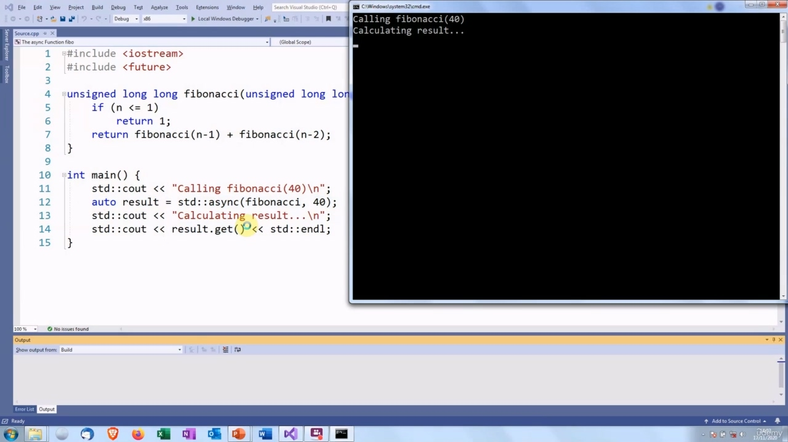
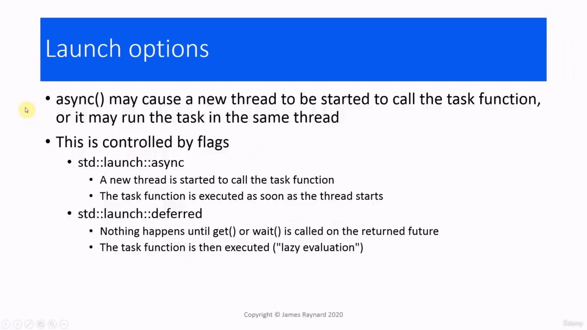

## img - 7440

In this video, we are going to talk about the async function. The async function is another way to

> 在本视频中，我们将讨论异步函数。异步函数是

## img - 7440

In this video, we are going to talk about the async function. The async function is another way to start a thread. It is defined in the standard library header. And we can start a thread by calling async(). This async function call represents a higher level abstraction than the standard thread classs. We can start a task with async() and run it in the background, and that will allow us to do other work while the task is running. So, as the name suggests, it can be used for starting asynchronous tasks. The syntax for calling async() is very similar to the constructor of the standard thread. We give the task function as the first argument and then we follow it with the arguments to the task function.

> 在本视频中，我们将讨论异步函数。异步函数是启动线程的另一种方式。它在标准库标头中定义。我们可以通过调用 async（）来启动线程。此异步函数调用表示比标准线程类更高级别的抽象。我们可以使用 async（）启动一个任务，并在后台运行它，这将允许我们在任务运行时执行其他工作。因此，顾名思义，它可以用于启动异步任务。调用 async（）的语法与标准线程的构造函数非常相似。我们将任务函数作为第一个参数，然后将其作为任务函数的参数。

## img - 103070

## img - 103070

Here is the async() equivalent of "Hello Thread". We have our task function, which just prints out "hello". In the main function we call async(). We pass the pointer to the hello function as its argument. So that will be the task function. And this will create a new thread which executes the hello function. And there we are! "Hello, Async!"

> 这里是“Hello Thread”的异步（）等价物。我们有一个任务函数，它只打印“hello”。在主函数中，我们调用 async（）。我们将指针传递给 hello 函数作为其参数。这就是任务函数。这将创建一个执行 hello 函数的新线程。我们到了！“你好，Async！”

## img - 121700

And there we are! "Hello, Async!"

> 我们到了！“你好，Async！”

## img - 130820

One of the advantages of using async() compared to the standard thread is that we can get the return value from a task function. When we call async(), it returns a future. And when we are ready to get the result, we call get() on that future, and that will give us the return value from the function. And there are also wait(), wait_for() and wait_until() if we just want to know that the background test has completed. So, for example, if we want to make sure that the file has been saved, then we could call wait(). Here is an example, which is maybe not a very realistic one(!)

> 与标准线程相比，使用 async（）的优点之一是我们可以从任务函数获得返回值。当我们调用 async（）时，它返回一个未来。当我们准备好得到结果时，我们在未来调用 get（），这将给我们函数的返回值。如果我们只是想知道后台测试已经完成，那么还有 wait（）、wait_fr（）和 wait_until（）。因此，例如，如果我们想确保文件已经保存，那么我们可以调用 wait（）。这里有一个例子，可能不是很现实（！）

## img - 203040

Here is an example, which is maybe not a very realistic one(!) We're going to compute a Fibonacci number. If you are not familiar with the Fibonacci sequence, it is a sequence of numbers which starts with one and two. And then you get the next number by adding the two previous numbers, so the next number is one plus two, which is three. The number after that is two plus three, which is five. Then three plus five is eight. Five plus eight is 13 and so on. We are going to implement this by making a recursive call, which will give us the two previous values, and then when we get to n == one, then that will stop and the recursive functions will return. We are going to call this in a thread, which is not really very sensible, but it is an example! So we are going to call async(). We give the pointer to the function as the first argument, and then 40 is the second argument. So that will be passed when we call fibonacci(). And the return value from this is stored in a future.

> 这里有一个例子，可能不是很现实（！）我们要计算一个斐波那契数。如果你不熟悉斐波那契数列，它是一个以 1 和 2 开头的数字序列。然后你把前面的两个数字相加，得到下一个数字，所以下一个数是一加二，也就是三。之后的数字是二加三，即五。那么三加五等于八。五加八等于 13，以此类推。我们将通过递归调用来实现这一点，这将给我们前面的两个值，然后当我们到达 n==1 时，这将停止，递归函数将返回。我们将在线程中调用它，这不是很明智，但它是一个示例！所以我们将调用 async（）。我们将指向函数的指针作为第一个参数，然后 40 作为第二个参数。因此，当我们调用 fibonacci（）时，这将被传递。然后将其返回值存储在将来。

## img - 308270

And the return value from this is stored in a future. And then we can call get() on this future, and that will give us the return value from the Fibonacci calculation.

> 然后将其返回值存储在将来。然后我们可以在这个未来调用 get（），这将为我们提供斐波那契计算的返回值。

## img - 325630

So we have started the thread, which is executing fibonacci with the argument 40. It is going through and calling the lower values. And 165580141, which I am sure you will all agree is the correct answer :)

> 所以我们已经启动了线程，它使用参数 40 执行 fibonacci。它正在经历并调用较低的值。165580141，我相信你们都会同意这是正确的答案：）

## img - 334980

And 165580141, which I am sure you will all agree is the correct answer :) I will leave you to check that for yourselves. There are some options we can give to async() which will decide what happens, whether a new thread is created

> 165580141，我相信你们都会同意这是正确的答案：）我让你们自己检查一下。我们可以给 async（）一些选项，这些选项将决定发生什么，是否创建新线程

## img - 348260

There are some options we can give to async() which will decide what happens, whether a new thread is created or the task is run in the same thread that calls async. The C++ library provides a couple of flags for this. The first one is std::launch_async. This will cause a new thread to be created and that will call the task function, and the task function will be executed as soon as the thread starts up. The other one is std::launch_deferred, and in this case, the task will be run in the same thread. In fact, it will not be executed until get() or wait() and company is called on the returned future and at that point the task function is executed. So that is lazy evaluation. Again, we do not actually do the calculation until we need the results.

> 我们可以给 async（）一些选项，这些选项将决定发生什么，是创建新线程还是在调用 async 的同一线程中运行任务。C++库为此提供了几个标志。第一个是 std:：launch_async。这将导致创建一个新的线程，并调用任务函数，而任务函数将在线程启动后立即执行。另一个是 std:：launch_deferred，在这种情况下，任务将在同一个线程中运行。事实上，只有在 get（）或 wait（）和 company 在返回的 future 上被调用，任务函数才被执行。这就是懒惰的评价。同样，在我们需要结果之前，我们实际上并不进行计算。

## img - 445110

And you can set both the flags using an "or", a single bar | And in that case, the implementation will decide whether it wants to start a new thread. So it is possible if there are a lot of threads already in use, it could run in the current thread, and that is the default

> 您可以使用一个“或”，一个单杠|来设置这两个标志，在这种情况下，实现将决定是否要启动一个新线程。因此，如果有很多线程已经在使用，它可以在当前线程中运行，这是默认的

## img - 458880

if there are a lot of threads already in use, it could run in the current thread, and that is the default if you do not provide any option. So to use these flags, we pass them as a first argument. If we have async(launch_async) that will cause the function to be run in a separate thread. If we call async(launch_deferred) that will cause the function to be run in the same thread. And if we just call async(func), then the implementation will decide. So let's look at how this affects the behaviour. So we have got a thread function here. We are going to

> 如果有很多线程已经在使用，它可以在当前线程中运行，如果不提供任何选项，这是默认的。所以要使用这些标志，我们将它们作为第一个参数传递。如果我们有异步（launch_async），这将导致函数在单独的线程中运行。如果我们调用异步（launch_deferred），这将导致函数在同一线程中运行。如果我们只调用异步（func），那么实现将决定。让我们来看看这是如何影响行为的。所以我们这里有一个线程函数。我们将

## img - 532850

So let's look at how this affects the behaviour. So we have got a thread function here. We are going to print out the ID of this thread so we can see which thread it is. We are also printing out the ID of the main thread. So we will be able to tell if the function is executing in a different thread. We're going to use async to launch this and we are going to use the different options for launching it. We are going to use the async one first. And then we are going to get() at the end of the program to give us the result. So let's see what happens with the async launch policy. So you see that the two threads have different IDs. So this has caused a new thread to be started. The function starts executing before we call get(). And then we finally have the answer, 42. Let's try it now with the deferred option...

> 让我们来看看这是如何影响行为的。所以我们这里有一个线程函数。我们将打印出这个线程的 ID，以便我们可以看到它是哪个线程。我们还将打印出主线程的 ID。因此，我们将能够判断该函数是否在不同的线程中执行。我们将使用异步来启动它，我们将使用不同的选项来启动它。我们将首先使用异步。然后我们将在程序结束时获取（），以给出结果。让我们看看异步启动策略会发生什么。因此，您可以看到这两个线程具有不同的 ID。因此，这导致启动了一个新线程。函数在调用 get（）之前开始执行。然后我们终于有了答案，42。让我们现在尝试一下延迟选项。。。

## img - 646550

So you can see the two threads have the same ID. So this is running the function in the same thread that called async(). You will also notice that the function does not start executing until we call get(). I have put some sleeps in here to make sure that everything happens in the right order. So get() is called first and then the function is executed. So that is lazy evaluation again. And finally, we are going to use the default so the system will choose that. So the two threads have different IDs and the function is executed before we call get().

> 因此，您可以看到两个线程具有相同的 ID。因此，这是在调用 async（）的同一线程中运行函数。您还将注意到，在调用 get（）之前，函数不会开始执行。我在这里睡了几个觉，以确保一切都按正确的顺序进行。因此，首先调用 get（），然后执行该函数。所以这又是懒惰的评价。最后，我们将使用默认值，这样系统将选择它。因此，两个线程具有不同的 ID，并且在调用 get（）之前执行该函数。

## img - 730250

So the two threads have different IDs and the function is executed before we call get(). So that is the same as launch_async and I think you will find that is usually the case. Although you cannot rely on it.

> 因此，两个线程具有不同的 ID，并且在调用 get（）之前执行该函数。所以这和 launch_async 是一样的，我想你会发现通常都是这样。尽管你不能依赖它。

## img - 747510

Normally, you would think that a default value for something would be a sensible compromise. The problem with the default value for async is that we do not know whether it is going to launch a new thread or not, and this can complicate the implementation. It is possible that the function could be run concurrently with the thread that calls async(), and then, in that case, we have to start thinking about possible conflicts. It is also possible that wait() or get() could be called on the future in a different thread. There is nothing to prevent that. And in that case, we have to consider potential conflicts with that thread. On the other hand, if it does not launch a new thread, then it is possible that the function might not be called at all if there is some path through the code where wait() or get() or some similar function is not called. And remember, when the execution is deferred, the function is only called after wait() or get() is called. If we want to use thread-local storage, we have a big problem because we do not know which thread's local storage

> 通常，你会认为某个东西的默认值是明智的妥协。异步默认值的问题是，我们不知道它是否会启动新线程，这可能会使实现复杂化。函数可能与调用 async（）的线程同时运行，在这种情况下，我们必须开始考虑可能的冲突。还可能在未来的不同线程中调用 wait（）或 get（）。没有什么可以阻止这一点。在这种情况下，我们必须考虑与该线程的潜在冲突。另一方面，如果它没有启动新线程，那么如果代码中存在 wait（）或 get（）或其他类似函数未被调用的路径，则可能根本无法调用该函数。请记住，当延迟执行时，只有在调用 wait（）或 get（）后才调用函数。如果我们想使用线程本地存储，我们有一个很大的问题，因为我们不知道哪个线程的本地存储

## img - 852370

If we want to use thread-local storage, we have a big problem because we do not know which thread's local storage is going to be used.

> 如果我们想使用线程本地存储，我们有一个很大的问题，因为我们不知道将使用哪个线程的本地存储。

## img - 857960

So what are we to do? My recommendation is to always be explicit. Always provide a launch option so everyone can understand what is happening. The situations where you would use the async launch option: If the thread has to run in a separate thread because launch_async will force it it. If the task function is going to use thread-local storage. Because in that case, you will know that it has thread-local storage which is unique to that task. It is not shared with any other executing code. If the task function must be executed, even if you are not going to call get() or wait(). And finally, the other situation is, if you pass the future on to a different thread and that thread is going to call wait_for() or wait_until(). The situations in which you would use the deferred launch option: If you want to make sure that the task is run in the thread which calls get() or wait().

> 那我们该怎么办？我的建议是始终保持明确。始终提供一个启动选项，以便每个人都能了解正在发生的事情。使用异步启动选项的情况：如果线程必须在单独的线程中运行，因为 launch_async 将强制它运行。如果任务函数将使用线程本地存储。因为在这种情况下，您将知道它具有该任务所特有的线程本地存储。它不与任何其他正在执行的代码共享。如果必须执行任务函数，即使您不打算调用 get（）或 wait（）。最后，另一种情况是，如果将未来传递给另一个线程，而该线程将调用 wait_fr（）或 wait_until（）。使用延迟启动选项的情况：如果您希望确保任务在调用 get（）或 wait（）的线程中运行。

## img - 954540

is run in the thread which calls get() or wait(). If none of these conditions apply, then it is safe to use the default. OK, so that's it for this video.

> 在调用 get（）或 wait（）的线程中运行。如果这些条件都不适用，那么使用默认值是安全的。好了，这个视频就到此为止。
