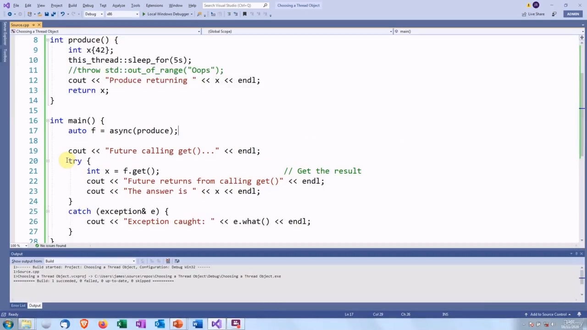
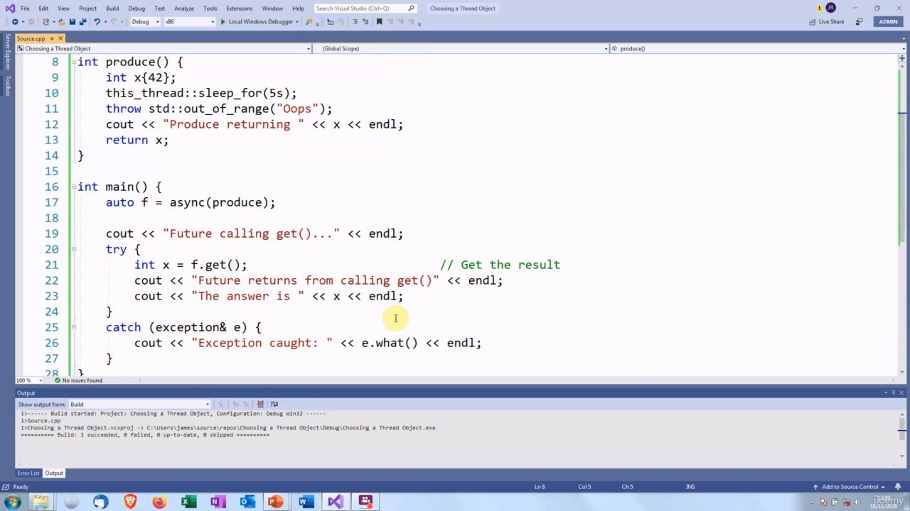
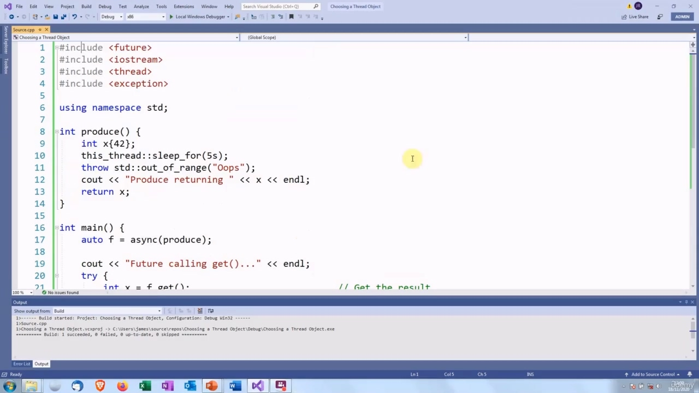
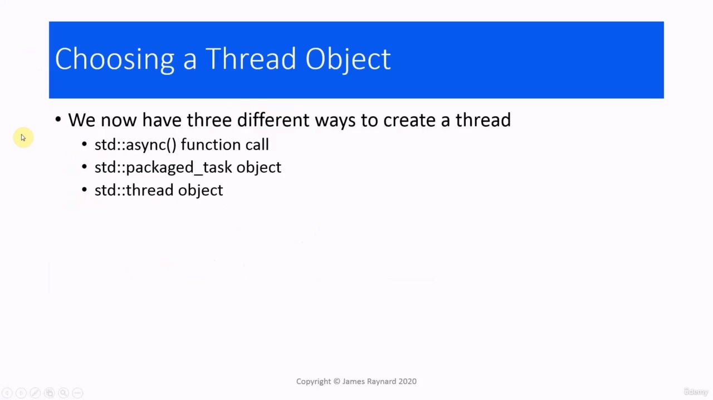
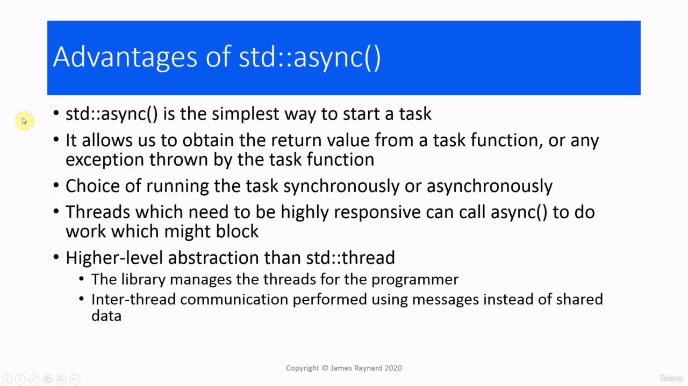
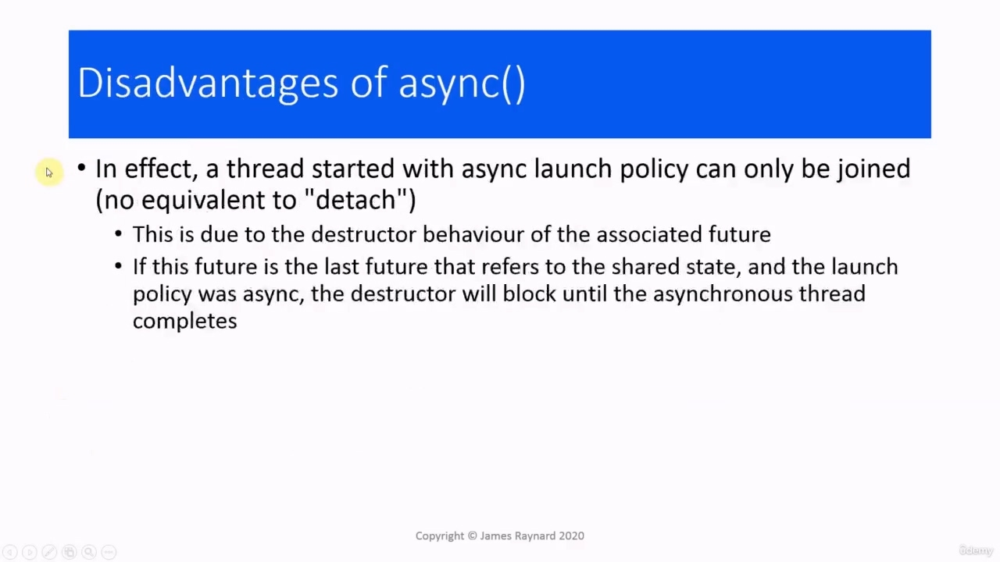
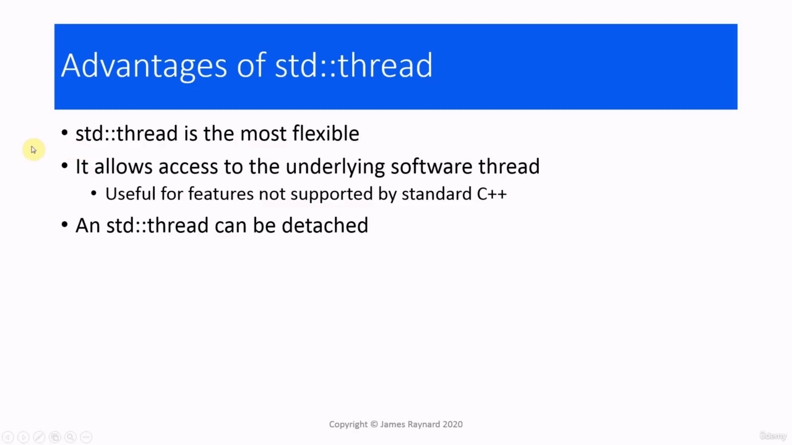
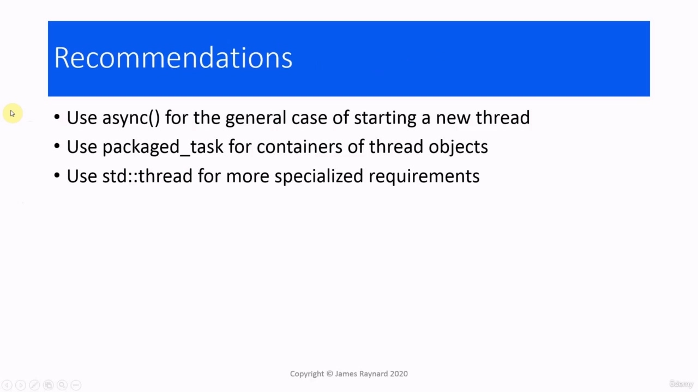
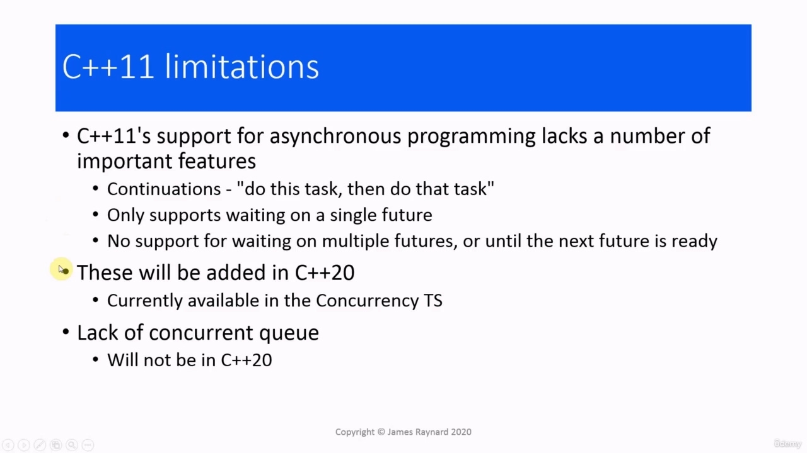

Hello again! In this video, we are going to talk about how to choose a thread object, amongst some other odds and ends

> 你好！在本视频中，我们将讨论如何选择线程对象，以及其他一些零碎问题

## img - 6930

In this video, we are going to talk about how to choose a thread object, amongst some other odds and ends to finish off the section. In the async function lecture, I did not cover how to deal with exceptions, so let's look at that now.

> 在本视频中，我们将讨论如何选择一个线程对象，以及如何完成本节的其他零碎内容。在异步函数讲座中，我没有介绍如何处理异常，所以现在让我们来看一下。

## img - 27190

If you remember back to when we were looking at promises and futures, we had a situation where a thread threw an exception and it was passed through a promise, to a future object. And then when we called get() on that future, we put a try-catch block around it. So we're going to do the same thing here. We get a future when we call async() and then when we call get() on that future, we are going to put it inside a try block. And if the future contains a value, then we will get the value. If it contains an exception, then it is going to throw the exception when we call get() and then the catch block will come into play. I have got a function which will return a value, so let's try that first without the exception, just to make sure that it works. So our future is calling get()... And in this case, there was no exception, so we got a value and we did not go into the catch block. Now let's uncomment the exception... and try it again. So we are calling get()... And they we are. So when we called get(), an exception was thrown and this was caught and we went into the catch block. OK, so that is the main function...

> 如果你还记得，当我们研究 promise 和 future 时，我们遇到了这样一种情况：线程抛出了一个异常，它通过 promise 传递给了一个 future 对象。然后，当我们在未来调用 get()时，我们在它周围放置了一个 try-catch 块。当我们调用 async()时，我们得到了一个未来，然后当我们对这个未来调用 get()时我们将把它放在一个 try 块中。如果未来包含一个值，那么我们将获得该值。如果它包含异常，那么当我们调用 get()时，它将抛出异常，然后 catch 块将发挥作用。我有一个函数，它将返回一个值，所以让我们先尝试一下，没有异常，只是为了确保它正常工作。所以我们的未来是调用 get()。。。在这种情况下，没有例外，所以我们得到了一个值，没有进入 catch 块。现在让我们取消注释异常。。。然后再试一次。所以我们调用 get()。。。我们就是他们。因此，当我们调用 get()时，抛出了一个异常，这被捕获，我们进入了 catch 块。好的，这是主要功能。。。

## img - 201480

## img - 201480

We just have the usual include files. So we now have three different ways in which we can create a thread. We can call the async() function,

> 我们只有通常的包含文件。所以我们现在有三种不同的方法来创建线程。我们可以调用 async()函数，

## img - 208650

So we now have three different ways in which we can create a thread. We can call the async() function, we can create a packaged task object, or we can create a standard thread object. So what are the relative strengths and weaknesses of these. And when should we use them?

> 所以我们现在有三种不同的方法来创建线程。我们可以调用 async()函数，我们可以创建打包的任务对象，也可以创建标准线程对象。那么，它们的相对优势和劣势是什么呢。我们什么时候应该使用它们？

## img - 225110

async() is the simplest way to start a task.

> async()是启动任务的最简单方法。

## img - 232090

We can use it and get the return value from a task function. If the task function throws an exception,

> 我们可以使用它并从任务函数中获取返回值。如果任务函数抛出异常，

## img - 232090

We can use it and get the return value from a task function. If the task function throws an exception, we can get that as well. We can choose whether we want to run the task synchronously or asynchronously. If we need to do something that might block, but we need to remain responsive, then we can call async() to run the work in the background. async() provides a higher level of abstraction than the standard thread class. The library will manage the threads for us, so we do not need to start threads and join them. We can get threads to communicate using messages instead of shared data, so we do not need to worry about mutexes and atomic variables.

> 我们可以使用它并从任务函数中获取返回值。如果任务函数抛出异常，我们也可以得到它。我们可以选择是同步还是异步运行任务。如果我们需要做一些可能会阻塞的事情，但我们需要保持响应，那么我们可以调用 async()在后台运行工作。async()提供了比标准线程类更高的抽象级别。库将为我们管理线程，因此我们不需要启动线程并加入它们。我们可以让线程使用消息而不是共享数据进行通信，因此我们不必担心互斥锁和原子变量。

## img - 322970

The main disadvantage of async() is that there is no way to have a thread which is detached. The reason for this is the way that the future destructor is designed. The future has some shared state which is used for passing results and exceptions and so on. When we have a thread that is launched with the launch_async policy, then the destructor will block until the thread has completed. So that means the future will always wait for the thread. Packaged task is the best choice if we want to represent a task as an object. For example, if we are creating a container of tasks. A packaged task is an object so we can move it onto a particular thread and make it execute on that thread, which we cannot do with async() because async() is not an object. It has less overhead than async() and is more flexible.

> async()的主要缺点是无法分离线程。原因是未来析构函数的设计方式。未来有一些共享状态，用于传递结果和异常等。当我们有一个线程使用 launch_async 策略启动时，析构函数将阻塞，直到线程完成。因此，这意味着未来将永远等待线程。如果我们想将任务表示为对象，打包任务是最佳选择。例如，如果我们正在创建一个任务容器。打包的任务是一个对象，因此我们可以将其移动到特定的线程上，并使其在该线程上执行，这是我们无法使用 async()实现的，因为 async（不是一个对象。它比 async()开销更少，而且更灵活。

## img - 425430

And the standard thread class is the most flexible of all. We can use it to access the underlying software thread so we can use features which are provided by the operating system, but not supported by standard C++. And you can also detach standard thread if you want to.

> 标准线程类是最灵活的。我们可以使用它访问底层软件线程，这样我们就可以使用操作系统提供的功能，但标准 C++不支持这些功能。如果需要，还可以分离标准螺纹。

## img - 442450

My recommendations are that you would normally use async() for starting a thread. Bjarne Stroustrup says that async() is the equivalent of range for loops. If you want to iterate over all the elements in a container once, then you would use a range for loop. If you want something a bit more specific, if you only want to iterate over some of the elements or you want to add or remove elements, then you would use a lower level loop and write some more code. And similarly, if you want to do something more specialized, which isn't supported by async(), then you would use the standard thread class and write some extra code. If you want to create containers of thread objects, then use a packaged task.

> 我的建议是，通常使用异步()启动线程。BjarneStroustrup 表示，async()相当于循环的范围。如果您想对容器中的所有元素进行一次迭代，那么可以使用循环范围。如果你想要更具体的东西，如果你只想迭代一些元素，或者你想添加或删除元素，那么你可以使用一个较低级别的循环并编写更多的代码。类似地，如果你想做一些更专业的事情，这是异步()不支持的，那么你可以使用标准线程类并编写一些额外的代码。如果要创建线程对象的容器，请使用打包任务。

## img - 534440

If you have done asynchronous programming in other languages, then you may notice that there are a few things I have not covered, and these are actually missing from C++11. The biggest omission is continuations. When you have a continuation, you can start off several tasks which run in a sequence. So you could say, for example, assemble 20 units, take them over there, then tell Joe in the workshop that you have done it. With C++11, you would have to say make up 20 units. Have you done that? Okay, take them over there. Okay. Tell Joe in the warehouse. So the difference is that the thread that is controlling all these tasks has to keep waiting for them and starting up new threads. It cannot just start off several threads and let them run while it does something else. In C++11, we can only wait on a single future from async(). There is no support for waiting on multiple

> 如果您已经用其他语言进行了异步编程，那么您可能会注意到，有一些事情我没有涉及，而这些实际上是 C++11 中缺少的。最大的遗漏是延续。当您有一个延续时，您可以开始按顺序运行的几个任务。例如，你可以说，组装 20 个单元，把它们拿到那里，然后在车间告诉乔你已经完成了。用 C++11，你必须说组装 20 个。你做到了吗？好的，把他们带到那边。可以告诉仓库里的乔。所以不同的是，控制所有这些任务的线程必须继续等待它们并启动新的线程。它不能只启动几个线程，让它们在执行其他任务时运行。在 C++11 中，我们只能等待一个来自异步()的未来。不支持等待多个

## img - 629660

In C++11, we can only wait on a single future from async(). There is no support for waiting on multiple futures. So you cannot start off lots of tasks and wait for them all to finish.

> 在 C++11 中，我们只能等待一个来自异步()的未来。不支持等待多个期货。因此，你不能先开始很多任务，然后等待它们全部完成。

## img - 634750

So you cannot start off lots of tasks and wait for them all to finish. You have to check each one individually. There is also no support for waiting on any task. So you cannot start lots of tasks and then wait until the first one finishes. In C++20, the future implementation is going to be extended, so these will be supported.

> 因此，你不能先开始很多任务，然后等待它们全部完成。你必须逐一检查。也不支持等待任何任务。因此，你不能开始很多任务，然后等到第一个任务完成。在 C++20 中，未来的实现将被扩展，因此这些将得到支持。

## img - 653510

In C++20, the future implementation is going to be extended, so these will be supported. There is also a lot of other changes. At the moment, C++20 has been agreed. It is just waiting the final stamp that says, it is an official standard and then we will have to wait for compilers to support this. If you cannot wait until then, there is something called the concurrency TS, which has been around for several years and is basically a test bed for these new features. The other limitation, which we have mentioned before, is that there is not a concurrent queue in the

> 在 C++20 中，未来的实现将被扩展，因此这些将得到支持。还有很多其他变化。目前，C++20 已经达成一致。它只是在等待最后的盖章，上面写着，它是一个官方标准，然后我们将不得不等待编译器来支持它。如果你不能等到那时，有一种叫做并发 TS 的东西，它已经存在了好几年，基本上是这些新特性的测试平台。我们之前提到过的另一个限制是

## img - 726730

The other limitation, which we have mentioned before, is that there is not a concurrent queue in the standard and unfortunately there is not going to be one in C++20. OK, so that's it for this video.

> 我们之前提到过的另一个限制是，标准中没有并发队列，不幸的是，C++20 中不会有并发队列。好了，这个视频就到此为止。
