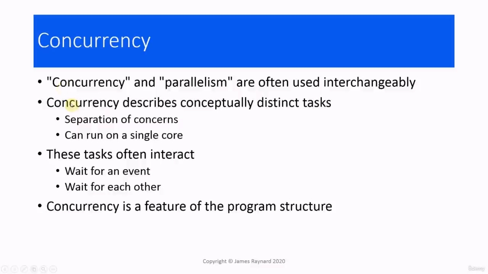
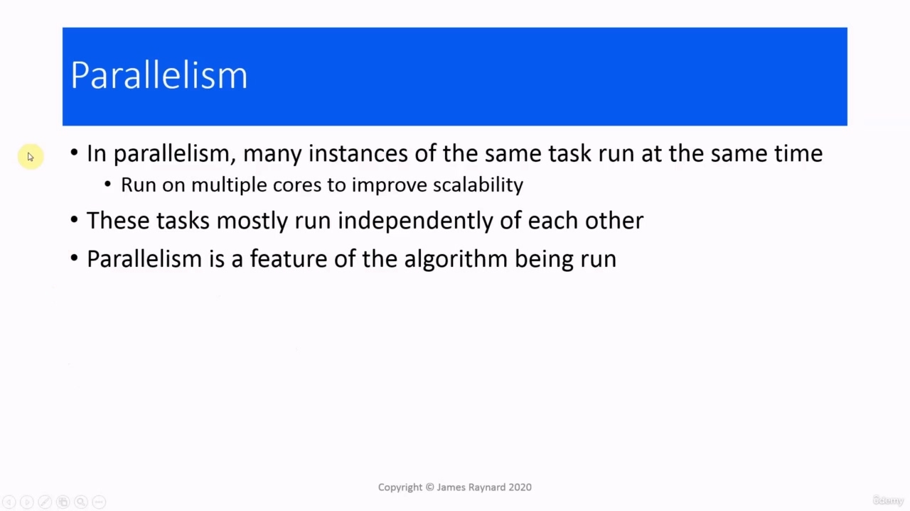
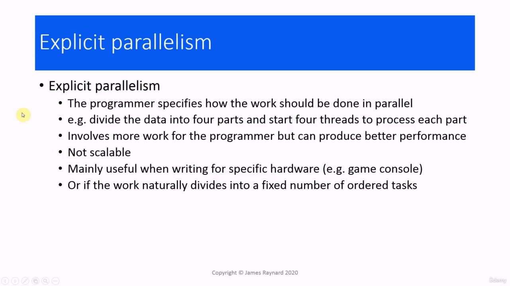
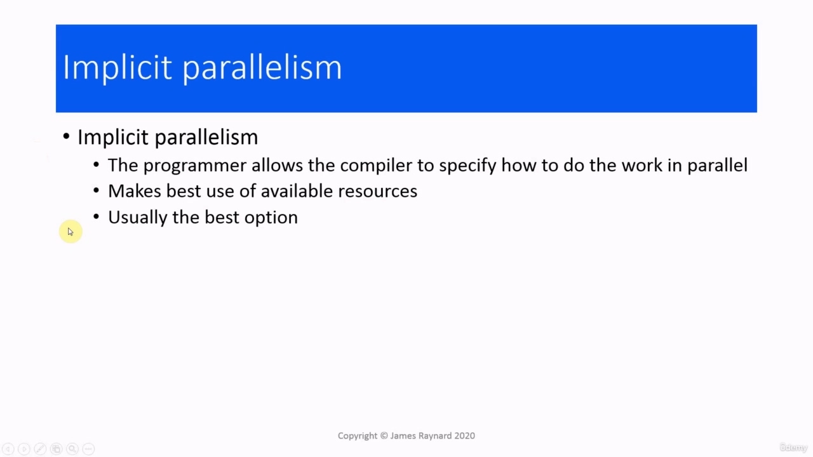

## img - 4590

In this video, we are going to have a quick overview of parallelism.

> 在本视频中，我们将快速概述并行性。

## img - 13770

People often use "concurrency" and "parallelism" to describe the same thing, but there is actually an important difference between them. With concurrency, you have tasks which are conceptually distinct. So these are different threads which are doing different things. This is what is known as separation of concerns. So, for example, having the GUI application where we have one thread which handles events and other threads which handle various tasks. And it is possible for a concurrent program to run on a single processor core. These tasks are usually interactive. They can often wait for an event or they can wait for other tasks to complete or to do something, and they can also exchange data with each other. When it comes down to it, concurrency is really a feature of the program structure. It is the way you design the program, to separate concerns.

> 人们经常用“并发”和“并行”来描述同一件事，但实际上它们之间有一个重要的区别。
> 对于并发，您的任务在概念上是不同的。所以这些是不同的线程，它们在做不同的事情。这就是所谓的关注点分离。例如，有一个 GUI 应用程序，我们有一个线程处理事件，其他线程处理各种任务。并发程序可以在单个处理器内核上运行。这些任务通常是交互式的。他们通常可以等待一个事件，也可以等待其他任务完成或做某事，他们还可以相互交换数据。归根结底，并发确实是程序结构的一个特征。这是您设计程序的方式，以分离关注点。

## img - 107400

When you have parallelism, on the other hand, you have many instances of the same task of running at the same time. So all these tasks are basically doing the same thing, but they are running on multiple cores at the same time to improve scalability. And these tasks are usually pretty much independent of each other. Parallelism is a feature of the algorithm that is being performed. There are some algorithms where it naturally makes sense to divide the data into different groups and then have each group processed at the same time. There is actually a very good sporting analogy. Concurrency is like a team sport, so everyone has a distinct role. Usually players are doing different things. They interact with each other. They wait to get the ball. They wait for other players to go into position. They wait for various events to happen and so on. Parallelism is more like an individual track sport. So, for example, sprinting, swimming and so on, everyone is doing the same thing and they are all trying to do it as fast as possible. And there is no interaction between them or very little.

> 另一方面，当您具有并行性时，您可以同时运行同一任务的多个实例。所以所有这些任务基本上都在做相同的事情，但它们同时在多个内核上运行，以提高可扩展性。这些任务通常彼此独立。并行性是正在执行的算法的一个特征。在某些算法中，将数据分成不同的组，然后同时处理每个组自然是有意义的。实际上有一个很好的体育类比。并发就像一项团队运动，因此每个人都有不同的角色。通常，玩家在做不同的事情。他们彼此互动。他们等着拿到球。他们等待其他球员就位。他们等待各种事件的发生等等。平行运动更像是一项单独的田径运动。例如，短跑、游泳等，每个人都在做同样的事情，他们都在尽可能快地做。他们之间没有互动，或者互动很少。

## img - 221620

There are two different ways of doing parallelism, explicit and implicit. When you do it explicitly, you specify how exactly it should be done in parallel. For example, you divide your data into four parts and you start up four threads, each of which will process one quarter of the data. This involves more work for the programmer, but it can produce better performance. The problem is it is not scalable. If you have a machine which supports four threads and you have four threads, then it is working flat out. If you buy a new computer which has support for eight threads, then you are still only running four threads. So your program still runs at the same speed, even though you have twice as much processing capacity. One of the main situations where you would use this is if you are writing for a specific bit of hardware, A good example of that is a game console. Each generation of game consoles has a fixed number of processors. So you can actually tune your program for the number of processors. It is also useful if the problem you are trying to solve naturally divides into a fixed number of tasks.

> 有两种不同的并行方式，显式和隐式。
> 当您显式执行时，您可以指定并行执行的确切方式。例如，您将数据分成四部分，然后启动四个线程，每个线程将处理四分之一的数据。这需要程序员做更多的工作，但可以产生更好的性能。问题是它不可扩展。如果你有一台支持四个线程的机器，并且你有四个线程，那么它就可以正常工作了。如果你买了一台支持八个线程的新计算机，那么你仍然只能运行四个线程。所以你的程序仍然以相同的速度运行，即使你有两倍的处理能力。其中一个主要的情况是，如果你是为一个特定的硬件编写的，游戏机就是一个很好的例子。每一代游戏机都有固定数量的处理器。因此，您实际上可以根据处理器的数量调整程序。如果您试图解决的问题自然地划分为固定数量的任务，那么它也很有用。

## img - 331160

The other form of parallelism is implicit. This is where the programmer does not do anything, you just leave it up to the compiler and the environment to decide how to do it. And this means that you will always make the best use of the resources that are available. In the situation where you go from having a computer with four processor cores to having eight, then implicit parallelism means that you will automatically get eight threads instead of four. And for most purposes, this is the best option. Okay, so that's it for this video. I'll see you next time.

> 另一种并行形式是隐式的。这是程序员不做任何事情的地方，你只需要让编译器和环境来决定如何做。这意味着你将始终充分利用可用的资源。在从拥有四个处理器核的计算机到拥有八个处理器核时，隐式并行意味着将自动获得八个线程，而不是四个线程。对于大多数目的来说，这是最好的选择。好了，这个视频就到此为止。下次见。
