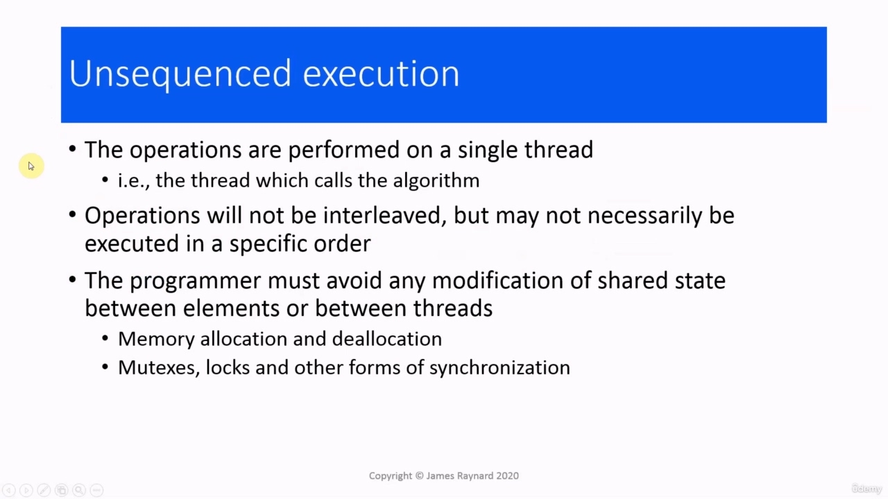
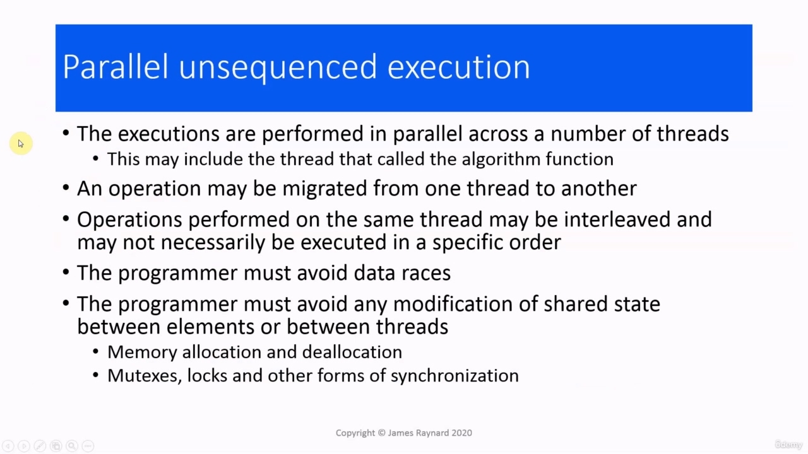

## img - 7890

In this video, we are going to talk about execution policies. Execution policies are applied to standard

> 在本视频中，我们将讨论执行策略。执行策略适用于标准

## img - 7890

In this video, we are going to talk about execution policies. Execution policies are applied to standard algorithms. These algorithms were introduced in C++98. They are a set of functions which can be called on containers and sequences of data. These algorithms implement classic computer science techniques such as searching, sorting, populating containers, copying elements from one container to another, reordering the elements and so on. Most of these algorithms are in the header. Although just to catch you out, they put a few in the header. Usually when you call an algorithm, you give it an iterator range, which corresponds to the sequence of elements you want the algorithm to be applied to. You can also pass an optional extra argument, which is a callable object, and that function

> 在本视频中，我们将讨论执行策略。执行策略应用于标准算法。这些算法是在 C++98 中引入的。它们是一组可以在容器和数据序列上调用的函数。这些算法实现了经典的计算机科学技术，例如搜索、排序、填充容器、将元素从一个容器复制到另一个容器、对元素重新排序等等。这些算法中的大多数都在标头中。虽然只是为了抓住你，但他们在头球中放了一些。通常，当你调用一个算法时，你会给它一个迭代器范围，它对应于你想要应用算法的元素序列

## img - 54470

You can also pass an optional extra argument, which is a callable object, and that function will be applied to the elements in the sequence. When an algorithm executes, it, performs a series of operations on the elements of the container. It may modify them, swap them around, compare them, pass them as arguments to a function call and so on.

> 您还可以传递一个可选的额外参数，它是一个可调用的对象，该函数将应用于序列中的元素。当算法执行时，它对容器的元素执行一系列操作。它可以修改它们，交换它们，比较它们，将它们作为参数传递给函数调用等等。

## img - 121120

When algorithms came in in 1998, most computers only provided one way of executing code, but now we have four to choose from. The first one is sequential, in which we have a single instruction which processes a single data item.

> 当算法在 1998 年问世时，大多数计算机只提供一种执行代码的方式，但现在我们有四种可供选择。第一种是顺序的，其中我们有一条处理单个数据项的指令。

## img - 129580

The first one is sequential, in which we have a single instruction which processes a single data item. And this is the traditional C++ model. For example, if you write a loop, it will process the first element, then it will process the second element then it will process the third and so on. All the elements are looked at in turn. There is also vectorized execution.

> 第一种是顺序的，其中我们有一条处理单个数据项的指令。这是传统的 C++模型。例如，如果你写一个循环，它将处理第一个元素，然后处理第二个元素，再处理第三个元素，依此类推。还有矢量化执行。

## img - 147210

There is also vectorized execution. This is when a single instruction processes several data items at the same time. For example, it is possible to have a processor instruction that can add four integers in a single operation. This requires support from the hardware. It also requires that the data structure is suitable for vectorized processing. So if you have an array or vector, that would be ideal. If you have a map or multimap, maybe not. There is also parallel execution in which several instructions each possess a single data item at the

> 还有矢量化执行。这是指一条指令同时处理多个数据项。例如，处理器指令可以在一次操作中添加四个整数。这需要硬件的支持。它还要求数据结构适合于矢量化处理。所以如果你有一个数组或向量，那将是理想的。如果你有地图或多地图，也许没有。还有并行执行，其中多个指令在

## img - 221970

There is also parallel execution in which several instructions each possess a single data item at the same time. For example, instead of having one processor adding 16 numbers in sequence, we could have eight processors which add up eight pairs of numbers. This requires a suitable algorithm. An example of this would be a sorting algorithm where you split the data into two halves and sort each half, then split each part of that into two parts and so on. All these parts are sorted independently. So they could be sorted on separate processors at the same time. And then finally, you can really "go wild" and do both at the same time, so you can have parallel and vectorized execution. So you can have multiple processors, each of which is executing instructions which will process multiple items of data in a single instruction. And this will only work if you have the right algorithm, the right data structure and the right hardware.

> 还有并行执行，其中多个指令同时拥有一个数据项。例如，我们可以使用八个处理器，将八对数字相加，而不是一个处理器按顺序相加 16 个数字。这需要合适的算法。这方面的一个例子是排序算法，将数据分成两半，然后对每一半进行排序，然后将其中的每一部分分成两部分，依此类推。所有这些部分都是独立排序的。因此，它们可以同时在不同的处理器上进行排序。最后，你真的可以“疯狂”，同时做这两件事，这样你就可以进行并行和矢量化的执行。因此，可以有多个处理器，每个处理器都在执行指令，这些指令将在一条指令中处理多个数据项。只有当你有正确的算法、正确的数据结构和正确的硬件时，这才有效。

## img - 331770

C++17 added execution policies, and these allow us to say how we want an algorithm to be executed. The choices all match the hardware that I just described.

> C++17 增加了执行策略，这些策略允许我们说出我们希望如何执行算法。这些选择都与我刚才描述的硬件相匹配。

## img - 335740

The choices all match the hardware that I just described. The sequential means do not use any kind of parallel execution or vectorization. So just sequential, the "good old-fashioned" way of executing things. par for using parallel execution. par underscore unseq for using parallel and vectorized execution. And then in C++20, they added the fourth possibility, unseq for using vectorized execution. It is important to realize these are only requests. It is a bit like the "inline" keyword. It could be ignored.

> 这些选择都与我刚才描述的硬件相匹配。顺序方法不使用任何类型的并行执行或矢量化。所以，只是循序的，“好的老式”执行方式。par 表示使用并行执行。par_unseq 用于使用并行和矢量化执行。然后在 C++20 中，他们添加了第四种可能性，即使用矢量化执行。重要的是要认识到这些只是请求。它有点像“inline”关键字。这是可以忽略的。

## img - 409580

It is a bit like the "inline" keyword. It could be ignored. For example, if the hardware does not support parallel or vectorized execution, then the compiler will not generate those instructions. If there are not enough system resources available to do it efficiently. For example, if the system cannot create any more threads, then you may be forced to run in a single thread. And also, if the C++ library you are using has not implemented the parallel or the vectorized version, and there are quite a few gaps at the moment.

> 它有点像“inline”关键字。这是可以忽略的。例如，如果硬件不支持并行或矢量化执行，那么编译器将不会生成这些指令。如果没有足够的系统资源来有效地执行此操作。例如，如果系统无法创建更多线程，那么您可能被迫在单个线程中运行。此外，如果您正在使用的 C++库尚未实现并行或矢量化版本，那么目前还有相当多的差距。

## img - 444500

To actually specify a policy, we need to include the header, which defines all these policy objects, and then we pass the appropriate object as the first document of the algorithm call. So the traditional call is just to pass the iterator range. So sort(v.begin(), v.end()) would give non-policy execution. Then if we have seq as the first argument, that will give us sequential execution. par for parallel, par_unseq to request parallel and vectorized execution. And in C++20, we will be able to pass unseq as well.

> 要实际指定策略，我们需要包含定义所有这些策略对象的头，然后我们将适当的对象作为算法调用的第一个文档传递。因此，传统的调用只是传递迭代器范围。所以 sort（v.begin()，v.end()）将提供非策略执行。然后，如果我们将 seq 作为第一个参数，这将给我们顺序执行。par 表示并行，par_unseq 请求并行和矢量化执行。在 C++20 中，我们也可以通过 unseq。

## img - 525820

So let's look at these in more detail. With sequenced policy execution, all the operations in the algorithm execution are going to be performed on a single thread and this will be the thread which calls the algorithm function. The operations will not be interleaved, but they may not necessarily be executed in a specific order.

> 让我们更详细地看一下这些。通过顺序策略执行，算法执行中的所有操作将在单个线程上执行，这将是调用算法函数的线程。这些操作不会交错，但它们不一定按特定顺序执行。

## img - 554730

So here is some code in which we actually use the execution policies. We are going to start off with a traditional algorithm call, actually. We are going to use for_each(). This will take a range of iterators. And then the third argument is a callable object. And this will be called on every element in the range. We have a vector with 2,000 elements, and in effect, we are going to populate the vector with values from one up to 2,000. So there we are, the final value is 2000.

> 这里有一些代码，我们实际上使用了执行策略。实际上，我们将从一个传统的算法调用开始。我们将使用 for_each()。这需要一系列迭代器。第三个参数是一个可调用对象。这将在范围内的每个元素上调用。我们有一个包含 2000 个元素的向量，实际上，我们将用从 1 到 2000 的值填充向量。因此，最终值是 2000。

## img - 626470

So there we are, the final value is 2000. So we have not had any data corruption, and all the numbers appear to be in order. (I am not going to check all of them!) So we have included the header, we are also using the execution namespace under std, and then if

> 因此，最终值是 2000。因此，我们没有任何数据损坏，所有数据似乎都是有序的。（我不会检查所有这些！）所以我们包含了头，我们也使用 std 下的执行命名空间，然后如果

## img - 645380

So we have included the header, we are also using the execution namespace under std, and then if we seq as the first argument, then we are requesting a sequential execution.

> 因此，我们已经包含了头，我们也在 std 下使用了执行命名空间，然后如果我们将 seq 作为第一个参数，那么我们将请求顺序执行。

## img - 652160

we seq as the first argument, then we are requesting a sequential execution. So let's try that. So, again, the last element is 2,000.

> 我们将 seq 作为第一个参数，然后请求顺序执行。所以让我们试试看。同样，最后一个元素是 2000。

## img - 659410

So, again, the last element is 2,000. There has not been any data corruption. The elements could be in a different order, but they look as though they are [in order].

> 同样，最后一个元素是 2000。没有任何数据损坏。这些元素可能处于不同的顺序，但它们看起来似乎是按顺序排列的。

## img - 717070

So when we use the sequential execution policy, the elements will always have the right values, but they may not necessarily be in the right order. It's a bit of a "Eric Morecambe". If you have ever seen the Morecambe and Wise sketch with Andre Previn or "Andrew Preview", as they call him. If you have no idea what I am talking about, just ignore it. It is British humour.

> 因此，当我们使用顺序执行策略时，元素将始终具有正确的值，但它们的顺序不一定正确。这有点像“埃里克·莫尔坎贝”。如果你曾经看过安德烈·普雷文（Andre Previn）的《莫克姆和怀斯》（Morecambe and Wise）素描，或者他们称之为“安德鲁·预览”（Andrew Preview）。如果你不知道我在说什么，就忽略它吧。这是英国的幽默。

## img - 741110

When we ask for parallel execution, the executions are performed in parallel across a number of threads, and this could include the thread that called the algorithm function. Within those operations, any given operation is going to be run on the same thread for its entire duration. So we are not going to get operations which are switched from one thread to another or from one processor to another. Operations which are performed on the same thread will not be interleaved, but may not necessarily be executed in a particular order. And of course, we have operations on different threads. So this means there is a possibility of data races.

> 当我们要求并行执行时，执行是在多个线程之间并行执行的，这可能包括调用算法函数的线程。在这些操作中，任何给定的操作都将在同一线程上运行整个持续时间。所以我们不会得到从一个线程切换到另一个线程或从一个处理器切换到另另一个处理器的操作。在同一线程上执行的操作不会被交织，但不一定以特定的顺序执行。当然，我们在不同的线程上有操作。因此，这意味着存在数据竞争的可能性。

## img - 827030

So let's go back to our program and change this to par. We may not actually get a data race, but let's give it a try. Oh, right.

> 所以，让我们回到我们的程序，并将其更改为标准。我们可能实际上没有获得数据竞赛，但让我们尝试一下。哦，对了。

## img - 832360

We did get one. So the last element is 1752. So there has been some corruption. We are using this variable count.

> 我们确实得到了一个。最后一个元素是 1752。因此出现了一些腐败。我们使用这个变量计数。

## img - 847860

It is being incremented in each operation, but these operations are being performed on different threads. So it could be that different threads are seeing different values of count. If we make that atomic, then it should work. Okay...

> 它在每个操作中递增，但这些操作在不同的线程上执行。因此，不同的线程可能看到不同的计数值。如果我们制造出原子，那么它应该会起作用。可以

## img - 917040

Yes, there we are. The last value is 2,000. By the way, I should have mentioned, when you compile

> 是的，我们到了。最后一个值是 2000。顺便说一下，我应该提到，当你编译

## img - 917040

Yes, there we are. The last value is 2,000. By the way, I should have mentioned, when you compile this code make sure that your compiler is in C++17 mode. So, for example, with Visual Studio, that is the project properties. And then Configuration, General

> 是的，我们到了。最后一个值是 2000。顺便说一下，我应该提到，当您编译这段代码时，请确保您的编译器处于 C++17 模式。例如，在 Visual Studio 中，这就是项目属性。然后是配置，概述

## img - 928740

So, for example, with Visual Studio, that is the project properties. And then Configuration, General and then C++ language standards.

> 例如，在 Visual Studio 中，这就是项目属性。然后是配置、通用和 C++语言标准。

## img - 931370

and then C++ language standards. If you are using other compilers, it will be different, obviously. But if you do not do that, it probably will not compile.

> 然后是 C++语言标准。如果使用其他编译器，显然会有所不同。但如果不这样做，它很可能无法编译。

## img - 945790

And then unsequenced execution. The operations are performed on a single thread, which will be the one which called the algorithm. So this is vectorization. Operations will not be interleaved, but may not necessarily be executed in a particular order. This time, we do not have to worry about data races, but we do have to worry about shared state. If there is any interaction between elements or between threads, then that could cause a data race. In particular, if we allocate or deallocate memory, that could cause a problem, and also mutexes, locks and other forms of synchronization. This is not actually supported in C++17. I do not think my compiler has C++20 support yet. (It has a preview)

> 然后是未排序的执行。这些操作是在一个线程上执行的，它将是调用算法的线程。这就是矢量化。操作不会交错，但不一定按特定顺序执行。这一次，我们不必担心数据竞赛，但我们必须担心共享状态。如果元素之间或线程之间存在任何交互，那么这可能会导致数据竞争。特别是，如果我们分配或释放内存，这可能会导致问题，同时也会导致互斥锁、锁和其他形式的同步。这在 C++17 中实际上不受支持。我认为我的编译器还没有 C++20 支持。（有预览）

## img - 1043790

No, still no good. Okay, maybe by the time that you watch this video that will work. I am planning actually to do another concurrency course which goes into more depth and covers C++20. But let's see how this one goes first. And then finally, parallel, unsynchronized execution.

> 不，还是不行。好吧，也许到你看这段视频的时候，它会起作用。实际上，我计划做另一个更深入的并发课程，涵盖 C++20。但让我们先来看看这个是怎么回事。最后是并行、非同步执行。

## img - 1059330

And then finally, parallel, unsynchronized execution. We have executions which are performed in parallel across a number of threads. Again, possibly including the thread that called the algorithm. And this time an operation can be migrated from one thread to another. Operations which are performed on the same thread, may be interleaved and may not necessarily be executed in a specific order. And then the requirements are a combination of both. We must avoid data races and we must also avoid modifying shared state.

> 最后是并行、非同步执行。我们有跨多个线程并行执行的执行。同样，可能包括调用算法的线程。这一次，操作可以从一个线程迁移到另一个线程。在同一线程上执行的操作可以是交错的，并且不一定以特定的顺序执行。然后，需求是两者的结合。我们必须避免数据竞争，也必须避免修改共享状态。

## img - 1138220

So if we change that to par_unseq (and let's also make that a normal variable again)

> 因此，如果我们将其更改为 par_unseq（让我们再次将其设置为普通变量）

## img - 1138220

So if we change that to par_unseq (and let's also make that a normal variable again)

> 因此，如果我们将其更改为 par_unseq（让我们再次将其设置为普通变量）

## img - 1152050

So, again, we get the data race, so we have 1,982 instead of 2,000. (So let's quickly make that atomic again before anyone notices!) There we are, that is better.

> 因此，我们再次获得了数据竞赛，因此我们有 1982 年而不是 2000 年。（所以，在任何人注意到之前，让我们快速地重新制作原子！）我们在这里，那更好。
