Hello again! In this video, we are going to talk about algorithms and execution policies.

> 你好！在本视频中，我们将讨论算法和执行策略。

## img - 5160

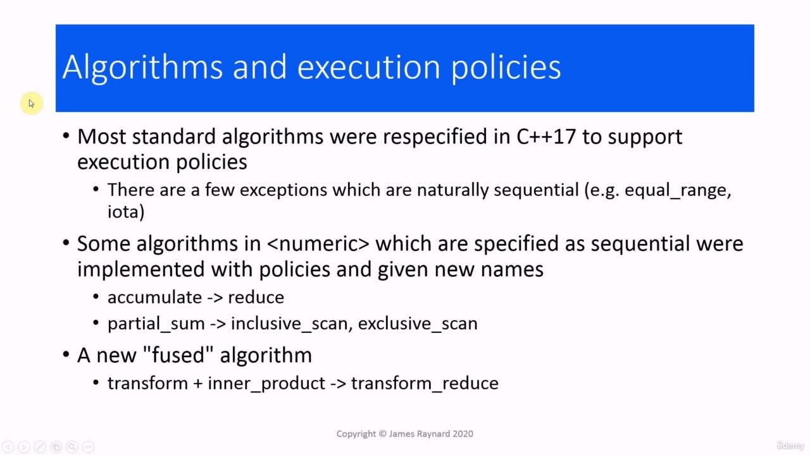

In this video, we are going to talk about algorithms and execution policies. When execution policies came along in C++17, most of the algorithms in the standard library were

> 在本视频中，我们将讨论算法和执行策略。当执行策略出现在 C++17 中时，标准库中的大多数算法都是

## img - 14080

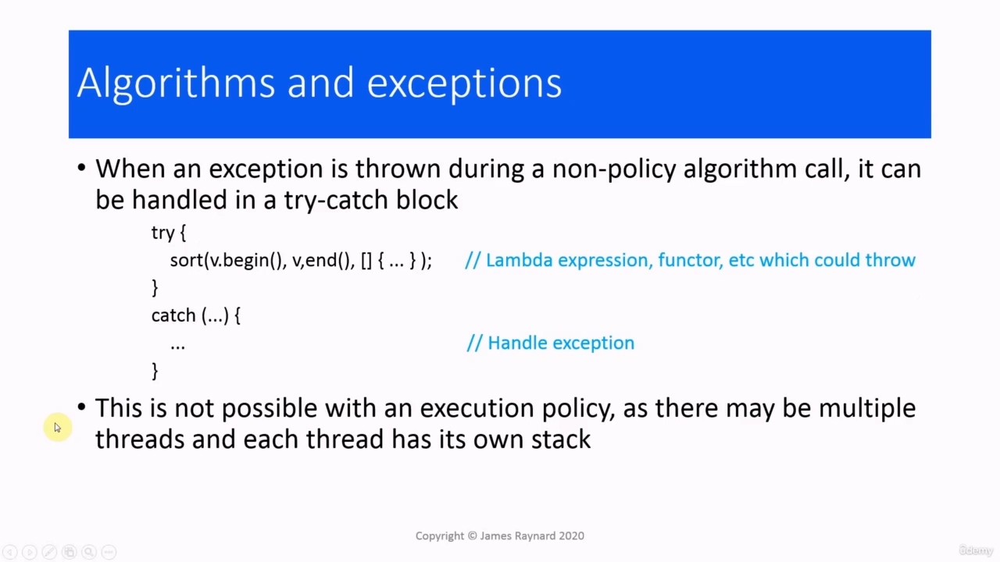

When execution policies came along in C++17, most of the algorithms in the standard library were re-specified to support execution policies. There were a few exceptions, which are algorithms which can really be only done sequentially. For example, equal_range and iota. There are some algorithms in which are specified as being sequential-only. They came up with some new functions with different names, which support policies. So there is a new version of accumulate called reduce. And there are two new versions of partial_sum which are called inclusive and exclusive scan. There's also a new "fused" algorithm which combines two separate algorithms: transform_reduce combines transform and inner_product. And we will be looking at these new functions later on in this section.

> 当执行策略出现在 C++17 中时，标准库中的大多数算法都被重新指定以支持执行策略。
> 有一些例外，这些算法实际上只能按顺序执行。例如，equal_range 和 iota。
> 有一些算法被指定为仅是顺序的。他们提出了一些不同名称的新功能，支持策略。
> 所以有一个新版本的累加叫做 reduce。partial_sum 有两个新版本，称为包含扫描和排他扫描。
> 还有一种新的“融合”算法，它结合了两种不同的算法：transform_reduce 结合了 transform 和 inner_product。我们将在本节稍后介绍这些新功能。

## img - 112210

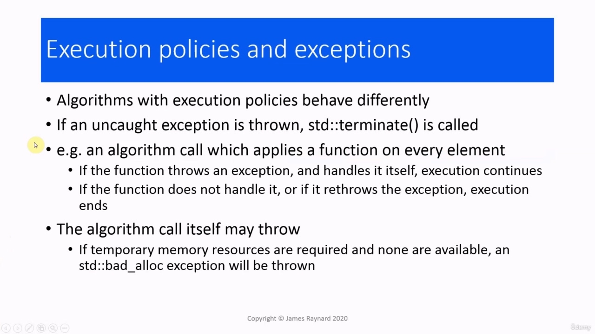

We need to talk about how exceptions are handled with algorithms. With the original non-policy algorithms, it is very straightforward. It is just like any other code. You have a try/catch block. So you put the algorithm call inside the try block. And if there is something that might throw, a lambda expression or maybe a functor. If there is an exception, then it gets caught in the catch block and you can handle it there. When you have an execution policy, that does not work because there are probably going to be multiple threads executing in parallel. Each thread will have its own stack and you cannot transfer an exception from one thread to another.

> 我们需要讨论如何使用算法处理异常。对于原始的非策略算法，它非常简单。这和其他代码一样。
> 您有一个 try/catch 块。所以你把算法调用放在 try 块中。如果有什么东西可能抛出，lambda 表达式或函子。如果有异常，那么它会被捕获块捕获，您可以在那里处理它。
> 当您有执行策略时，这不起作用，因为可能会有多个线程并行执行。每个线程都有自己的堆栈，不能将异常从一个线程传输到另一个线程。

## img - 155210

So the result is rather drastic. If an uncaught exception is thrown, the terminate function is called, and by default that will end the program. If we imagine we have an algorithm call, which is going to apply a function to every element in the

> 因此，结果相当激烈。如果抛出未捕获的异常，则调用 terminate 函数，默认情况下将结束程序。

## img - 204240

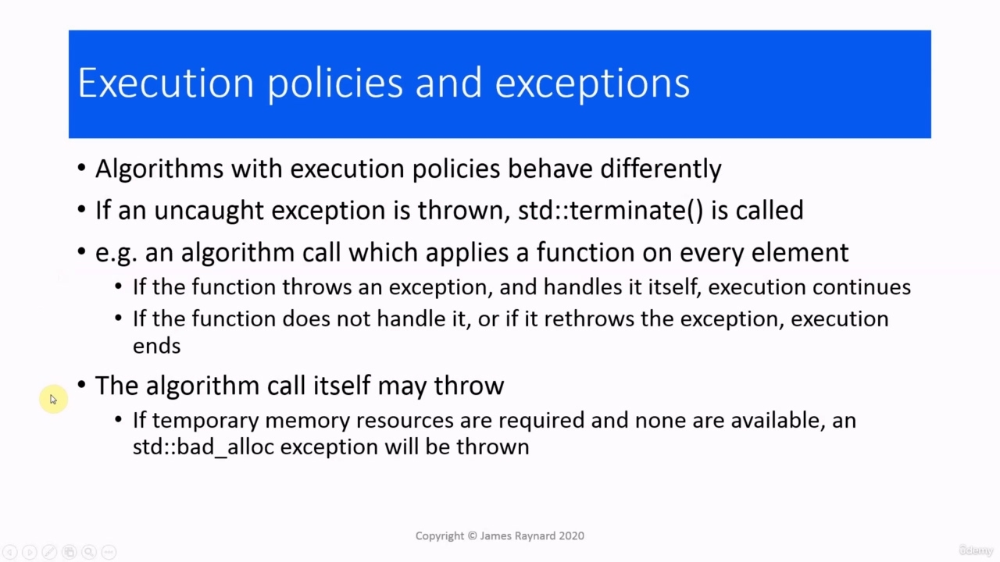

If we imagine we have an algorithm call, which is going to apply a function to every element in the container. If this function throws an exception and handles the exception internally, so it does not escape outside the function call, then the execution of the algorithm is going to continue. If the applied function does not handle the exception itself or if it rethrows it, then it goes outside the function call into the algorithm and then the algorithm will terminate. It's also possible for the algorithm call itself to throw an exception, even if it does not call any

> 假设我们有一个算法调用，它将对容器中的每个元素应用一个函数。
> 如果此函数抛出异常并在内部处理该异常，因此它不会在函数调用外部逃逸，则算法的执行将继续。
> 如果应用的函数本身不处理异常，或者如果它重新抛出异常，那么它将在函数调用之外进入算法，然后算法将终止。

## img - 234690

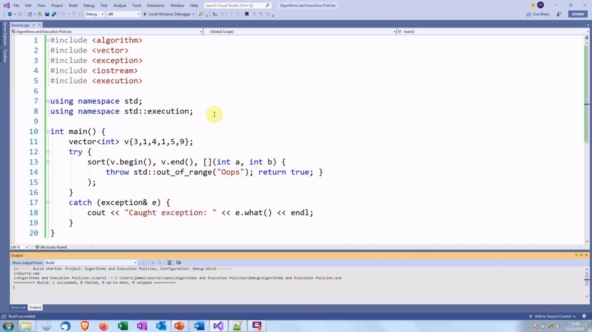

It's also possible for the algorithm call itself to throw an exception, even if it does not call any other functions. If it needs some temporary memory resources, for example, to manage the new threads that it is creating and it cannot obtain these, it is going to throw the standard bad_alloc exception.

> 算法调用本身也可能抛出异常，即使它不调用任何其他函数。
> 例如，如果它需要一些临时内存资源来管理正在创建的新线程，但无法获得这些资源，那么它将抛出标准的 bad_alloc 异常。

## img - 257600

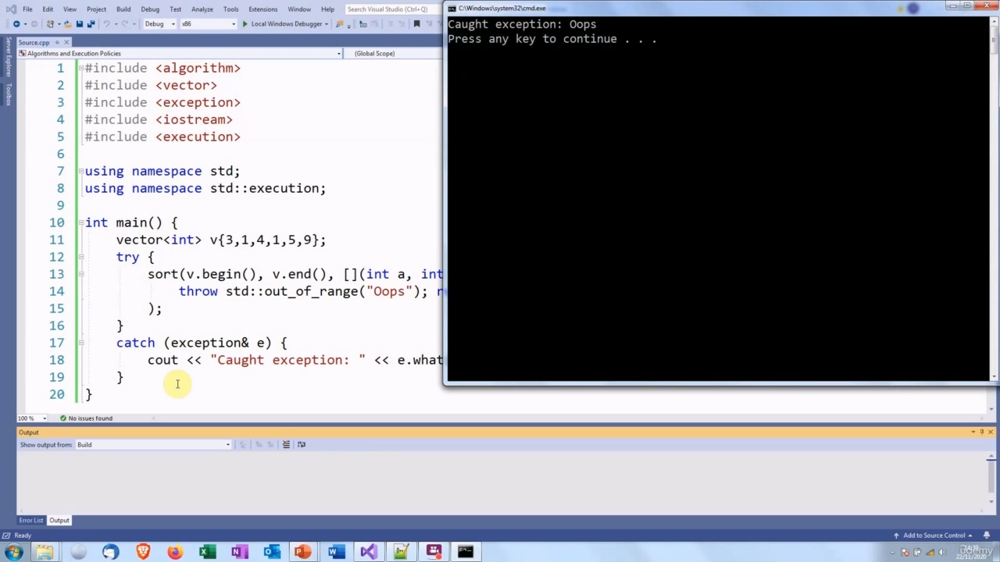

Let's look at an example. We have got a vector of ints. We are going to call the sort of algorithm. We are going to use the entire range of elements in the vector. So that is the data that is going to be sorted. We are going to compare the elements by using a lambda expression, and this lambda expression is going to throw an exception. We are calling the sort algorithm inside a try blog, so we would expect that the exception would be caught and handled in the catch block. So let's see what happens. So as we would expect, the exception is thrown.

> 让我们看一个例子。我们有一个整数向量。我们将调用这种算法。
> 我们将使用向量中的整个元素范围。这就是要排序的数据。我们将通过使用 lambda 表达式来比较元素，而这个 lambda 表达式将引发异常。我们在 try 博客中调用排序算法，因此我们希望在 catch 块中捕获并处理异常。让我们看看会发生什么。因此，正如我们预期的那样，异常被抛出。

## img - 329170

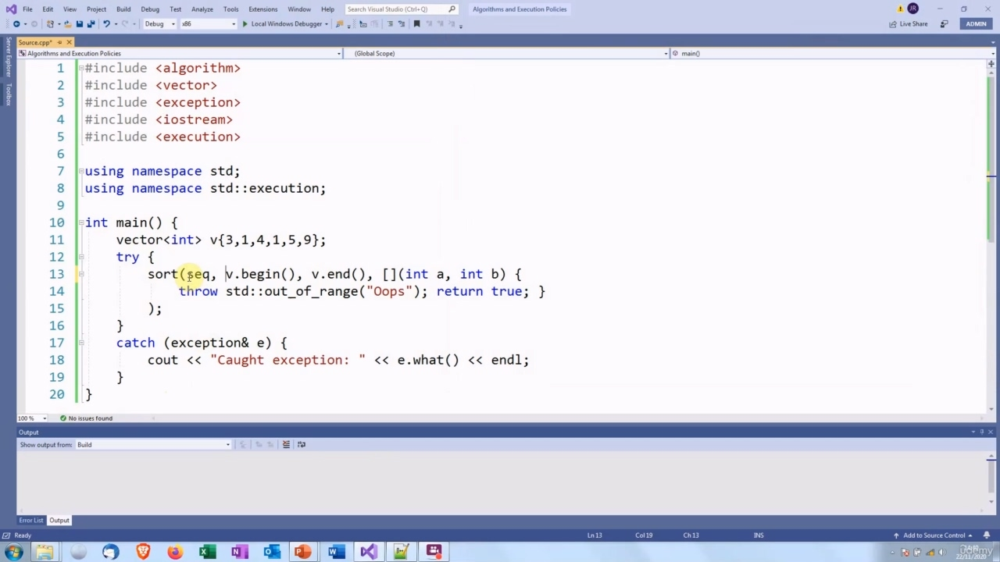

So as we would expect, the exception is thrown. It is caught in the catch block. And that is exactly as we would expect. If we now add an execution policy...

> 因此，正如我们预期的那样，异常被抛出。它被挡块卡住了。这正是我们所期望的。如果现在添加执行策略。。。

## img - 346370

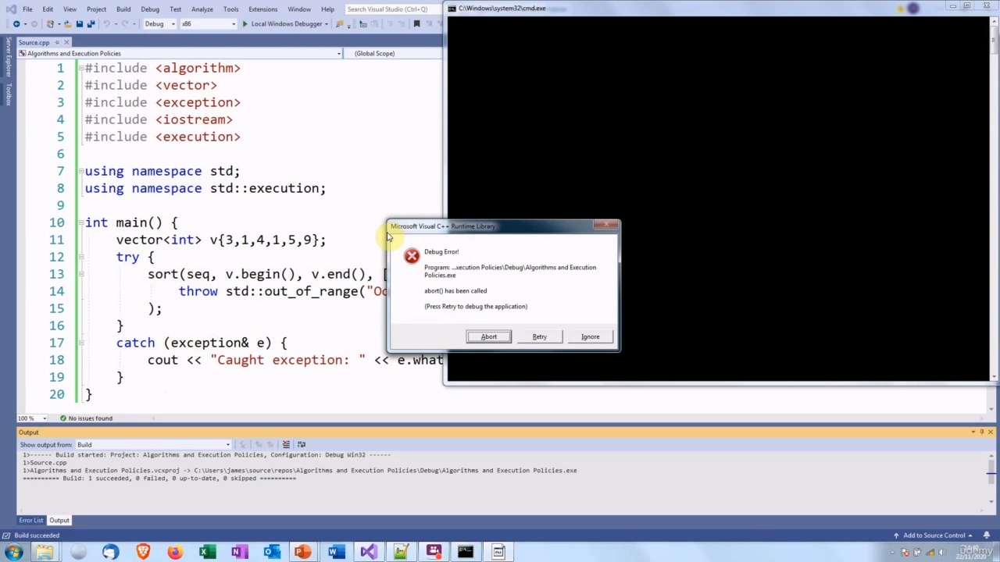

So let's use sequential for simplicity and then let's see what happens. So the program has terminated abnormally.

> 为了简单起见，让我们使用顺序，然后看看会发生什么。因此程序异常终止。

## img - 349040

So the program has terminated abnormally. The reason for this is that an algorithm which uses an execution policy can start up multiple threads. In C++, each thread has its own execution stack, and it is quite difficult to communicate exceptions between threads. There is the futures mechanism, but that would add overhead and it would defeat the object of using parallel execution. So instead, the program just terminates.

> 因此程序异常终止。原因是使用执行策略的算法可以启动多个线程。在 C++中，每个线程都有自己的执行堆栈，并且很难在线程之间传递异常。有期货机制，但这会增加开销，并且会破坏使用并行执行的目标。因此，程序只是终止。

## img - 429460

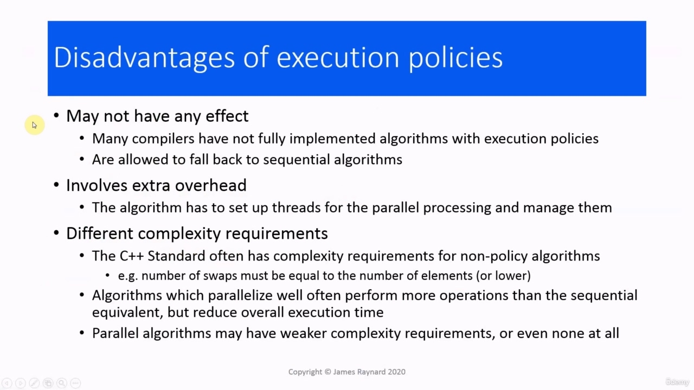

Now, you may be thinking that all this execution policy stuff sounds very exciting, and you are going to rush off and convert all your algorithm calls to use them. But before you do that, there are some downsides that you need to think about. The first one is that an execution policy may not actually do anything.

> 现在，您可能会认为所有这些执行策略的东西听起来都非常令人兴奋，您将立即转换所有的算法调用以使用它们。但在你这样做之前，你需要考虑一些缺点。第一个问题是执行策略实际上可能什么都做不了。

## img - 441030

The first one is that an execution policy may not actually do anything. The reason for this is that compiler writers are still in the process of implementing execution policies for algorithms. The C++ language does give them plenty of freedom in this respect. If they have not yet found an effective parallel or vectorized algorithm, they are allowed to supply a sequential implementation. So it may be that you ask for parallel and vectorized and you still get sequential. There is extra overhead involved, especially for the ones which do parallel processing. The algorithm

> 第一个问题是执行策略实际上可能什么都做不了。原因是编译器编写者仍在为算法实现执行策略的过程中。C++语言确实在这方面给了他们很大的自由。如果他们还没有找到有效的并行或矢量化算法，则允许他们提供顺序实现。
> 所以，你可能要求并行和矢量化，但你仍然得到顺序。这涉及额外的开销，特别是对于那些进行并行处理的系统。算法

## img - 515850

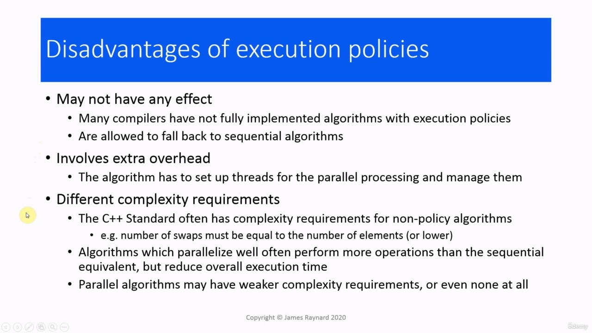

There is extra overhead involved, especially for the ones which do parallel processing. The algorithm will have to create threads and manage them, and that all uses up CPU time. There are things called complexity requirements which basically say how fast an algorithm has to run

> 这涉及额外的开销，特别是对于那些进行并行处理的系统。该算法必须创建线程并管理它们，这一切都会占用 CPU 时间。有一些叫做复杂度要求的东西，基本上可以说明算法的运行速度

## img - 527440

There are things called complexity requirements which basically say how fast an algorithm has to run for a given number of elements. The old algorithms have complexity requirements, for example, if you're doing a sort, the number of swap operations must be equal to or lower than the number of elements. When you move on to parallel algorithms, you often find that algorithms that work well in parallel

> 有一些叫做复杂度要求的东西，它基本上说明了算法对于给定数量的元素的运行速度。旧算法有复杂度要求，例如，如果要进行排序，交换操作的数量必须等于或小于元素的数量。当你转向并行算法时，你经常会发现并行运行良好的算法

## img - 547960

When you move on to parallel algorithms, you often find that algorithms that work well in parallel have more operations than ones which work well sequentially. So they actually perform more operations. But because they run in parallel, they take less time overall. So this means that the parallel algorithms may have weaker complexity requirements than the original

> 当你转向并行算法时，你经常会发现并行运行良好的算法比顺序运行良好的多。所以他们实际上执行了更多的操作。但由于它们是并行运行的，所以总体上花费的时间更少。

## img - 605200

So this means that the parallel algorithms may have weaker complexity requirements than the original ones or even no requirements at all. Obviously compiler writers want to have the most efficient implementations possible, for benchmarks. But it may be they have not found a good one yet, so they can put in a suboptimal one. So that might be a problem. Some of these problems are going to go away, of course, once there is better compiler support.

> 因此，这意味着并行算法可能具有比原始算法更弱的复杂度要求，甚至根本没有要求。
> 显然，编译器编写者想要尽可能高效地实现基准测试。但可能他们还没有找到一个好的，所以他们可以选择一个次优的。所以这可能是个问题。当然，一旦有了更好的编译器支持，其中一些问题就会消失。

## img - 630300

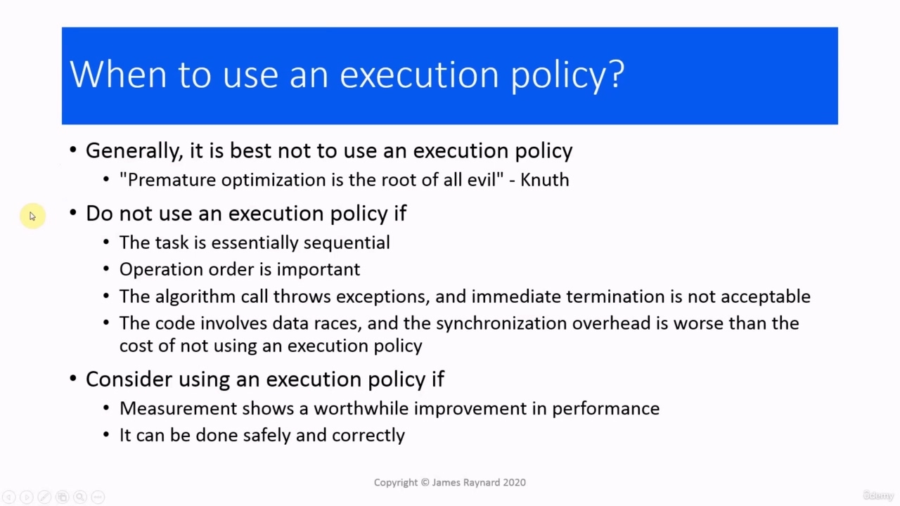

So when should we use an execution policy? The best advice is not to use one at all unless you know that you need one. There's a famous saying, which I think every programmer we should have stuck on their wall, which is "premature optimization is the root of all evil". The reasoning behind that is when you try to optimize, you often create complicated code, which is hard to understand and more difficult to get right. What you should do is to get clear, understandable, well-structured code that produces the correct answers, and then try to speed it up. Some situations where you should definitely not use an execution policy: If you have a task which is

> 那么我们什么时候应该使用执行策略？最好的建议是，除非你知道你需要一个，否则不要使用它。
> 有一句名言，我认为我们每个程序员都应该把它贴在墙上，那就是“过早优化是万恶之源”。这背后的原因是，当您尝试优化时，您通常会创建复杂的代码，这很难理解，也更难正确。
> 您应该做的是获得清晰、可理解、结构良好的代码，以产生正确的答案，然后尝试加快速度。在某些情况下，您绝对不应该使用执行策略：如果您有一项任务

## img - 709420

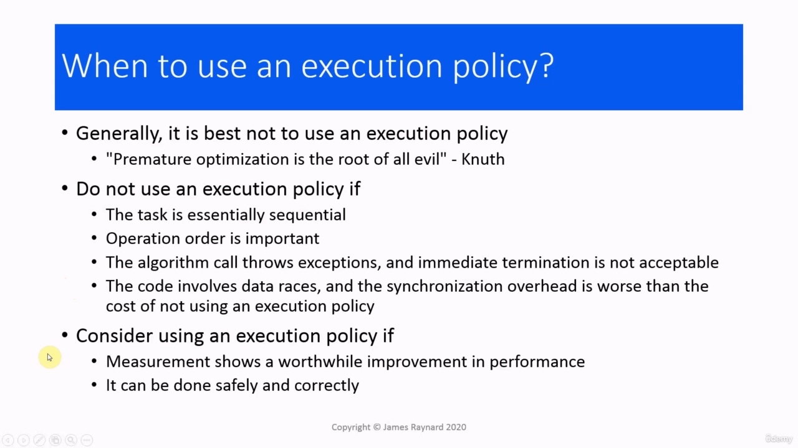

Some situations where you should definitely not use an execution policy: If you have a task which is best done sequentially. For example, incrementing the value of each element in turn. If the order of operations is important. if you try to re-order subtractions, then you will get some very wrong results. If the algorithm is going to call a function which might throw an exception, and immediately terminating the program is not acceptable. If the code involves data races, then parallel execution means that you will need to protect against a data race, and the cost of locking a mutex or using an atomic variable is probably going to be much greater than the cost of not having an execution policy. On the other hand, you should consider using an execution policy if measuring the performance of your

> 在某些情况下，您绝对不应该使用执行策略：如果您有一项任务，最好按顺序完成。例如，依次递增每个元素的值。如果操作顺序很重要。如果你尝试重新排列减法，那么你会得到一些非常错误的结果。如果算法要调用一个可能引发异常的函数，那么立即终止程序是不可接受的。如果代码涉及数据竞争，那么并行执行意味着您需要防止数据竞争，锁定互斥锁或使用原子变量的成本可能会比没有执行策略的成本高得多。另一方面，如果要衡量

## img - 756690

On the other hand, you should consider using an execution policy if measuring the performance of your program shows a definite and worthwhile improvement in performance. And of course, providing you can do it safely and correctly.

> 另一方面，如果衡量程序的性能表明性能有明显的、值得改进的地方，则应考虑使用执行策略。当然，前提是你能安全、正确地完成任务。

## img - 812470

So which execution policy should you use? Sequential execution. may sound a bit pointless, but in fact it is useful for debugging. The reason for that is that sequential execution is much easier to understand than parallel or vectorized execution. So it is much easier to spot when something is going wrong. This is almost the same as the non policy version, but it allows out of order execution and if any exceptions are thrown, it will terminate immediately. The obvious one to use is parallel unsequenced execution, which is both parallel and vector instructions. So that should give the biggest improvement in performance, but it also has the strictest requirements. You need to make sure there cannot be any data races and you need to make sure that the code does not modify shared state. So you need to avoid allocating and deallocating memory, and you also need to avoid mutexes, which rather conflicts with the data race [avoidance]. So this is best really for pure numerical work. Parallel execution can be used when vectorization is not safe.

> 那么您应该使用哪种执行策略？顺序执行。听起来可能有点无意义，但实际上它对调试很有用。原因是顺序执行比并行或矢量化执行更容易理解。因此，当出现问题时更容易发现。这与非策略版本几乎相同，但它允许无序执行，如果抛出任何异常，它将立即终止。
> 最明显的一种是并行非序列执行，即并行指令和矢量指令。因此，这应该会给性能带来最大的改善，但它也有最严格的要求。您需要确保不存在任何数据竞争，并且需要确保代码不会修改共享状态。因此，您需要避免分配和释放内存，还需要避免互斥，这与数据竞争（避免）相冲突。所以这对于纯数值计算来说是最好的。当矢量化不安全时，可以使用并行执行。

## img - 913910

Parallel execution can be used when vectorization is not safe. So if you are going to be locking mutexes or operating on memory. Unsequenced execution in C++20. That is just vectorization on its own. You can even use that in a

> 当矢量化不安全时，可以使用并行执行。所以，如果您要锁定互斥锁或对内存进行操作。C++20 中的无顺序执行。这本身就是矢量化。你甚至可以在

## img - 925870

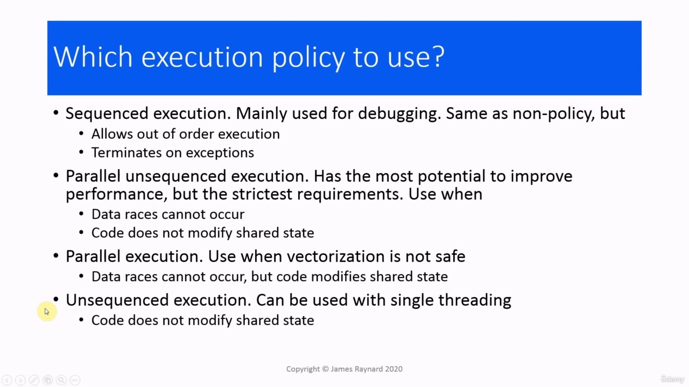

Unsequenced execution in C++20. That is just vectorization on its own. You can even use that in a single threaded program. The only requirement is that the code doesn't modify shared state. OK, so that's it for this video.

> C++20 中的无顺序执行。这本身就是矢量化。您甚至可以在单线程程序中使用它。唯一的要求是代码不修改共享状态。好了，这个视频就到此为止。
