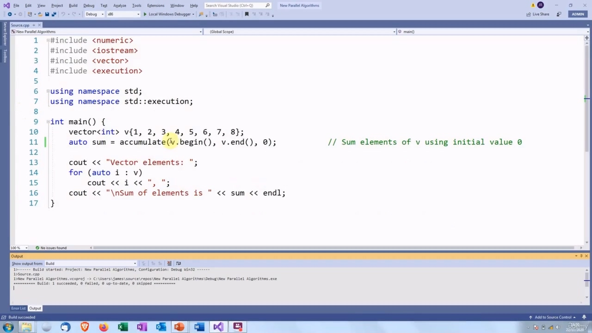
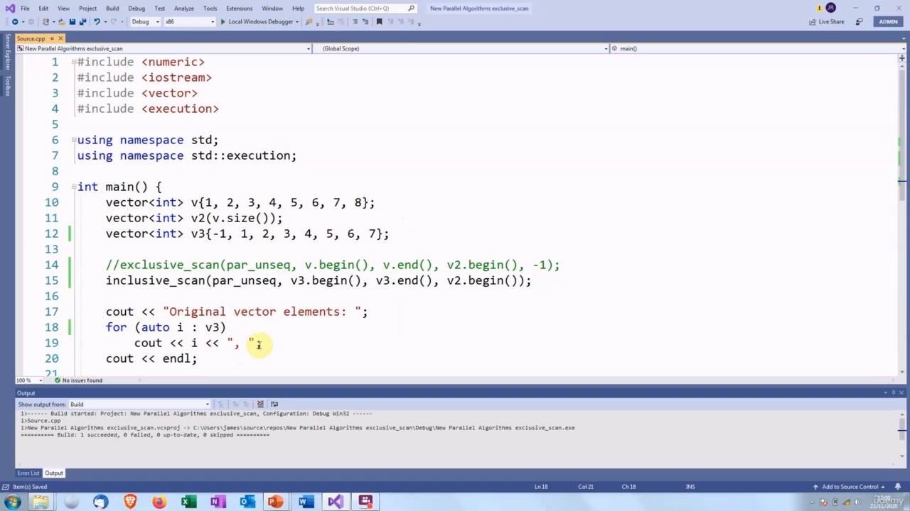

## img - 7530

In this video, we are going to look at new parallel algorithms. In the last video, we said that some

> 在本视频中，我们将研究新的并行算法。在上一个视频中，我们说

## img - 7530

In this video, we are going to look at new parallel algorithms. In the last video, we said that some of the algorithm functions from had to be rewritten to support execution policies. So we are going to look at those. The first one is accumulate. This takes a range of iterators and an initial value. It will add the value of each element in the range to that initial value and return the sum. By default, the plus operator is used for performing the addition. So if we have an initial value of zero, then we will get the sum of the values of all the elements. We can also pass a callable object as an additional fourth argument, if we want to perform a different operation. For example, if we want to get the product of the values of the elements, we could pass one as the initial value and pass a callable object that performs multiplication. So here is a simple example of accumulate.

> 在本视频中，我们将研究新的并行算法。在上一个视频中，我们说过必须重写中的一些算法函数以支持执行策略。所以我们要看看这些。
> 第一个是累积。这需要一系列迭代器和一个初始值。它会将范围中每个元素的值与初始值相加，并返回总和。默认情况下，加号运算符用于执行加法运算。如果我们的初始值为零，那么我们将得到所有元素的值之和。如果要执行不同的操作，我们还可以将可调用对象作为附加的第四个参数传递。
> 例如，如果我们想得到元素值的乘积，我们可以传递一个作为初始值，并传递一个执行乘法的可调用对象。这里是一个简单的累积示例。

## img - 100100

So here is a simple example of accumulate. We have a vector which we are going to perform the accumulate on. Then we call accumulate. We pass the elements, which is the entire vector in this case, and the initial value of zero. And we expect that will give us the total of the value of the elements in the vector, which is 36.

> 这里是一个简单的累积示例。我们有一个向量，我们要对它进行累加，然后我们称之为累加。我们传递元素，在本例中是整个向量，初始值为零。我们期望这将给出向量中元素的总值，即 36。

## img - 120350

And we expect that will give us the total of the value of the elements in the vector, which is 36.

> 我们期望这将给出向量中元素的总值，即 36。

## img - 131150

The reason why accumulate had to be rewritten is to do with the way that it was specified. The specification says that it must execute sequentially and also that the execution must be performed from left to right. So if we have a vector with elements one, two, three, four, it will have to execute it by doing one plus two, then add three to the result of that, then add four to the result of that and so on. This means that each addition must be complete before the next one can start.

> 必须重写累加的原因与它的指定方式有关。规范规定它必须按顺序执行，并且必须从左到右执行。因此，如果我们有一个包含元素 1、2、3、4 的向量，它必须通过执行 1 加 2 来执行，然后将 3 加到结果上，然后将 4 加到结果上等等。这意味着在下一个加法开始之前，每个加法都必须完成。

## img - 152690

This means that each addition must be complete before the next one can start. So obviously that is not compatible with a parallel implementation. It is also not compatible with a vectorized implementation, because vectorization means that the instructions take more than two arguments, and the specification says that each operation can only take two arguments.

> 这意味着每次添加都必须完成，才能开始下一次添加。显然，这**与并行实现不兼容。它也与矢量化实现不兼容**，因为矢量化意味着指令需要两个以上的参数，而规范规定每个操作只能使用两个参数。

## img - 218360

To overcome these problems, C++ provides a new function called reduce.

> 为了克服这些问题，C++提供了一个名为 reduce 的新函数。

## img - 229210

## img - 229210

This works exactly the same way as accumulate. The difference is that the execution is not guaranteed to be sequential or in left-to-right [order]. We can also apply a policy. So let's try parallel and vectorized... And there it is. OK?

> 这与累加的方式完全相同。不同之处在于，不能保证执行顺序或从左到右[顺序]。我们也可以应用策略。所以让我们尝试并行和矢量化。。。就在那里，好吗？

## img - 257290

So reduce will actually support all the execution policies. If we ask for sequential execution, then

> 因此 **reduce 实际上将支持所有执行策略**。如果我们要求顺序执行，那么

## img - 257290

So reduce will actually support all the execution policies. If we ask for sequential execution, then it is just going to do it as one big sequence of additions. If we ask for parallel execution, then it is going to break it down into four single additions, which can all be performed at the same time. So it will be one plus two and three plus four and five plus six and seven plus eight, and then combine the results to get the answer. If we ask for vectorized execution, then it will use an instruction which will add four numbers in a single instruction and then add another four numbers in a single instruction. And then we can do these vector executions in parallel. So we have parallel and vectorized. So we are doing two vectorized additions at the same time. So we are doing one plus two plus three plus four in a single instruction and five plus six plus seven plus eight as another separate instruction which can run at the same time.

> 因此 reduce 实际上将支持所有执行策略。
> 如果我们要求顺序执行，那么它将作为一个大的添加序列来执行。如果我们要求并行执行，那么它将把它分解为四个单独的加法，这些加法可以同时执行。所以它将是一加二和三加四，五加六和七加八，然后将结果组合起来得到答案。
> 如果我们要求矢量化执行，那么它将使用一条指令，该指令将在一条指令中添加四个数字，然后在一条命令中添加另外四个数字。然后我们可以并行执行这些向量执行。
> 所以我们进行了并行和矢量化。所以我们同时做两个矢量化加法。所以我们在一条指令中做一加二加三加四，在另一条单独的指令中做五加六加七加八，这两条指令可以同时运行。

## img - 402440

When reduce has a parallel execution policy, it breaks the operations down into something that looks like a tree. So we have eight numbers that we want to add. This is broken down into two additions of four numbers, and then each of those is broken down into four additions of two numbers. And then you cannot go any lower because you must have at least two numbers in an addition. So all of these additions are going to be performed, then the results will be combined. So the result, one and two will be combined with the result of three and four give the result of adding one and two and three and four. Then that will be combined with all the operations on the other side of the tree and then we get the final results. This is actually a very important concept in parallel programming. You split the program up into lots of operations, which run separately at the same time, and then you have a reduce step which will combine together all these partial results and give you the final answer.

> 当 reduce 有一个并行执行策略时，它将操作分解成一棵树。所以我们有八个数字要相加。这被分解为四个数字的两个加法，然后每个数字被分解为两个数字的四个加法。然后你不能再往下走，因为你必须在一个加法中至少有两个数字。所以所有这些加法都将被执行，然后结果将被合并。因此，一和二的结果将与三和四的结果相结合，得到一和二以及三和四相加的结果。
> 然后，这将与树另一侧的所有操作相结合，然后我们得到最终结果。这实际上是并行编程中一个非常重要的概念。你将程序分成许多操作，这些操作同时单独运行，然后你有一个 reduce 步骤，将所有这些部分结果合并在一起，并给出最终答案。

## img - 503150

We said that the operations may not be performed in sequence. If we are performing addition it does not matter, but if we are doing something like subtraction, then it is going to give the wrong answer. So there are some restrictions on the operator we can use. The operator must have some properties which are known by mathematicians as associativity and commutativity. If it is commutative, that means the order does not matter. So two plus three is the same as three plus two. If it is associative, then grouping operations together does not change the result. This is true for adding integers, multiplying them. It is not true for subtraction and is also not true for floating point.

> 我们说过这些操作可能不会按顺序执行。如果我们在做加法，这并不重要，但如果我们做减法，那么它会给出错误的答案。所以我们可以使用的运算符有一些限制。
> 该算子必须具有一些数学家称为结合性和交换性的性质。如果它是可交换的，这意味着顺序无关紧要。所以二加三等于三加二。如果它是关联的，那么将操作分组在一起不会改变结果。这适用于整数相加和相乘。减法不正确，浮点也不正确。

## img - 548590

Another function that was rewritten was partial_sum. This is used for populating a second vector. Each element in the second vector is the sum of the corresponding elements so far in the first vector. So if we have a vector one, two, three, four, the first element of the result will be one. The second will be one plus two. The third will be one plus two plus three. And the fourth will be one plus two plus two plus four. So each element in v2 contains "the sum so far" from v1.

> 另一个被重写的函数是 partial_sum。这用于填充第二个向量。第二向量中的每个元素是第一向量中迄今为止的对应元素的和。所以如果我们有一个向量一二三四，结果的第一个元素就是一。第二个是一加二。第三个是一加二加三。第四个是一加二加二加四。所以 v2 中的每个元素都包含 v1 中的“到目前为止的总和”。

## img - 623020

So here is an example. We have the same starting vector. We have another vector that we are going to populate. In this case, I am making sure that the populated vector is the same size as the original vector. So we are not going to have any problems with invalid element accesses. You could also use a back_inserter in this case. However, you cannot use a back_inserter with an execution policy. So that is why I am doing it this way. We then call partial_sum. We give the element range again. That is all the elements in the first vector. And then the start of the target vector. So we are going to start from the beginning of the second vector.

> 这里有一个例子。我们有相同的起始向量。我们有另一个向量，我们要填充。在这种情况下，我要确保填充的向量与原始向量的大小相同。
> 因此，我们不会遇到任何无效元素访问的问题。在这种情况下，还可以使用 back_inserter。但是，不能将 back_inserter 与执行策略一起使用。这就是为什么我要这样做。然后我们调用 partial_sum。我们再次给出元素范围。这是第一个向量中的所有元素。然后是目标向量的起点。所以我们要从第二个向量的开头开始。

## img - 704370

And then you can see that each element is the sum of the elements so far. So the first one is one, the second element is one plus two. The third element is one plus two plus three and so on. And the last element is the sum of all the elements. There are actually two different algorithms which replace partial_sum. One is inclusive_scan.

> 然后你可以看到，每个元素都是到目前为止元素的总和。所以第一个元素是 1，第二个元素是一加 2。第三个元素是一加二加三等等。
> 最后一个元素是所有元素的总和。实际上有两种不同的算法可以替代 partial_sum。一种是包容性扫描。

## img - 733660

So this does exactly the same as partial sum, except it supports policies. So we can put a policy in here.

> 所以这和部分和完全一样，只是它支持政策。所以我们可以在这里制定政策。

## img - 740500

And that all works.

> 这一切都奏效了。

## img - 750930

The other C++17 version of partial_sum is called exclusive_scan.

> **partial_sum 的另一个 C++17 版本称为 exclusive_scan。**

## img - 750930

The other C++17 version of partial_sum is called exclusive_scan. This is a bit more complicated. It excludes the current element from the sum, but it also adds an extra element which is supplied as a fourth argument. So in this case, we're calling exclusive scan with a fourth argument of minus one. We have this vector here, but it is actually going to be treated as though it was like this, with the first element, minus one, and then last element has been dropped.

> partial_sum 的另一个 C++17 版本称为 exclusive_scan。这有点复杂。它将当前元素从和中排除，但还添加了一个额外的元素，作为第四个参数提供。所以在本例中，我们使用第四个参数负一调用互斥扫描。我们这里有这个向量，但实际上它会被当作这样处理，第一个元素减一，然后最后一个元素被删除。

## img - 818510

first element, minus one, and then last element has been dropped. This is probably a bit hard to understand. I think the best way to explain it is to show the output.

> 第一个元素，减一，然后最后一个元素已被删除。这可能有点难以理解。我认为最好的解释方法是显示输出。

## img - 837600

So the first element is the imaginary first element, minus one. The second element is the sum of minus one and the actual first element, which gives zero. And we add zero, two. And three is five, five and four is nine and so on. It is the same as if we did an inclusive_scan... of this vector. So the first element has been replaced by minus one.

> 所以第一个元素是假想的第一个元素，减一。第二个元素是负一和实际的第一个元素的和，这是零。我们加上 0，2。三是五，五和四是九等等。这就像我们做了一个包容性的扫描一样。。。该矢量的。所以第一个元素已经被减一所取代。

## img - 857140

of this vector. So the first element has been replaced by minus one. The rest have been shuffled along and the last element has been dropped. (So if I change the printed output!)

> 该矢量的。所以第一个元素已经被减一所取代。其余的元素已被打乱，最后一个元素已被删除。（因此，如果我更改打印输出！）

## img - 906380

(So if I change the printed output!)

> （因此，如果我更改打印输出！）

## img - 915890

So the first element is minus one, second element is minus one plus one, third element is those plus two, fourth element plus three, fifth plus four and so on. But the best way to appreciate this is to experiment with it yourselves. It may seem rather a strange thing to do, but it is actually very useful in numeric programming. There it is again. OK, so that's it for this video. I'll see you next time.

> 所以第一个元素是负一，第二个元素是减一加一，第三个元素是那些加二，第四个元素加三，第五个元素加四，等等。但最好的方法是自己实验。这可能看起来很奇怪，但实际上在数字编程中非常有用。
>
> 又到了。好了，这个视频就到此为止。下次见。
