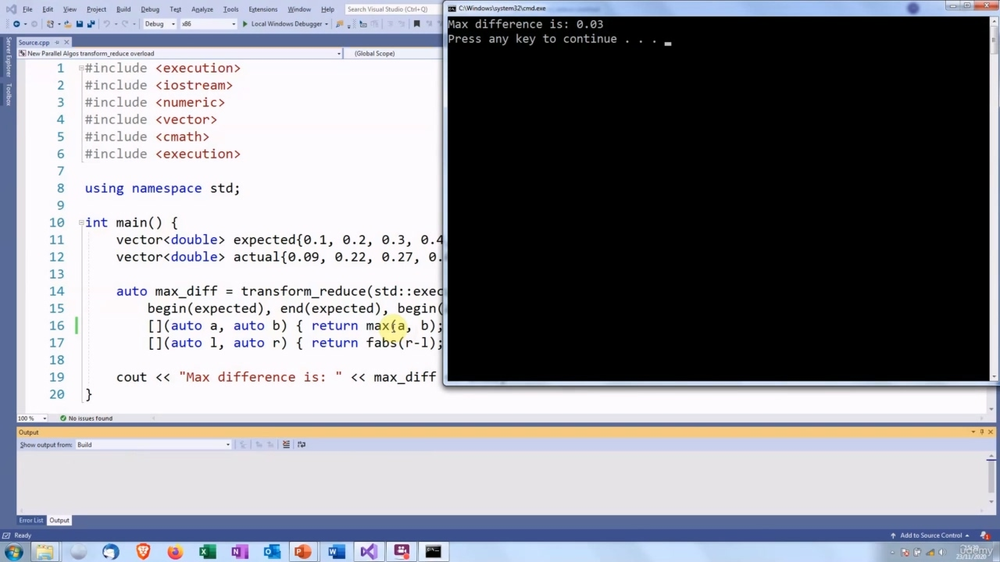

Hello again! In this video, we are going to continue looking at the new parallel algorithms in C++17.

> 你好！在本视频中，我们将继续研究 C++17 中的新并行算法。

## img - 6690

In this video, we are going to continue looking at the new parallel algorithms in C++17. First, we are going to take a slight detour and look at the transform algorithm.

> 在本视频中，我们将继续研究 C++17 中的新并行算法。首先，我们将稍微绕道看一下 transform 算法。

## img - 12930

First, we are going to take a slight detour and look at the transform algorithm. This takes a range of elements and a callable object. It will call that object on every element in the iterator range, and the result of each call will be used to populate a destination container. In functional languages, there is a similar concept called map. That name is used for something else in C++.

> 首先，我们将稍微绕道看一下 transform 算法。这需要一系列元素和一个可调用对象。它将在迭代器范围内的每个元素上调用该对象，每次调用的结果将用于填充目标容器。在函数语言中，有一个类似的概念叫做 map。该名称用于 C++中的其他内容。

## img - 44320

So here is an example of transform. We have a vector, which is going to be the input and a vector v2 which is going to be the output. Our callable object will double its argument. So this is going to be called on every element in v and the result is going to be stored as the elements of v2. So we would expect that the elements of v2 are two, four, six and eight from doubling these. And there

> 这里是一个 transform 的例子。我们有一个向量，它将作为输入，一个向量 v2 将作为输出。我们的可调用对象将使其参数加倍。这将在 v 中的每个元素上调用，结果将存储为 v2 的元素。因此，我们可以预期 v2 的元素是 2、4、6 和 8，将其加倍。在那里

## img - 108820

So we would expect that the elements of v2 are two, four, six and eight from doubling these. And there are, two four, six, eight. So that allows us to apply a unary operator to transform a vector.

> 因此，我们可以预期 v2 的元素是 2、4、6 和 8，将其加倍。有，四，六，八。因此，这允许我们应用一元运算符来 transform 向量。

## img - 119770

So that allows us to apply a unary operator to transform a vector. There's also an overload of transform, which allows us to apply a binary operator to transform pairs of elements from different containers. So this version will take elements from two containers and combine them. So in this case, we have two input containers. v3 is going to be the output container. The callable object is going to add its arguments, so this is going to be called on every element in v and v2. And it is going to add them. So one plus five, and then that will store six as the first elements of v3. Two plus six will give eight as the second element and so on.

> 因此，这允许我们应用一元运算符来 transform 向量。还有一个转换重载，它允许我们应用二进制运算符来转换来自不同容器的元素对。因此，这个版本将从两个容器中获取元素并将它们组合起来。所以在本例中，我们有两个输入容器。v3 将成为输出容器。可调用对象将添加其参数，因此这将在 v 和 v2 中的每个元素上调用。它将添加它们。所以一加五，然后将存储六个作为 v3 的第一个元素。二加六将得到八作为第二个元素，依此类推。

## img - 205210

So there we are. The elements in this vector are the sum of the corresponding elements in the input vectors.

> 我们就在这里。此向量中的元素是输入向量中相应元素的总和。

## img - 220210

We have touched upon this already, but one of the most common ways of doing parallel programming is to split the problem up into small units, have one thread or processor which handles each sub-unit, and then you combine all the results from each sub-unit to get the complete result. In C++, you can do this by dividing the data into subsets. You start a number of threads, each one of which will call transform and perform some sort of operation on part of the data, and then you can call reduce to combine together the results from each thread into the final answer. The problem is that these are two separate functions.

> 我们已经提到了这一点，但最常见的并行编程方法之一是将问题分割成多个小单元，由一个线程或处理器处理每个子单元，然后将每个子单元的所有结果组合起来，得到完整的结果。在 C++中，可以通过将数据划分为子集来实现这一点。您启动多个线程，每个线程都将调用 transform 并对部分数据执行某种操作，然后您可以调用 reduce 将每个线程的结果合并到最终答案中。问题是这是两个独立的功能。

## img - 255010

The problem is that these are two separate functions. So each thread that calls transform has to write data to a container. The reduce process has to read all these containers. The reduce function cannot be called until all the transform threads have finished. Because all the transform threads will be taken down and then reduce will have to start up some threads as well, and it would be much more efficient if we could just re-use these threads. Another way of thinking about this is going back to the early days of programming, before there were things like interprocess communication. If you wanted programs to share data, you would have to get one program to write its data to file, and then the next program would have to read its data from that file or perhaps tape in those days. The problem is that writing to file is very slow. What they did was invent various forms of interprocess communication in which the data is held in memory, so that avoids all the output of writing to file and reading back in again. It also introduces the possibility of streaming data. So the second program can start reading data as soon as the first program produces it.

> 问题是这是两个独立的功能。因此，调用转换的每个线程都必须将数据写入容器。reduce 过程必须读取所有这些容器。在所有转换线程完成之前，无法调用 reduce 函数。因为所有的转换线程都将被关闭，然后 reduce 也必须启动一些线程，如果我们可以重用这些线程，那么效率会高得多。
> 关于这一点的另一种思考方式是回到编程的早期，在出现诸如进程间通信之类的事情之前。如果你想让程序共享数据，你必须让一个程序将其数据写入文件，然后下一个程序必须从该文件或磁带读取数据。问题是写入文件非常慢。他们所做的是发明了各种形式的进程间通信，其中数据保存在内存中，从而避免了写入文件和再次读取文件的所有输出。它还介绍了流数据的可能性。因此，第一个程序一产生数据，第二个程序就可以开始读取数据。

## img - 417420

C++ provides a combined transform_reduce function to remove this overhead. It is actually based on an existing algorithm called inner_product. So let's find out what that does.

> C++提供了一个组合的 transform_reduce 函数来消除这个开销。它实际上基于一种称为 inner_product 的现有算法。所以让我们来看看这是什么。

## img - 431340

inner_product is actually designed for numerical processing. It takes two containers, multiplies the corresponding elements together, and then calculates the sum of all these products. So as an example, we have two vectors x and y. We call inner_product. We give the iterator range,

> inner_product 实际上是为数字处理而设计的。它使用两个容器，将相应的元素相乘，然后计算所有这些乘积的和。例如，我们有两个向量 x 和 y，我们称为 inner_product。我们给出迭代器范围，

## img - 445610

So as an example, we have two vectors x and y. We call inner_product. We give the iterator range, which is all the elements in x, we give the start of y and the initial value of the sum, this will multiply the values. So one times five, two times four, three times three and so on. And it is going to add all those together. And the result is 35.

> 例如，我们有两个向量 x 和 y，我们称为 inner_product。我们给出迭代器范围，它是 x 中的所有元素，我们给出 y 的起始值和和的初始值，这将使值相乘。所以一乘五，二乘四，三乘三等等，然后把这些加在一起。结果是 35。

## img - 503700

And it is going to add all those together. And the result is 35. transform_reduce works exactly the same way, except we have the option of specifying an execution

> 它将把所有这些加在一起。结果是 35。transform_reduce 的工作方式完全相同，只是我们可以选择指定执行

## img - 515150

transform_reduce works exactly the same way, except we have the option of specifying an execution policy. So here we are. Let's see, we get the same result, 35. Basically the same code. We just replace inner_product by transform

> transform_reduce 的工作方式完全相同，只是我们可以选择指定执行策略。我们到了。让我们看看，我们得到了同样的结果，35。基本上是相同的代码。我们只是用 transform 代替 inner_product

## img - 524720

Let's see, we get the same result, 35. Basically the same code. We just replace inner_product by transform\* reduce. You may say "that is not very interesting, I do not do very much matrix multiplication in my work."

> 让我们看看，我们得到了同样的结果，35。基本上是相同的代码。我们只是用 transform_reduce 替换内部乘积。你可能会说：“这不是很有趣，我在工作中不做很多矩阵乘法。”

## img - 534490

You may say "that is not very interesting, I do not do very much matrix multiplication in my work." The interesting thing is that you can overload the operators. We can replace the multiplication by a "transform" function. So this takes two arguments of the type of the elements of the containers, and it does something and it returns a value which has some return type, and then we can replace the addition operator by a "reduce" function. This will take two arguments of the returned type, do something with them and return another value of the result type. So we can do some kind of parallel operation here and then we can combine together the results here.

> 你可能会说“这不是很有趣，我在工作中不做很多矩阵乘法。”有趣的是，你可以重载运算符。我们可以用“transform”函数代替乘法。
> 所以这需要两个容器元素类型的参数，它会做一些事情，并返回一个具有某种返回类型的值，然后我们可以用“reduce”函数替换加法运算符。这将采用返回类型的两个参数，对它们进行处理并返回结果类型的另一个值。所以我们可以在这里进行某种并行运算，然后我们可以将结果组合在一起。

## img - 619050

An example which is not really going too far away from maths. It is a scientific experiment, we have done an experiment. We have got a vector here which contains our results. We have also got another vector. We have calculated what the results should be according to the theory. So we want to find out which one of these data points has the biggest erorr, which means the biggest discrepancy between theory and practice. We could do this using a transform_reduce. We replace the multiplication by some kind of transformation operation. So this is the stage that is done in parallel. In this case, we are finding the differences between the corresponding elements in the two vectors. Then we replace the addition by a reduce operation. So this is going to go through the differences and produce the final answer. In this case, it is going to find the largest one out of those differences. So it is going to work like this. We will replace the multiplication by a function that finds the difference

> 一个离数学不远的例子。这是一个科学实验，我们做了一个实验。这里有一个向量，它包含了我们的结果。我们还得到了另一个向量。我们已经根据理论计算出了结果。所以我们想找出这些数据点中哪一个具有最大的误差，这意味着理论和实践之间的最大差异。
> 我们可以使用 transform_reduce 来实现这一点。我们用某种 transform 运算来代替乘法。这是一个并行完成的阶段。在这种情况下，我们正在寻找两个向量中对应元素之间的差异。然后我们用一个 reduce 操作替换加法。因此，这将通过差异得出最终答案。在这种情况下，它将从这些差异中找到最大的差异。所以它会这样工作。我们将用一个求差的函数来代替乘法

## img - 717730

So it is going to work like this. We will replace the multiplication by a function that finds the difference between corresponding elements, instead of multiplying them together. And instead of adding together the results, we are going to find the result which has the biggest value. So here we are, the transform stage is where we find the difference between the two elements and then the reduce stage is where we find the biggest difference.

> 所以它会这样工作。我们将用查找相应元素之间差异的函数代替乘法，而不是将它们相乘。而不是将结果相加，我们将找到具有最大价值的结果。所以我们在这里，转换阶段是我们找到两个元素之间的差异的地方，然后还原阶段是我们发现最大差异的地方。

## img - 750750

So here is an example. I have created a vector which has the results which are predicted by theory, and then some results which might have come from actually doing the experiment. Then we call transform_reduce. We find the absolute difference between each element. We have to use the floating point version because these are doubles. And then we go through and find the maximum. So let's see what that gives us. There we are. The maximum difference is nought point nought three.

> 这里有一个例子。我创建了一个向量，它有理论预测的结果，然后是一些可能来自实际实验的结果。然后我们调用 transform_reduce。我们找到每个元素之间的绝对差异。我们必须使用浮点型，因为这是双精度的。然后我们通过并找到最大值。让我们看看这给了我们什么。最大差值为零点零三。

## img - 813250

The maximum difference is nought point nought three. And I think that is those elements there. And there we again, nought point nought three.

> 最大差值为零点零三。我认为这就是那些元素。在这里，我们再次，零点零三。

## img - 828140

And there we again, nought point nought three. OK, so that's it for this video. I'll see you next time.

> 在这里，我们再次，零点零三。好了，这个视频就到此为止。下次见。
