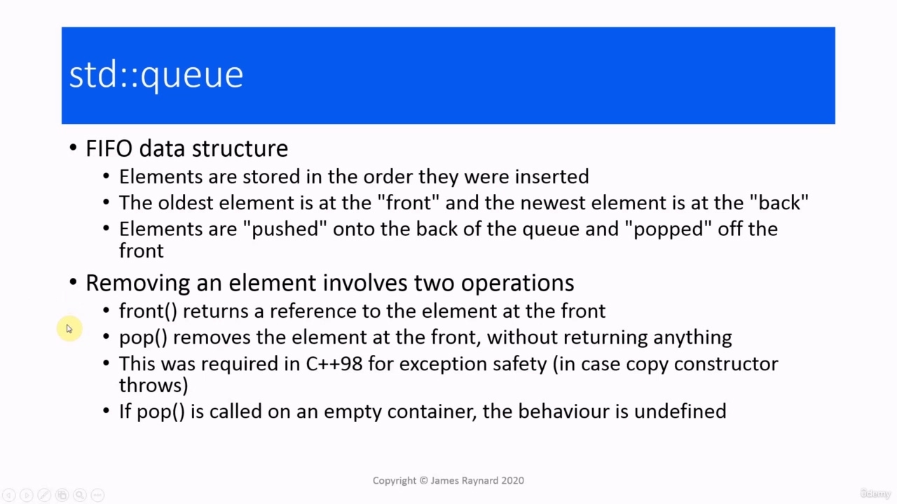

Hello again! In this video, we are going to look at implementing a concurrent queue. The C++ library already provides

> 你好！在本视频中，我们将讨论如何实现并发 queue。C++库已经提供

## img - 9330

In this video, we are going to look at implementing a concurrent queue. The C++ library already provides an std::queue, so let's remind ourselves what that does. This is what is known as a first in, first out data structure. If you think of this as being like a queue of humans, so they all stand there in the order that they arrive. The earliest arrival is at the front and the latest arrival is at the back. In a queue data structure, elements are stored in the order they are inserted. The oldest element goes at the front, the newest element goes to the back. Elements are said to be "pushed" onto the back of the queue and "popped" off the front. So elements are also removed in the order that they arrive. In the C++ implementation,

> 在本视频中，我们将讨论如何实现并发 queue。C++库已经提供了一个 std::queue，所以让我们提醒自己它的作用。这就是所谓的先进先出数据结构。如果你认为这就像一队人，那么他们都按照到达的顺序站在那里。最早的到达在前面，最晚的到达在后面。
> 在 queue 数据结构中，元素按插入顺序存储。最古老的元素在前面，最新的元素在后面。据说元素被“推”到 queue 的后面，然后从前面“弹出”。因此，元素也按照到达的顺序被移除。在 C++实现中，

## img - 51520

So elements are also removed in the order that they arrive. In the C++ implementation, removing an element from the queue actually involves two separate operations. The first one is you call front() to get the value of the element at the front. This will return a reference to it. Then you call pop(), which will actually remove the element from the front without returning anything.

> 因此，元素也按照到达的顺序被移除。在 C++实现中，从 queue 中删除元素实际上涉及两个单独的操作。第一个是调用 front()来获取前面元素的值。这将返回对它的引用。然后调用 pop()，它实际上将从前面删除元素，而不返回任何内容。

## img - 111550

Then you call pop(), which will actually remove the element from the front without returning anything. This is different from the way that queues in most languages work. In most languages, when you call pop(), it returns the value and removes the element in one single operation. The problem is, in C++98, that would not be exception-safe. There were really only two options. One was to return the front element by reference and then when the element is removed, you then have a reference to something that no longer exists. The alternative was to return it by value, which means calling the copy constructor, so you would make a copy of the value, then remove the element and then return the copy. The problem is that copy constructors can throw exceptions, and if you get an exception after you have removed the element, then that element is completely lost. There is no way that anyone can get its value. So that is why they had to do that way. In C++11, of course, you can return by move, which solves all these problems because move operations cannot throw. Well, they should not throw! If pop() is called on an empty container. the behaviour is undefined. So you might want to pause the video for a couple of minutes and see if you can think of any reasons why this might be problematic in a multithreaded program.

> 然后调用 pop()，它实际上会从前面删除元素而不返回任何内容。这与大多数语言中的 queue 工作方式不同。在大多数语言中，当您调用 pop()时，它会在一次操作中返回值并删除元素。问题是，在 C++98 中，这不是异常安全的。
> 实际上只有两种选择。
> 一种方法是通过引用返回前面的元素，然后当元素被删除时，您就有了对不再存在的元素的引用。
> 另一种方法是按值返回它，这意味着调用复制构造函数，因此您将复制该值，然后删除元素，然后返回副本。
> 问题是，复制构造函数会抛出异常，如果在删除元素后出现异常，则该元素将完全丢失。任何人都无法获得它的价值。这就是为什么他们必须这样做。当然，在 C++11 中，您可以通过 move 返回，这解决了所有这些问题，因为 move 操作不能抛出。嗯，他们不应该扔！如果对空容器调用 pop()。该行为未定义。因此，您可能需要暂停视频几分钟，看看是否能想出在多线程程序中出现问题的原因。

## img - 239340

OK, well, I have got three reasons, or maybe two and a half. The first one is the library guarantees on container objects. If you have the same instance, which is accessed from multiple threads and there is modification, then there is a data race. So this means we cannot use a queue directly. We have to protect it. There is also a race condition between calling front() and calling pop() when we remove an element. If we call front() and we get the value of the first element and then we are interrupted and some other thread runs and calls pop(), then we wake up and call pop() again. The element that we popped is not the one with the value that we got. So we have an inconsistency in our program. The other problematic issue is the undefined behaviour if we call pop() on an empty queue. So we need to implement a concurrent queue and the easiest way to do that is to write a wrapper class about the

> 好吧，我有三个理由，或者两个半。
> 第一个是对容器对象的库保证。如果您有同一个实例，它是从多个线程访问的，并且存在修改，那么就存在数据竞争。因此，这意味着我们不能直接使用 queue。我们必须保护它。当我们删除一个元素时，调用 front()和调用 pop()之间也存在竞争条件。如果我们调用 front()并获得第一个元素的值，然后我们被中断，其他线程运行并调用 pop()，然后我们醒来并再次调用 pop()。
> 我们弹出的元素不是我们得到的值。因此，我们的程序存在不一致性。
> 另一个问题是，如果我们在空 queue 上调用 pop()，则会出现未定义的行为。因此，我们需要实现一个并发 queue，最简单的方法是编写一个关于

## img - 336380

So we need to implement a concurrent queue and the easiest way to do that is to write a wrapper class about the standard queue. We have a standard queue instance as a member of the class and we also have a mutex as another member of that class. The way this will work is that each of our member functions will lock the mutex, then it will call the corresponding member function or member functions of the standard queue member. And then it will unlock the mutex. So that should all be thread-safe, because only one thread can access the queue member at any one time. So you might like to pause the video for a couple of minutes and think about how you would implement this class. How you would write the member functions?

> 因此，我们需要实现一个并发 queue，最简单的方法是编写一个关于标准 queue 的包装类。
> 我们有一个标准 queue 实例作为该类的成员，我们也有**一个互斥锁作为该类中的另一个成员**。这样做的方式是，我们的每个成员函数都将锁定互斥锁，然后它将调用相应的成员函数或标准 queue 成员的成员函数。然后它将解锁互斥锁。因此，这应该都是线程安全的，因为在任何时候只有一个线程可以访问 queue 成员。因此，您可能需要暂停视频几分钟，并思考如何实现这个类。您将如何编写成员函数？

## img - 425280

OK, so this is what I propose to do. For the special member functions: constructor, copy constructor, destructor and so on, we are just going to use the defaults, which will call the corresponding functions on the data members. The push member function is going to lock the mutex. It will call the push member function of the standard queue member. It will pass its argument to that call. When that call returns, it will unlock the mutex. The pop member function is only a little more complex. It is going to lock the mutex, it's going to call the front member function of the queue member, and it is going to copy the return value into its argument. This is going to take a reference to some variable of the element type. Then, while it is still under the lock, it is going to call the pop member function of the queue to remove the element, and then when that returns, it will unlock the mutex. And we are also going to do something sensible if it is called on an empty queue. So, again, you might like to pause the video and think about what happens if there is an exception. Is there anything in here that can throw an exception? And if so, will it be safe?

> 好的，这就是我要做的。对于特殊的成员函数：构造函数、复制构造函数、析构函数等等，我们将使用默认值，它将调用数据成员上的相应函数。
> push 成员函数将锁定互斥锁。它将调用标准 queue 成员的推送成员函数。它会将其参数传递给该调用。当该调用返回时，它将解锁互斥锁。pop 成员函数只是稍微复杂一点。它将锁定互斥锁，它将调用 queue 成员的前端成员函数，并将返回值复制到其参数中。这将引用元素类型的某个变量。然后，当它仍然处于锁下时，它将调用 queue 的 pop 成员函数来删除元素，然后当返回时，它会解锁互斥锁。如果在空 queue 中调用它，我们也会做一些明智的事情。因此，再次，您可能需要暂停视频，并思考如果出现异常会发生什么。这里有什么东西可以引发异常吗？如果是这样，它会安全吗？

## img - 538700

There are a couple of possibilities. One is when we call the queue's push(), we are going to copy the argument and that copy could throw. In that case, we don't actually get to call push() on the queue member, we do not modify the queue and then everything is left as it was. And then if we use some wrapper objects like the lock guard or unique lock, the mutex will be automatically unlocked when the destructors are called. In the pop function, we again have a copy constructor. In that case, all that we have done is to call the front member function. We have just looked at the first element in the queue. We do not actually get to call pop. So, again, the queue is unmodified. So that does not actually affect anything. And the mutex will be automatically unlocked when the destructors are called. So we have actually provided the strong exception guarantee. If an exception is thrown, then everything will be left as it was.

> 有两种可能性。一个是当我们调用 queue 的 push()时，我们将复制该参数，并且该复制可能会抛出。在这种情况下，我们实际上无法在 queue 成员上调用 push()，我们不会修改 queue，然后一切都保持原样。然后，如果我们使用一些包装器对象，如锁保护或唯一锁，那么当调用析构函数时，互斥锁将自动解锁。在 pop 函数中，我们还有一个复制构造函数。在这种情况下，我们所做的只是调用前端成员函数。我们刚刚查看了 queue 中的第一个元素。我们实际上不能打电话给 pop。因此，queue 也是未修改的。所以这实际上不会影响任何事情。当调用析构函数时，互斥锁将自动解锁。所以我们实际上提供了强有力的例外保证。如果抛出异常，那么一切都将保持原样。

## img - 645590

OK, so here is our class definition. We are going to make it a template class so we can store any type of element inside it.

> 好的，这是我们的类定义。我们将使它成为一个模板类，以便我们可以在其中存储任何类型的元素。

## img - 657350

We have a mutex and a queue as members. We are going to use the defaults for the special functions. I put

> 我们有一个互斥体和一个 queue 作为成员。我们将使用特殊函数的默认值。我把

## img - 657350

We have a mutex and a queue as members. We are going to use the defaults for the special functions. I put the constructor in just to make it obvious that we have not forgotten. The push member function is going to lock the mutex using a lock guard, and it is going to call push on the

> 我们有一个互斥体和一个 queue 作为成员。我们将使用特殊函数的默认值。我把构造函数放进去只是为了表明我们没有忘记。push 成员函数将使用锁保护来锁定互斥锁，并将在

## img - 710290

The push member function is going to lock the mutex using a lock guard, and it is going to call push on the underlying queue. It will pass the argument that we are pushing onto the queue. And then when this returns, the mutex will be unlocked. The function will again lock the mutex. We check if the queue is empty and if it is, we throw an exception.

> push 成员函数将使用锁保护来锁定互斥锁，并将在底层 queue 上调用 push。它将传递我们正在推进 queue 的参数。然后当它返回时，互斥锁将被解锁。该函数将再次锁定互斥锁。我们检查 queue 是否为空，如果为空，则抛出异常。

## img - 727060

The function will again lock the mutex. We check if the queue is empty and if it is, we throw an exception. If the queue is not empty, we are still under the lock, so no one else can come along and modify the queue. And then we get the front element and we remove the element from the queue, and then the mutex will be

> 该函数将再次锁定互斥锁。我们检查 queue 是否为空，如果为空，则抛出异常。如果 queue 不是空的，那么我们仍然处于锁定状态，因此其他人不能一起修改 queue。然后我们得到前面的元素，然后从 queue 中删除该元素，然后互斥锁将

## img - 741580

And then we get the front element and we remove the element from the queue, and then the mutex will be unlocked.

> 然后我们得到前面的元素，然后从 queue 中删除该元素，然后互斥锁将被解锁。

## img - 751840

The exception that we throw is just a very simple one derived from the standard exception. We provide a couple of constructors which are needed for making it compile.

> 我们抛出的异常只是从标准异常派生的一个非常简单的异常。我们提供了使其编译所需的几个构造函数。

## img - 809330

I have also got a program to test it. So we create an instance of our concurrent queue. There is a thread which

> 我也有一个程序来测试它，所以我们创建了一个并发 queue 的实例。有一条线

## img - 809330

I have also got a program to test it. So we create an instance of our concurrent queue. There is a thread which is going to call pop. This is going to read data off the queue. There is the call to pop. I put some print statements in, so we can see what is going on. I have also put a try/catch block around it, just in case it does throw when we access an empty queue. There is a writer thread, which is going to call push.

> 我也有一个程序来测试它，所以我们创建了一个并发 queue 的实例。有一个线程将调用 pop。这将从 queue 中读取数据。这是流行音乐的号召。我放了一些打印语句，这样我们就可以看到发生了什么。我还在它周围放了一个 try/catch 块，以防我们访问空 queue 时它会抛出。有一个编写器线程，它将调用 push。

## img - 841510

And then in the main function, we launch these threads and we wait for them. So we start by creating the writer thread. This is going to push some data onto the queue, and then the reader will call pop and get the data. That is all Okay. Now, if I move this sleep statement out of the main and into the writer thread. So this means the writer thread is going to sleep before it pushes anything onto the queue, and that means when the reader thread starts, it is going to see an empty queue. So let's see how it handles this. So the reader thread starts up, there is nothing on the queue, and then we get the empty queue exception. And eventually the writer thread wakes up, it calls push, but there is nobody there to read it.

> 然后在主函数中，我们启动这些线程并等待它们。因此，我们从创建 writer 线程开始。这将把一些数据推送到 queue 中，然后读取器将调用 pop 并获取数据。好了。现在，如果我将这个 sleep 语句移出 main 并移入 writer 线程。因此，这意味着写入线程将在将任何内容推送到 queue 之前进入休眠状态，也意味着当读取器线程启动时，它将看到一个空 queue。让我们来看看它是如何处理的。因此，读取器线程启动，queue 中没有任何内容，然后我们得到空 queue 异常。最终，编写器线程唤醒，它调用 push，但没有人读它。

## img - 943780

We are throwing an exception when the queue is empty, which is better than doing - who knows what? But we could improve this. This is a multithreaded program, so it is possible that if we hang around for a while, some other thread will come along and push some data onto the queue, and then it will be safe for us to pop it. So instead of throwing an exception, we can wait until the queue becomes populated. And we can do that

> 当 queue 为空时，我们会抛出一个异常，这比执行更好——谁知道呢？但我们可以改进这一点。这是一个多线程程序，所以如果我们停留一段时间，可能会有其他线程出现并将一些数据推送到 queue 中，然后我们可以安全地弹出它。因此，我们可以等待 queue 填充，而不是抛出异常。我们可以做到

## img - 1005770

So instead of throwing an exception, we can wait until the queue becomes populated. And we can do that with a condition variable. In the thread that calls pop, we don't call pop straight away. We call wait on the condition variable first. In the thread that calls push, we notify the condition variable and then that will wake up the thread that calls pop. And then it will be able to go ahead and actually do the pop operation. We saw when we looked at condition variables, that there can be spurious and lost wake ups. In fact, we saw one just then. A lost wake up where the reader thread ran before there was any data.

> 因此，我们可以等待 queue 被填充，而不是抛出异常。我们可以用一个条件变量来实现。在调用 pop 的线程中，我们不会直接调用 pop。我们首先调用条件变量 wait。在调用 push 的线程中，我们通知条件变量，然后将唤醒调用 pop 的线程。然后它将能够继续并实际执行弹出操作。当我们观察条件变量时，我们发现可能存在虚假的和丢失的唤醒。事实上，我们刚才看到了一个。读卡器线程在没有任何数据之前运行的丢失唤醒。

## img - 1046480

And we can avoid that by adding a predicate argument when we call wait. This predicate is going to check the queue. If the queue is empty, then we continue waiting. If the queue is not empty, then it is safe for us to continue and pop the data off the queue. So you might like to pause the video and have a go at implementing this.

> 我们可以通过在调用 wait 时添加谓词参数来避免这种情况。此谓词将检查 queue。如果 queue 为空，那么我们继续等待。如果 queue 不是空的，那么我们可以继续并从 queue 中弹出数据。因此，您可能需要暂停视频并尝试执行此操作。

## img - 1111600

Right, so we have modified the class definition slightly. We have added a condition variable as a member. And then when we call push, we notify the condition variable, so that will signal that there is data. And threads which are waiting to read, will be able to wake up and read the data. In the pop member function, we have a call to wait. And then we have a predicate function which is going to check the queue member. It is going to call the empty() member function of this queue. And if this member function returns true, the queue is still empty and we continue waiting. If it returns false, then we can proceed and get the data off the queue.

> 对，所以我们稍微修改了类定义。我们添加了一个条件变量作为成员。然后，当我们调用 push 时，我们通知条件变量，这样就可以发出有数据的信号。等待读取的线程将能够唤醒并读取数据。在 pop 成员函数中，我们有一个调用等待。然后我们有一个谓词函数，它将检查 queue 成员。它将调用此 queue 的 empty()成员函数。如果此成员函数返回 true，则 queue 仍然为空，我们继续等待。如果返回 false，那么我们可以继续并从 queue 中获取数据。

## img - 1206670

And the test program is the same as before. So let's try this out.

> 测试程序与之前相同。所以让我们试试看。

## img - 1218330

So we have our reader thread, which is waiting for data. Then the writer thread writes the data. It notifies

> 所以我们有一个读取器线程，它正在等待数据。然后写入线程写入数据。它通知

## img - 1218330

So we have our reader thread, which is waiting for data. Then the writer thread writes the data. It notifies the condition variable, then the condition variable wakes up the reader thread and the reader thread can get the data.

> 所以我们有一个读取器线程，它正在等待数据。然后写入线程写入数据。它通知条件变量，然后条件变量唤醒读取器线程，读取器线程可以获取数据。

## img - 1241960

## img - 1241960

So in conclusion, this is a fairly simple concurrent queue. It is an example of what is known as coarse-grained locking, which means that the entire data structure is locked and only one thread can access the queue at any one time. So in effect, when the program accesses the queue, it becomes single threaded. Adding the condition variable makes the program more flexible and also makes it slightly less coarse-grained. If we have an empty queue and a thread that is trying to call pop, then other threads will be able to run and call member functions. For example, they could query the size of the queue. And that can carry on until some data is pushed in the queue. And then it goes back to being single-threaded again, so that the thread can safely call pop. A more efficient solution would be to use lock-free programming, which would allow more threads to access the queue, provided they are doing different things and it would also be more efficient because locking mutexes is very time consuming. Unfortunately, lock-free programming is much more difficult. So that would have to wait for another course.

> 总之，这是一个相当简单的并发 queue。这是一个被称为粗粒度锁定的示例，这意味着整个数据结构被锁定，并且在任何时候只有一个线程可以访问 queue。
> 因此，实际上，当程序访问 queue 时，它变成了单线程。添加条件变量使程序更加灵活，同时也使其稍微不那么粗粒度。
> 如果我们有一个空 queue 和一个试图调用 pop 的线程，那么其他线程将能够运行和调用成员函数。例如，他们可以查询 queue 的大小。这可以一直持续到一些数据被推入 queue。然后它又回到单线程状态，这样线程就可以安全地调用 pop。
> 一个更有效的解决方案是使用无锁编程，这将允许更多线程访问 queue，前提是它们在做不同的事情，而且这也会更有效，因为锁定互斥锁非常耗时。不幸的是，无锁编程要困难得多。因此，这需要等待另一个课程。

## img - 1348530

Okay, so that's it for this video. I'll see you next time.

> 好了，这个视频就到此为止。下次见。
