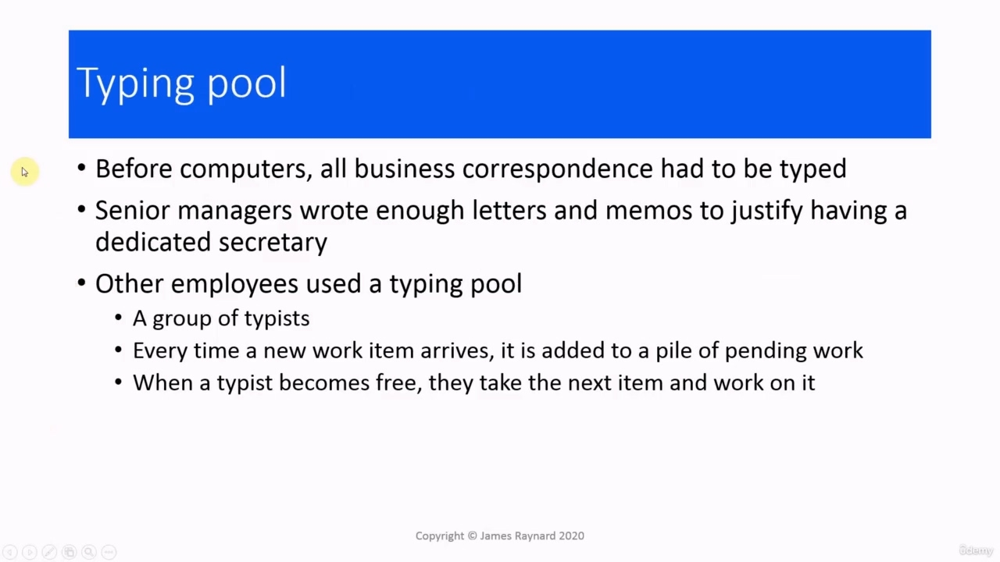
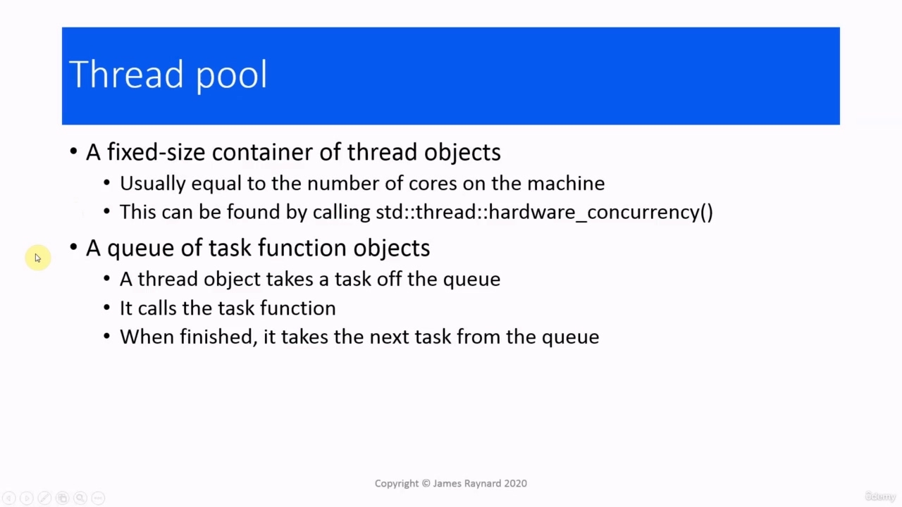
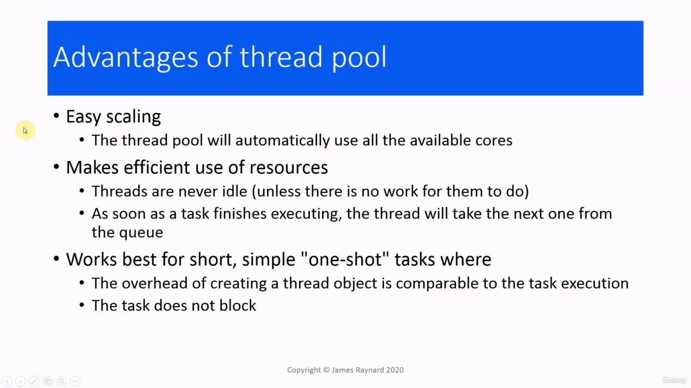
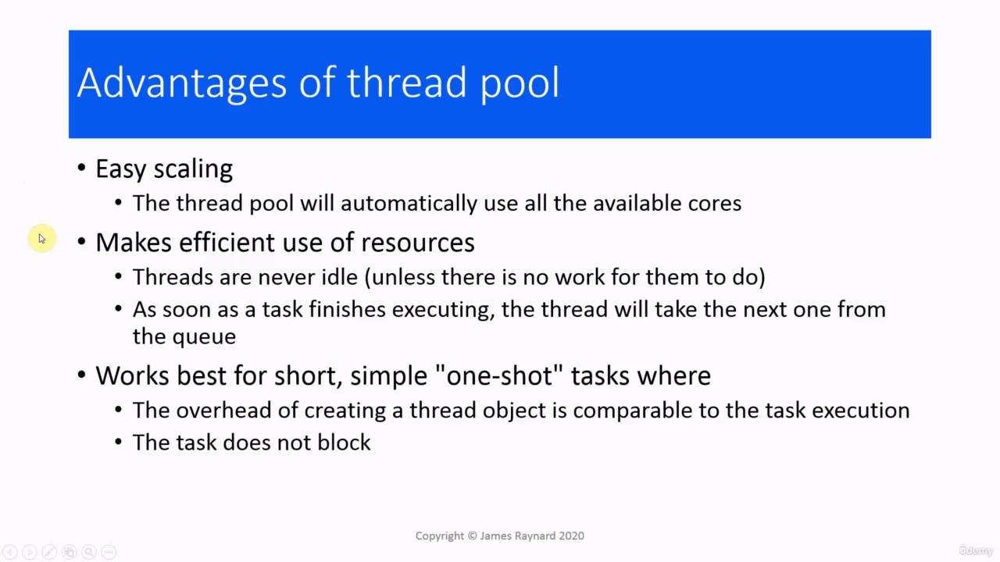
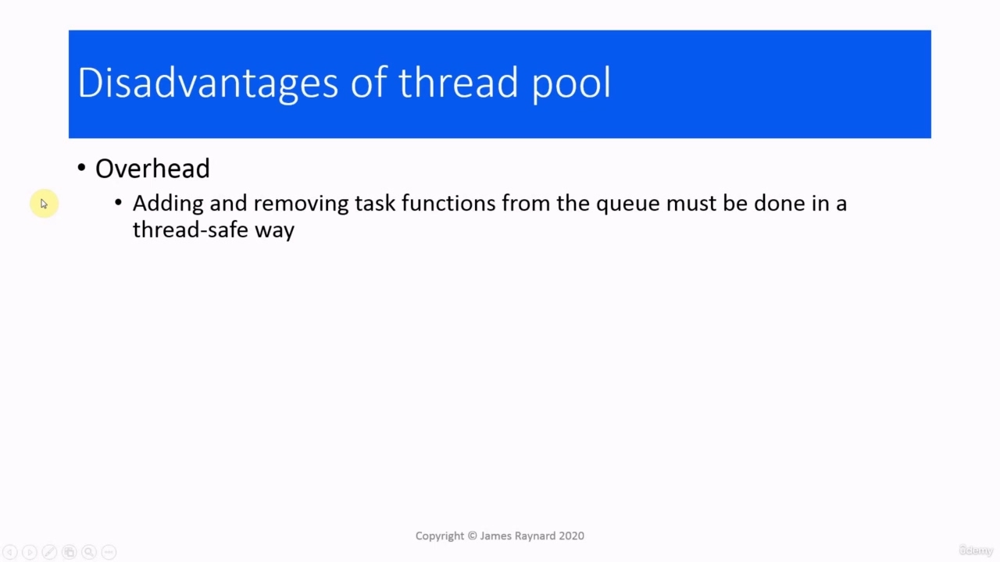

Hello again! In this video, we are going to talk about thread pools. Hello again! In this video, we are going to talk about thread pools. The motivation for using a thread pool is that creating a thread has a lot of overhead.

> 你好！在本视频中，我们将讨论线程池。你好！在本视频中，我们将讨论线程池。使用线程池的动机是**创建线程有很多开销**。

## img - 10720

The motivation for using a thread pool is that creating a thread has a lot of overhead. The program has to create an execution stack for the thread. It has to call an API function to get to the operating system. The operating system has to create the data that it uses internally for managing the thread. Then the scheduler has to execute the thread and then a context switch will occur to actually run the thread. The upshot of all this is that if we create a new thread to run a function instead of calling it directly, it can easily take 10,000 times as many instructions to execute the function in the thread. If we create a new thread every time we start a function, then that represents an awful lot of overhead. So is there any way we can avoid that overhead, or at least reduce it?

> 使用线程池的动机是创建线程有很多开销。程序必须为线程创建执行堆栈。它必须调用 API 函数才能访问操作系统。操作系统必须创建内部用于管理线程的数据。然后调度器必须执行线程，然后将发生上下文切换以实际运行线程。所有这些的结果是，如果我们创建一个新线程来运行一个函数，而不是直接调用它，那么在线程中执行该函数很容易需要 10000 倍的指令。如果我们每次启动一个函数时都创建一个新线程，那么这意味着大量的开销。那么，有什么方法可以避免这种开销，或者至少减少它？

## img - 101870

The concept of a thread pool comes from the typing pool. If we go back to - say - the 1950s when there were no computers in offices. People did not send emails, they sent letters and memos on paper, and these had to be typed out by someone. If you were an executive, you would have a secretary who would type out your letters and deal with all your admin. If you were at a less exalted level, then you would have to send your letter to the typing pool. The typing pool that was a room full of typists who spent all day typing out other people's letters. When you sent your work to the typing pool, it was put in a pile of pending work and then when a typist became available, they would take the first item from the top of the pile and work on it. So in that way, all the typists were kept busy. Every time they finished one letter, they took another one and started working on that.

> **线程池的概念来自于类型池**。如果我们回到 1950 年代，那时办公室里没有电脑。人们不发送电子邮件，而是在纸上发送信件和备忘录，这些必须由某人打印出来。如果你是一名高管，你会有一个秘书，他会打印你的信件，并处理所有的行政事务。如果你的级别不那么高，那么你就必须把你的信送到打字池。打字室里坐满了打字员，他们整天都在打字别人的信件。当你把你的工作送到打字池时，它被放在一堆待处理的工作中，然后当一个打字员有空时，他们会从这堆工作的顶部取出第一个项目并继续工作。所以这样，所有的打字员都忙得不可开交。每写完一封信，他们就拿另一封信开始写。

## img - 158290

To implement a thread pool, we need two things. The first one is a fixed size container of thread objects, which are all ready to run. Usually, you would want to make this equal to the number of cores on the machine. Presumably, we are using threads because we want to get the maximum performance from the hardware. And if we have one thread for every processor, then all the processors on the machine are going to be busy and we are going to get the maximum possible output. If we have more threads than there are cores, then we are going to get task switching and context switching, which are going to slow things down. The C++ library provides a function which allows you to find this out. It is in the std::thread namespace and it is called hardware underscore concurrency. If you call this, it will return the number of cores on the machine and that will tell you what size to make your container of threads. The other thing we need is a queue of task function objects.

> 要实现线程池，我们需要两件事。第一个是一个固定大小的线程对象容器，它们都准备好运行。通常，您希望使其等于机器上的核心数。我们之所以使用线程，大概是因为我们希望从硬件中获得最大性能。如果每个处理器都有一个线程，那么机器上的所有处理器都将很忙，我们将获得最大可能的输出。如果我们的线程数超过了内核数，那么我们将进行任务切换和上下文切换，这将减慢速度。C++库提供了一个函数，可以让您找到它。它位于 std:：thread 命名空间中，称为硬件下划线并发。如果调用此命令，它将返回机器上的内核数，并告诉您线程容器的大小。我们还需要一个任务函数对象队列。

## img - 255320

The other thing we need is a queue of task function objects. So when users want to send a task to the thread pool, they will push it onto the queue. Then the next thread object which becomes free, will pop that task from the queue and execute it. And then when it finishes that task, it will pop the next task off the front of the queue and so on.

> 我们还需要一个**任务函数对象队列**。因此，当用户想要将任务发送到线程池时，他们会将其推送到队列中。然后，下一个空闲的线程对象将从队列中弹出该任务并执行它。然后，当它完成该任务时，它将从队列前面弹出下一个任务，依此类推。

## img - 321170

The advantages of a thread pool are that it makes scaling very easy. If you run your program on a different machine, which has more cores, then the thread pool will automatically make use of all the available processor cores. It also makes very efficient use of resources.

> 线程池的优点是它使扩展非常容易。如果您在具有更多内核的不同计算机上运行程序，那么线程池将自动使用所有可用的处理器内核。它还非常有效地利用资源。

## img - 336210

It also makes very efficient use of resources. Threads are always busy. The only time that threads are idle is if there is no work to do. Otherwise they are constantly pulling tasks off the queue and executing them. And we have one thread for every core. So if the threads are busy all the time, then all the processor cores are going to be busy as well. And we are making the best use of the hardware. Thread pools are ideally suited for short and simple tasks, which really do one thing.

> 它还非常有效地利用资源。线程总是忙的。线程空闲的唯一时间是没有工作要做。否则，它们会不断地从队列中提取任务并执行它们。每个核心都有一个线程。因此，如果线程一直处于忙碌状态，那么所有处理器内核也将处于忙碌状态。我们正在充分利用硬件。线程池非常适合短而简单的任务，这些任务只做一件事。

## img - 403890

Thread pools are ideally suited for short and simple tasks, which really do one thing. In that case, the execution time for the function is going to be much smaller than the overhead of creating a new thread. So if you can reuse an existing thread, then you have saved a lot of time. They are also best suited to tasks which do not block. If the task needs to perform input/output or wait for another thread or lock a mutex, then that represents idle time when the processor is not being fully used. And it may be that the delay from blocking is considerably greater than the time saved by not starting a new thread.

> **线程池非常适合短而简单的任务，这些任务只做一件事。**在这种情况下，函数的执行时间将比创建新线程的开销小得多。因此，如果您可以重用现有线程，那么就节省了大量时间。它们也最适合不阻塞的任务。如果任务需要执行输入/输出或等待另一个线程或锁定互斥锁，则表示处理器未完全使用时的空闲时间。而且，阻塞的延迟可能远远大于不启动新线程所节省的时间。

## img - 448230

The biggest disadvantage to the thread pool is that the queue can affect performance. Adding and removing task functions from the queue must be done in a safe way. So that is going to add overhead. And the queue can also become a bottleneck if tasks are being added to the queue faster than the threads can remove them. In a full thread pool implementation, you need to be very careful about how you write the queue.

> 线程池的最大缺点是队列会影响性能。必须以安全的方式从队列中添加和删除任务函数。所以这将增加开销。如果任务添加到队列的速度快于线程删除任务的速度，那么队列也可能成为瓶颈。在全线程池实现中，您需要非常小心如何编写队列。

## img - 513960

