> [!note]
> 值得注意的是，这里在确定数量的时候有一个 `std::hardware_*` 的量，相比我们确定数值的方式要好一些

## img - 4200

In this video, we are going to implement a simple thread pool. Let's start off by thinking about how we are going to implement this.

> 在本视频中，我们将实现一个简单的线程池。让我们从思考如何实现这一点开始。

## img - 8880

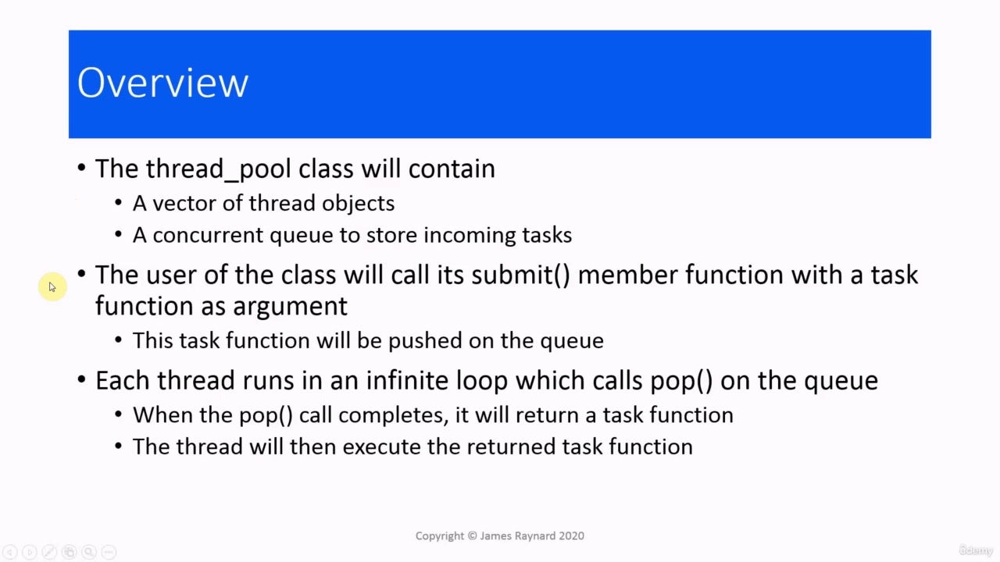

Let's start off by thinking about how we are going to implement this. We are going to write a class for the thread pool. For a thread pool, we need a fixed size container of thread objects and a queue of some sort for storing the incoming tasks. We are going to use a vector of thread objects. We are going to call the hardware currency function to find out how big to make this vector. We are going to use the concurrent queue that we wrote in an earlier part of the course for storing tasks. So those are going to be members of this class. We will have a public member function of this class which callers can use to get their task functions

> 让我们从思考如何实现这一点开始。我们将为线程池编写一个类。对于线程池，我们需要一个固定大小的线程对象容器和一个用于存储传入任务的队列。我们将使用线程对象的向量。我们将调用硬件货币函数来找出这个向量的大小。我们将使用我们在课程前面部分中编写的并发队列来存储任务。所以这些将是这个班的成员。我们将有一个此类的公共成员函数，调用方可以使用该函数获取其任务函数

## img - 47380

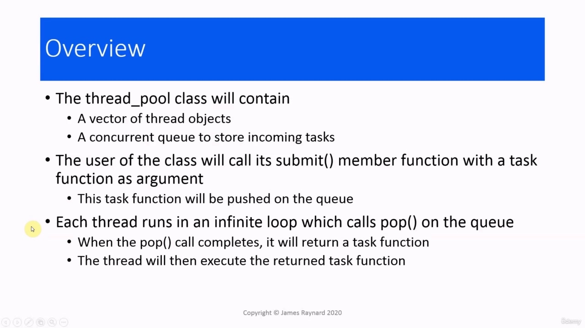

We will have a public member function of this class which callers can use to get their task functions pushed onto the queue. This is going to be called submit. Each of these threads in the container will have a thread function, which performs an infinite loop. This infinite loop will call pop on the queue. We are going to use the version of the concurrent queue, which has a condition variable. So if the queue is empty, the thread will stop and wait until some work becomes available. The queue is concurrent, so only one thread at a time will be able to pop the queue. If the pop call completes, we know that this thread has got a task and it is the only one which has that task. That task will be a callable object, so the thread will simply call it. Okay, so I would like you to pause the video for a short while and try and write a definition for this

> 我们将有一个此类的公共成员函数，调用方可以使用该函数将其任务函数推送到队列中。这将被称为提交。容器中的每个线程都有一个线程函数，它执行无限循环。这个无限循环将调用队列中的 pop。我们将使用并发队列的版本，它有一个条件变量。因此，如果队列为空，线程将停止并等待，直到某些工作可用。队列是并发的，因此一次只有一个线程能够弹出队列。如果 pop 调用完成，我们知道这个线程有一个任务，并且它是唯一一个有该任务的线程。该任务将是一个可调用对象，因此线程将简单地调用它

## img - 138750

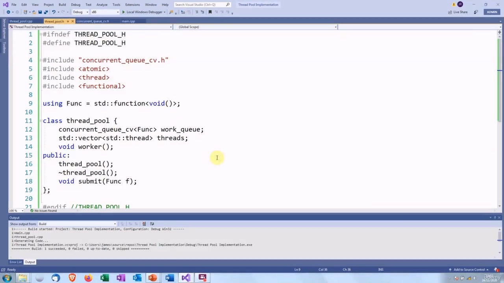

Okay, so I would like you to pause the video for a short while and try and write a definition for this class.

> 好的，所以我想让你暂停一下视频，并尝试为这门课写一个定义。

## img - 146770

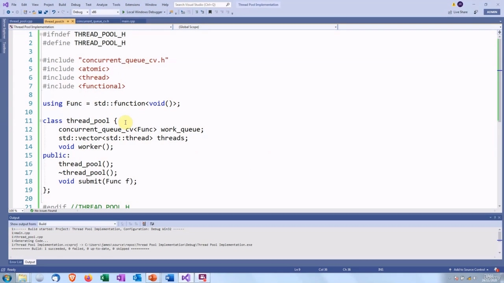

We are going to use this type alias to make things simpler. The objects in the queue are going to be function objects. The standard function class from the library, which can represent any callable type. This is going to store a pointer or lambda expression or whatever, which takes no arguments and returns nothing. We are going to have a concurrent queue of these function objects. That will be the work queue.

> 我们将使用此类型别名来简化操作。队列中的对象将是函数对象。库中的标准函数类，它可以表示任何可调用类型。这将存储一个指针或 lambda 表达式等，它不接受任何参数，也不返回任何内容。我们将拥有这些函数对象的并发队列。这将是工作队列。

## img - 210870

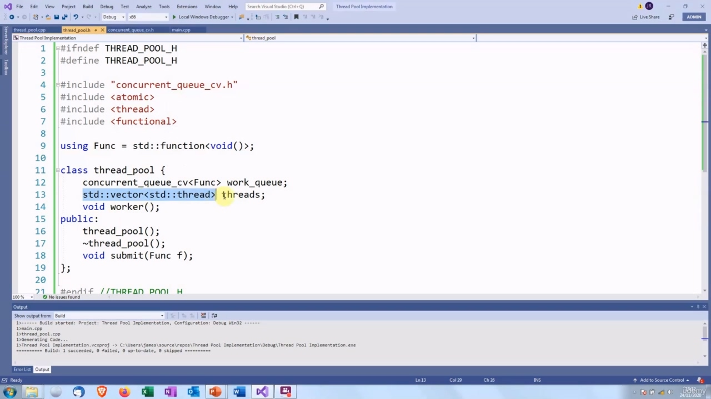

We are going to have a concurrent queue of these function objects. That will be the work queue. The worker threads will be on a vector of threads. We are going to have a worker member function,

> 我们将拥有这些函数对象的并发队列。这将是工作队列。工作线程将位于线程向量上。我们将有一个工人成员功能，

## img - 220440

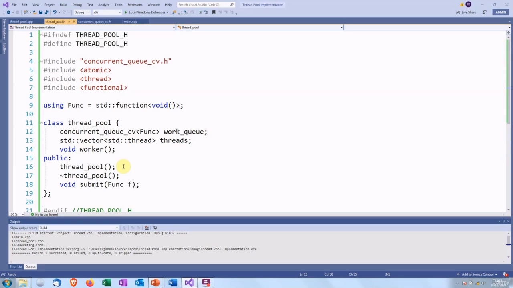

The worker threads will be on a vector of threads. We are going to have a worker member function, which will be the actual thread function for the threads. Then on the public interface, we have our submit function which takes an argument of this function object type. We also have a constructor and destructor for populating and clearing the vector of threads. OK, so you might want to pause the video again and spend a couple of minutes thinking about how you would implement these member functions.

> 工作线程将位于线程向量上。我们将有一个 worker 成员函数，它将是线程的实际线程函数。然后在公共接口上，我们有一个 submit 函数，它接受此函数对象类型的参数。我们还有一个构造函数和析构函数，用于填充和清除线程向量。好的，所以你可能想再次暂停视频，花几分钟思考如何实现这些成员函数。

## img - 245740

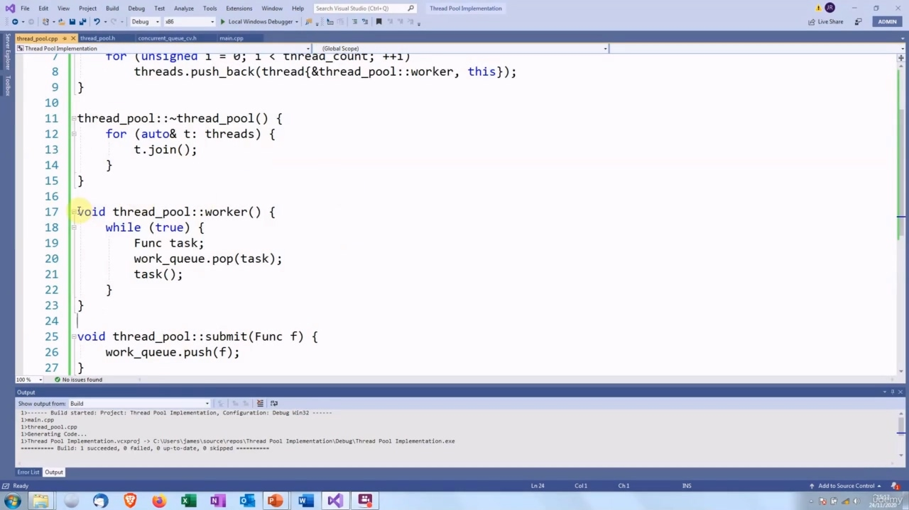

implement these member functions.

> 实现这些成员函数。

## img - 255950

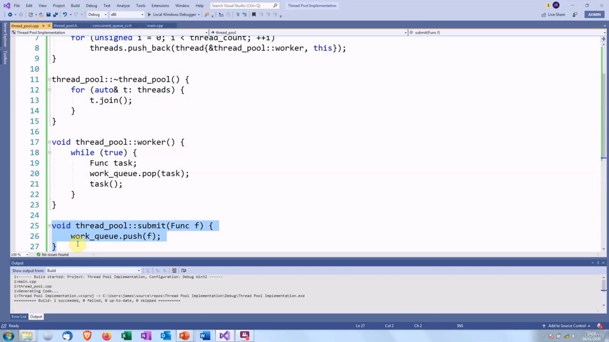

The worker function. This is going to be the thread function for the pool of threads. This has an infinite loop. In the infinite loop, it calls pop on the work queue. When this call completes, there will be a callable object in the task argument and then we just call it. And then when that's complete, we go back to the loop and call pop again and wait for the next task to become available. The submit function is even simpler. We just push the argument onto the work queue.

> worker 函数。这将是线程池的线程函数。这有一个无限循环。在无限循环中，它调用工作队列中的 pop。当这个调用完成时，任务参数中会有一个可调用的对象，然后我们只调用它。然后当完成后，我们返回循环并再次调用 pop，等待下一个任务变为可用。提交功能甚至更简单。我们只是将参数推到工作队列中。

## img - 326290

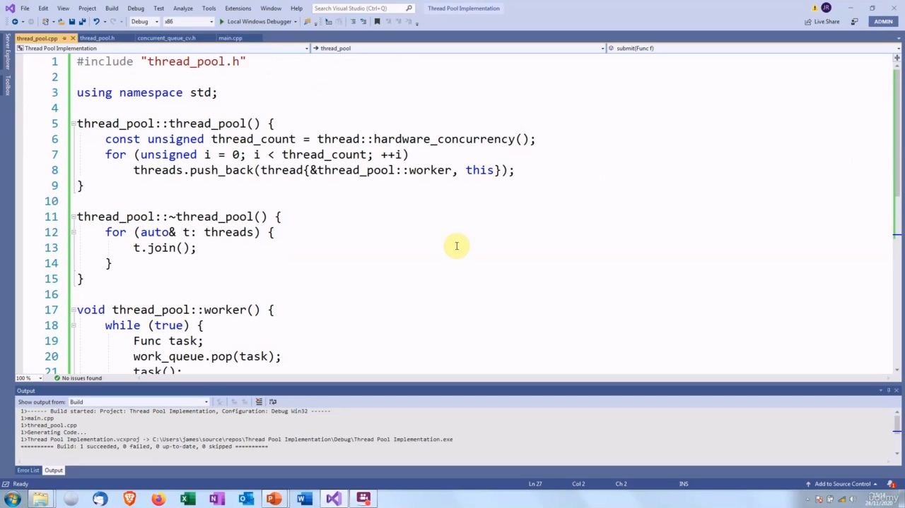

We just push the argument onto the work queue.

> 我们只是将参数推到工作队列中。

## img - 338370

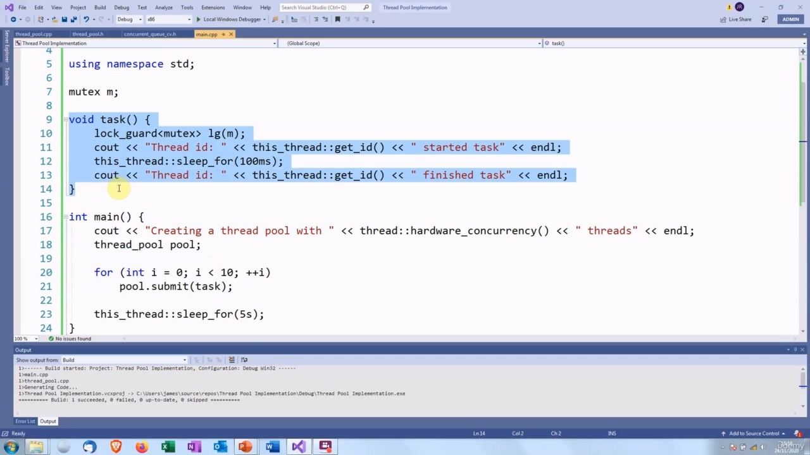

The thread pool constructor needs to populate the vector, so we call hardware concurrency to find out how many cores and then we create that number of threads. We just push them back onto the vector. The thread function is going to be the worker member function. So we use the syntax for a member function pointer, which is ampersand, followed by the fully qualified name. We also pass the "this" argument to the thread function, because every member function that is not static, must have the "this" pointer as its first argument. And then in the destructor, we iterate over this vector and we join on all the thread objects. Notice that we use the reference form of the range for loop, because threads are movable, but cannot be copied. The concurrent queue is exactly the same as the one that we had before. There should not be anything surprising in there, I hope! To use this class, you create an instance of it. So that constructor will populate the vector with the thread objects. Then you write a suitable task function. This one just prints out the thread ID.

> 线程池构造函数需要填充向量，因此我们调用硬件并发来确定有多少个内核，然后创建该数量的线程。我们只是把它们推回到向量上。线程函数将成为工作成员函数。因此，我们使用成员函数指针的语法，即“与”，后跟完全限定的名称。我们还将“this”参数传递给线程函数，因为每个非静态的成员函数都必须有“this”指针作为其第一个参数。然后在析构函数中，我们迭代这个向量，并连接所有线程对象。注意，我们使用循环范围的引用形式，因为线程是可移动的，但不能复制。并发队列与之前的队列完全相同。我希望里面不会有什么令人惊讶的东西！要使用这个类，需要创建它的一个实例。这样，构造函数将用线程对象填充向量。然后编写一个合适的任务函数。这个只是打印出线程 ID。

## img - 453540

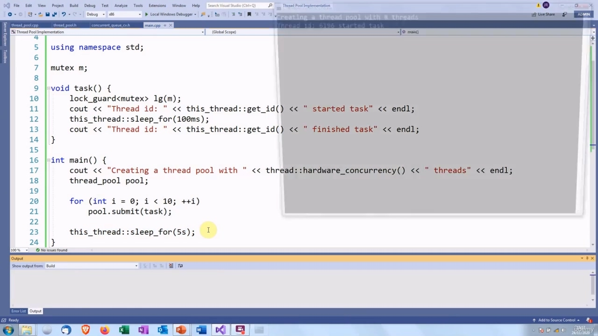

This one just prints out the thread ID. There is also a mutex with a lock to make the output look tidy. Then you call submit function and you pass this task function as its argument. I have put a sleep function in here, because if you do not put that, the main function can terminate before the threads start up. So this is just to make sure it works properly. OK, so let's see what happens.

> 这一个只是打印出线程 ID。还有一个带有锁的互斥锁，以使输出看起来整洁。然后调用提交函数，并将此任务函数作为其参数传递。我在这里放置了一个睡眠函数，因为如果不这样做，主函数可以在线程启动之前终止。所以这只是为了确保它正常工作。好的，让我们看看会发生什么。

## img - 526160

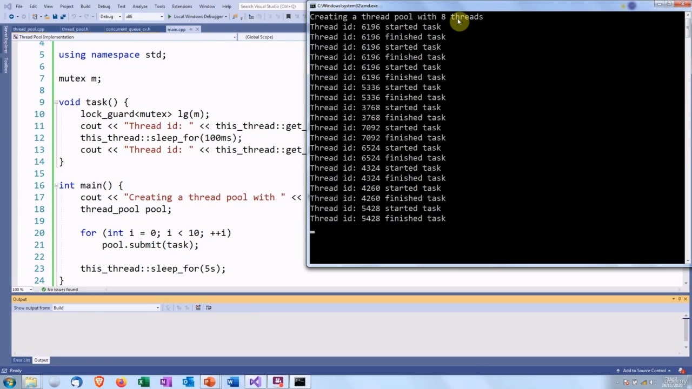

I put in a call to hardware concurrency just so we can see how many cores there are. This machine has

> 我调用了硬件并发，这样我们就可以看到有多少内核。这台机器有

## img - 526160

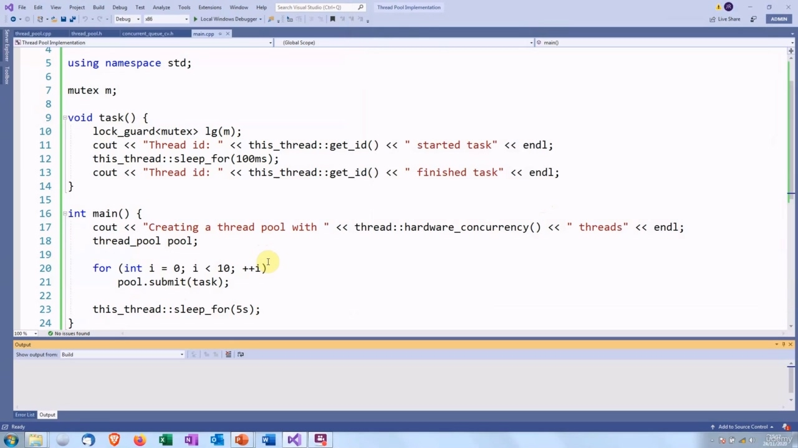

I put in a call to hardware concurrency just so we can see how many cores there are. This machine has eight cores. You can see that thread 6196 was the first one to execute a task function and it finished that. Then it popped another one and executed that, then it pops another task and executed that. Then presumably it was busy by that point. So some of the other threads have started sharing some of the load. If you were writing a real program, you would probably have an infinite loop in the main as well, and

> 我调用了硬件并发，这样我们就可以看到有多少内核。这台机器有八个核心。您可以看到线程 6196 是第一个执行任务函数的线程，它完成了任务。然后它弹出另一个任务并执行，然后弹出另一任务并执行。那么，大概那时它很忙。因此，其他一些线程已经开始共享一些负载。如果你正在编写一个真正的程序，那么你可能在主程序中也会有一个无限循环，并且

## img - 558600

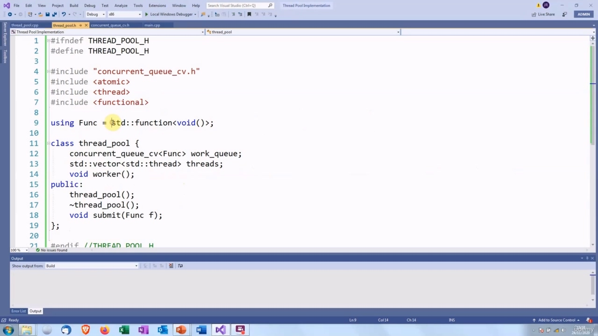

If you were writing a real program, you would probably have an infinite loop in the main as well, and that could, for example, be receiving orders. Then you create a task function to process the order and then you send that to the thread pool. And then one of the threads will pop that task off the queue and execute it. This implementation is a bit limited because we are restricted to task functions that do not take any

> 如果你正在编写一个真正的程序，那么你可能在主程序中也会有一个无限循环，例如，这可能是在接收订单。然后创建一个任务函数来处理订单，然后将其发送到线程池。然后其中一个线程将该任务从队列中弹出并执行它

## img - 623130

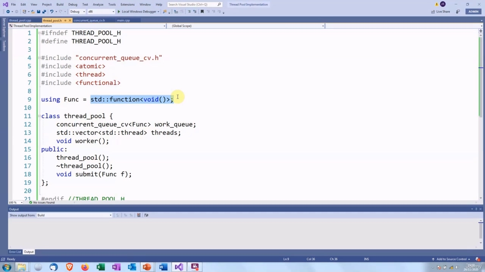

This implementation is a bit limited because we are restricted to task functions that do not take any arguments or return anything. It might be possible to extend this by using a packaged task rather than a function object. And then, in the main function, you would obtain a future from the packaged task and call get on it, to get the result of the processing. So that is one possible extension of this. But anyway, this will give you enough to start experimenting with thread pools. So have fun!

> 这个实现有点受限，因为我们只限于不接受任何参数或返回任何内容的任务函数。可以通过使用打包任务而不是函数对象来扩展此功能。然后，在主函数中，您将从打包的任务中获得未来，并调用 get on，以获得处理结果。所以这是一个可能的扩展。但无论如何，这将为您提供足够的时间来尝试线程池。所以玩得开心！
